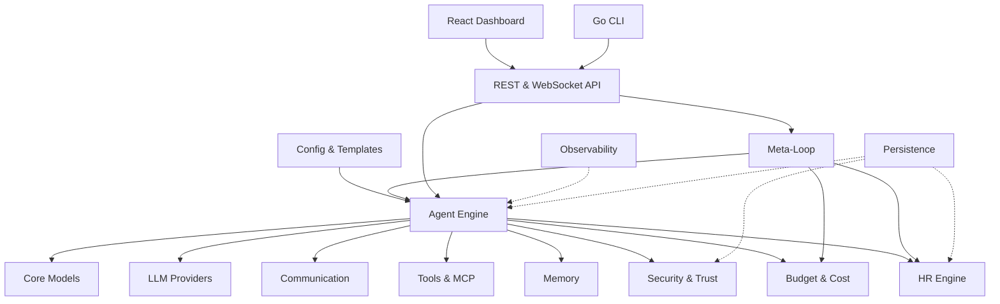

<p align="center">
  <strong>SynthOrg</strong><br>
  <em>An autonomous product studio you operate: describe what to build, a synthetic organisation of AI agents plans and delivers it.</em>
</p>

<p align="center">
  <a href="https://securityscorecards.dev/viewer/?uri=github.com/Aureliolo/synthorg"></a>
  <a href="https://slsa.dev"></a>
  <a href="https://codecov.io/gh/Aureliolo/synthorg"></a>
  <a href="https://codspeed.io/Aureliolo/synthorg?utm_source=badge"></a>
  <a href="https://github.com/Aureliolo/synthorg/blob/main/LICENSE"></a>
  <a href="https://www.python.org/downloads/"></a>
  <a href="https://synthorg.io/docs"></a>
</p>

---

SynthOrg is a self-contained, self-hostable platform for **synthetic organisations**: role-based AI agents modelled as an actual company (roles, departments, hierarchies, persistent memory, budgets, governance, structured communication) rather than a task queue or a DAG of function calls. The goal is an autonomous product studio you operate: you describe a product or service to build, or hand it an existing codebase, and the organisation plans, executes, and delivers it under budgets and your steering.

It is provider-agnostic (<!--RS:providers_via_litellm-->90+<!--/RS--> LLM providers via [LiteLLM](https://github.com/BerriAI/litellm)), configuration-driven ([Pydantic v2](https://docs.pydantic.dev/) models), and licensed BUSL-1.1 (converts to Apache 2.0 at the Change Date).

> **Project status (read this).** SynthOrg is **pre-alpha**. The framework, infrastructure, and runtime are built and tested (<!--RS:tests-->37,000+<!--/RS--> tests, 80%+ coverage): API, dashboard, CLI, dual-backend persistence, the provider layer, the agent runtime, the multi-agent coordinator, the work pipeline spine, the intake engine, sandbox lifecycle dispatch, and the distributed-path consumers are all wired and exercised by deterministic e2e harnesses with a scripted provider (no real LLM spend). Operator-facing onboarding (real provider, real workloads, dashboard polish) has not been exercised end to end by a human. Expect bugs, rough edges, and missing polish; use it for research and contribution, not for production workloads. Progress is tracked openly on the [roadmap](https://synthorg.io/docs/roadmap/) and the [issue tracker](https://github.com/Aureliolo/synthorg/issues).

## What is available now

A tested platform you can run, inspect, and build on:

- **REST + WebSocket API** (Litestar) and a **React 19 dashboard** (org chart, task board, agent detail, budget tracking, provider management, workflow editor, ceremony settings, setup wizard) with live WebSocket / SSE updates.
- **Go CLI** for Docker orchestration: `init`, `start`, `stop`, `status`, `logs`, `update`, `doctor`, `uninstall`, `version`, `config`, `wipe`, `cleanup`, `worker`, `backup`, with cosign signature and SLSA provenance verification at pull time.
- **Dual-backend persistence**: SQLite (single-node default) and PostgreSQL (multi-instance), conformance-tested for parity, with in-process yoyo schema migrations and ISO 4217 currency stamping on every cost-bearing row.
- **Provider layer**: any LLM via LiteLLM with built-in retry and rate-limit handling; local model management for Ollama and LM Studio; periodic model-refresh that flags removed models stale, surfaces in-family upgrade recommendations for review, and optionally auto-applies within-family upgrades.
- **Configuration and templates**: define a company in YAML; importable/shareable agent, department, and company templates with personality presets.
- **Agent runtime**: a configured provider boots a real agent runtime that executes tasks (LLM + sandboxed tools) under a minimal safety spine (autonomy/trust verdict on tool actions, approval-queue producer for sensitive actions). An empty company (no provider) cleanly rejects task submission. Exercised by a deterministic e2e simulation harness (synthetic clients, scripted provider, zero LLM spend).
- **Multi-agent coordinator + work pipeline spine**: `/coordinate` runs decompose, route, parallel execution, then rollup end to end behind the provider-present switch. The shared work pipeline (intake to projects to decompose to solo/team to execute to coordination metrics) is the single integration point every entry adapter feeds, with solo-vs-team decided internally by decomposition.
- **Entry adapters**: real work-entry paths for the intake engine (`POST /requests/{id}/approve`), the task board (`POST /tasks`), and stated objectives (`POST /objectives`), all driving the pipeline spine.
- **Sandbox lifecycle dispatch**: `DockerSandbox.execute()` honours `owner_id` and dispatches to the configured per-call / per-agent / per-task lifecycle strategy, with grace-period teardown.
- **Operations**: structured logging with redaction and correlation, Prometheus metrics and OTLP, HttpOnly-cookie multi-user sessions with CSRF protection, Wolfi apko-composed distroless images with Trivy + Grype scanning, cosign signatures, and SLSA L3 provenance.
- **Distributed dispatch**: NATS JetStream queue, worker pool, dead-letter consumer, dedup pruner, and heartbeat subscriber, validated under multi-worker synthetic load (no loss, no duplication).
- **Conversational org interface**: talk to the company in natural language. Clarify-and-propose against the Chief of Staff (clarifies an underspecified request, then parks concrete `WorkItem`s in the human approval queue; on approval they run through the work pipeline), per-turn concern-routing to the best-fit role agent, multi-agent group chat, human-consented agent-initiated invites, and direct MCP acting under trust (sensitive actions approval-gated; fail-closed when security governance is inactive). All modes opt-in, default off; exercised by deterministic e2e harnesses with a scripted provider.
- **Product studio substrate**: persistent project workspace with pluggable git, brownfield codebase intake, living documentation, and a deep requirements interview.
- **Operate tier**: a golden-company benchmark, mission control with run replay, a cost forecast / kill-switch dial, a measurable learning curve, deterministic replay, run narratives, and an adversarial red-team.
- **Agent capability layer**: knowledge and provenance retrieval substrate, research mode, continual improvement, governed external API access, headless-browser and virtual-desktop testing.

## In active development

The runtime, coordinator, intake, work pipeline, sandbox dispatch, and distributed-path consumers are wired and exercised by deterministic harnesses. What remains in flight is the operator-facing maturity that turns the wired runtime into a polished autonomous studio:

- **Self-improvement loop**: company-wide signals from existing subsystems producing deployment and product-level improvement proposals through a rule-first hybrid pipeline with mandatory human approval. Components built and unit-tested; live end-to-end run pending.
- **Real-provider acceptance**: the e2e harness drives the runtime against a deterministic scripted provider, not a real LLM. A real-provider golden-company benchmark and run narrative arrive with the operate tier.

The design for each lives in the [Design Specification](https://synthorg.io/docs/design/).

## Quick Start

### Install

```bash
# Linux / macOS
curl -sSfL https://synthorg.io/get/install.sh | bash
```

```powershell
# Windows (PowerShell)
irm https://synthorg.io/get/install.ps1 | iex
```

### Run

```bash
synthorg init                                   # interactive setup wizard (SQLite default)
synthorg init --persistence-backend postgres    # auto-provision a Postgres container
synthorg start                                  # pull images + start containers
```

Open [localhost:3000](http://localhost:3000); the **setup wizard** covers LLM providers, company config, agent setup with personality presets, and theme selection. Choose **Guided Setup** for the full experience or **Quick Setup** (provider + company name only). This brings up the platform and dashboard. Configuring a provider stores the company; running it as an autonomous organisation is the runtime work in active development, so skipping provider setup yields an empty company by design.

**Persistence backends:** SQLite (default) for single-node and development, Postgres for multi-instance deployments. The CLI orchestrates both. `--persistence-backend postgres` generates a `dhi.io/postgres` DHI service (image tag pinned via `DefaultPostgresImageTag` in `cli/internal/config/state.go`), random credentials, and a named data volume. `synthorg stop` preserves the data volume unless `--volumes` is passed.

### From source

```bash
git clone https://github.com/Aureliolo/synthorg.git
cd synthorg
uv sync                  # install dev + test deps
uv sync --group docs     # install docs toolchain
```

Schema migrations run in-process via [yoyo-migrations](https://ollycope.com/software/yoyo/latest/) (installed by `uv sync`); no external binary required. Building the docs site locally (for D2 diagrams) additionally requires the [D2 CLI](https://d2lang.com/tour/install) on `PATH`.

### Docker Compose (manual)

```bash
cp docker/.env.example docker/.env
docker compose -f docker/compose.yml up -d
curl http://localhost:3001/api/v1/readyz
```

## Target architecture

The diagram below is the designed architecture. Components exist as code; the
edges into and out of the agent engine are what the runtime work (above)
brings online.



## Compare

SynthOrg vs [other agent frameworks](https://synthorg.io/compare/) across organisation structure, multi-agent coordination, memory, budget tracking, security, and observability. The comparison marks SynthOrg capabilities honestly as available now versus planned, matching the status sections above. <!-- lint-allow: doc-numeric-macros -- competitor count is sourced from data/competitors.yaml via generate_comparison.py, not runtime_stats -->

## Documentation

| Section | What's there |
|---------|-------------|
| [User Guide](https://synthorg.io/docs/user_guide/) | Install, configure, run, customise |
| [Guides](https://synthorg.io/docs/guides/) | Quickstart, company config, agents, budget, security, MCP tools, deployment, logging, memory |
| [Design Specification](https://synthorg.io/docs/design/) | The designed behaviour of every subsystem (the source of truth; states current wiring status per area) |
| [Architecture](https://synthorg.io/docs/architecture/) | System overview, tech stack, decision log |
| [REST API](https://synthorg.io/docs/openapi/) | Scalar/OpenAPI reference |
| [Library Reference](https://synthorg.io/docs/api/) | Auto-generated from docstrings |
| [Security](https://synthorg.io/docs/security/) | Application security, container hardening, CI/CD security |
| [Licensing](https://synthorg.io/docs/licensing/) | BUSL 1.1 terms, Additional Use Grant, commercial options |
| [Roadmap](https://synthorg.io/docs/roadmap/) | Current status, what works today, what is in active development |

> **Contributors:** Start with the [Design Specification](https://synthorg.io/docs/design/) before implementing any feature. See [`DESIGN_SPEC.md`](docs/DESIGN_SPEC.md) for the full design set. The design pages describe intended behaviour and mark per-area current wiring status; treat any gap between a spec and `src/` as the work, not the spec.
>
> **Forking?** CI runs out of the box for code changes; the release pipeline needs setup (environments, labels, branch protection, a release-bot GitHub App). On your first push, the **CI Preflight** workflow opens a tracking issue listing exactly what is missing; see [Fork Setup](https://synthorg.io/docs/guides/fork-setup/) for the long-form walkthrough.

## License

[Business Source License 1.1](LICENSE): free production use for non-competing organisations with fewer than 500 employees and contractors. Converts to Apache 2.0 on the change date specified in [LICENSE](LICENSE). See [licensing details](https://synthorg.io/docs/licensing/) for the full rationale and what is permitted.
