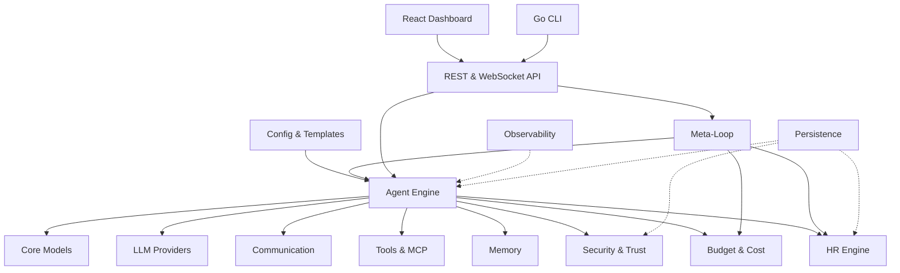

<p align="center">
  <strong>SynthOrg</strong><br>
  <em>An AI software company that reports to you.</em>
</p>

<p align="center">
  <a href="https://securityscorecards.dev/viewer/?uri=github.com/Aureliolo/synthorg"></a>
  <a href="https://slsa.dev"></a>
  <a href="https://codecov.io/gh/Aureliolo/synthorg"></a>
  <a href="https://codspeed.io/Aureliolo/synthorg?utm_source=badge"></a>
  <a href="https://github.com/Aureliolo/synthorg/blob/main/LICENSE"></a>
  <a href="https://www.python.org/downloads/"></a>
  <a href="https://synthorg.io/docs"></a>
</p>

---

SynthOrg is a self-contained, self-hostable platform for **synthetic organisations**: role-based AI agents modelled as an actual company (roles, departments, hierarchies, persistent memory, budgets, governance, structured communication) rather than a task queue or a DAG of function calls. Describe what to build, or hand over a codebase you already have, and the organisation plans it, builds it, and has to prove it: a build, a passing test suite, and an independent review. Nothing in the model is specific to software; software leads because it is the domain where done can be checked mechanically instead of argued.

It is provider-agnostic (<!--RS:providers_via_litellm-->95+<!--/RS--> LLM providers via [LiteLLM](https://github.com/BerriAI/litellm)), configuration-driven ([Pydantic v2](https://docs.pydantic.dev/) models), and licensed BUSL-1.1 (converts to Apache 2.0 at the Change Date).

> **Project status (read this).** SynthOrg is **pre-alpha**. The framework, infrastructure, and runtime are built and tested (<!--RS:tests-->46,000+<!--/RS--> tests, 80%+ coverage): API, dashboard, CLI, dual-backend persistence, the provider layer, the agent runtime, the multi-agent coordinator, the work pipeline spine, the intake engine, sandbox lifecycle dispatch, and the distributed-path consumers are all wired and exercised by deterministic e2e harnesses with a scripted provider (no real LLM spend). Operator-facing onboarding (real provider, real workloads, dashboard polish) has not been exercised end to end by a human. Expect bugs, rough edges, and missing polish; use it for research and contribution, not for production workloads. Progress is tracked openly on the [roadmap](https://synthorg.io/docs/roadmap/) and the [issue tracker](https://github.com/Aureliolo/synthorg/issues).

## How supervision works

Autonomy here is not trust. An agent never earns latitude by behaving well; latitude is a rule you write, and the rules accumulate as you learn which actions you can stop looking at.

- **Oversight mode, set by you.** Four modes, most oversight to least: `locked` (a human approves every action), `supervised` (reads and test runs flow, every mutation is approved), `semi` (code, tests, docs, commits and internal messages flow; deploys, publishes, budget, org changes and tool use are approved), and `full` (approval routing off; the deny list and the built-in detectors still run). A mode applies per agent, per initiative, per department, or company-wide, most specific winning. Moving an initiative to `full` is a CEO-only opt-in that must be confirmed explicitly and is audited at warning level, and a lookup failure on that path falls back to `locked` rather than opening up.
- **A gate on every action.** A deterministic deny list refuses the unconditional catastrophes (production deploys, database administration, firing an agent), a deterministic allow list clears the obviously safe, built-in detectors catch credential leaks, path traversal and destructive operations with no configuration at all, policy rules you write extend that, and an LLM evaluator handles what is left, attaching a reason to its verdict. Clearing the gate is not the same as running: the oversight mode still routes what cleared it, so under `locked` every action waits for you regardless. Rule evaluation fails closed, and an internal error there denies at critical risk rather than letting the action through.
- **Latitude is granted, never earned.** No agent, the CEO included, can widen its own limits: a request to raise an agent's autonomy becomes an approval item for a human. What actually buys you back attention is the allow list growing: the commands, rules, tools and conditions you ratify as safe, each one a decision you made once and never have to make again.
- **Done means proven.** Work does not complete because an agent says so. The completion oracle is on by default: the build and tests recorded against the task must pass, and an independent reviewer (never the author, blocked in the service, the model, and the database) must sign off. Both halves fail closed, short of a persistence-less boot with no record store to read, and an initiative reaches completion only through assembly and evaluation, never straight from execution.
- **Spend has a ceiling.** A run that reaches its hard cost ceiling parks itself and waits for you to raise the ceiling or stop it, rather than spending through the limit.

Approvals queue in the dashboard and over the REST API, and a reply through the chat integration decides a run parked at the approval gate. A run parked on spend is different: it resumes only when an operator names a new ceiling through the budget API. The full model lives in the [security](https://synthorg.io/docs/design/security/) and [verification and quality](https://synthorg.io/docs/design/verification-quality/) design pages.

## What is available now

A tested platform you can run, inspect, and build on:

- **REST + WebSocket API** (Litestar) and a **React 19 dashboard** (org chart, task board, agent detail, budget tracking, provider management, workflow editor, ceremony settings, setup wizard) with live WebSocket / SSE updates.
- **Go CLI** for Docker orchestration: `init`, `start`, `stop`, `status`, `logs`, `update`, `doctor`, `uninstall`, `version`, `config`, `wipe`, `cleanup`, `worker`, `backup`, `new`, `completion-install`, with cosign signature and SLSA provenance verification at pull time.
- **Dual-backend persistence**: SQLite (single-node default) and PostgreSQL (multi-instance), conformance-tested for parity, with in-process yoyo schema migrations and ISO 4217 currency stamping on every cost-bearing row.
- **Provider layer**: any LLM via LiteLLM with built-in retry and rate-limit handling; local model management for Ollama and LM Studio; periodic model-refresh that flags removed models stale, surfaces in-family upgrade recommendations for review, and optionally auto-applies within-family upgrades.
- **Configuration and templates**: define a company in YAML; importable/shareable agent, department, and company templates with personality presets.
- **Agent runtime**: a configured provider boots a real agent runtime that executes tasks (LLM + sandboxed tools) under a minimal safety spine (a gate verdict on every tool action, approval-queue producer for sensitive actions). An empty company (no provider) cleanly rejects task submission. Exercised by a deterministic e2e simulation harness (synthetic clients, scripted provider, zero LLM spend).
- **Multi-agent coordinator + work pipeline spine**: `/coordinate` runs decompose, route, parallel execution, then rollup end to end behind the provider-present switch. The shared work pipeline (intake to projects to decompose to solo/team to execute to coordination metrics) is the single integration point every entry adapter feeds, with solo-vs-team decided internally by decomposition.
- **Entry adapters**: work-entry paths into the pipeline spine. Stated objectives (`POST /objectives`) are the always-on operator door, each standing up its own per-initiative project; the task board (`POST /tasks`) files against a caller-named project; the synthetic-client intake door (`POST /requests/{id}/approve`) is a benchmark surface, off by default behind `simulations.client_intake_enabled`.
- **Sandbox lifecycle dispatch**: `DockerSandbox.execute()` honours `owner_id` and dispatches to the configured per-call / per-agent / per-task lifecycle strategy, with grace-period teardown.
- **Operations**: structured logging with redaction and correlation, Prometheus metrics and OTLP, HttpOnly-cookie multi-user sessions with CSRF protection, Wolfi apko-composed distroless images with Trivy scanning, cosign signatures, and SLSA L3 provenance.
- **Distributed dispatch**: NATS JetStream queue, worker pool, dead-letter consumer, dedup pruner, and heartbeat subscriber, validated under multi-worker synthetic load (no loss, no duplication).
- **Conversational org interface**: talk to the company in natural language. Explain-chat answers grounded in the live org state (in-flight tasks, active projects, pending approvals), citing the records they draw on rather than inferring idleness. Clarify-and-propose against the Chief of Staff (clarifies an underspecified request, then drafts it as one durable `Plan` parked for holistic review in Plan Review; steering directives still park individually in the approval queue), per-turn concern-routing to the role agent that fits, multi-agent group chat, human-consented agent-initiated invites, direct MCP acting under trust (sensitive actions approval-gated; fail-closed when security governance is inactive), and an operator console that configures the control plane conversationally (connect an integration, flip toggles) with credentials captured out of band so they never reach the transcript. Explain-chat, propose, and group chat are on by default and toggle live per request. Concern routing also resolves live per turn (no restart), but additionally requires the off-by-default persona master switch, so it stays off until that is enabled even though its own toggle defaults on. Agent-initiated invites, direct MCP acting, and the operator console are off by default. Exercised by deterministic e2e harnesses with a scripted provider.
- **Delivery substrate**: persistent project workspace with pluggable git, brownfield codebase intake, living documentation, and a deep requirements interview.
- **Operate tier**: a golden-company benchmark, mission control with run replay, a cost forecast and hard-ceiling dial, a measurable learning curve, deterministic replay, run narratives, and an adversarial red-team.
- **Agent capability layer**: knowledge and provenance retrieval substrate, research mode, continual improvement, governed external API access, headless-browser and virtual-desktop testing.

## In active development

The runtime, coordinator, intake, work pipeline, sandbox dispatch, and distributed-path consumers are wired and exercised by deterministic harnesses. What remains in flight is the operator-facing maturity that turns a wired runtime into something you would leave running:

- **Many initiatives at once**: nothing caps how many initiatives are active together, and parallelism inside one initiative is exercised (waves of agents, each in its own isolated git worktree). Running several initiatives side by side has not been exercised at scale, so treat that leverage as the design intent rather than a measured result.
- **Self-improvement loop**: company-wide signals from existing subsystems producing deployment and product-level improvement proposals through a rule-first hybrid pipeline with mandatory human approval. Components built and unit-tested; live end-to-end run pending.
- **Real-provider acceptance**: the e2e harness drives the runtime against a deterministic scripted provider, not a real LLM. A real-provider golden-company benchmark and run narrative arrive with the operate tier.

The design for each lives in the [Design Specification](https://synthorg.io/docs/design/).

## Quick Start

### Install

```bash
# Linux / macOS
curl -sSfL https://synthorg.io/get/install.sh | bash
```

```powershell
# Windows (PowerShell)
irm https://synthorg.io/get/install.ps1 | iex
```

### Run

```bash
synthorg init                                   # interactive setup wizard (SQLite default)
synthorg init --persistence-backend postgres    # auto-provision a Postgres container
synthorg start                                  # pull images + start containers
```

Open [localhost:3000](http://localhost:3000); the **setup wizard** covers LLM providers, company config (currency, budget, model-tier profile), agent setup with personality presets and per-agent model matching, coordinator + embedding model selection, and theme selection. Choose **Guided Setup** for the full experience or **Quick Setup** (provider + company name only). This brings up the platform and dashboard. A configured provider is what boots the agent runtime, so skipping provider setup yields an empty company by design: it stores the organisation and cleanly rejects task submission.

**Persistence backends:** SQLite (default) for single-node and development, Postgres for multi-instance deployments. The CLI orchestrates both. `--persistence-backend postgres` generates a `dhi.io/pgvector` DHI service (a hardened Postgres image bundling pgvector, so semantic memory has a dense index; image tag and digest pinned via `DefaultPostgresImageTag` and `DefaultPostgresImageDigest` in `cli/internal/config/state.go`), random credentials, and a named data volume. `synthorg stop` preserves the data volume unless `--volumes` is passed.

### From source

```bash
git clone https://github.com/Aureliolo/synthorg.git
cd synthorg
uv sync                  # install dev + test deps
uv sync --group docs     # install docs toolchain
```

Schema migrations run in-process via [yoyo-migrations](https://ollycope.com/software/yoyo/latest/) (installed by `uv sync`); no external binary required. Building the docs site locally (for D2 diagrams) additionally requires the [D2 CLI](https://d2lang.com/tour/install) on `PATH`.

### Docker Compose (manual)

```bash
cp docker/.env.example docker/.env
docker compose -f docker/compose.yml up -d
curl http://localhost:3001/api/v1/readyz
```

## Target architecture

The diagram below is the designed architecture. The
[Design Specification](https://synthorg.io/docs/design/) states the current
wiring status per area.



## Compare

SynthOrg vs [other agent frameworks](https://synthorg.io/compare/) across organisation structure, multi-agent coordination, memory, budget tracking, security, and observability. The comparison marks SynthOrg capabilities honestly as available now versus planned, matching the preceding status sections. <!-- lint-allow: doc-numeric-macros -- competitor count is sourced from data/competitors.yaml via generate_comparison.py, not runtime_stats -->

## Documentation

| Section | What's there |
|---------|-------------|
| [User Guide](https://synthorg.io/docs/user_guide/) | Install, configure, run, customise |
| [Guides](https://synthorg.io/docs/guides/) | Quickstart, company config, agents, budget, security, MCP tools, deployment, logging, memory |
| [Design Specification](https://synthorg.io/docs/design/) | The designed behaviour of every subsystem (the source of truth; states current wiring status per area) |
| [Architecture](https://synthorg.io/docs/architecture/) | System overview, tech stack, decision log |
| [REST API](https://synthorg.io/docs/openapi/) | Scalar/OpenAPI reference |
| [Library Reference](https://synthorg.io/docs/api/) | Auto-generated from docstrings |
| [Security](https://synthorg.io/docs/security/) | App security, container hardening, CI/CD security |
| [Licensing](https://synthorg.io/docs/licensing/) | BUSL 1.1 terms, Additional Use Grant, commercial options |
| [Roadmap](https://synthorg.io/docs/roadmap/) | Current status, what works today, what is in active development |

> **Contributors:** Start with the [Design Specification](https://synthorg.io/docs/design/) before implementing any feature. See [`DESIGN_SPEC.md`](docs/DESIGN_SPEC.md) for the full design set. The design pages describe intended behaviour and mark per-area current wiring status; treat any gap between a spec and `src/` as the work, not the spec.
>
> **Forking?** CI runs out of the box for code changes; the release pipeline needs setup (environments, labels, branch protection, a release-bot GitHub App). On your first push, the **Ops - Preflight** workflow opens a tracking issue listing exactly what is missing; see [Fork Setup](https://synthorg.io/docs/guides/fork-setup/) for the long-form walkthrough.

## License

[Business Source License 1.1](LICENSE): free production use for non-competing organisations with fewer than 500 employees and contractors. Converts to Apache 2.0 on the change date specified in [LICENSE](LICENSE). See [licensing details](https://synthorg.io/docs/licensing/) for the full rationale and what is permitted.
