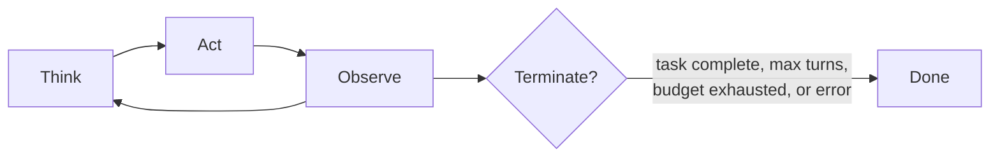

# Agent Execution

This page covers the agent-side execution plane: how a single agent runs a task. The engine dispatches work via the [TaskEngine](engine.md#taskengine-centralised-state-coordination); the agent receives it, enters an execution loop, and iterates through LLM turns and tool calls until completion or handoff. The loop type, prompt profile, stagnation guards, and context-budget policies are all pluggable per agent.

## Agent Execution Status

The `ExecutionStatus` enum (in `engine/agent_state.py`) tracks the per-agent
runtime execution state:

| Status | Meaning |
|--------|---------|
| `IDLE` | Agent is not executing; no active task or execution run. |
| `EXECUTING` | Agent is actively processing a task within an execution loop. |
| `PAUSED` | Agent is waiting for an external event (e.g. approval gate). |

`ExecutionStatus` is consumed by `AgentRuntimeState` (in `engine/agent_state.py`),
which is persisted via `AgentStateRepository` for dashboard queries and
graceful-shutdown discovery. See the [Agents design page](agents.md#runtime-state)
for how `AgentRuntimeState` fits into the runtime state layer.

## Agent Execution Loop

The agent execution loop defines how an agent processes a task from start to
finish. The framework provides multiple configurable loop architectures behind
an `ExecutionLoop` protocol, making the system extensible. The default can vary
by task complexity and is configurable per agent or role.

### ExecutionLoop Protocol

All loop implementations satisfy the `ExecutionLoop` runtime-checkable protocol:

`get_loop_type() -> str`
:   Returns a unique identifier (e.g., `"react"`).

`execute(...) -> ExecutionResult`
:   Runs the loop to completion, accepting `AgentContext`,
    `CompletionProvider`, optional `ToolInvoker`, optional `BudgetChecker`,
    optional `ShutdownChecker`, optional `CompletionConfig`, optional
    `TaskCancellationChecker` (operator cancellation and supersession),
    optional `TurnObserver` (per-step progress), and
    `streaming_enabled` (streams each turn and makes it interruptible
    mid-flight for cancellation and steering REDIRECT).

    The loop reports a turn once; how many things listen is the engine's
    business, so `compose_turn_observers` fans it out. Two listen today: the
    AG-UI stream, and `make_runtime_state_observer`, which upserts the
    agent's `AgentRuntimeState` so the cockpit can answer for a run while it
    is still in flight (see [Agents](agents.md#runtime-state)). The report
    carries the live `AgentContext`, which holds the whole conversation:
    fenced where it is stored, so an observer putting any of it into a
    prompt owes it a `wrap_untrusted` at that boundary. Both shipped
    observers read scalars only.

    The hook fires only on a turn that CONTINUES: a turn that finishes the
    run returns the result instead of reporting. So the engine also writes
    a row at dispatch (`mark_agent_running`), or a single-turn run would
    never appear as running at all, and marks the agent idle in a `finally`,
    naming its own execution so a sibling dispatch's row is left alone.

    The engine is not the only writer. The decomposition planning session
    builds its own loop rather than going through `AgentEngine`, so it claims
    and releases the row itself and wires the same observer; it was otherwise
    the one agent run that appeared nowhere.

    The clear is **shielded, and the shielded write is awaited again on
    cancellation**. An `await` in a `finally` is not protected, and a row left
    behind here is worse than stale: the write is a compare-and-set on
    execution ownership, so a later run presents a different execution id, is
    refused, and is refused permanently. Nothing reaps an `EXECUTING` row and
    the row is durable, so one interrupted clear would cost that agent every
    live-state read from then on. Shielding alone is not enough: the shield
    re-raises the moment the cancellation lands, leaving the write running
    with nothing waiting on it, so a shutdown that closes the loop next takes
    it with it. Holding the task and awaiting it is what makes the clear land.

    That covers every in-process interruption, which is the whole of what the
    process can cover. **A hard kill (SIGKILL, container death) still strands
    the row**, and nothing reclaims it: the agent is then refused for ever. A
    boot-time pass is the shape that closes it, because a process that has
    just started knows nothing it did not start is running, but only where
    this process owns execution: with work handed to a distributed queue,
    another worker's live rows would be exactly what such a pass cleared.
    Untracked here rather than half-built.

**Supporting models:**

`TerminationReason`
:   Enum: `COMPLETED`, `MAX_TURNS`, `BUDGET_EXHAUSTED`, `SHUTDOWN`, `STAGNATION`,
    `ERROR`, `PARKED`, `CANCELLED`, `NO_OP`.  `max_turns` is the budget a run
    starts with (`engine.max_turns`), not the last word on how long it may go:
    see [Turn ceiling](#turn-ceiling) below.
    `CANCELLED` fires when a per-task `TaskCancellationChecker` observes the
    task's terminal status at a safe boundary (e.g. an operator superseded it
    via mid-flight steering); the loop halts and the post-execution pipeline
    performs no re-transition because the task is already terminal.  `NO_OP` is
    the fail-loud zero-artifact guard: a task declaring `artifacts_expected`
    whose run produced none terminates here and the task goes `FAILED`, rather
    than reaching review as though it had delivered. Every plan-dispatched
    WORK item declares an artifact, so the guard is always armed for one (see
    [Initiative Tail](initiative-tail.md)). "Produced none" is decided by
    asking the workspace whether this run changed it, not by counting tool
    calls: an agent that read two files, wrote nothing, and stopped made tool
    calls, and one that created directories and announced its next step made
    five (see [Did this run do anything?](#did-this-run-do-anything)). When
    the post-execution pipeline is
    what catches the run, the verdict is written back onto the run as well as
    the task: the returned `ExecutionResult` carries `NO_OP` in place of the
    `COMPLETED` the loop claimed, because `AgentRunResult.is_success` reads
    that field, and a run left reporting success while its task sits `FAILED`
    answers "did this work" two ways at once. A run that stopped for a reason
    of its own (`MAX_TURNS`, `ERROR`) keeps it: it already answers `False`,
    and overwriting it would discard how it stopped to restate that it failed.

`TurnRecord`
:   Frozen per-turn stats (tokens, cost, tool calls, finish reason).

`ExecutionResult`
:   Frozen outcome with final context, termination reason, turn records, and
    optional error message (required when reason is `ERROR`).

`BudgetChecker`
:   Callback type `Callable[[AgentContext], bool]` invoked before each LLM call.

`ShutdownChecker`
:   Callback type `Callable[[], bool]` checked at turn boundaries to initiate
    cooperative shutdown.

### The Loop

`ReactLoop` is the one inner loop the product ships. A single interleaved
cycle: the agent reasons about the current state, selects an action (tool call
or response), observes the result, and repeats until done or `max_turns` is
reached.



!!! note "Why one loop"
    A second loop shipped for a time: an embedded OpenHands harness, run
    in-sandbox over its container's stdin/stdout and governed at the LLM
    gateway. It was there to be measured, and it was:
    [the recording](../research/inner-loop-ab-recording.md) put 90 runs through
    both loops across five briefs and three model capabilities, and ReAct
    scored higher in 12 of 15 cells.

    The result that decided it was not the score. Its builder took only
    `**_unused: object`, so it silently discarded the six in-flight controls
    the native builder receives by name, and 6 of its 45 runs terminated
    `completed` while failing their own checks, against 2 of ReAct's 45. An
    ungoverned run that reads downstream as a success is the expensive
    failure for a supervised system, so the loop, the selection surface and
    the settings that named one were removed together.

### AgentEngine Orchestrator

`AgentEngine` is the top-level entry point for running an agent on a task. It
composes the execution loop with prompt construction, context management, tool
invocation, and cost tracking into a single `run()` call. It builds its loop
through `_make_default_loop()`, which passes every in-flight control the engine
holds (approval gate, stagnation detector, compaction callback, steering inbox,
step classifier) by name, so a control the engine was given that the loop never
received is a type error rather than a silently ungoverned run. An
`execution_loop=` may still be injected, which tests use to drive a double.

The engine also exposes an optional ``coordinate()`` method that delegates to a
``MultiAgentCoordinator`` when one is configured (see [Coordination](coordination.md)).

**Signature:**

```python
async run(
    identity, task, completion_config?, max_turns?,
    memory_messages?, timeout_seconds?, effective_autonomy?
) -> AgentRunResult
```

`effective_autonomy` is an override, not a requirement. When a caller supplies
none the engine resolves it itself, through the `AutonomyResolution` seam the
worker installs (`set_autonomy_resolution`), so every dispatch path gets the
same answer from one owner: the solo `execute_once`, the coordinated
`ParallelAgentExecutor`, and a resume. Only the solo path used to resolve it,
which is why every coordinated agent silently lost its autonomy-tiered output
scanning; the team path is the one the general loop actually uses.

`AutonomyTieredPolicy` closes the remaining gap. With genuinely no tier to read
(no run behind the screen, or a level the map does not cover) it responds at the
STRICTEST tier and logs why, never a middle one: the map runs from `LogOnly` at
FULL to `Withhold` at LOCKED, so substituting the middle `RedactPolicy` handed a
LOCKED organisation a weaker response than it chose and said nothing.

**Pipeline steps:**

1. **Validate inputs**: agent must be `ACTIVE`, task must be `ASSIGNED` or
   `IN_PROGRESS`. Raises `ExecutionStateError` on violation.
2. **Pre-flight budget enforcement**: if `BudgetEnforcer` is provided, check the
   monthly hard stop, the daily limit and the provider's quota via
   `check_can_execute()`. Raises `BudgetExhaustedError`,
   `DailyLimitExceededError` or `QuotaExhaustedError` on violation. Budget
   refuses spend; it never re-points the agent at a different model or
   connection. See [Budget & Cost Management](budget.md#cost-controls).
3. **Project validation**: if `ProjectRepository` is provided, validate that the
   task's project exists (`ProjectNotFoundError` if not). Membership is not
   checked: an initiative has no stored agent subset, and its contributors are
   derived from the tasks that ran. When the project has a non-zero budget and
   `BudgetEnforcer` is available, check project-level budget via
   `check_project_budget()`. Raises `ProjectBudgetExhaustedError` when the
   project's accumulated cost has reached its budget. Pre-flight project budget
   checks are approximate under concurrency (TOCTOU); the in-flight
   `BudgetChecker` closure provides the true safety net.
4. **Build system prompt**: calls `build_system_prompt()` with agent identity,
   task, and resolved model capability. The rung determines a `PromptProfile` that
   controls prompt verbosity (see [Prompt Profiles](#prompt-profiles) below).
   Tool definitions are NOT included in the prompt; they are supplied via the
   API's `tools` parameter ([Decision Log](../architecture/decisions.md) D22).
   Follows the **non-inferable-only principle**: system prompts include only
   information the agent cannot discover by reading the codebase or environment
   (role constraints, custom conventions, organisational policies).
5. **Create context**: `AgentContext.from_identity()` with the configured
   `max_turns`.
6. **Seed conversation**: injects system prompt, optional memory messages, and
   formatted task instruction as initial messages.
7. **Transition task**: `ASSIGNED` -> `IN_PROGRESS` (pass-through if already
   `IN_PROGRESS`). This is the entry sync to the central engine, and it is
   fail-loud: a refused transition raises `ExecutionStateError` rather than
   proceeding locally, so the engine never runs work the central engine has no
   record of starting. It runs here rather than at validation time because it
   applies to the local context: `transition_task_if_needed` takes the seeded
   context and returns the moved one, so the context has to exist first.
8. **Prepare tools and budget**: creates `ToolInvoker` from registry and
   `BudgetChecker` from `BudgetEnforcer` (task + monthly + daily + project limits
   with pre-computed baselines and alert deduplication) or from task budget limit
   alone when no enforcer is configured.
9. **Take the loop**: the engine built it at construction, wired with every
   in-process control it holds (`approval_gate`, `stagnation_detector`,
   `compaction_callback`, `steering_inbox`, `step_classifier`). The boundary
   checks (budget, shutdown, cancellation, `NO_OP`) are passed per call to
   `execute()`.
10. **Delegate to loop**: calls `ExecutionLoop.execute()` with context,
   provider, tool invoker, budget checker, and completion config. The
   provider client is dispatched **per agent**, not fixed to the engine
   default: `_dispatch_client_for(identity)` resolves the client serving
   the agent's own `identity.model.provider` from the provider registry, so
   an agent pinned to a non-default provider runs on its own API and its cost
   is attributed to that provider. A wired registry that does not know the
   provider fails closed (`DriverNotRegisteredError`) rather than silently
   dispatching to the wrong API; only a fully unwired registry falls back to
   the engine default. Nothing between the roster and the driver may rewrite
   `identity.model`, so the client resolved here and the pair the cost record
   names cannot come apart (`check_no_bound_pair_rewrite.py`). If
   `timeout_seconds` is set, wraps the call in `asyncio.wait`; on expiry
   the run returns with `TerminationReason.ERROR` but cost recording and
   post-execution processing still occur.
   When escalations are detected after tool execution (via
   `ToolInvoker.pending_escalations`), the `ApprovalGate` evaluates whether
   parking is needed. If so, the context is serialised via `ParkService`
   and persisted when a `ParkedContextRepository` is configured; the loop
   then returns a `PARKED` result. When an `EventStreamHub` is configured,
   the gate also emits an `APPROVAL_INTERRUPT` SSE event and creates an
   `Interrupt` record for real-time HITL resolution. On resume, an
   `APPROVAL_RESUMED` event is emitted. See
   [Event Stream and Async Delegation](communication-events.md#interrupt-and-resume-protocol)
   for the full interrupt/resume protocol and `EvidencePackage` schema.
11. **Record costs**: records accumulated `TokenUsage` to `CostTracker` (if
    available), tagged with `project_id` for project-level cost aggregation.
    Cost recording failures are logged but do not affect the result.
12. **Apply post-execution transitions:**
    - On the `COMPLETED` and `NO_OP` branches (after the shutdown and park
      branches and the zero-tool-call proxy), a task that declared
      `artifacts_expected` and left its workspace untouched goes IN_PROGRESS
      -> FAILED (see [Declared-artifact check](#declared-artifact-check)); a
      run that delivered nothing never reaches review. A run interrupted by
      shutdown, or parked for clarification, is not failed for missing
      artifacts it was never given the chance to produce.
    - `COMPLETED` termination: IN_PROGRESS -> IN_REVIEW (review gate).
      The task parks at IN_REVIEW until resolved by one of two paths:
      (a) a human approves (-> COMPLETED) or rejects (-> IN_PROGRESS
      for rework) via the approval API, or (b) the
      ``ApprovalTimeoutScheduler`` applies a configured timeout policy
      (auto-approve, auto-deny, or escalate).  Both paths delegate to
      ``ReviewGateService`` for the actual state transition.

      ``ReviewGateService`` structurally enforces no-self-review: if
      the decider equals ``task.assigned_to``, it raises
      ``SelfReviewError`` (surfaced as HTTP 403 at the approval
      controller, with a generic message that never echoes internal
      agent/task identifiers) and no transition occurs. The check
      runs in two phases: the approval controller calls
      ``check_can_decide`` as a **preflight** *before*
      ``approval_store.save_if_pending``; this ensures a rejected
      self-review attempt never leaves a decided approval row or a
      broadcast WebSocket event behind.  ``complete_review``
      independently re-runs the check as defence-in-depth at the
      service boundary; the service makes no assumption that the
      caller ran the preflight.  ``TaskNotFoundError`` maps to 404
      and ``TaskVersionConflictError`` to 409, both with generic
      messages to avoid leaking task UUIDs via error bodies.

      The service attempts to append a ``DecisionRecord`` to the
      auditable decisions drop-box (``DecisionRepository``) for every
      completed review, capturing executor, reviewer, outcome,
      approval-ID cross-reference, and an acceptance-criteria snapshot.
      This append is **failure-tolerant**: known transient persistence
      failures (``QueryError`` / ``DuplicateRecordError``) are logged
      via ``logger.exception`` and do NOT roll back the state
      transition (the transition is the source of truth; the drop-box
      is the audit trail).  Programming errors (``ValidationError``,
      ``TypeError``, ``AttributeError``) are deliberately NOT caught;
      they propagate loudly so schema drift surfaces in dev/CI instead
      of being masked as silent audit loss. See the "Review Gate
      Invariants" section of ``docs/design/security.md`` for the
      full three-layer enforcement model (service preflight, Pydantic
      validator, SQL CHECK constraint).

      **Identity versioning:** Agent identities
      are versioned as first-class artifacts via the generic
      ``VersioningService[T]`` infrastructure. ``ReviewGateService``
      looks up the executing agent's newest identity version and injects
      ``charter_version: {agent_id, version, content_hash}`` into the
      ``DecisionRecord.metadata`` field (failure-tolerant; lookup failure
      is logged at WARNING and the decision record is still written).
      See [Agents](agents.md) for the full design.
    - `SHUTDOWN` termination: current status -> INTERRUPTED (or SUSPENDED
      if the checkpoint strategy successfully checkpointed the task;
      see [Graceful Shutdown](coordination.md#graceful-shutdown-protocol)).
    - `ERROR` termination: recovery strategy is applied (default
      `FailAndReassignStrategy` transitions to FAILED;
      see [Crash Recovery](coordination.md#agent-crash-recovery)).
    - `CANCELLED` termination: the task is already terminal (an operator
      cancelled or superseded it out of band), so the pipeline performs no
      re-transition and records no phantom state change. See
      [Mid-Flight Steering](mid-flight-steering.md).
    - `MAX_TURNS`, `BUDGET_EXHAUSTED` and `STAGNATION` terminations:
      IN_PROGRESS -> FAILED, with the termination reason recorded.
      `STAGNATION` indicates the agent was stuck in a repetitive loop.
      A run that stopped without finishing is not still moving, and
      leaving it at IN_PROGRESS makes it invisible to the stall derivation
      (which counts an item stalled only when its task sits in a dead
      status), so an initiative whose agent exhausted its turns could
      never be replanned or completed. FAILED is also retryable under
      `max_retries`; once retries are spent the item reads as stalled and
      the replan trigger fires. See
      [Initiative Tail](initiative-tail.md). A run reaches `MAX_TURNS` only
      once its extensions are spent or unearned: see
      [Turn ceiling](#turn-ceiling).
    - `PARKED` leaves the task in its current state. It indicates the
      agent paused while waiting for a human
      approval decision from `ApprovalGate`; the task remains at its
      current status (typically `IN_PROGRESS` or `AUTH_REQUIRED` in the
      task-state diagram; see [Task Lifecycle](engine.md#task-lifecycle))
      until explicitly resumed. The Approval Timeout Policy controls
      how long the parked state persists and how it ultimately
      resolves. Approval parking is distinct from the
      checkpoint-based `SUSPENDED` state produced by graceful shutdown
      (which preserves an agent's full context across a process restart);
      see [Approval Timeout Policy](security.md#approval-timeout-policy)
      and [Graceful Shutdown](coordination.md#graceful-shutdown-protocol)
      for the two parking mechanisms.
    - Each transition is synced to TaskEngine incrementally (see
      [AgentEngine <-> TaskEngine Incremental Sync](engine.md#agentengine-taskengine-incremental-sync)).
    - Transition failures are logged but do not discard the successful execution
      result.
13. **Procedural memory generation** (non-critical): when
    `ProceduralMemoryConfig` is enabled and the execution failed
    (recovery_result exists), a separate proposer LLM call analyses the
    failure and stores a `PROCEDURAL` memory entry for future retrieval.
    Optionally materialises a SKILL.md file. Failures are logged but do
    not affect the result (see [Memory Learning: Procedural Memory Auto-Generation](memory-learning.md#procedural-memory-auto-generation)).
14. **Return result**: wraps `ExecutionResult` in `AgentRunResult` with
    engine-level metadata.

**Error handling:** `MemoryError` and `RecursionError` propagate
unconditionally. `BudgetExhaustedError` (including `DailyLimitExceededError`)
returns `TerminationReason.BUDGET_EXHAUSTED` without recovery; budget
exhaustion is a controlled stop, not a crash. All other exceptions are caught
and wrapped in an `AgentRunResult` with `TerminationReason.ERROR`.

???+ note "AgentRunResult model"
    `AgentRunResult` is a frozen Pydantic model wrapping `ExecutionResult`
    with engine metadata:

    - `execution_result`: outcome from the execution loop
    - `system_prompt`: the `SystemPrompt` used for this run
    - `duration_seconds`: wall-clock run time
    - `agent_id`, `task_id`: identifiers
    - Computed fields: `termination_reason`, `total_turns`, `total_cost`,
      `is_success`, `completion_summary`

### Did this run do anything?

Asked of the workspace, and asked once. `engine/artifacts/workspace_fingerprint.py`
takes every file under the project's workspace with a key for its content; a
run that leaves that set identical produced nothing. Content rather than
length, because the verdict this drives is whether to FAIL the task and an
edit that keeps a file's size (a flipped constant, a rewritten line) is
ordinary work a byte count cannot see. Nothing is read through a link: a
workspace an agent can write can hold a symlink to `/dev/zero`, which never
reaches EOF, so a link is keyed by its own text and anything else that is
not a regular file by its kind. `AgentEngine.run` takes the
answer before the loop starts and publishes it on
`engine/artifacts/baseline_scope.py`, where the loop's own correction, its
no-op classification and the post-execution guard all read it, so the three
cannot answer differently about a run one of them is about to end.

The question needs no plan, which is the point. A declaration is written
before the tree exists, from a title and a sentence, so a run briefed to
build the CSV reader that writes `sqlcsv/reader.py` where
`sqlcsv/csv_reader.py` was declared satisfies no declaration and has
produced eight modules. A tool name cannot answer it either: `mkdir`, `ls`
and `cat` are the same call as a write to anything that only knows names,
and a recorded leaf that ran exactly those was read as finished on turn 6
of 40 holding an empty tree.

Trees a tool writes rather than an author are pruned wherever they appear
(`.git`, `__pycache__`, `.pytest_cache`, `.mypy_cache`, `.ruff_cache`,
`node_modules`, `.venv`): an agent that ran the suite it was handed authored
nothing, and counting the cache it left would wave through the run the check
exists to catch. Length rather than content, because this decides whether to
spend one more turn, not whether work is correct.

When nothing changed and the task declared artifacts, the run fails under
whichever reason names most: the declared paths when any of them is
path-shaped, and `NOTHING_PRODUCED_REASON` otherwise. That last case is the
only check a prose declaration ever gets.

### Declared-artifact check

Once the workspace says something happened, the sharper question is whether
it was what the task promised. `engine/artifacts/expected_artifact_check.py`
resolves each `ExpectedArtifact.path` against the task's project workspace
(`engine/workspace/paths.py::project_workspace_dir`) and returns what is
missing; `apply_post_execution_transitions` consumes it through an injected
`RunBaselineProbe` seam alongside the fingerprint, so a deployment without a
workspace root simply falls back to the tool-call proxy rather than failing
every task.

A run that produced **something** and satisfied no declaration reaches
review rather than failing here. The naming disagreement is real and worth
a verdict, but it is one a reviewer can read the tree to settle, and failing
it here discards working code: measured on a live recursion-depth cell,
three of eight units wrote 4, 8 and 10 modules apiece under names the
planner had not guessed.

That only holds if the reviewer can see the substitution, so
`engine/artifacts/deliverable_content.py` reads the files the workspace
holds under a `produced_instead` heading whenever no declared path came back.
Both headings share the one content budget, because they share the one
prompt. Without it, sending such a run to review would hand the reviewer an
empty section and leave it approving on the agent's closing prose, which is
the reading that module exists to stop.

Only a **path-shaped** declaration is probed. `ExpectedArtifact.path` carries
whatever the planner wrote, which may be a file (`src/game.py`) or a
deliverable named in prose ("the integrated, runnable deliverable"). Prose
resolves to no file, so probing it would read as "produced nothing" and fail
every task whose planner wrote a sentence, the integration task included.
An absolute declaration is not probed either: containment is what makes the
answer about the task's own output, and a path the run could not have written
under its own workspace is not evidence of delivery.

The threshold is deliberately "none of them present" rather than "all of
them present". An agent that legitimately chose a different path for one
file should reach review and let the completion oracle judge it; an agent
that delivered nothing at all is the case the invariant is about, and the
recorded reason names the paths that are absent.

Presence answers a task that creates. Most engineering work edits a file
that is already there, and for those tasks every declared path exists before
the agent starts, so presence alone comes back "delivered" whatever the run
did. The same baseline that carries the fingerprint carries each
declaration's digest, taken in one call off one directory so the two views
cannot describe different moments; the post-execution transition compares
the two. A declaration counts as
delivered when it appeared, changed or was removed, and a run all of whose
declarations are byte-identical to how it found them is failed under its own
reason, which names the paths rather than saying they are missing (they are
not: they are untouched). Three cases deliberately do not fail: a directory,
which has no single content to compare and is judged on presence alone; a
run whose engine wired no probe, so no baseline was taken; and a resumed
segment, whose baseline was captured at the resume and so already contains
whatever an earlier segment wrote.

`check_verified_completion_paths.py` asserts the post-execution transition
still calls the probe, so the guard cannot be quietly unwired later.

### Corrective turns before the guard

Three corrections run before the zero-artifact guard can fire, because every
failure they catch looks identical to "produced nothing" while the run still
had budget to deliver.

`engine/loop_empty_run.py` fires at most once, on the first turn that calls
no tool, and only when the task declares artifacts, the workspace holds
nothing this run put there, a turn remains, and the run is not a resumed
segment. It names the declared deliverables (fenced with `wrap_untrusted`,
since a planner-authored path is model output) and says prose is not a
deliverable. A second empty turn falls through to the guard, so the
correction costs one round trip and never loops.

`engine/loop_silent_turn.py` fires when a reasoning model spends a whole turn
on its thinking channel and its visible channel comes back empty. That is
neither the agent finishing nor the provider failing, so the run gets its
next turn rather than being ended and discarded. Like the first, it fires at
most once in a row.

`engine/loop_unusable_turn.py` fires when a turn asked for a tool and
delivered none: a `TOOL_USE` finish whose only call the driver dropped as
malformed, or a turn empty on every channel that the driver normalised to
`ERROR` on its way out. It nudges the model to re-issue one well-formed call,
up to `MAX_CONSECUTIVE_CORRECTIONS` times in a row, with any productive turn
resetting the count. Past the bound the run ends `ERROR` rather than falling
through, because the turn produced nothing and the ordinary completion path
would report a run that delivered nothing as a success. This one is not a
hypothetical shape: a full A/B recording lost 14 of 27 native-loop runs to it
by the third turn.

### Tools that do not exist

A turn whose every tool call named something the registry does not have ran
nothing, so it made no progress whatever its arguments were. After
`engine.max_unresolved_tool_turns` (default 5) consecutive such turns the run
ends `STAGNATION`, with the names it kept asking for in the result's metadata.

This is deliberately a different question from the one the stagnation detector
asks. That detector fingerprints each call as `name:args_hash` and fires on
repetition; a live run defeated it by drifting its arguments a few characters
every turn while asking 246 times for a tool named `write`. The registry had
answered the first of those by name with its four nearest matches, so nothing
was hidden from the model: what was missing was a bound.

### Turn ceiling

Reaching `engine.max_turns` is not itself a verdict. A run that **ran** a tool
in the budget it just spent grants itself another budget of the same size,
up to `engine.max_turn_extensions` times (default 3), so a working run can
reach `max_turns * (1 + max_turn_extensions)` turns. A run that spent that
budget without running one earns nothing and stops at its first ceiling.

Ran, not requested, and the difference is the whole rule. Asking is free, so
under the earlier test the run above was granted its second budget at turn 300
for 300 requests that had resolved to nothing. It is that grant, not the
policy above, which no longer happens.

Once the extensions are spent the run terminates `PARKED` rather than
`MAX_TURNS`: its workspace and everything it wrote are intact, and the honest
next step is to ask whether to carry on. `engine/task_sync_turn_ceiling.py`
arms that question **before** the task moves, writing both halves a resume
needs: a `ParkedContext`, and an approval carrying
`ApprovalSource.PARKED_CONTEXT` under its own `execution:extend_turns` action
type (an autonomy grant written for "review this deliverable" must not also
mean "spend another four turn budgets"). If either half cannot be written the
run does not park at all: it ends `MAX_TURNS`, which is retryable and visible
to the stall derivation, rather than sitting in `AWAITING_INPUT` with nothing
able to move it.

The park moves the task `IN_PROGRESS -> AWAITING_INPUT`. On resume the run is
handed one further budget: approving restores the extension allowance too,
rejecting leaves it at zero so the next ceiling ends the run instead of
asking again. Setting `engine.max_turn_extensions` to `0` ends every run at
its first ceiling.

## Prompt Profiles

A basic model cannot carry the prompt an expert one can, so the prompt adapts to
the rung the agent actually runs at. A `PromptProfile` controls how verbose and
detailed the system prompt is for each capability rung.

### Built-in Profiles

| Profile    | Capability | Org Policies | Acceptance Criteria | Autonomy |
|------------|------------|--------------|---------------------|----------|
| **full**   | expert     | Included     | Nested list         | Full     |
| **standard** | capable  | Included     | Nested list         | Summary  |
| **basic**  | basic      | Excluded     | Flat semicolon line | Minimal  |

The `Autonomy` column selects the verbosity tier for two sections at once. The
standing "ask rather than guess" directive is tiered on the same axis as the
autonomy instructions and keyed on the same resolved autonomy level, so an
agent selected at a lower capability rung gets a terser instruction rather
than losing the instruction.
See [The Org Asks](org-questions.md).

### Capability Flow

1. Template YAML specifies an agent's capability requirements (capability
   flags, `min_context`, optional `family`/`model_pattern`, priority)
2. Model matcher hard-filters on those requirements against each model's
   persisted `ModelMetadata`, resolves any family/pattern reference to the
   newest matching model, scores survivors, and stores the report-only
   `capability` (derived from the selected model's context window) in
   `ModelConfig`
3. Nothing revises it afterwards: the rung is set when the model is matched, and
   the model catalogue is the authority a selection decision reads
   (`ResolvedAgentCapabilityReader`), so an operator re-grading a model does not
   need every roster row rewritten
4. Engine passes `described_capability(self._capability, identity.model)` to
   `build_system_prompt()`, so the prompt profile is keyed on the rung the
   catalogue grades the pair at, and a re-grade moves selection and the
   prompt together; `identity.model.capability` is the fallback when nothing
   grades the pair
5. Prompt builder resolves `PromptProfile` and adapts template rendering

### Invariants

- **Authority** and **Identity** sections are **never** stripped regardless of
  profile
- When `capability` is `None` (unknown), the **full** profile is used as a safe
  default
- Profile selection is logged via `prompt.profile.selected` (with
  `requested_capability`, `selected_capability`, and `defaulted` flag);
  `prompt.profile.default` is emitted at DEBUG level when falling back
  to the full profile

## Stagnation Detection

Agents can persist in unproductive loops, repeating the same tool calls without
making progress. Stagnation detection analyses `TurnRecord` tool call history
across a sliding window, intervenes with a corrective prompt injection, and
terminates early with `STAGNATION` if correction fails.

### Protocol Interface

```python
@runtime_checkable
class StagnationDetector(Protocol):
    async def check(
        self,
        turns: tuple[TurnRecord, ...],
        *,
        corrections_injected: int = 0,
    ) -> StagnationResult: ...

    def get_detector_type(self) -> str: ...
```

Async protocol; future implementations may consult external services or
LLM-based analysis.

### Detector selection (`StagnationDetectionConfig.strategy`)

Stagnation detection is **off by default**: `StagnationDetectionConfig.strategy`
defaults to `"off"`, and the factory returns no detector, so a stock boot runs
the engine without one. Set `stagnation.strategy` to `tool_repetition` or
`quality_erosion` to activate the matching detector with its co-located
sub-config.

### `ToolRepetitionDetector` (`strategy: tool_repetition`)

Uses dual-signal detection:

1. **Repetition ratio**: excess duplicates divided by total fingerprint count
   in the window. A fingerprint appearing 3 times contributes 2 to the
   duplicate count.
2. **Cycle detection**: checks for repeating A->B->A->B patterns at the turn
   level (`seq[-2k:-k] == seq[-k:]` for cycle lengths 2..len/2).

Fingerprints are computed as `name:sha256(canonical_json_args)[:16]`,
sorted per-turn for order-independent comparison.

### Configuration (`StagnationConfig`)

| Field                  | Default | Description                                       |
|------------------------|---------|---------------------------------------------------|
| `enabled`              | `True`  | Per-detector switch within `StagnationConfig`; only consulted once `strategy: tool_repetition` selects this detector (the system default is `strategy: off`, no detector) |
| `window_size`          | `5`     | Number of recent tool-bearing turns to analyse     |
| `repetition_threshold` | `0.6`   | Duplicate ratio that triggers detection            |
| `cycle_detection`      | `True`  | Whether to detect repeating patterns               |
| `max_corrections`      | `1`     | Corrective prompts before terminating (0 = none)   |
| `min_tool_turns`       | `2`     | Minimum tool-bearing turns before any check fires  |

### Intervention Flow

1. **No stagnation**: execution continues normally
2. **`INJECT_PROMPT`**: a corrective USER-role message is injected into the
   conversation (up to `max_corrections` times)
3. **`TERMINATE`**: execution terminates with `TerminationReason.STAGNATION`
   and stagnation metadata attached to the result

### Loop Integration

- **ReactLoop**: stagnation checked after each successful turn; corrections
  counter is loop-scoped
- `STAGNATION` terminates the task `FAILED` (like `MAX_TURNS` and
  `BUDGET_EXHAUSTED`): a run that stopped mid-way has not delivered, and
  parking it at `IN_PROGRESS` hid it from the stall derivation

## Context Budget Management

Agents running long tasks consume their LLM context window without awareness.
The context budget system tracks fill levels, injects soft indicators into
system prompts, and compresses conversations at turn boundaries.

### Context Fill Tracking

`AgentContext` carries three context-budget fields:

- `context_fill_tokens`: estimated tokens in the full context (system prompt +
  conversation + tool definitions)
- `context_capacity_tokens`: the model's `max_context_tokens` from
  `ModelCapabilities`, or `None` when unknown
- `context_fill_percent`: computed percentage (`fill / capacity * 100`),
  `None` when capacity is unknown

Fill is re-estimated after each turn via `update_context_fill()` in
`context_budget.py`, using the `PromptTokenEstimator` protocol (default:
`DefaultTokenEstimator` at `len(text) // 4`).

### Soft Budget Indicators

`ContextBudgetIndicator` is injected into the system prompt via
`_SECTION_CONTEXT_BUDGET`:

```text
[Context: 12,450/16,000 tokens (78%) | 0 archived blocks]
```

The indicator is set at initial prompt build time. The `archived_blocks` count
is derived from `CompressionMetadata.compactions_performed`.

### Compaction Hook

`CompactionCallback` is a type alias (`Callable[[AgentContext], Coroutine[...,
AgentContext | None]]`) wired into `ReactLoop` via its constructor; the same
injection pattern as `checkpoint_callback`, `stagnation_detector`, and
`approval_gate`.

The default implementation (`make_compaction_callback` in
`compaction/summarizer.py`) archives oldest conversation turns into a summary
message when `context_fill_percent` exceeds a configurable threshold (default
80%).

`CompactionConfig` controls:

| Field | Default | Description |
|-------|---------|-------------|
| `fill_threshold_percent` | `80.0` | Fill percentage that triggers compaction |
| `min_messages_to_compact` | `4` | Minimum messages before compaction is allowed |
| `preserve_recent_turns` | `3` | Recent turn pairs to keep uncompressed |
| `agent_controlled` | `False` | Let the `compact_context` tool trigger compaction; auto-compaction then defers to `safety_threshold_percent` |
| `safety_threshold_percent` | `95.0` | Auto-compaction safety net when `agent_controlled` is on; must exceed `fill_threshold_percent` |
| `preserve_epistemic_markers` | `True` | Preserve marker-bearing sentences instead of truncating them (see [Agent-Controlled Context Compaction](#agent-controlled-context-compaction)) |
| `llm_summarizer_enabled` | `False` | Summarise the archived batch via a completion call instead of concatenation; requires `llm_summary_model` |
| `memory_offload_enabled` | `False` | Persist the archived batch to the memory backend for later rehydration |

Assistant message snippets included in the summary are sanitized via
``sanitize_message()`` to redact file paths and URLs before injection into LLM
context. Compaction errors are logged but never propagated; compaction is
advisory, not critical.

### Compressed Checkpoint Recovery

`CompressionMetadata` is persisted on `AgentContext` and serialised into
checkpoint JSON. On resume, `deserialize_and_reconcile()` detects compressed
checkpoints and includes compression-aware information in the reconciliation
message:

The ``error_message`` is sanitized via ``sanitize_message()`` before inclusion to
prevent file paths and URLs from leaking into LLM context.

```text
Execution resumed from checkpoint at turn 8. Note: conversation was
previously compacted (archived 12 turns). Previous error: ...
```

### Loop Integration

- **ReactLoop**: compaction checked after stagnation detection, at turn
  boundaries (between completed turns), through the shared
  `invoke_compaction()` helper in `loop_helpers.py`

## Brain / Hands / Session

*Vocabulary adopted from the [Anthropic managed-agents engineering post](https://www.anthropic.com/engineering/managed-agents).*

The engine's architecture maps onto three decoupled planes. Each plane has a distinct responsibility, failure mode, and persistence story.

| Plane | SynthOrg Modules | Purpose |
|-------|-----------------|---------|
| **Brain** | `engine/agent_engine.py`, `AgentContext`, loop protocol (`ReactLoop`) | Inference loop, middleware, decision-making. Stateless between turns; all state lives in the immutable `AgentContext`. |
| **Hands** | `ToolInvoker`, `tools/sandbox/`, `SandboxCredentialManager`, `engine/_validation.py::validate_task_metadata` | Tool execution, side effects, credential scope. Credentials are stripped at the engine input boundary (task metadata validator) and at the sandbox boundary (credential manager); they never enter the brain or session planes. |
| **Session** | `observability/events/`, `engine/session.py` (`Session.replay`), checkpoint/resume | Durable event history, replay, audit. Every significant action emits a structured event; the event stream is the session's source of truth. |

### Resilience Property

The brain can fail (crash, OOM, timeout) without losing session state. Because every turn emits structured events (`execution.context.turn`, `execution.task.transition`, etc.) to the configured observability sinks, a new brain instance can reconstruct the execution context via `Session.replay(execution_id)`.

`Session.replay()` walks the event log for a given execution and reconstructs `AgentContext` (turn count, accumulated cost, task status).  It is a **partial** read-only reconstruction; conversation message content is not stored in events, so the replayed context has synthetic placeholder messages. The `ReplayResult.replay_completeness` field (0.0 to 1.0) indicates how much state was recovered, scored by event coverage (engine start, context creation, turn contiguity, cost data, task transitions).

This is lighter-weight than full checkpoint/resume (`checkpoint/resume.py`), which persists complete `AgentContext` snapshots and supports mid-execution suspend/resume with full message history. Use session replay for recovery after brain failure; use checkpoint/resume for deliberate pause/resume of long-running tasks.

### Credential Isolation Boundary

Credentials never enter the brain or session planes. Two enforcement points:

1. **Task metadata validator** (`engine/_validation.py::validate_task_metadata`): rejects `Task.metadata` keys matching credential patterns (token, secret, api_key, password, bearer) at the engine input boundary before execution starts.
2. **Sandbox credential manager** (`tools/sandbox/credential_manager.py`): strips credential-like environment variables before they enter sandbox containers.

See also: [Security > Credential Isolation Boundary](security.md#credential-isolation-boundary).

### Workspace Sharing Boundary

The Hands plane runs as a different POSIX identity from the process governing
it, which is the whole point: a sandbox running as the backend could act on the
backend. That leaves one way for a test runner to open the sources it was
pointed at, and it is a group both identities hold.

The gid is the backend's own, derived at run time (`core/workspace_sharing.py::workspace_share_gid`)
rather than configured. A configured value would be a second owner for a fact
the operating system already holds, and a stale one fails silently back to the
state this contract exists to end: every captured test run reporting `EACCES`
on a file the agent had just written, and therefore a build/test oracle that
could never return `VERIFIED`.

| Concern | Mechanism |
|---------|-----------|
| Files an agent writes | `delivered_file_mode` states the mode instead of letting `mkstemp`'s owner-only bits through. It never narrows what a file already grants, so an executable script keeps its bit, and it widens an unreachable one by mirroring the owner's triad into the group. |
| Directories the backend creates | `ensure_shared_dir` at `0o2770`: group-write because an atomic replace needs the directory entry rather than the file, setgid so what the sandbox creates lands under the shared group and the backend can read build output back. |
| Directories git creates | `SHARED_GROUP_GIT_CONFIG` (`core.sharedRepository=group`) rides the one seam every system-internal git invocation already passes through. Git makes most of the tree itself (`.git`, a worktree root, a checked-out tree), so a rule applied per `mkdir` would miss them. |
| Reaching the group | `GroupAdd` at container creation, not a group baked into the image, so an operator's own devcontainer override takes part without carrying ours. |
| Writing at all | The workspace mounts read-only except for the categories that legitimately change a project (`code_execution`, `terminal`, `version_control`). A build writes objects, a shell writes output, git writes its own directory; a web fetch has no reason to. |

Nothing is granted to *other*: the group is the mechanism, so a world bit would
widen reach without serving it.

Permission is not the only way a shared workspace fails across a mount
boundary. A worktree records the path it was created at, and the backend and
the agent reach the same tree through different ones, so an absolute record
sends every git command the agent runs to a path that exists on one side only.
`worktree.useRelativePaths` is what stops that, and git accepts an unknown
configuration key silently rather than refusing it, so an older binary takes
the option, reports nothing, and hands back the broken worktree. That is why
the boot preflight asserts a version floor for git rather than only its
presence; see
[api-startup-lifecycle.md](../reference/api-startup-lifecycle.md#binary-preflight).

Two consequences are easy to miss. A container's mount mode is fixed when it is
created while the category deciding it arrives per command, so the lifecycle
owner key carries the mode (`<project>:<owner>[:img-<hash>]:<rw|ro>`) exactly as
it already carries the environment image, and an owner is torn down once per
mode. And git's local transport is unusable in the shell-free backend image: it
builds `git-receive-pack '<path>'` as one string whose space and quotes force
`/bin/sh`, which the image does not ship, so the embedded backend moves refs
through a bundle (`_ref_transfer.py::transfer_ref_local`) rather than a push.

## ACG Vocabulary Cross-Reference

The Agentic Computation Graph (ACG) formalism (arXiv:2603.22386) provides a graph-level
vocabulary for reasoning about agentic execution: nodes as atomic computation steps, edges
as data/control flow, scheduling policies, resource constraints, and termination conditions.
SynthOrg's engine maps closely to this vocabulary. The cross-reference below is maintained
as a **bidirectional glossary**: use ACG terms when discussing execution graphs with
external audiences; use SynthOrg terms in implementation discussions.

### Vocabulary Mapping

| ACG Term | SynthOrg Equivalent | Fidelity | Notes |
|----------|--------------------|---------:|-------|
| ACG Template | `CompanyConfig` + company YAML | Partial | ACG is graph-level; SynthOrg operates at org-level |
| Realised Graph | `AgentContext` + `TaskExecution` + `CoordinationResult` | Strong | Runtime execution state |
| Execution Trace | `TurnRecord` tuple + observability events (100+ constants) | Strong | SynthOrg's trace is richer than ACG baseline |
| Nodes | LLM calls (`call_provider`), tool invocations, validation checks | Strong | Typed via `NodeType` enum on `TurnRecord.node_types` |
| Edges | `SubtaskDefinition.dependencies`, `DecompositionPlan` DAG | Strong | Multi-agent; implicit in single-agent loops |
| Scheduling Policies | `CoordinationConfig` + `AutoTopologyConfig` | Strong | Topology selection |
| Conditional Branching | Loop termination checks, stagnation intervention | Partial | Not expressed as graph-level conditionals |
| Parallel Composition | `ParallelExecutor`, `CoordinationWave`, `asyncio.TaskGroup` | Strong | Fan-out/fan-in with DAG wave execution |
| Resource Constraints | `BudgetEnforcer`, quota degradation, `ContextBudget` | Strong | Richer than ACG: pre-flight and in-flight enforcement |
| Graph Mutation | Stagnation correction injection, mid-flight steering adoption | Partial | Runtime; not exposed as first-class graph mutation |
| Termination Conditions | `TerminationReason` enum (9 reasons) | Strong | Explicit enumeration covers all exit paths |
| Node Cost | `TurnRecord.cost`, `TokenUsage` | Strong | Per-turn cost attribution |

**SynthOrg concepts not captured by ACG**: episodic memory,
procedural memory, trust levels, autonomy presets, hiring/firing lifecycle. These are organisational
abstractions above the computation graph level.

## Agent-Controlled Context Compaction

Compaction runs one of two paths, chosen by `CompactionConfig`, and both share the same
split/finalise machinery in `compaction/summarizer.py`; the `invoke_compaction()` helper in
`engine/loop_helpers.py` is the shared entry point for any loop that manages its own context
in-process.

### Text summary (default path)

With no summariser or offloader wired, `_build_summary()` performs snippet-join
concatenation: assistant message snippets capped at 100 characters each, total summary
capped at 500 characters. Epistemic markers ("wait", "hmm", "actually", and the wider
hedging / reconsideration / uncertainty / verification / correction families in
`compaction/epistemic.py`) are preserved rather than truncated when a message crosses a
complexity-adaptive density threshold (`preserve_epistemic_markers`, default on): such a
message is kept as its marker-bearing sentences (up to 200 characters) instead of being cut
to the standard 100-character snippet. Empirical data (arXiv:2603.24472) shows that
discarding these markers degrades accuracy by up to 63% on complex reasoning tasks (AIME24),
which is what this preservation is for.

### Semantic path (opt-in)

Two independent upgrades layer onto the text path, both off by default:

- **LLM summarisation** (`llm_summarizer_enabled`, requires `llm_summary_model`): the
  archived batch is summarised by a completion call (`LLMSummarizer`) instead of
  concatenated; the archived content is fenced with `wrap_untrusted` before it reaches the
  prompt. Any provider failure, or empty content, falls back to the text summary rather than
  blocking compaction.
- **Memory offload** (`memory_offload_enabled`): the archived batch is persisted to the
  memory backend as a PROCEDURAL entry tagged `compaction:offloaded` (`MemoryOffloader`),
  scoped to the run's project, so a resume or investigation path can rehydrate detail the
  in-context summary elided. Best-effort: a backend failure is logged and never blocks
  compaction.

### Agent-controlled mode

With `agent_controlled` enabled, the `compact_context` tool lets an agent request compaction
directly when it judges context fill is hurting reasoning quality; automatic compaction then
defers to `safety_threshold_percent` (must exceed `fill_threshold_percent`) as a safety net
rather than firing at `fill_threshold_percent` itself. With `agent_controlled` off (the
default), only the fixed `fill_threshold_percent` threshold triggers compaction.

Semantic, cost-aware weighting of what gets archived first (rather than oldest-first) is not
built; see [Agent-Controlled Compaction](../research/agent-controlled-compaction.md) and the
[Roadmap](../roadmap/future-vision.md).

---

## See Also

- [Inner-loop A/B recording](../research/inner-loop-ab-recording.md): the measurement that left one loop shipping
- [Task & Workflow Engine](engine.md): task dispatch, routing, state coordination
- [Coordination](coordination.md): multi-agent topology, decomposition, workspace isolation
- [Verification & Quality](verification-quality.md): verification stage, review pipeline, harness middleware
- [Design Overview](index.md): full index
