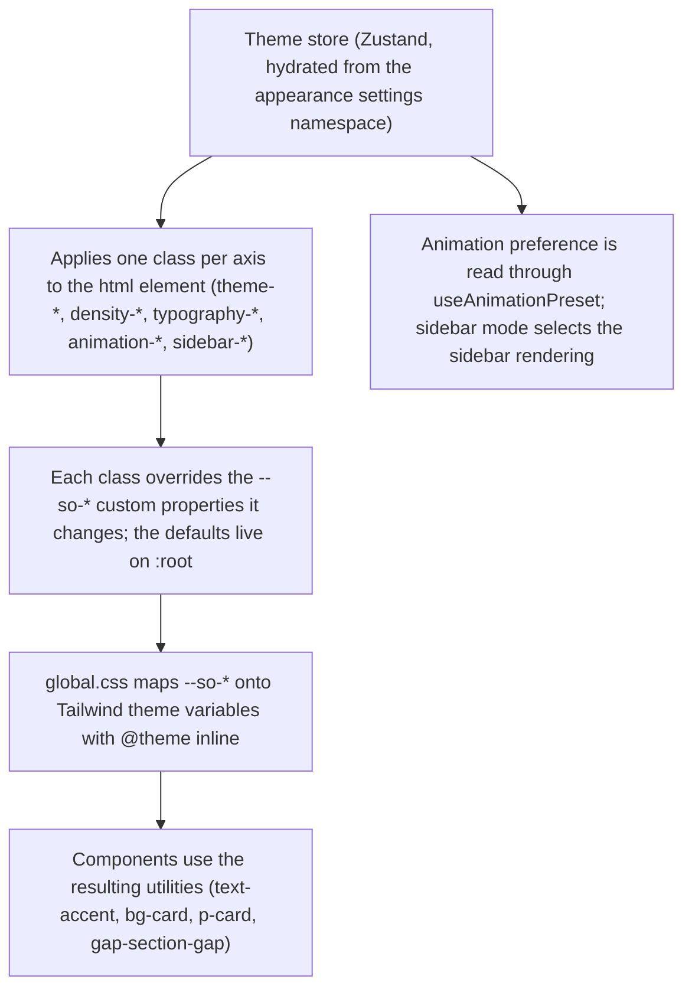

# Brand Identity & UX Design System

This page carries two things: the words SynthOrg uses about itself, which every
other page inherits, and the visual system the dashboard is built from. The voice
comes first, because a page can be accurate about the code and still be wrong
about the product.

## What SynthOrg Is

> Where one agent stops, an organisation starts. SynthOrg is a synthetic one:
> it staffs the roles, splits the work into jobs that stand alone, builds them
> in parallel, each in its own workspace, and sends each one to a reviewer who
> had no hand in it. On your hardware, against models you choose.

The order is load-bearing: problem, then mechanism, then where it runs. Never
lead with the mechanism. The product name carries the answer rather than the
problem, so the opening line has to supply what that answer is an answer to, and
the line after it says what a synthetic organisation does rather than leaving a
reader to infer it from a name they have just met.

**The binding constraint is decomposition quality, not agent supply.** The
parallel tree is not a speed feature and must never be sold as one. A single
agent does one thing at a time, so the twentieth damages the first; a tree does
not have that failure mode, provided the merges hold. Making the parts genuinely
independent is the hard problem.

### The Three Claims, and How Far Each Goes

**It fans out.** Work is decomposed recursively into units that can be built
independently, built concurrently, each in its own git worktree, and assembled
bottom-up. Never state a size the system handles: the decomposition ceiling is
being measured and has no answer yet. The isolation to name is the workspace,
never a container per part: the shipped sandbox default is `subprocess`
(`tools/sandbox/sandboxing_config.py`), and where an operator selects Docker a
container belongs to an agent and is reused across every command and task that
agent runs (`tools/sandbox/lifecycle/config.py`).

**Each part is checked by something that did not write it.** The reviewer is
structurally prevented from being the author, in the service layer, the model
binding, and a database constraint. The claim stops there. It does not mean the
work is correct, and nothing binds the two to different model families, so a
blind spot they share is one the pair cannot see. The narrow version is the true
one and it is worth more than the broad one.

**It runs on your hardware.** Self-hosted and provider-agnostic, local models
included, with no SynthOrg service in the path. State it as a property, never as
a boast.

### What Is Not Sold

The organisation metaphor. Roles, departments, staffing, and the approval gate are
shipped, working machinery, and pages documenting them must stay accurate. They
are plumbing, described as plumbing, never the headline.

## Voice Rules

A page that breaks one of these is wrong, not merely off-tone.

| Rule | What it means |
|------|---------------|
| Never promise an outcome | No page says the reader will get working software. Every claim is about how the system is built and behaves. The loop has been driven live twelve times and has never reached the assembly stage |
| Pre-alpha, stated plainly | Not softened, not implied, not left below the fold |
| No autonomy claims | Supervision is a property of the design, not a stage the product has graduated from |
| Bound the checking claim | The thing that checks the work is not the thing that produced it. Anything broader says more than the code supports; model-family independence in particular is a recommendation the code does not implement |
| Quote no build size | The decomposition ceiling has no measured answer, so a figure invented for it is a claim about an open question |
| Mark intent as intent | Never write a thing that is not built in the present tense, and never hedge one that ships |

House rules on every word: British English; no em-dashes; current state only; no
unverified number; and no LLM vendor privileged where a provider or model is
configured, dispatched to or illustrated (`example-provider`,
`example-{basic,capable,expert}-001`).

## Design Direction

**Chosen direction**: Warm Ops, a warm, approachable aesthetic with balanced density and spring-physics interactions, combined with semantic state-driven colour encoding where every colour communicates system status rather than serving as decoration.

**Why this direction**: warmth makes an operations dashboard approachable without losing professionalism. Tying colour exclusively to state (green = rising, amber = attention, red = critical) gives operators instant comprehension of system health. The brand accent is a warm soft blue, deliberately neutral so that semantic state colours dominate the visual hierarchy. Orange and amber mean "attention needed", not "this is SynthOrg".

**What was rejected and why**: a cool blue-cyan palette (data centre aesthetic) was too generic to tell apart from any other monitoring dashboard. A neutral grey palette (no hue) lacked enough identity to be recognisable. A high-energy violet/purple palette was visually fatiguing over a long working session. Each scored well on individual criteria and failed the combination of distinct identity plus sustained usability.

**Design influences**: Linear (clean layout, balanced density), Vercel (status-first design), Dust.tt (warm approachability), Grafana (data density as a user preference).

## Colour System

### Semantic Colour Tokens

Colours are **state-driven**, not decorative. Every coloured element answers: "what is the system telling me?"

| Token | Purpose | Example hex | When to use |
|-------|---------|-------------|-------------|
| `accent` | Brand, interactive elements, links, focus rings, active nav | `#38bdf8` (warm soft blue, tunable) | Default state, clickable things, brand identity |
| `accent-dim` | Muted brand, secondary interactive, onboarding | `#0ea5e9` (fixed per-theme `--so-accent-dim`) | Hover states, secondary info, less prominent interactive |
| `success` | Rising, improving, healthy, completed | `#10b981` (emerald) | Metrics trending up, tasks completed, agents active |
| `warning` | Declining, degrading, attention needed | `#f59e0b` (amber) | Metrics trending down, budget nearing limit, stale tasks |
| `danger` | Critical, error, immediate action | `#ef4444` (red) | Agent errors, budget exceeded, failed tasks |
| `text-primary` | Main content text | `#e2e8f0` | Headings, values, primary content |
| `text-secondary` | Supporting text | `#94a3b8` | Labels, descriptions, secondary info |
| `text-muted` | Least prominent text | `#8b95a5` | Timestamps, metadata, disabled items |
| `bg-base` | Page background | `#0a0a12` | Deepest background layer |
| `bg-surface` | Sidebar, elevated surfaces | `#0f0f1a` | Sidebar, panels, raised areas |
| `bg-card` | Card backgrounds | `#13131f` | All card containers |
| `bg-card-hover` | Card hover state | `#181828` | Card background on mouse-over |
| `border` | Default borders | `#1e1e2e` | Card borders, dividers |
| `border-bright` | Interactive/hover borders | `#2a2a3e` | Focus rings, hover states |

### Dynamic Colour Assignment

Metric cards, sparklines, and trend indicators use colours dynamically based on direction of change:

| Data state | Colour token | Rationale |
|------------|-------------|-----------|
| Improving / rising | `success` | Green = things getting better |
| Stable / normal | `accent` or `text-muted` | Neutral; no action needed |
| Declining / degrading | `warning` | Amber = attention warranted |
| Critical / threshold | `danger` | Red = act now |

This ensures operators instantly understand system state from colours alone, without reading values. The same metric card shows green when tasks are completing faster and amber when they are slowing down.

### How to Add a New Colour Palette

Every colour in the dashboard resolves through a `--so-*` custom property declared in `web/src/styles/design-tokens.css`. Warm Ops is `:root`; each other palette is a class on `<html>` that overrides only the properties it changes. To add one:

1. Add a `.theme-<name>` block to `design-tokens.css` overriding the `--so-*` properties that differ from `:root`
2. Add `<name>` to the `ColorPalette` union and the `COLOR_PALETTES` array in `web/src/stores/theme.ts`, which derives the class list from it
3. Give it a label in the `THEME_META.PALETTE` map in `web/src/components/layout/AppLayout.tsx`, which is what the command palette and theme popover show

No component code changes. The five palettes (Warm Ops, Ice Station, Stealth, Signal, Neon) each override the accent pair and a handful of surfaces; everything else inherits from `:root`.

## Typography

### Chosen Pairing

| Role | Font | Usage |
|------|------|-------|
| Monospace | Geist Mono (via @fontsource, self-hosted) | Data values, code, metrics, timestamps, agent names |
| Sans-serif | Geist Sans (via @fontsource, self-hosted) | Labels, descriptions, UI text, headings |

**Rationale**: Geist was designed by Vercel specifically for developer dashboards. Excellent readability at small sizes, clean number rendering in mono, professional but not clinical in sans.

**Typography is a theme axis**: other pairings (JetBrains Mono + Inter, IBM Plex Mono + IBM Plex Sans) are available and can be selected independently of colours.

### Self-Hosted Fonts

All fonts are bundled via `@fontsource` packages. No external CDN (Google Fonts) dependencies. This ensures:

- No privacy concerns from third-party font loading
- Consistent rendering regardless of network
- Faster first contentful paint (no font fetch waterfall)

## Density

Density is an **independent user preference**, not tied to theme colours.

| Level | Padding | Section gap | Grid gap | Metric size | Body size | Use case |
|-------|---------|-------------|----------|-------------|-----------|----------|
| Dense | `p-3` (12px) | `gap-3` (12px) | `gap-3` (12px) | `text-2xl` | `text-xs` | Power users, large monitors, data-heavy workflows |
| Balanced (default) | `p-4` (16px) | `gap-4` (16px) | `gap-4` (16px) | `text-3xl` | `text-sm` | General use, comfortable reading distance |
| Medium | `p-[14px]` | `gap-4` (16px) | `gap-4` (16px) | `text-2xl` | `text-xs` | Slightly tighter than balanced |
| Sparse | `p-5` (20px) | `gap-6` (24px) | `gap-6` (24px) | `text-3xl` | `text-sm` | Presentation mode, low information density tasks |

> **Token usage**: Components must use density-aware token classes (`p-card`, `space-y-section-gap`, `gap-section-gap`, `gap-grid-gap`) instead of the raw Tailwind utilities shown above. The raw values are what each token resolves to at each density level.

### How to Add a New Density Level

Same shape as a palette. Balanced is `:root`; each other level is a `.density-<name>` class in `design-tokens.css` overriding the `--so-density-*` properties, registered in the `Density` union and `DENSITIES` array in `web/src/stores/theme.ts` and labelled in `THEME_META.DENSITY`. Components consume the density tokens (`p-card`, `gap-section-gap`, `gap-grid-gap`), so no component changes.

## Animation

Animation is an **independent user preference**, controlling motion intensity.

Each profile resolves to one config in `useAnimationPreset()`: a primary transition (`spring`, used for modals, panels and card interactions, which need not be a spring), a `tween` for hover and colour changes, a stagger delay, and whether layout animations run at all. Components read the hook rather than reaching into `lib/motion.ts` directly.

| Profile | Primary transition | Tween | Stagger | Layout animations | Use case |
|---------|--------------------|-------|---------|-------------------|----------|
| Minimal | `tweenFast` (150ms) | 150ms ease-out | None | Off | Distraction-free, close to reduced motion |
| Spring | `springDefault` | `tweenDefault` (200ms) | 30ms | On | Playful, responsive feel |
| Instant | Instant (zero duration) | Instant | None | Off | Maximum performance, zero-latency feel |
| Status-driven | `tweenDefault` (200ms) | `tweenDefault` | 20ms | On | Animation earns attention; only what changed moves |
| Aggressive | `springBouncy` | `tweenDefault` | 50ms | On | High-energy demo and presentation mode |

**Recommended default**: status-driven. Animation should communicate a state change, not decorate. Static elements stay still; only things that changed move.

Page transitions are deliberately outside this axis. Every profile gets the same short opacity cross-fade, because on a dense dashboard any horizontal slide reads as a layout shift rather than a transition.

## Sidebar

Sidebar mode is an **independent user preference**.

| Mode | Behaviour | Width | Suits |
|------|----------|-------|----------|
| Rail | Icons only, pinned collapsed; labels surface on hover | 56px | Maximum content area while keeping nav reachable |
| Collapsible (default) | Expanded by default, can collapse to an icon rail. Remembers user preference. | 220px / 56px | Most users (full nav when needed, compact when focused) |
| Hidden | Hamburger toggle, content gets full width | 240px (overlay) | Maximum content area, presentation |
| Persistent | Expanded with labels, no collapse toggle; `desktop-sm` collapses it | 220px / 56px | High-interactivity workflows, many nav items |
| Compact | Expanded with labels in a narrower column; `desktop-sm` collapses it | 180px / 56px | Small screens, secondary monitors |

Rail is the only mode that is always icon-only; collapsible also hides labels at
full desktop width whenever the user collapses it. The `desktop-sm`
breakpoint pins every mode collapsed regardless of preference, so compact and
persistent render the icon rail there too, at the collapsed width rather than
their own. Above that breakpoint the two keep labels and differ by column width
alone; neither renders the collapse toggle, which belongs to collapsible.
Notification badges render in every mode that shows labels, not only persistent.

### Persistence

Every appearance preference is backend-owned. The five theme axes live in the `appearance` settings namespace and the sidebar collapse state in `dashboard.sidebar_collapsed`; the stores hydrate from the API on mount and write each change straight back. There is no client-side copy, because the dashboard is a pure API consumer and a preference held only in the browser is a preference no other client can see.

## Theme Architecture

### Independent Axes

The theme system has 5 orthogonal axes that users can configure independently:

```text
Colour Palette  x  Density  x  Typography  x  Animation  x  Sidebar Mode
```

This gives users full control without combinatorial explosion in theme definitions. A user can run "warm blue colours + dense layout + IBM Plex fonts + minimal animation + compact sidebar" without any custom theme code.

### Implementation Pattern



Because the mapping is `@theme inline`, the compiled utilities resolve as `var(--so-*)` references rather than baked values, which is what lets a class swap on `<html>` restyle the whole dashboard at runtime.

### Critical Implementation Note: Tailwind v4 CSS Layers

When using Tailwind v4 with `@import "tailwindcss"`, **all custom CSS resets MUST be inside `@layer base`**. Tailwind v4 uses CSS cascade layers, and unlayered styles (like `* { margin: 0; padding: 0; }`) have higher priority than layered utilities, silently overriding all spacing, padding, margin, and gap utilities.

```css
/* WRONG -- breaks all Tailwind spacing utilities */
* { margin: 0; padding: 0; }

/* CORRECT -- respects Tailwind cascade layers */
@layer base {
  * { margin: 0; padding: 0; }
}
```

An unlayered reset is hard to diagnose because the utilities still appear in the generated CSS and simply have no visual effect.

## Dark Mode

**Dark mode only.** There is no light mode. All colour tokens assume dark backgrounds, and WCAG AA contrast ratios are validated against the dark card and surface backgrounds.

## Accessibility

- WCAG AA contrast minimum on all text (4.5:1 on backgrounds, 3:1 for large text)
- `prefers-reduced-motion` supported: `AnimatedPresence` uses `reducedPageVariants` (opacity-only fade), skeleton shimmer disabled via CSS media query, Motion's `useReducedMotion()` hook used for runtime detection
- Keyboard navigation for all interactive elements
- `aria-hidden="true"` on decorative icons
- Escape key closes overlays/drawers
- **Storybook a11y enforcement**: `parameters.a11y.test: 'error'` set globally in `.storybook/preview.tsx`; all stories fail on WCAG violations, catching regressions at component development time

## Storybook Tooling (v10)

The component development environment uses Storybook 10 with native type-safe configuration:

- **Config**: `defineMain` (from `@storybook/react-vite/node`) and `definePreview` (from `@storybook/react-vite`) for full TypeScript inference
- **Addons**: `@storybook/addon-docs` (autodocs), `@storybook/addon-a11y` (WCAG testing) and `msw-storybook-addon`. Essentials (backgrounds, controls, viewport, actions) and interactions are built into core
- **Backgrounds**: `initialGlobals.backgrounds.value = 'dark'` selects the single `backgrounds.options.dark` entry, whose value is the same `#0a0a12` the `--so-bg-base` token carries, so stories render against the real brand background
- **Decorator**: Global dark-mode wrapper (`div.dark.bg-background.p-4.text-foreground`) applies our design tokens to all stories
- **API mocking**: MSW (Mock Service Worker) via `msw-storybook-addon`, registered in `preview.tsx` with an explicit worker whose `onUnhandledRequest` is `bypass`, so a story that mocks nothing stays silent instead of warning on every request. Stories declare handlers via `parameters.msw.handlers` using pre-built handler arrays from `web/src/mocks/handlers/`. All responses use the `ApiResponse<T>` envelope via the `apiSuccess()` helper

## Component Inventory

The following shared components live in `web/src/components/ui/` and form the building blocks for all dashboard pages. **Always compose pages from these**; never recreate equivalent functionality inline.

### Core Components

| Component | File | Props | Purpose |
|-----------|------|-------|---------|
| `StatusBadge` | `status-badge.tsx` | `status`, `label?`, `pulse?` | Status indicator dot. `label` is a boolean that toggles display of the built-in status text (not a custom string). Maps `AgentRuntimeStatus` to semantic colours via `getStatusColor()`. |
| `MetricCard` | `metric-card.tsx` | `label`, `value`, `change?`, `sparklineData?`, `progress?`, `subText?` | Numeric KPI display with optional sparkline, change badge (+/-%), and progress bar. |
| `Sparkline` | `sparkline.tsx` | `data`, `color?`, `width?`, `height?`, `animated?` | Pure SVG sparkline with gradient fill and animated draw. `color` defaults to `var(--so-accent)`. Standalone or inside MetricCard. |
| `SectionCard` | `section-card.tsx` | `title`, `icon?`, `action?`, `children` | Titled card wrapper with Lucide icon, action slot, and content area. Use for every content section. |
| `AgentCard` | `agent-card.tsx` | `name`, `role`, `department`, `status`, `currentTask?`, `timestamp?` | Consistent agent display. Composes Avatar + StatusBadge internally. Must look identical everywhere. |
| `DeptHealthBar` | `dept-health-bar.tsx` | `name`, `health?`, `agentCount` | Animated horizontal fill bar with utilisation percentage (null-safe; shows N/A when utilisation unavailable). Colour auto-mapped via `getHealthColor()`. |
| `ProgressGauge` | `progress-gauge.tsx` | `value`, `max?`, `label?`, `variant?`, `size?` | Circular or linear gauge for budget/utilisation. `variant` defaults to `'circular'`, `max` defaults to 100. |
| `StatPill` | `stat-pill.tsx` | `label`, `value` | Compact inline label + value pair for metadata rows. |
| `Avatar` | `avatar.tsx` | `name`, `size?`, `borderColor?` | Circular initials avatar with optional coloured border. Sizes: sm (24px), md (32px), lg (40px). |
| `Button` | `button.tsx` | shadcn standard | Standard button component (shadcn/ui). |
| `TaskStatusIndicator` | `task-status-indicator.tsx` | `status: TaskStatus`, `label?: boolean`, `pulse?: boolean`, `className?: string` | Task status dot with optional label and pulse animation. |
| `PriorityBadge` | `task-status-indicator.tsx` | `priority: Priority`, `className?: string` | Task priority coloured pill badge. |
| `ProviderHealthBadge` | `provider-health-badge.tsx` | `status: ProviderHealthStatus`, `label?: boolean`, `pulse?: boolean`, `className?: string` | Provider health status dot (up/degraded/down/unknown) with optional label. |
| `RunOutcomeBadge` | `run-outcome-badge.tsx` | `outcome: RunOutcome`, `className?` | Failure-aware badge for a task run's outcome (`succeeded` / `empty` / `failed`): colour + icon + label so the signal is never colour alone. Shared across the approvals queue, review drawer, and chat prompts. |
| `StatusPill` | `status-pill.tsx` | `tone?`, `toneClassName?`, `icon?`, `ariaLabel?`, `children`, `className?` | The single inline status-pill primitive (one corner radius, one padding scale). `tone` maps to the shared palette; `toneClassName` carries a feature-specific one. Every status pill composes this rather than re-implementing the span. |
| `PlanStatusBadge` | `plan-status-badge.tsx` | `status: PlanStatus`, `className?` | Plan lifecycle pill across the tail: executing, integrating, evaluating, completed. Built on `StatusPill`. |
| `CompletionOracleVerdictBadge` | `completion-oracle-verdict-badge.tsx` | `verdict: CompletionOracleVerdict`, `className?` | Semantic badge for a completion-review verdict. |
| `RedTeamVerdictBadge` | `red-team-verdict-badge.tsx` | `verdict: RedTeamVerdict`, `className?` | Semantic badge for an adversarial red-team gate verdict. |
| `ConnectionHealthBadge` | `connection-health-badge.tsx` | `status: ConnectionHealthStatus`, `label?`, `pulse?`, `className?` | Connection health dot. The single owner of the mapping from the connection enum (healthy/degraded/unhealthy/unknown) onto `ProviderHealthBadge`'s (up/degraded/down/unknown). Reports the outbound probe only; inbound readiness is surfaced separately, where it is actionable. |
| `LocalityBadge` | `locality-badge.tsx` | `isLocal` | Flags an agent whose model runs on a local, free-to-run provider. Renders nothing when false. |
| `ModelStalenessBadge` | `model-staleness-badge.tsx` | `stale: ModelStaleness \| null`, `className?` | Warning badge for a model the refresh service flagged as removed or deprecated, with the successor in a tooltip. Renders nothing for a current model. |
| `ToolCallingUnavailableBadge` | `tool-calling-unavailable-badge.tsx` | `toolCallsVerified: boolean \| null`, `className?` | Warning badge for a model the runtime downgraded after repeated tool-call failures. Renders only on an explicit `false`, never on an unobserved verdict. |
| `ProvenanceBadge` | `provenance-badge.tsx` | `className?`, `title?`, `children` | Presentational skeleton for data-provenance labels (measured vs absent). The caller owns the kind-to-tone mapping and passes the tone in. |
| `Timeline` | `timeline.tsx` | `frames`, `currentIndex`, `onSeek`, `label?`, `className?` | Horizontal scrubber of recorded turns, colour-coded by status. Click a dot to seek; arrow keys step, Home/End jump to the ends. |
| `ProgressIndicator` | `progress-indicator.tsx` | `variant: 'determinate' \| 'indeterminate' \| 'stages'`, `value?`, `label?`, `description?`, `stages?` | Long-running-operation progress. The indeterminate variant can carry a live elapsed-time chip. |
| `Breadcrumbs` | `breadcrumbs.tsx` | `items`, `maxItems?`, `className?` | Trail for detail routes; collapses the middle to an ellipsis past `maxItems` (default 4). |
| `ListHeader` | `list-header.tsx` | `title`, `count?`, `countLabel?`, `description?`, `primaryAction?`, `secondaryActions?` | Standard list-page header: title with count, primary action top-right, and a slot for search/filter/sort that sits inline on wide viewports. |
| `InfoTooltip` | `info-tooltip.tsx` | `content`, `children`, `className?` | Hover/focus explanation beside an icon or compact control. Renders its trigger as a `<span>` so it can nest inside an existing interactive element; the popup is non-interactive. |
| `KeyboardShortcutHint` | `keyboard-shortcut-hint.tsx` | `keys`, `label?`, `size?`, `className?` | Renders a key sequence as `<kbd>` pills with an optional trailing label. |

### Interaction Components

| Component | File | Props | Purpose |
|-----------|------|-------|---------|
| `Toast` / `ToastContainer` | `toast.tsx` | `toast` (ToastItem), `onDismiss`, `maxVisible?` | Notification toasts (success/error/warning/info) with auto-dismiss queue, Motion animations. Mount `ToastContainer` once in AppLayout. |
| `Skeleton` variants | `skeleton.tsx` | `shimmer?`, `lines?`, `rows?`, `columns?` | Loading placeholders: `Skeleton` (base), `SkeletonText`, `SkeletonCard`, `SkeletonMetric`, `SkeletonTable`. Shimmer respects `prefers-reduced-motion`. |
| `EmptyState` | `empty-state.tsx` | `icon?`, `title`, `description?`, `action?` | No-data / no-results placeholder with optional action button. |
| `ErrorBoundary` | `error-boundary.tsx` | `fallback?`, `onReset?`, `level?` | React error boundary with retry. Levels: `page` (full-height), `section` (card), `component` (inline). |
| `ConfirmDialog` | `confirm-dialog.tsx` | `open`, `onOpenChange`, `title`, `onConfirm`, `variant?`, `loading?` | Confirmation modal built on Base UI AlertDialog. Variants: `default`, `destructive`. |
| `CommandPalette` | `command-palette.tsx` | `className?` | Global Cmd+K search built with cmdk-base. Hosted inside a Base UI Dialog for focus trapping, fuzzy search, scope toggle, recent items. |
| `InlineEdit` | `inline-edit.tsx` | `value`, `onSave`, `validate?`, `type?`, `disabled?` | Click-to-edit with Enter/Escape, inline validation, optimistic save via `useFlash`. |
| `AnimatedPresence` | `animated-presence.tsx` | `routeKey`, `className?` | Page transition wrapper. Uses Motion AnimatePresence with reduced-motion fallback. |
| `StaggerGroup` / `StaggerItem` | `stagger-group.tsx` | `staggerDelay?`, `animate?`, `layoutId?`, `layout?` | Card entrance stagger container with configurable delay and layout animation support. |
| `Drawer` | `drawer.tsx` | `open`, `onClose`, `title?`, `ariaLabel?`, `side?`, `header?`, `footer?`, `contentClassName?`, `children`, `className?` | Slide-in panel (left or right via `side`, default right) with overlay, spring animation, focus trap, and Escape-to-close. At least one of `title` or `ariaLabel` must be provided for accessible naming. A custom `header` slot (via `DrawerCustomHeader` + `DrawerCloseButton`) replaces the default title bar, and a `footer` slot renders as a bordered sibling below the scroll area (used for the sticky approval decision buttons). Header omitted when neither `title` nor `header` is present. |
| `InputField` | `input-field.tsx` | `label`, `error?`, `hint?`, `multiline?`, `rows?`, `placeholder?`, `required?`, `disabled?`, `type?`, `value`, `onChange` | Labelled text input with inline error/hint display and optional textarea mode. Extends native input/textarea props. |
| `SelectField` | `select-field.tsx` | `label`, `options`, `value`, `onChange`, `error?`, `hint?`, `placeholder?`, `required?`, `disabled?`, `className?` | Labelled select dropdown with error/hint display and placeholder support. |
| `SliderField` | `slider-field.tsx` | `label`, `value`, `onChange`, `min`, `max`, `step?`, `formatValue?`, `disabled?`, `className?` | Labelled range slider with custom value formatter and aria-live value display. |
| `ToggleField` | `toggle-field.tsx` | `label`, `checked`, `onChange`, `description?`, `disabled?` | Labelled toggle switch (role="switch") with optional description text. |
| `TagInput` | `tag-input.tsx` | `label`, `value`, `onChange`, `placeholder?`, `disabled?`, `className?` | Chip-style multi-value input with add/remove, keyboard support (Enter to add, Backspace to remove), paste splitting. |
| `TokenUsageBar` | `token-usage-bar.tsx` | `data`, `segments?`, `max?`, `animated?`, `className?` | Segmented horizontal meter bar for token usage (multi-segment with auto-colours, `role="meter"`, animated transitions). |
| `CodeMirrorEditor` | `code-mirror-editor.tsx` | `value`, `onChange`, `language`, `readOnly?`, `aria-label?`, `className?` | CodeMirror 6 editor with JSON/YAML modes, design-token dark theme, line numbers, bracket matching, and `readOnly` support. |
| `SegmentedControl` | `segmented-control.tsx` | `label`, `options`, `value`, `onChange`, `disabled?`, `size?`, `className?` | Accessible radiogroup with keyboard navigation (arrow keys + wrapping), size variants (`sm`/`md`), generic `<T extends string>` typing. |
| `ThemeToggle` | `theme-toggle.tsx` | `className?` | Base UI Popover with 5-axis theme controls (colour, density, typography, animation, sidebar). Rendered in StatusBar for global access. |
| `LiveRegion` | `live-region.tsx` | `children`, `politeness?`, `debounceMs?`, `className?` | Debounced ARIA live region wrapper for real-time WS updates without overwhelming screen readers. Default: 500ms polite, 0ms assertive. |
| `MobileUnsupportedOverlay` | `mobile-unsupported.tsx` | (none, self-managing) | Full-screen overlay at <768px viewports directing users to desktop or CLI. Self-manages visibility via `useBreakpoint`. |
| `LazyCodeMirrorEditor` | `lazy-code-mirror-editor.tsx` | Same as `CodeMirrorEditor` | Suspense-wrapped lazy-loaded CodeMirrorEditor. Drop-in replacement that defers ~200KB+ CodeMirror bundle. |
| `MetadataGrid` | `metadata-grid.tsx` | `items`, `columns?`, `className?` | Key-value metadata grid for detail pages with configurable 2/3/4 columns and density-aware spacing. |
| `ProjectStatusBadge` | `project-status-badge.tsx` | `status`, `showLabel?`, `className?` | Project status dot with optional label and semantic colours (planning/active/integrating/evaluating/on_hold/completed/cancelled). |
| `ContentTypeBadge` | `content-type-badge.tsx` | `contentType`, `className?` | MIME content type pill badge with semantic colours (JSON, PDF, Image, Text, Markdown, CSV, Binary). |
| `TaskProgress` | `task-progress.tsx` | `status`, `stages`, `className?` | Live task-execution progress panel (`running` / `finished` / `error` header + accumulated `ProgressStage`s). Presentational leaf fed by the `useTaskProgress` hook; shown inline in the chat flows so an operator watches approved work execute instead of a silent gap. |
| `Dialog` | `dialog.tsx` | `open`, `onOpenChange`, `children`; composed with `DialogContent`, `DialogHeader`, `DialogTitle`, `DialogDescription`, `DialogCloseButton` | Themed modal built on the Base UI Dialog primitive, for anything that is not a confirmation. `ConfirmDialog` is the pre-composed confirmation. |
| `Checkbox` | `checkbox.tsx` | `checked?`, `defaultChecked?`, `onCheckedChange?`, `disabled?`, `id?`, `name?`, `value?`, `aria-label?` | Themed checkbox on the Base UI primitive, so selection controls match the design system instead of the browser-native box. |
| `Collapsible` | `collapsible.tsx` | `title`, `summary?`, `open?` / `defaultOpen?`, `onOpenChange?`, `disabled?`, `children`, `contentClassName?` | Disclosure section with a trigger row and an optional right-aligned summary (count, status, badge). Controlled or uncontrolled. |
| `Pagination` | `pagination.tsx` | `page`, `pageSize`, `total`, `onPageChange`, `onPageSizeChange?`, `pageSizeOptions?`, `hidePageSize?`, `ariaLabel?` | 1-indexed pager with page-size selector. An undefined `total` signals an unknown count. |
| `SearchInput` | `search-input.tsx` | `value`, `onChange`, `placeholder?`, `ariaLabel?`, `focusShortcut?`, `disabled?` | List-page search field. `focusShortcut` binds the global `/` key on the page's primary search only, and is ignored while focus is already in a text field. |
| `SearchFilterSort` | `search-filter-sort.tsx` | `search?`, `filters?`, `sort?`, `trailing?`, `className?` | Layout wrapper for list-page controls, so search, filters and sort line up identically on every list. |
| `BulkActionBar` | `bulk-action-bar.tsx` | `selectedCount`, `onClear`, `children`, `loading?`, `ariaLabel?` | Slide-up bar for a multi-select list. The caller owns the action buttons; the bar owns the count, the Clear control, and the disabled state. |
| `BulkDeleteControls` | `bulk-delete-controls.tsx` | `selection`, `noun`, `description`, `ariaLabel` | The bar plus the confirmation behind "delete the rows I picked". One component rather than a copy per list, so no list can skip the confirmation or word the count differently. |
| `DetailNavBar` | `detail-nav-bar.tsx` | `label?`, `canPrev`, `canNext`, `onPrev`, `onNext`, `position`, `bindShortcuts?` | Previous/next navigation between detail rows with a position counter, binding `J` / `ArrowLeft` and `K` / `ArrowRight` by default. A `null` position hides the counter (deep link or refresh). |
| `CommandCheatsheet` | `command-cheatsheet.tsx` | `open?`, `onOpenChange?`, `disableShortcut?` | The `?` keyboard-shortcut overlay, rendered from the live shortcut registry rather than a hand-written list. Self-manages when uncontrolled. |
| `ErrorBanner` | `error-banner.tsx` | `variant?`, `severity?`, `title`, `description?`, `onRetry?`, `retryAfterSeconds?` | Page, inline, and offline error banners. `error` takes `role="alert"`, while `warning` and `info` take `role="status"`. A `retryAfterSeconds` value renders a cosmetic countdown on the Retry button; the caller still owns the retry. |
| `ErrorTechnicalDetails` | `error-technical-details.tsx` | `technical`, `className?` | Collapsed-by-default technical panel with copy-to-clipboard, shared by the router error page and the page-level error boundary. |
| `WsConnectionBanner` | `ws-connection-banner.tsx` | `title?`, `description?` | The standard "real-time updates disconnected" notice, so every live page words a dropped channel the same way. |
| `InheritToggle` | `inherit-toggle.tsx` | `inherit`, `onChange`, `inheritFrom?`, `disabled?` | Inherit-or-override switch for a setting that has a parent scope. |
| `AgentModelPicker` | `agent-model-picker/` | `currentProvider`, `currentModelId`, `providers`, `onChange`, `label?`, `hideLabel?`, `disabled?` | The `(provider, model)` picker. Both halves are chosen together, because a model id means nothing without the connection it is reached through. |
| `HealthPopover` | `health-popover/` | `children` (the trigger) | Shared system-health dialog behind both the StatusBar pill and the sidebar connection indicator. Reads the shared health snapshot and the live WebSocket state rather than fetching its own. |
| `Slot` | `slot.tsx` | `children`, standard HTML attributes | Merges its props and ref onto its single child, for components that need to render as whatever element the caller passes. |

### Conversational Components

Used by the Chat surface and the other places the organisation speaks.

| Component | File | Props | Purpose |
|-----------|------|-------|---------|
| `ChatBubble` | `chat-bubble.tsx` | `variant`, `content?`, `children?`, `timestamp?`, `roleLabel?`, `agentName?`, `agentRole?`, `agentTopic?`, `isError?` | One turn in a transcript. Markdown body for an assistant or agent turn, plain text for a human one, and a custom body for the event and notice variants. A streaming bubble is hidden from assistive technology until it settles. |
| `ChatMarkdown` | `chat-markdown.tsx` | `content`, `className?` | Renders assistant markdown through descendant selectors only, so the tree carries design tokens and no raw HTML reaches the DOM. Tables and code blocks scroll inside themselves. |
| `ChatInputArea` | `chat-input-area.tsx` | `value`, `onChange`, `onSend`, `disabled`, `inputDisabled?`, `label`, `hideLabel?`, `placeholder` | Composer. `disabled` blocks sending while leaving the field editable, so composed text is never discarded; `inputDisabled` freezes the field itself for terminal states. |
| `ExamplePrompts` | `example-prompts.tsx` | `prompts`, `onSelect`, `disabled?` | Clickable starting points on an empty conversational surface. |
| `ResponderAttribution` | `responder-attribution.tsx` | `name`, `role?`, `topic?`, `loading?` | Names the agent that answered, with its role and the concern topic that routed to it. A responder carrying no role renders name-only. |
| `RequestCard` | `request-card.tsx` | `request`, `pending`, `onScope`, `onApprove`, `onReject` | A client request in the intake queue, with per-request in-flight flags so a double submission is impossible. |

### Utility Functions

| Function | File | Purpose |
|----------|------|---------|
| `cn()` | `lib/utils.ts` | Tailwind class merging (clsx + twMerge). Use in every component. |
| `getStatusColor()` | `utils/agent-status.ts` | Maps `AgentRuntimeStatus` to `SemanticColor \| "text-secondary"` token name (`offline` maps to `"text-secondary"`). |
| `getHealthColor()` | `utils/agent-status.ts` | Maps 0-100 percentage to `SemanticColor` (>=75 success, >=50 accent, >=25 warning, <25 danger). |
| `getTaskStatusColor()` | `utils/tasks.ts` | Maps `TaskStatus` to `SemanticColor`. |
| `getTaskStatusLabel()` | `utils/tasks.ts` | Maps `TaskStatus` to display label. |
| `getPriorityColor()` | `utils/tasks.ts` | Maps `Priority` to `SemanticColor`. |
| `getPriorityLabel()` | `utils/tasks.ts` | Maps `Priority` to display label. |
| `getTaskTypeLabel()` | `utils/tasks.ts` | Maps `TaskType` to display label. |
| `getProviderHealthColor()` | `utils/providers.ts` | Maps `ProviderHealthStatus` to `SemanticColor \| "muted"`. |
| `formatLatency()` | `utils/providers.ts` | Formats milliseconds to human-readable string (e.g. "123ms", "1.5s"). |
| `formatErrorRate()` | `utils/providers.ts` | Formats error rate percentage with <0.1% handling. |
| `formatTokenCount()` | `utils/providers.ts` | Formats token count with K/M suffixes. |
| `formatCost()` | `utils/providers.ts` | Formats cost value using the runtime-configured currency (falls back to `DEFAULT_CURRENCY`); display-only, no FX conversion. |
| `toRuntimeStatus()` | `utils/agents.ts` | Maps API-layer `AgentStatus` (HR lifecycle) to `AgentRuntimeStatus` for UI components. |
| `getRiskLevelColor()` | `utils/approvals.ts` | Maps `ApprovalRiskLevel` to `SemanticColor \| "accent-dim"`. |
| `getRiskLevelLabel()` | `utils/approvals.ts` | Maps `ApprovalRiskLevel` to display label. |
| `getRiskLevelIcon()` | `utils/approvals.ts` | Maps `ApprovalRiskLevel` to `LucideIcon`. |
| `getRunOutcomeColor()` | `utils/approvals.ts` | Maps `RunOutcome` to `SemanticColor` (succeeded=success, empty=warning, failed=danger). |
| `getRunOutcomeLabel()` | `utils/approvals.ts` | Maps `RunOutcome` to display label. |
| `getRunOutcomeIcon()` | `utils/approvals.ts` | Maps `RunOutcome` to `LucideIcon`. |
| `isFailedApproval()` | `utils/approvals.ts` | Whether an approval represents a failed run (drives the danger styling + Acknowledge/Retry relabel). |
| `getApprovalStepLabel()` | `utils/approvals.ts` | The source-aware step label ("Approve to start" vs "Review completed work"). |
| `approvalDetailPath()` | `utils/approvals.ts` | Builds the `/approvals?selected=<id>` deep-link path. |
| `getApprovalStatusColor()` | `utils/approvals.ts` | Maps `ApprovalStatus` to `SemanticColor \| "text-secondary"`. |
| `getApprovalStatusLabel()` | `utils/approvals.ts` | Maps `ApprovalStatus` to display label. |
| `getUrgencyColor()` | `utils/approvals.ts` | Maps `UrgencyLevel` to `SemanticColor \| "text-secondary"`. |
| `formatUrgency()` | `utils/approvals.ts` | Formats `seconds_remaining` into human-readable countdown string. |
| `groupByRiskLevel()` | `utils/approvals.ts` | Groups approvals into `Map<ApprovalRiskLevel, ApprovalResponse[]>` sorted critical-to-low. |
| `filterApprovals()` | `utils/approvals.ts` | Client-side filtering by status, risk level, action type, and search text. |
| `RISK_LEVEL_ORDER` | `utils/approvals.ts` | Numeric ordering map for risk levels (critical=0 through low=3). |
| `DOT_COLOR_CLASSES` | `utils/approvals.ts` | Maps `SemanticColor \| "accent-dim"` to Tailwind background classes. |
| `URGENCY_BADGE_CLASSES` | `utils/approvals.ts` | Maps `SemanticColor \| "text-secondary"` to Tailwind badge classes. |
| `RISK_BADGE_CLASSES` | `utils/approvals.ts` | Maps `SemanticColor \| "accent-dim"` to Tailwind badge (bg + text + border) classes for the risk pill. |
| `formatFileSize()` | `utils/format.ts` | Formats byte count to human-readable size string (e.g. "1.2 MB", "340 KB"). |

### Design System Hooks

| Hook | File | Purpose |
|------|------|---------|
| `useFlash()` | `hooks/useFlash.ts` | Real-time update flash effect. Returns `{ flashing, flashClassName, triggerFlash, flashStyle }`. Uses `STATUS_FLASH` timing constants. |
| `useStatusTransition()` | `hooks/useStatusTransition.ts` | Animate between agent status colours. Returns `{ displayColor, motionProps }` for spreading on `motion.div`. |
| `useCommandPalette()` | `hooks/useCommandPalette.ts` | Global command palette state. `registerCommands()` adds page-local commands (cleanup on unmount). `open()` / `close()` / `toggle()`. |
| `useAnimationPreset()` | `hooks/useAnimationPreset.ts` | Returns animation config (`spring`, `tween`, `staggerDelay`, `enableLayout`) based on the user's theme animation preference. Components use this instead of directly referencing `lib/motion.ts` constants. |
| `useCountAnimation()` | `hooks/useCountAnimation.ts` | Animated numeric value transitions for metric displays. Uses rAF with ease-out cubic and `prefers-reduced-motion` support. |
| `useAutoScroll()` | `hooks/useAutoScroll.ts` | Auto-scroll container to bottom on new content, pausing when user scrolls away. Returns `{ isAutoScrolling, scrollToBottom }`. |
| `useBreakpoint()` | `hooks/useBreakpoint.ts` | Reactive viewport breakpoint detection via matchMedia. Returns `{ breakpoint, isDesktop, isTablet, isMobile }`. |

### Types

| Type | File | Values |
|------|------|--------|
| `AgentRuntimeStatus` | `utils/agent-status.ts` | `"active"`, `"idle"`, `"error"`, `"offline"` |
| `SemanticColor` | `utils/agent-status.ts` | `"success"`, `"accent"`, `"warning"`, `"danger"` |
| `TaskStatus` | `api/types/enums` | `"created"`, `"assigned"`, `"in_progress"`, `"in_review"`, `"completed"`, `"blocked"`, `"failed"`, `"interrupted"`, `"suspended"`, `"cancelled"`, `"rejected"`, `"auth_required"`, `"awaiting_input"` |
| `Priority` | `api/types/enums` | `"critical"`, `"high"`, `"medium"`, `"low"` |
| `ProviderHealthStatus` | `api/types/providers` | `"up"`, `"degraded"`, `"down"`, `"unknown"` |
| `ApprovalStatus` | `api/types/enums` | `"pending"`, `"approved"`, `"rejected"`, `"expired"` |
| `ApprovalRiskLevel` | `api/types/enums` | `"low"`, `"medium"`, `"high"`, `"critical"` |
| `UrgencyLevel` | `api/types/enums` | `"critical"`, `"high"`, `"normal"`, `"no_expiry"` |
| `ApprovalPageFilters` | `utils/approvals` | Filter shape: `status?`, `riskLevel?`, `actionType?`, `search?` |
| `ProjectStatus` | `api/types/enums` | `"planning"`, `"active"`, `"integrating"`, `"evaluating"`, `"on_hold"`, `"completed"`, `"cancelled"`, `"failed"` |
| `ArtifactType` | `api/types/enums` | `"code"`, `"tests"`, `"documentation"` |

Every enum above sourced from `api/types/enums` is re-exported from `web/src/api/types/enum-values.gen.ts`, generated from the backend's own API surface by `scripts/generate_dto_types_ts.py` and held in step by a pre-push drift check. A value is added by changing the backend and regenerating, never by editing the generated file. The types sourced from `utils/` are UI-local and have no backend counterpart, so they are hand-written and generated from nothing.

### When to Create a New Shared Component

Create a new component in `web/src/components/ui/` when:

1. The same UI pattern appears (or will appear) on **2+ pages**
2. It represents a **semantic concept** (not just a styled div)
3. It has **configurable behaviour** via props (variants, states, sizes)

Every new shared component must have:

- A `.stories.tsx` file with all states (default, hover, loading, error, empty)
- A TypeScript props interface
- Design token usage exclusively (no hardcoded colours/fonts/spacing)
- `cn()` for conditional class merging

### Enforcement

A PostToolUse hook (`scripts/check_web_design_system.py`) runs automatically on every Edit/Write to `web/src/` files. See CLAUDE.md "Web Dashboard Design System" section for the full rule set.

## Reference Materials

| Resource | Location |
|----------|----------|
| Page structure and information architecture | [Page Structure & IA](page-structure.md) |
| UX design guidelines (implementation specs) | [UX Guidelines](ux-guidelines.md) |
| Framework evaluation behind the dashboard stack | [Dashboard Framework Research](ux-research.md) |
| Design tokens (the source of every colour, spacing and density value) | `web/src/styles/design-tokens.css` |
| Theme axes and their persisted keys | `web/src/stores/theme.ts` |
| Motion presets | `web/src/lib/motion.ts` |
| WCAG verification script | `scripts/wcag_check.py` |
| Design-system enforcement hook | `scripts/check_web_design_system.py` |
