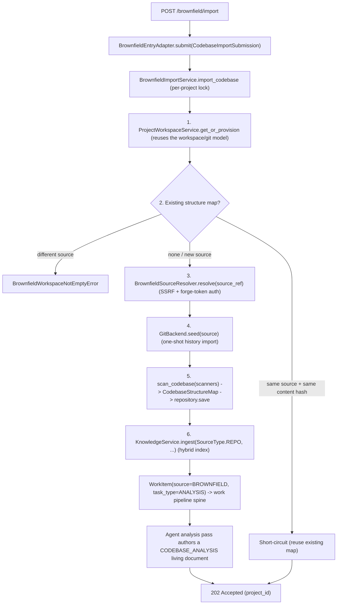

# Brownfield Codebase Intake

The "merger / acquisition" entry mode. The operator points the studio at an
existing codebase; the org imports it into a persistent project workspace,
builds a navigable structure map, runs an agent analysis pass that produces an
architecture and health assessment, indexes both the codebase and the
assessment into the hybrid-retrieval knowledge store, and then awaits human
direction. Follow-up directives build on the ingested base.

This is the codebase counterpart to requirement intake: requirement intake
turns a stated need into work; brownfield intake turns an existing repository
into a mapped, indexed, analysed base the org can extend.

## Flow

The import + analysis run as a background task; the controller returns `202`
immediately. The operator then files follow-up directives through the task
board, which retrieve the indexed structure map and codebase.

## Source resolution and the git seed

`GitBackend` (the pluggable workspace git model) gains a one-shot
`seed(*, project_id, repo_root, source, default_branch)` operation, distinct
from `provision` (which creates an empty repository) and `push` / `fetch`
(which collaborate back). Seeding fetches an existing source into a freshly
provisioned, empty workspace and resets the default branch onto the imported
head.

`BrownfieldSourceResolver` owns auth and SSRF so the backend stays
auth-agnostic. It classifies the `source_ref`:

- **Local path / `file://`**: validated as a readable directory.
- **Remote URL**: scheme-checked (https / ssh only) and SSRF-validated by
  reusing the clone-URL validator (public-IP enforcement, DNS pinning via
  `http.curloptResolve`). When the source host matches a configured forge
  connection, that connection's token is injected into the HTTPS userinfo;
  otherwise the fetch is anonymous (a private repo with no matching connection
  fails at fetch time). Credentials embedded directly in the `source_ref` are
  rejected: forge tokens come from the connection catalog, never from the
  operator-supplied reference.

The import helper fetches directly from the resolved URL with no named remote,
so a credential-bearing fetch URL never persists in the workspace git config.
The embedded backend force-updates its bare repo because the imported history
is unrelated to the empty initialisation commit.

## Structure map

`CodebaseStructureMap` is a frozen, navigable model persisted 1:1 per project
(`CodebaseStructureMapRepository`, an `IdKeyedRepository`). It records the facts
a deterministic scan can establish:

| Facet | Contents |
|---|---|
| `modules` | Source modules / packages (`path`, `language`, `kind`). |
| `entry_points` | Console scripts, main modules, binaries, web services. |
| `test_suites` | Test locations and detected framework. |
| `build_files` | Build / packaging manifests and their tool. |
| `dependencies` | Declared third-party deps (`name`, `ecosystem`, `scope`, `version_spec`). |

The map is built by a deterministic, per-ecosystem scanner (no LLM): the
analysis pass is the agent step. Scanners are pluggable
(`StructureMapScanner` protocol + factory + config discriminator). Python,
Node, Go, and Rust scanners ship; a generic file-tree scanner is the
always-present safe-default fallback, used only when no ecosystem-specific
scanner matched. The aggregator runs every matching scanner, merges and
de-duplicates their contributions, and stamps a `content_hash` over the
structural facts only (independent of project id and scan time) so a
same-source re-import short-circuits when nothing changed.

The persisted collections are JSON columns (SQLite `TEXT`, Postgres `JSONB`);
`scanned_at` is `TEXT` on SQLite and `TIMESTAMPTZ` on Postgres. Dual-backend
conformance tests cover the repository.

## Analysis deliverable and indexing

Codebase indexing reuses the knowledge substrate:
`KnowledgeService.ingest(SourceType.REPO, ...)` walks the seeded workspace,
AST-chunks it, and stores it in the hybrid-retrieval store (freshness-aware via
content hash). No bespoke indexing is added.

The analysis deliverable is a `LivingDocument` of type `CODEBASE_ANALYSIS`,
authored by the analysis-pass agent and auto-indexed into the
`PROJECT_DOC` namespace. This is what makes agents retrieve their own
understanding on later work.

Agents navigate the deterministic map through `query_structure_map`, a tool
that lists a requested facet (modules, entry points, tests, build files,
dependencies) with an optional name filter. The imported codebase is
third-party content, so the tool's output is wrapped via
`wrap_untrusted(TAG_TASK_DATA, ...)` before it reaches a prompt (SEC-1).

## Re-import policy

The persisted structure-map row is the "already imported" marker:

- No row: fresh import (provision, seed, scan, persist, index).
- Same `source_ref`, unchanged `content_hash`: idempotent re-scan,
  short-circuits.
- Different `source_ref` onto an occupied project: rejected with
  `BrownfieldWorkspaceNotEmptyError`. Force-reset is a separate explicit
  operation, not the default, because importing onto an existing codebase is
  destructive.

## Wiring

`wire_real_brownfield_entry` constructs the import service and the
`BrownfieldEntryAdapter` once the work pipeline, a connected persistence
backend, a `ProjectWorkspaceService`, and a `KnowledgeService` are available;
it is best-effort and idempotent, so a partial boot leaves the
`/brownfield/import` controller to return `503` rather than poisoning startup.
The structure-map tool factory is parked on the app state for the per-task
tool loader, mirroring the knowledge and living-documentation tool factories.
