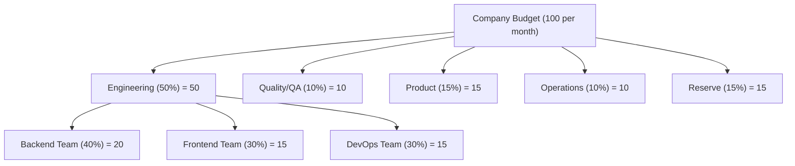

# Budget & Cost Management

SynthOrg treats money as a first-class runtime constraint. Every LLM call carries a currency-stamped `CostRecord`, budgets cascade from the company down to individual teams, and three layers of enforcement (pre-flight, in-flight, task-boundary) prevent runaway spending without breaking in-progress work. The agent execution pipeline that drives each layer is documented in [Agent Execution > AgentEngine Orchestrator](agent-execution.md#agentengine-orchestrator).

---

## Budget Hierarchy

The framework enforces a hierarchical budget structure. Allocations cascade from the company
level through departments to individual teams.



!!! abstract "Note"

    Percentages are illustrative defaults. All allocations are configurable per company.
    Numeric amounts in the diagram are unitless; `budget.currency` is an ISO 4217 code
    resolved per the regional-defaults chain (user/company setting -> browser/system ->
    neutral fallback). SynthOrg stamps `budget.currency` onto every row at
    record-creation time; historical rows retain the code that was active when they were
    written, so changing the setting only affects newly created rows. Numeric cost values
    are never converted; updating the setting relabels the display symbol for future
    records, not the existing ones.

## Cost Tracking

Every API call is tracked with full context:

```json
{
  "agent_id": "sarah_chen",
  "task_id": "123e4567-e89b-12d3-a456-426614174000",
  "prompt_class_id": "system:memory:rerank",
  "provider": "example-provider",
  "model": "example-medium-001",
  "input_tokens": 4500,
  "output_tokens": 1200,
  "cost": 0.0315,
  "currency": "<operator-configured>",
  "timestamp": "2026-02-27T10:30:00Z"
}
```

Every `CostRecord`, `TaskMetricRecord`, `LlmCalibrationRecord`, and `AgentRuntimeState` carries its own `currency`
(ISO 4217 code validated against the allowlist in `synthorg.budget.currency`). The
`budget.currency` setting determines the currency stamped on new rows; historical rows
retain the code that was active when they were created, so changing `budget.currency`
is safe and does not invalidate history.

Every aggregation site (`CostTracker`, `ReportGenerator`, `CostOptimizer`,
per-agent / per-department / per-project rollups, the HR `WindowMetrics` multi-window
strategy, and the parallel-execution coordinator) enforces a same-currency invariant by
calling `assert_currencies_match` (from `synthorg.budget.currency`) before any
reduction. Mixing currencies raises `MixedCurrencyAggregationError` (HTTP 409,
error code `4007`, symbolic code `MIXED_CURRENCY_AGGREGATION`) at the aggregator
rather than silently producing a meaningless total. Pre-push gate
`scripts/check_currency_aggregation_invariant.py` AST-walks `src/synthorg/` for
unguarded `sum` / `math.fsum` / `statistics.mean` / `statistics.fmean` calls
(including bare-name imports such as `from statistics import mean`) over
`.cost` / `.amount` / `.total_cost` / `.usd` / `.eur` attributes and fails the
push when an aggregation is not preceded by a guard call in the same
function-or-module scope. `CostTracker.record()`
additionally rejects at the ingestion boundary when the incoming record's currency differs
from the currently-configured `budget.currency`, so new writes cannot introduce drift
against the live setting. Historical rows written before a `budget.currency` change still
carry their original code, so a rollup that spans the change window will legitimately see
mixed currencies; the aggregator raises rather than silently combining them. Operators
who change `budget.currency` should either scope reports to a single currency window or
run a proper migration that converts both the numeric amount and the currency code
together under a documented FX policy; a raw
`UPDATE cost_records SET currency = '<new-code>'` is a **re-label, not a conversion**,
and must only be used when the operator knows the existing numeric values are already
denominated in the target code (for example, correcting an initial mis-configuration
before any production data accumulated). SynthOrg does not ship an FX engine; callers are
responsible for the conversion policy when they need one.

`CostRecord` stores `input_tokens` and `output_tokens`; `total_tokens` is a `@computed_field`
property on `TokenUsage` (the model embedded in `CompletionResponse`). Spending aggregation
models (`AgentSpending`, `DepartmentSpending`, `PeriodSpending`) extend a shared
`_SpendingTotals` base class that also carries the per-aggregation currency.

### Recording Paths

`CostRecord` emission flows through two complementary paths:

1. **Provider-layer chokepoint** (`synthorg.providers.cost_recording`). A
   `cost_recording_scope(...)` async context manager binds per-call recording
   context (`agent_id`, `task_id`, `project_id`, `purpose`, `call_category`,
   `currency`, `cost_tracker`) to the current `asyncio.Task` via `contextvars`.
   Inside `BaseCompletionProvider.complete()`, the chokepoint reads the active
   context after a successful response and emits a `CostRecord` to the bound
   tracker. The `purpose` (a `PromptPurposeId` from `llm/prompt_purpose.py`, or
   `None`) is stamped onto `CostRecord.prompt_class_id` so spend can be sliced
   by prompt purpose. Every non-engine LLM call site (memory consolidation,
   classification, verification graders, intake, evolution, HR judges, security
   evaluators, meetings, Chief of Staff, etc.) opens this scope so every paid
   LLM call is accounted for. Two pre-push lints guard it:
   `scripts/check_provider_complete_chokepoint.py` blocks any new call site that
   bypasses the chokepoint, and `scripts/check_cost_scope_purpose.py` blocks any
   `cost_recording_scope()` call that omits `purpose=`.
2. **Engine post-execution recorder** (`synthorg.engine.cost_recording`). The
   main agent execution loop builds per-turn `TurnRecord`s (carrying additional
   metadata the chokepoint cannot reconstruct, e.g. cumulative retry counts and
   PTE token-response inflation) and emits `CostRecord`s after the loop
   completes. Engine call sites do **not** open the chokepoint scope, so the
   chokepoint stays silent on the engine path and there is no double-counting.

Both paths converge on the same `CostTracker.record()` API and the same
same-currency invariants apply.

Streaming completions (`BaseCompletionProvider.stream()`) route through the
same chokepoint. Token counts surface only on the terminal
`StreamEventType.USAGE` chunk, so `stream()` wraps the driver's iterator in a
lazy pass-through generator (`_cost_recording_stream`) that yields each chunk
unchanged, captures the usage chunk, and -- once the consumer fully drains the
stream -- fires the same `record_cost_if_in_scope` chokepoint `complete()` uses.
Because draining happens in the consumer's scope, the `CostRecord` lands in the
caller's `cost_recording_scope`, not at connection-setup time. A stream that
never yields a usage chunk records nothing, matching the no-scope no-op
contract. The scope's teardown is context-safe (a plain context-var restore, so
an SSE response body that drives the generator's close in a different `anyio`
context than its open cannot raise).

The `GET /budget/records` endpoint returns paginated cost records alongside two server-computed
summaries (aggregated from **all** matching records, not just the current page):

- **`daily_summary`**: per-day aggregation with `date`, `total_cost`, `total_input_tokens`,
  `total_output_tokens`, and `record_count`, sorted chronologically.
- **`period_summary`**: overall stats including `avg_cost` (computed), `total_cost`,
  `total_input_tokens`, `total_output_tokens`, and `record_count`.

## CFO Agent Responsibilities

The CFO agent (when enabled) acts as a cost management system. Budget tracking, per-task cost
recording, and cost controls are enforced by `BudgetEnforcer` (a service the engine composes).
CFO cost optimisation is implemented via `CostOptimizer`.

- Monitor real-time spending across all agents
- Alert when departments approach budget limits
- Suggest model downgrades when budget is tight
- Report daily/weekly spending summaries
- Recommend hiring/firing based on cost efficiency
- Block tasks that would exceed remaining budget
- Optimise model routing for cost/quality balance

`CostOptimizer` implements anomaly detection (sigma + spike factor), per-agent efficiency
analysis, model downgrade recommendations (via `ModelResolver`), routing optimisation
suggestions, and operation approval evaluation. `ReportGenerator` produces multi-dimensional
spending reports with task/provider/model breakdowns and period-over-period comparison.

## Cost Controls

The budget system enforces three layers: pre-flight checks, in-flight monitoring, and
task-boundary auto-downgrade.

```yaml
budget:
  total_monthly: 100.00
  currency: "<ISO 4217 code>"  # display-only, no FX conversion
  reset_day: 1
  alerts:
    warn_at: 75               # percent
    critical_at: 90
    hard_stop_at: 100
  per_task_limit: 5.00
  per_agent_daily_limit: 10.00
  auto_downgrade:
    enabled: false             # opt-in -- ships disabled
    threshold: 85              # percent of budget used
    boundary: "task_assignment" # task_assignment only -- NEVER mid-execution
    downgrade_map:             # ordered pairs -- aliases reference configured models
      - ["large", "medium"]
      - ["medium", "small"]
      - ["small", "local-small"]
```

!!! tip "Auto-Downgrade Boundary"

    Model downgrades apply only at **task assignment time**, never mid-execution. An agent
    halfway through an architecture review cannot be switched to a cheaper model; the task
    completes on its assigned model. The next task assignment respects the downgrade threshold.
    This prevents quality degradation from mid-thought model switches.

    When a downgrade target alias matches a valid tier name (`large`/`medium`/`small`), the
    downgraded `ModelConfig` stores the tier in `model_tier`, enabling prompt profile
    adaptation (see [Prompt Profiles](agent-execution.md#prompt-profiles)).

!!! info "Minimal Configuration"

    The only required field is `total_monthly`. All other fields have sensible defaults:

    ```yaml
    budget:
      total_monthly: 100.00
    ```

## Cost as a First-Class Dial

Beyond the passive ledger and the soft-warning ladder, cost is a prospective,
operator-facing control with three capabilities.

### Pre-flight forecast gate

`CostForecaster` produces a forecast for a brief before any spend commits: a
mid-point `estimated_cost` plus a `[lower_bound, upper_bound]` uncertainty band.
The estimate is a hybrid of a per-tier static prior and a Bayesian-shrinkage blend
with historical per-role observations, so a cold start collapses to the prior and
a warm history pulls toward the observed mean.

`ForecastGate` sits at the work-entry seam between the entry adapters and the work
pipeline. When `forecast_required` is set it refuses to dispatch a brief unless a
persisted `Forecast` row with `decision = approved` covers it; a missing or pending
forecast yields a fresh `pending` row and raises `CostForecastApprovalRequiredError`
(HTTP 402) so the operator decides via the dashboard. The decision state machine is
`pending -> approved | rejected | superseded`; `approved` and `rejected` are terminal.

```yaml
budget:
  forecast_required: true
  forecast_default_ceiling_multiplier: 1.5   # UI suggests ceiling = upper_bound * this
  forecast_shrinkage_prior_weight: 5.0        # Bayesian prior pseudo-count
  forecast_static_prior_per_turn_large: 0.10
  forecast_static_prior_per_turn_medium: 0.03
  forecast_static_prior_per_turn_small: 0.005
  forecast_static_prior_per_turn_local_small: 0.0
```

On approval the work-entry intake phase stamps the forecast's `forecast_id` and
the operator-approved `ceiling_amount` onto the `Task` so the in-loop checker and
the engine can act on them.

### Hard real-money ceiling

Independent of the monthly soft-warning ladder, a per-run hard ceiling halts the org
cleanly mid-run. The in-loop `BudgetChecker` raises `RunHardCeilingExceededError` (a
subclass of `BudgetExhaustedError`) the moment accumulated cost meets or exceeds the
task's `hard_ceiling` (falling back to the global `run_hard_ceiling` setting when the
per-task value is unset). The shipped default `run_hard_ceiling` is `25.0`, a
safety net; `0.0` is the explicit opt-out that disables the global fallback. The engine routes the
crossing to `TerminationReason.PARKED` via `ApprovalGate.park_context` so execution
state is preserved, and stamps a `HaltContext` (accumulated cost, ceiling, currency,
timestamp) onto the forecast row. The operator raises the ceiling via
`POST /budget/forecasts/{id}/raise_ceiling` (rejected with `RunHardCeilingTooLowError`
if the new ceiling does not clear the accumulated cost), which clears the halt context
so the run can resume.

```yaml
budget:
  run_hard_ceiling: 25.0   # absolute amount in budget.currency; 0 disables the global fallback
```

### Cost / quality Pareto view

`ParetoAnalyzer` answers "90% of the quality at 40% of the cost if you downgrade these
roles". It walks the current per-role model assignments and observed costs, looks up a
downgrade candidate per role, and pairs the `cost_saving_pct` with the `quality_delta_pct`
drawn from a `BenchmarkScoreProvider`. Each model id resolves to a quality tier through a
shared resolver (`budget/model_tier.py`): the built-in heuristic handles the
`example-{large,medium,small}` / `local-small` ids, and an additive `ModelTierMap` lets an
operator map arbitrary deployment ids onto a canonical tier without re-keying the
candidate construction.

The quality axis is backed by `MeasuredBenchmarkScoreProvider`, selected by the
`budget.benchmark_provider` setting (`measured`; an unknown value fails loudly at wiring):

- `MeasuredBenchmarkScoreProvider` (`measured`) reads measured per-model scores from the
  `BenchmarkScoreRepository`. A model with no measured row returns `None`, so the frontier
  skips it and the quality axis is shown as explicitly absent, never a fabricated number.

Measured scores are genuinely measured, never fitted: `make record-benchmark-scores`
(driving `scripts/record_benchmark_scores.py`) replays a recorded per-model cassette
through the eval spine and derives each score from the resulting `Scorecard` (mean
normalised brief score plus a 95% confidence band), writing the committed seed artifact
`src/synthorg/budget/benchmark_seed.json`. The repository is boot-seeded from that artifact
when empty, so a fresh operator database carries the measured scores without a recording
run. Every `ParetoPoint` and the frontier carry a `source` field (the per-point provenance,
joined with ` | ` when a point's current and candidate scores differ in provenance, and
comma-joined across the frontier). A model with no measured row returns no score, so it never
becomes a `ParetoPoint`; the quality axis renders it as explicitly absent rather than a
fabricated value. The dashboard derives a provenance badge from the `source`: a measured
`benchmark:` token renders "measured", and a role without a measured score renders "absent",
so fabricated data can never be mistaken for measured data. The frontier is advisory: downgrade callouts
link to the agent settings surface rather than mutating models inline.

## Quota Degradation

When a provider's quota is exhausted, the framework applies the configured degradation
strategy before failing. Each provider has a `DegradationConfig` specifying the strategy:

| Strategy | Behaviour |
|----------|----------|
| `alert` (default) | Raise `QuotaExhaustedError` immediately |
| `fallback` | Walk the `fallback_providers` list, use the first provider with available quota |
| `queue` | Wait for the soonest quota window to reset (capped at `queue_max_wait_seconds`), then retry |

```yaml
providers:
  example-provider:
    degradation:
      strategy: "fallback"
      fallback_providers:
        - "secondary-provider"
        - "local-provider"
  secondary-provider:
    degradation:
      strategy: "queue"
      queue_max_wait_seconds: 300
```

`QuotaTracker` also exposes a synchronous `peek_quota_available()` method that returns
a `dict[str, bool]` snapshot of per-provider quota availability. This is used by the
`QuotaAwareSelector` at routing time to prefer providers with remaining quota. The
method reads cached counters without acquiring the async lock (safe on the single-threaded
asyncio event loop) and tolerates TOCTOU for heuristic selection decisions.

Degradation is resolved during pre-flight checks (`BudgetEnforcer.check_can_execute`),
which returns a `PreFlightResult` carrying the effective provider and degradation details.
The engine's `AgentEngine._apply_degradation` swaps the provider driver via the
`ProviderRegistry` when FALLBACK selects a different provider. QUEUE keeps the same
provider; it waits for the quota window to rotate, then re-checks.

!!! tip "Degradation Boundary"
    Like auto-downgrade, degradation applies only at **task assignment time** (pre-flight).
    An agent mid-execution is never switched to a different provider.

## LLM Call Analytics

Every LLM provider call is tracked with comprehensive metadata (per-call cost and proxy-overhead metrics, call categorisation and the orchestration ratio, the nine-metric coordination suite, and the coordination error taxonomy). That analytics layer has its own design page: [LLM Call Analytics and Coordination Metrics](coordination-metrics.md). The orchestration ratio (`coordination / total`) and the coordination suite are the primary signals for tuning multi-agent configurations.

## Risk Budget

The framework tracks **cumulative risk** alongside monetary cost. While the
`RiskClassifier` assigns per-action risk levels (LOW/MEDIUM/HIGH/CRITICAL),
the risk budget tracks risk _accumulation_: an agent executing 50 MEDIUM-risk
actions in a row should trigger escalation even though each individual action
is approved.

### Risk Scoring Model

Each action is scored on four dimensions (0.0--1.0):

| Dimension | Meaning | 0.0 | 1.0 |
|-----------|---------|-----|-----|
| `reversibility` | How irreversible | Fully reversible | Irreversible |
| `blast_radius` | Scope of impact | None | Global |
| `data_sensitivity` | Data touched | Public | Secret |
| `external_visibility` | External parties | Internal only | Fully public |

A weighted sum produces a scalar `risk_units` value (default weights:
0.3/0.3/0.2/0.2). The `RiskScorer` protocol is pluggable; the default
implementation maps built-in `ActionType` values to pre-defined `RiskScore`
instances (CRITICAL ~0.88, HIGH ~0.62, MEDIUM ~0.31, LOW ~0.05).

### Risk Budget Configuration

```yaml
budget:
  risk_budget:
    enabled: false                  # opt-in
    per_task_risk_limit: 5.0
    per_agent_daily_risk_limit: 20.0
    total_daily_risk_limit: 100.0
    alerts:
      warn_at: 75                   # percent of daily limit
      critical_at: 90
```

Zero limits mean unlimited. Risk budget is disabled by default.

### Risk Tracker

`RiskTracker` mirrors `CostTracker`: append-only `RiskRecord` entries with
TTL-based eviction (7 days), `asyncio.Lock` concurrency safety, and
per-agent/per-task/total aggregation queries.

### Enforcement

`BudgetEnforcer` checks risk limits alongside monetary limits:

1. **Pre-flight**: `check_risk_budget()` checks per-task, per-agent daily,
   and total daily risk limits. Raises `RiskBudgetExhaustedError` on breach.
2. **Recording**: `record_risk()` scores and records each action via
   the `RiskScorer` and `RiskTracker`.
3. **Auto-downgrade**: `RISK_BUDGET_EXHAUSTED` added to `DowngradeReason`.

### Shadow Mode

`SecurityEnforcementMode` (on `SecurityConfig`) controls enforcement:

| Mode | Behaviour |
|------|----------|
| `active` (default) | Full enforcement; verdicts applied as-is |
| `shadow` | Full pipeline runs, audit recorded, but blocking verdicts convert to ALLOW |
| `disabled` | No evaluation, always ALLOW |

Shadow mode enables pre-deployment calibration: operators can observe what
_would_ have been blocked without disrupting agent work, then tune risk
weights and limits before switching to active enforcement.

## Automated Reporting

The framework generates periodic reports summarising spending, performance,
task completion, and risk trends. Reports are generated on demand via API
or on a schedule.

### Report Periods

| Period | Coverage |
|--------|----------|
| `daily` | Previous day (00:00 UTC to 00:00 UTC) |
| `weekly` | Previous week (Monday 00:00 UTC to Monday 00:00 UTC) |
| `monthly` | Previous month (first-of-month 00:00 UTC to first-of-month 00:00 UTC) |

### Report Templates

| Template | Data Source | Contents |
|----------|-----------|----------|
| `spending_summary` | `CostTracker` | Per-task, per-provider, per-model cost breakdowns |
| `performance_metrics` | `PerformanceTracker` | Per-agent quality scores, task counts, cost/risk totals |
| `task_completion` | `CostTracker` | Completion rates, department breakdowns |
| `risk_trends` | `RiskTracker` | Risk accumulation by agent and action type, daily trend |
| `comprehensive` | All sources | Combines all templates into a single report |

### API Endpoints

| Method | Path | Description |
|--------|------|-------------|
| `POST` | `/api/v1/reports/generate` | Generate an on-demand report for a given period |
| `GET` | `/api/v1/reports/periods` | List available report periods |

## Prefill Token Equivalents (PTE)

PTE is an additional hardware-aware efficiency metric (from
[arXiv:2604.05404](https://arxiv.org/abs/2604.05404)) that accounts for KV-cache
eviction between tool calls and tool-response inflation. Unlike raw token counts,
PTE correlates better with wall-clock latency for tool-integrated reasoning.

**Formula approximation** (no internal KV state required):

    PTE = input_tokens * (1 + eviction_penalty * prior_tool_call_count)
        + output_tokens
        + tool_response_tokens * tool_inflation_factor

Default tuning: ``eviction_penalty = 0.3``, ``tool_inflation_factor = 1.5``.
``PTEConfig`` defines these tuning parameters where
``prefill_token_equivalents(..., config=...)`` is called.

**Integration**: PTE is **additive, not a replacement** for token budgets. Token
budgets continue to drive per-task spend caps; PTE drives efficiency analysis via
``EfficiencyRatios.pte`` and ``pte_ratio``.

**Configuration**: ``budget.pte_tracking_enabled: bool = False`` (opt-in).

---

## See Also

- [Providers](providers.md): provider abstraction, routing, quota
- [Tools](tools.md): tool invocation cost tracking
- [Design Overview](index.md): full index
