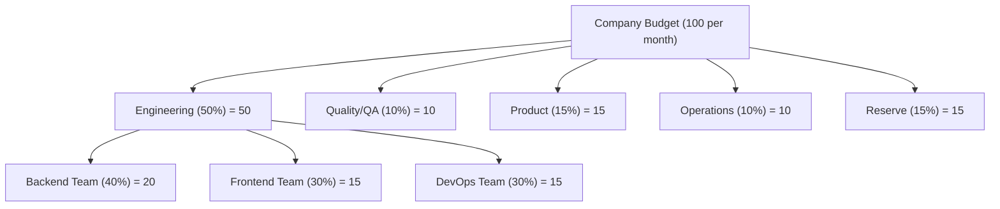

# Budget & Cost Management

SynthOrg treats money as a first-class runtime constraint. Every LLM call carries a currency-stamped `CostRecord`, budgets cascade from the company down to individual teams, and three layers of enforcement (pre-flight, in-flight, task-boundary) prevent runaway spending without breaking in-progress work. The agent execution pipeline that drives each layer is documented in [Agent Execution > AgentEngine Orchestrator](agent-execution.md#agentengine-orchestrator).

---

## Budget Hierarchy

The framework enforces a hierarchical budget structure. Allocations cascade from the company
level through departments to individual teams.



!!! abstract "Note"

    Percentages are illustrative defaults. All allocations are configurable per company.
    Numeric amounts in the diagram are unitless; `budget.currency` is an ISO 4217 code
    resolved per the regional-defaults chain (user/company setting -> browser/system ->
    neutral fallback). SynthOrg stamps `budget.currency` onto every row at
    record-creation time; historical rows retain the code that was active when they were
    written, so changing the setting only affects newly created rows. Numeric cost values
    are never converted; updating the setting relabels the display symbol for future
    records, not the existing ones.

## Cost Tracking

Every API call is tracked with full context:

```json
{
  "agent_id": "sarah_chen",
  "task_id": "123e4567-e89b-12d3-a456-426614174000",
  "prompt_class_id": "system:memory:rerank",
  "provider": "example-provider",
  "model": "example-capable-001",
  "input_tokens": 4500,
  "output_tokens": 1200,
  "cost": 0.0315,
  "currency": "<operator-configured>",
  "billing_model": "per_token",
  "timestamp": "2026-02-27T10:30:00Z"
}
```

Every `CostRecord`, `TaskMetricRecord`, `LlmCalibrationRecord`, and `AgentRuntimeState` carries its own `currency`
(ISO 4217 code validated against the allowlist in `synthorg.budget.currency`). The
`budget.currency` setting determines the currency stamped on new rows; historical rows
retain the code that was active when they were created, so changing `budget.currency`
is safe and does not invalidate history.

Every aggregation site (`CostTracker`, `ReportGenerator`, `CostOptimizer`,
per-agent / per-department / per-project rollups, the HR `WindowMetrics` multi-window
strategy, and the parallel-execution coordinator) enforces a same-currency invariant by
calling `assert_currencies_match` (from `synthorg.budget.currency`) before any
reduction. Mixing currencies raises `MixedCurrencyAggregationError` (HTTP 409,
error code `4007`, symbolic code `MIXED_CURRENCY_AGGREGATION`) at the aggregator
rather than silently producing a meaningless total. Pre-push gate
`scripts/check_currency_aggregation_invariant.py` AST-walks `src/synthorg/` for
unguarded `sum` / `math.fsum` / `statistics.mean` / `statistics.fmean` calls
(including bare-name imports such as `from statistics import mean`) over
`.cost` / `.amount` / `.total_cost` / `.usd` / `.eur` attributes and fails the
push when an aggregation is not preceded by a guard call in the same
function-or-module scope. `CostTracker.record()`
additionally rejects at the ingestion boundary when the incoming record's currency differs
from the configured `budget.currency`, so new writes cannot introduce drift
against the live setting. Historical rows written before a `budget.currency` change still
carry their original code, so a rollup that spans the change window will legitimately see
mixed currencies; the aggregator raises rather than silently combining them. Operators
who change `budget.currency` should either scope reports to a single currency window or
run a proper migration that converts both the numeric amount and the currency code
together under a documented FX policy; a raw
`UPDATE cost_records SET currency = '<new-code>'` is a **re-label, not a conversion**,
and must only be used when the operator knows the existing numeric values are already
denominated in the target code (for example, correcting an initial mis-configuration
before any production data accumulated). SynthOrg does not ship an FX engine; callers are
responsible for the conversion policy when they need one.

`CostRecord` stores `input_tokens` and `output_tokens`; `total_tokens` is a `@computed_field`
property on `TokenUsage` (the model embedded in `CompletionResponse`). Spending aggregation
models (`AgentSpending`, `DepartmentSpending`, `PeriodSpending`) extend a shared
`_SpendingTotals` base class that also carries the per-aggregation currency.

### Is the money figure measuring anything?

A provider that bills by flat subscription has no per-1k price to attribute, so every
call it serves records `cost = 0.0`. That zero is the correct number and it is not
headroom: a money ceiling compared against it can never bind, and a budget page
reading `0.00` cannot tell "nothing was spent" from "money never measured this".

So each connection declares how it charges. `BillingModel` (`core/billing_enums.py`)
is `per_token`, `flat_rate` or `unknown`; a preset declares it, `ProviderConfig` carries
it seeded from the preset at create time, and the operator can correct it afterwards
because they know their own contract better than a shipped table does. `unknown` reads
as unmeasurable rather than as metered, so an undeclared connection errs toward saying
less than it knows.

`CostRecord.billing_model` is carried on the row for the same reason `currency` is: a
connection that later changes contract must not rewrite the history of what was
measurable, and a connection since deleted must still be answerable. The mechanism is
not the same, though. Currency is supplied by the recording path and the tracker only
rejects a mismatch; the billing model is stamped centrally by `CostTracker.record`
from a snapshot of the provider set, overwriting whatever the caller supplied. One
owner, the connection's own declaration: a caller cannot make spend look measurable by
asserting it, and no recording path has to remember to ask. The snapshot is rebound
wherever the provider set is rebuilt (`providers/_driver_binding.py::rebind_provider_set`),
which is what keeps an operator's correction from reaching the ledger only on restart.

From the records a window actually aggregated, `SpendingSummary.measurability` is
derived (`budget/spending_summary.py`):

| Verdict | Meaning |
|---|---|
| `measured` | Every record in the window billed per token; the money total is the whole story. An empty window is `measured`: nothing was spent and nothing was hidden. |
| `unmeasurable` | Every record was flat-rate or unknown; the total is a correct zero that measures nothing. |
| `mixed` | Both kinds served the window, so the total is right for what it covers and understates the rest. |

`SpendingSummary.budget_used_percent` is `None` whenever the verdict is not `measured`.
`0.0` was the lie: it says "we have spent nothing" when the truth is "this ceiling
cannot measure what we are spending". Everything downstream reads the verdict rather
than inferring safety from a low number: the budget page and the overview endpoint
surface it beside the total, a deliverable receipt states it next to `total_cost`, and
the HR scaling budget signal treats an unmeasurable window the way it already treats a
budget that cannot answer at all (burn 100%, alert `hard_stop`), so hires are blocked
rather than waved through on an unmeasured zero. Writing a positive
`budget.run_hard_ceiling` while every configured connection is unmeasurable is refused
at write time, naming the token ceiling as the bound that does bind.

### Recording Paths

`CostRecord` emission flows through two complementary paths:

1. **Provider-layer chokepoint** (`synthorg.providers.cost_recording`). A
   `cost_recording_scope(...)` async context manager binds per-call recording
   context (`agent_id`, `task_id`, `project_id`, `purpose`, `call_category`,
   `currency`, `cost_tracker`) to the current `asyncio.Task` via `contextvars`.
   Inside `BaseCompletionProvider.complete()`, the chokepoint reads the active
   context after a successful response and emits a `CostRecord` to the bound
   tracker. The `purpose` (a `PromptPurposeId` from `llm/prompt_purpose.py`, or
   `None`) is stamped onto `CostRecord.prompt_class_id` so spend can be sliced
   by prompt purpose. Every non-engine LLM call site (memory consolidation,
   classification, verification graders, intake, evolution, HR judges, security
   evaluators, meetings, Chief of Staff, etc.) opens this scope so every paid
   LLM call is accounted for. Two pre-push lints guard it:
   `scripts/check_provider_complete_chokepoint.py` blocks any new call site that
   bypasses the chokepoint, and `scripts/check_cost_scope_purpose.py` blocks any
   `cost_recording_scope()` call that omits `purpose=`.
2. **Engine post-execution recorder** (`synthorg.engine.cost_recording`). The
   main agent execution loop builds per-turn `TurnRecord`s (carrying additional
   metadata the chokepoint cannot reconstruct, e.g. cumulative retry counts and
   PTE token-response inflation) and emits `CostRecord`s after the loop
   completes. Engine call sites do **not** open the chokepoint scope, so the
   chokepoint stays silent on the engine path and there is no double-counting.

Both paths converge on the same `CostTracker.record()` API and the same
same-currency invariants apply.

### Durability

`CostTracker` holds a rolling in-memory window (`_COST_WINDOW_HOURS`, 168
hours), and that window is what every spend summary and every ceiling reads.
The window alone is not the record of spend: a restart emptied it, so a
restarted backend enforced its ceiling against zero and every deliverable
receipt reported nothing spent.

So `cost_records` is written, not merely defined. `attach_durable_repos(...)`
binds the `CostRecordRepository` alongside the project aggregate and its dedup
store, and `record()` appends every accepted record to it:

- **Idempotent.** Each record carries a `claim_id`, unique per `(claim_id,
  timestamp)` in the table, so a redelivered record is stored once. A record
  with no project used to skip dedup entirely (the aggregate increment
  early-returns without a `project_id`), which is every system call.
- **Retried, then escalated.** The append runs under a `GeneralRetryHandler`
  with sub-second backoff (`_DURABLE_APPEND_MAX_ATTEMPTS`); a run of
  `_PERSIST_FAILURE_ESCALATION_STREAK` consecutive failures stops being a
  WARNING nobody reads and logs at ERROR, because by then the ceiling is being
  enforced against an incomplete record of spend.
- **Rehydrated.** `hydrate_from_durable()` refills the window from the durable
  table bounded by the same 168-hour constant, oldest record first, skipping
  claims the process has already seen. A ceiling therefore survives a restart.

Streaming completions (`BaseCompletionProvider.stream()`) route through the
same chokepoint. Token counts surface only on the terminal
`StreamEventType.USAGE` chunk, so `stream()` wraps the driver's iterator in a
lazy pass-through generator (`_cost_recording_stream`) that yields each chunk
unchanged, captures the usage chunk, and -- once the consumer fully drains the
stream -- fires the same `record_cost_if_in_scope` chokepoint `complete()` uses.
Because draining happens in the consumer's scope, the `CostRecord` lands in the
caller's `cost_recording_scope`, not at connection-setup time. A stream that
never yields a usage chunk records nothing, matching the no-scope no-op
contract. The scope's teardown is context-safe (a plain context-var restore, so
an SSE response body that drives the generator's close in a different `anyio`
context than its open cannot raise).

The `GET /budget/records` endpoint returns paginated cost records alongside two server-computed
summaries (aggregated from **all** matching records, not just the current page):

- **`daily_summary`**: per-day aggregation with `date`, `total_cost`, `total_input_tokens`,
  `total_output_tokens`, and `record_count`, sorted chronologically.
- **`period_summary`**: overall stats including `avg_cost` (computed), `total_cost`,
  `total_input_tokens`, `total_output_tokens`, and `record_count`.

## CFO Agent Responsibilities

The CFO agent (when enabled) acts as a cost management system. Budget tracking, per-task cost
recording, and cost controls are enforced by `BudgetEnforcer` (a service the engine composes).
CFO cost optimisation is implemented via `CostOptimizer`.

- Monitor real-time spending across all agents
- Alert when departments approach budget limits
- Suggest model downgrades when budget is tight
- Report daily/weekly spending summaries
- Recommend hiring/firing based on cost efficiency
- Block tasks that would exceed remaining budget
- Optimise model routing for cost/quality balance

`CostOptimizer` implements anomaly detection (sigma + spike factor), per-agent efficiency
analysis, advisory model recommendations (a cheaper model on the agent's OWN provider,
since a model reached through a different connection is a different decision with its
own credentials, quota and bill), routing optimisation suggestions, and operation
approval evaluation. `ReportGenerator` produces multi-dimensional spending reports with
task/provider/model breakdowns and period-over-period comparison.

## Cost Controls

The budget system enforces two layers: pre-flight checks and in-flight monitoring.
Every knob here refuses spend; none of them re-points an agent at a different
model.

```yaml
budget:
  total_monthly: 100.00
  currency: "<ISO 4217 code>"  # display-only, no FX conversion
  reset_day: 1
  alerts:
    warn_at: 75               # percent
    critical_at: 90
    hard_stop_at: 100
  per_task_limit: 5.00
  per_agent_daily_limit: 10.00
```

!!! tip "Cost discipline is selection, not substitution"

    An agent is a fixed `(role, personality, model)` unit, so budget pressure never
    swaps its binding: the pair is the operator's choice about where work runs and
    what it costs, and a run whose model was rewritten mid-flight recorded a
    capability rung that meant nothing.

    The standing discipline is the selection ladder instead. It prefers an agent at
    the **exact** rung the work demands over a stronger one, which picks the cheapest
    agent that can do the job on every assignment rather than only past a threshold
    (see [Model Capability Policy](../reference/model-capability-policy.md)). When
    the money genuinely runs out, the hard stops below refuse: monthly, daily,
    per-task, per-project, the run ceiling and the token ceiling all still halt the
    work, which is an outcome an operator can see and act on.

    Enforced by `check_no_bound_pair_rewrite.py`.

!!! info "Minimal Configuration"

    The only required field is `total_monthly`. All other fields have sensible defaults:

    ```yaml
    budget:
      total_monthly: 100.00
    ```

## Cost as a First-Class Dial

Beyond the passive ledger and the soft-warning ladder, cost is a prospective,
operator-facing control with three capabilities.

### Pre-flight forecast gate

`CostForecaster` produces a forecast for a brief before any spend commits: a
mid-point `estimated_cost` plus a `[lower_bound, upper_bound]` uncertainty band.
The estimate is a hybrid of a per-capability static prior and a Bayesian-shrinkage blend
with historical per-role observations, so a cold start collapses to the prior and
a warm history pulls toward the observed mean.

`ForecastGate` sits at the work-entry seam between the entry adapters and the work
pipeline. When `forecast_required` is set it refuses to dispatch a brief unless a
persisted `Forecast` row with `decision = approved` covers it; a missing or pending
forecast yields a fresh `pending` row and raises `CostForecastApprovalRequiredError`
(HTTP 402) so the operator decides via the dashboard. The decision state machine is
`pending -> approved | rejected | superseded`; `approved` and `rejected` are terminal.

```yaml
budget:
  forecast_required: true
  forecast_default_ceiling_multiplier: 1.5   # UI suggests ceiling = upper_bound * this
  forecast_shrinkage_prior_weight: 5.0        # Bayesian prior pseudo-count
  forecast_static_prior_per_turn_expert: 0.10
  forecast_static_prior_per_turn_capable: 0.03
  forecast_static_prior_per_turn_basic: 0.005
  forecast_static_prior_per_turn_local: 0.0
```

### Approval runs the work it gated

A refused brief rides with the estimate that refused it: when the gate mints a
pending forecast it stores the serialised `WorkItem` on the row's
`gated_work_item` column. Approval then re-dispatches it.
`BudgetForecastService.approve` calls the `ApprovedForecastDispatcher` port
(`budget/forecast_dispatch_port.py`), implemented by
`engine/pipeline/forecast_redispatch.py::ForecastGateRedispatcher` and wired at
boot in `engine/pipeline/entry/boot.py`. That adapter feeds the item back
**through the gate**, which now reads the row as `approved`, so the release
rules and the brief-drift check are applied once rather than duplicated; the run
is spawned rather than awaited, because a work pipeline outlives the HTTP
request that approved its budget.

That is what makes approval a decision that takes effect. Without it the
automation door accepted work, returned its `202`, raised
`CostForecastApprovalRequiredError` inside a detached background task where only
the log saw it, and dropped the objective: approving the forecast afterwards
changed a row and nothing else.

A forecast generated directly through `POST /budget/forecasts` gated no work, so
its `gated_work_item` is `NULL` and approval is only a budget decision. A row
that *does* hold work and finds no dispatcher wired raises rather than returning
success, because silently dropping approved work is the failure being fixed.

On approval the work-entry intake phase stamps the forecast's `forecast_id` and
the operator-approved `ceiling_amount` onto the `Task` so the in-loop checker and
the engine can act on them.

### Hard real-money ceiling

Independent of the monthly soft-warning ladder, a per-run hard ceiling halts the org
cleanly mid-run. The in-loop `BudgetChecker` raises `RunHardCeilingExceededError` (a
subclass of `BudgetExhaustedError`) the moment accumulated cost meets or exceeds the
task's `hard_ceiling` (falling back to the global `run_hard_ceiling` setting when the
per-task value is unset). The shipped default `run_hard_ceiling` is `25.0`, a
safety net; `0.0` is the explicit opt-out that disables the global fallback. The engine routes the
crossing to `TerminationReason.PARKED` via `ApprovalGate.park_context` so execution
state is preserved, and stamps a `HaltContext` (accumulated cost, ceiling, currency,
timestamp) onto the forecast row. The operator raises the ceiling via
`POST /budget/forecasts/{id}/raise_ceiling` (rejected with `RunHardCeilingTooLowError`
if the new ceiling does not clear the accumulated cost), which clears the halt context
so the run can resume.

```yaml
budget:
  run_hard_ceiling: 25.0   # unconverted provider-cost value; 0 disables the global fallback
```

### Hard token ceiling

Money is not the only bound, and against a flat-rate connection it is not a bound at
all. Every provider reports tokens, so the token ceiling is the runaway backstop that
holds regardless of how a connection charges. It is on by default:

```yaml
budget:
  run_hard_token_ceiling: 50000000   # cumulative tokens per run; 0 disables the global fallback
  session_token_ceiling: 2000000     # cumulative tokens per bounded helper session
```

Both apply without a restart, and the mechanism differs by consumer.
`BudgetConfig` is built once per process through the DB-blind bootstrap resolver, so
the enforcer's copy would otherwise freeze at boot for every limit it holds, not just
these two: `BudgetConfigSettingsSubscriber` re-resolves the whole config through the
live resolver on any budget write and hands it to the running enforcer.

Four components hold their own copy (the state slice, the enforcer, the tracker whose
copy decides which currency a record may be written in and what every gauge is computed
against, and the `CostOptimizer` that scores each recommendation), so
`budget/adoption.py`
owns reaching all four and both triggers call it. **Boot is the first trigger, not a
special case**: phase 1 builds all four from the code defaults because no setting can be
read yet, so a deployment whose budget was configured before it started measured against
`total_monthly`'s default of 100 for the life of the process, and restarting was what
reintroduced it rather than what fixed it. `adopt_resolved_budget_config` runs once
persistence and settings are up; a resolve failure leaves the boot defaults standing
rather than failing the deployment, and those defaults refuse spend sooner than any
ceiling an operator would choose. The bounded
sessions read `budget.session_token_ceiling` per call through
`resolve_session_token_ceiling`, except the two that bake it into a frozen config at
assembly (the decomposition planner and the plan-review panel), which are rebuilt on a
write: the panel declares the key on its `SubsystemSpec` with `rebuild_on_change`, and
the planner's key is watched by the runtime-reload subscriber.

The in-loop checker reads `ctx.accumulated_cost.total_tokens` and raises
`RunHardTokenCeilingExceededError` (a sibling of `RunHardCeilingExceededError` under
`BudgetExhaustedError`) when the run's task-level `hard_token_ceiling` (or the global
fallback) is met. The token branch is checked **first**, because a flat-rate run's money
branch can never fire. Sizing: `engine.max_turns` is 300 with three extensions, so a
legitimate run may reach 1200 turns, which at a large context is roughly 48M cumulative
tokens; 50M lets a full-length legitimate run through and stops a genuine runaway. The
four configured helper sessions carry money ceilings of 1.0 to 2.0, so 2M is the same
generosity one tier down.

Both ceilings park the run under the same `budget:hard_ceiling_exceeded` action type:
it is one event ("this run hit its hard bound"), and a second action type would be a
second owner for one decision. What differs is the reason string, which names the unit,
the ceiling, the usage and the two settings that raise it. Both of those settings are
writable: the global through the settings surface, and the task's own bound through
`PATCH /tasks/{id}`, which carries `hard_ceiling` and `hard_token_ceiling` alike.
Naming a knob the operator cannot reach would park the run behind an instruction that
does nothing, which is the same unreachable-exit shape one layer up. The money half of
that pair is guarded where it is written, not only where it is read: `hard_ceiling`
goes through the same can-this-bind refusal as `budget.run_hard_ceiling`, both asking
`money_ceiling_can_bind`, because the per-task value overrides the setting and guarding
only the setting would leave the stricter number as the unguarded one.
A token halt stamps no `HaltContext`: that structure hangs off `cost_forecasts` under an
all-or-none CHECK whose columns are money and a timestamp, and a forecast estimates
money. Resume is therefore raise a ceiling and resume the parked approval, where the
rebuilt checker reads the new value.

"Is this session out of budget?" has exactly one owner, `budget/session_budget.py`.
`build_session_budget_checker` takes a `SessionCeilings` pair rather than two scalars,
and each session config carries the pair as one field, so a wiring path that resolves
the money bound cannot leave the token bound at its default without saying so. Five
bounded sessions ask there (decomposition, plan review, initiative evaluation,
retrospective capture, chat action), each keeping its own tuned money number and
inheriting the token backstop. The loop protocol builds its checker from the same
seam but is not one of them: it bounds a whole task run from `Task.budget_limit` and
`Task.hard_token_ceiling`, and stands in where no enforcer is wired. The gateway's
per-run token claim is a different decision with its own owner and is left alone.

The chat action reads its token bound from `budget.session_token_ceiling` itself rather
than accepting it from a caller, because it is one of the bounded sessions and asking
two callers to pass it is how one of them comes not to. Its money ceiling stays
caller-supplied: each console tunes its own, and it measures nothing on a flat-rate
connection anyway.

### Cost / quality Pareto view

`ParetoAnalyzer` answers "90% of the quality at 40% of the cost if you downgrade these
roles". It walks the current per-role model assignments and observed costs, looks up a
downgrade candidate per role, and pairs the `cost_saving_pct` with the `quality_delta_pct`
drawn from a `BenchmarkScoreProvider`. Each model id resolves to a capability rung through
a shared resolver (`budget/model_capability.py`): the built-in heuristic handles the
`example-{basic,capable,expert}` ids (and the `example-local-*` locality variants), and an
additive `ModelCapabilityMap` lets an operator map arbitrary deployment ids onto a
canonical rung without re-keying the candidate construction.

The quality axis is backed by `MeasuredBenchmarkScoreProvider`, selected by the
`budget.benchmark_provider` setting (`measured`; an unknown value fails loudly at wiring):

- `MeasuredBenchmarkScoreProvider` (`measured`) reads measured per-model scores from the
  `BenchmarkScoreRepository`. A model with no measured row returns `None`, so the frontier
  skips it and the quality axis is shown as explicitly absent, never a fabricated number.

Measured scores are genuinely measured, never fitted: `make record-benchmark-scores`
(driving `scripts/record_benchmark_scores.py`) replays a recorded per-model cassette
through the eval spine and derives each score from the resulting `Scorecard` (mean
normalised brief score plus a 95% confidence band), writing the committed seed artifact
`src/synthorg/budget/benchmark_seed.json`. The repository is boot-seeded from that artifact
when empty, so a fresh operator database carries the measured scores without a recording
run. Every `ParetoPoint` and the frontier carry a `source` field (the per-point provenance,
joined with ` | ` when a point's current and candidate scores differ in provenance, and
comma-joined across the frontier). A model with no measured row returns no score, so it never
becomes a `ParetoPoint`; the quality axis renders it as explicitly absent rather than a
fabricated value. The dashboard derives a provenance badge from the `source`: a measured
`benchmark:` token renders "measured", and a role without a measured score renders "absent",
so fabricated data can never be mistaken for measured data. The frontier is advisory: downgrade callouts
link to the agent settings surface rather than mutating models inline.

Benchmark scores feed **only** this Pareto/quality view. Capability selection does
not consult them: it compares an agent's rung against the rung the work demands
(see [Providers: capability routing](providers.md#capability-routing-route-the-agent-never-the-horsepower)).
The `budget/model_capability.py` heuristic that this analyser shares is also the base
signal the capability classifier builds on, so a model's Pareto rung and its
selection rung derive from the same capability metadata.

Each frontier point's downgrade candidate is a **measured** model one rung down,
picked from the same benchmark rows the quality axis reads, so the callout always
names a model the operator can actually bind. It is advisory in the strict sense:
it links to the agent settings surface, and only an operator writing the new pair
changes anything.

## Quota Degradation

When a provider's quota is exhausted, the framework applies the configured degradation
strategy before failing. Each provider has a `DegradationConfig` specifying the strategy:

| Strategy | Behaviour |
|----------|----------|
| `alert` (default) | Raise `QuotaExhaustedError` immediately |
| `queue` | Wait for the soonest quota window to reset (capped at `queue_max_wait_seconds`), then retry |

Neither moves the caller onto a different connection. A provider is a registered
connection with its own credentials, endpoint and quota, so re-pointing an agent
at another one mid-dispatch would run the operator's choice somewhere nobody
chose and bill a quota nobody named. The `fallback` strategy and its
`fallback_providers` list are retired, and the two directions are deliberately
different:

- **Writing** one is refused by name, so an operator asking for a provider swap
  is told the system no longer does that rather than having it silently ignored.
- **Reading** one already persisted strips it, records it on the read
  (`ProviderConfigsRead.coerced`), and logs it once at boot. The setting is inert
  either way, and the only thing refusing it on read can cost is the connection
  that carries it: an operator who set it before the retirement would lose a
  working provider over a value whose correct state is now "absent". The next
  edit of that provider drops it from storage, since a write re-serialises from
  the validated model.

An agent whose provider stays out is answered at the organisation level rather
than inside the dispatch: the roster marks it unavailable
(`ServiceabilityFilteredRoster`) and its work is reassigned to an agent that can
serve.

```yaml
providers:
  example-provider:
    degradation:
      strategy: "queue"
      queue_max_wait_seconds: 300
  secondary-provider:
    degradation:
      strategy: "alert"
```

`QuotaTracker` also exposes a synchronous `peek_quota_available()` method that returns
a `dict[str, bool]` snapshot of per-provider quota availability. This is used by the
`QuotaAwareSelector` at routing time to prefer providers with remaining quota. The
method reads cached counters without acquiring the async lock (safe on the single-threaded
asyncio event loop) and tolerates TOCTOU for heuristic selection decisions.

Degradation is resolved during pre-flight checks (`BudgetEnforcer.check_can_execute`),
which returns a `PreFlightResult` recording what happened. QUEUE waits for the
quota window to rotate and then re-checks, on the same provider throughout;
ALERT raises. The dispatch that follows always runs on
`identity.model.provider`, which is also the provider the pre-flight was asked
about, so the call and the quota it is metered against can never come apart.

!!! tip "Degradation Boundary"
    Degradation is resolved at **task assignment time** (pre-flight). An agent
    mid-execution is never switched to a different provider, and neither is one
    at its boundary.

## LLM Call Analytics

Every LLM provider call is tracked with comprehensive metadata (per-call cost and proxy-overhead metrics, call categorisation and the orchestration ratio, the nine-metric coordination suite, and the coordination error taxonomy). That analytics layer has its own design page: [LLM Call Analytics and Coordination Metrics](coordination-metrics.md). The orchestration ratio (`coordination / total`) and the coordination suite are the primary signals for tuning multi-agent configurations.

## Risk Budget

The framework tracks **cumulative risk** alongside monetary cost. While the
`RiskClassifier` assigns per-action risk levels (LOW/MEDIUM/HIGH/CRITICAL),
the risk budget tracks risk *accumulation*: an agent executing 50 MEDIUM-risk
actions in a row should trigger escalation even though each individual action
is approved.

### Risk Scoring Model

Each action is scored on four dimensions (0.0--1.0):

| Dimension | Meaning | 0.0 | 1.0 |
|-----------|---------|-----|-----|
| `reversibility` | How irreversible | Fully reversible | Irreversible |
| `blast_radius` | Scope of impact | None | Global |
| `data_sensitivity` | Data touched | Public | Secret |
| `external_visibility` | External parties | Internal only | Fully public |

A weighted sum produces a scalar `risk_units` value (default weights:
0.3/0.3/0.2/0.2). The `RiskScorer` protocol is pluggable; the default
implementation maps built-in `ActionType` values to pre-defined `RiskScore`
instances (CRITICAL ~0.88, HIGH ~0.62, MEDIUM ~0.31, LOW ~0.05).

### Risk Budget Configuration

```yaml
budget:
  risk_budget:
    enabled: false                  # opt-in
    per_task_risk_limit: 5.0
    per_agent_daily_risk_limit: 20.0
    total_daily_risk_limit: 100.0
    alerts:
      warn_at: 75                   # percent of daily limit
      critical_at: 90
```

Zero limits mean unlimited. Risk budget is disabled by default.

### Risk Tracker

`RiskTracker` mirrors `CostTracker`: append-only `RiskRecord` entries with
TTL-based eviction (7 days), `asyncio.Lock` concurrency safety, and
per-agent/per-task/total aggregation queries.

### Enforcement

`BudgetEnforcer` checks risk limits alongside monetary limits:

1. **Pre-flight**: `check_risk_budget()` checks per-task, per-agent daily,
   and total daily risk limits. Raises `RiskBudgetExhaustedError` on breach.
2. **Recording**: `record_risk()` scores and records each action via
   the `RiskScorer` and `RiskTracker`.
3. **Autonomy downgrade**: `RISK_BUDGET_EXHAUSTED` is a `DowngradeReason`, so
   exhausting the risk budget drops the agent to `SUPERVISED`. This narrows what
   the agent may do unattended; it never touches which model it runs.

### Shadow Mode

`SecurityEnforcementMode` (on `SecurityConfig`) controls enforcement:

| Mode | Behaviour |
|------|----------|
| `active` (default) | Full enforcement; verdicts applied as-is |
| `shadow` | Full pipeline runs, audit recorded, but blocking verdicts convert to ALLOW |
| `disabled` | No evaluation, always ALLOW |

Shadow mode enables pre-deployment calibration: operators can observe what
*would* have been blocked without disrupting agent work, then tune risk
weights and limits before switching to active enforcement.

## Automated Reporting

The framework generates periodic reports summarising spending, performance,
task completion, and risk trends. Reports are generated on demand via API
or on a schedule.

### Report Periods

| Period | Coverage |
|--------|----------|
| `daily` | Previous day (00:00 UTC to 00:00 UTC) |
| `weekly` | Previous week (Monday 00:00 UTC to Monday 00:00 UTC) |
| `monthly` | Previous month (first-of-month 00:00 UTC to first-of-month 00:00 UTC) |

### Report Templates

| Template | Data Source | Contents |
|----------|-----------|----------|
| `spending_summary` | `CostTracker` | Per-task, per-provider, per-model cost breakdowns |
| `performance_metrics` | `PerformanceTracker` | Per-agent quality scores, task counts, cost/risk totals |
| `task_completion` | `CostTracker` | Completion rates, department breakdowns |
| `risk_trends` | `RiskTracker` | Risk accumulation by agent and action type, daily trend |
| `comprehensive` | All sources | Combines all templates into a single report |

### API Endpoints

| Method | Path | Description |
|--------|------|-------------|
| `POST` | `/api/v1/reports/generate` | Generate an on-demand report for a given period |
| `GET` | `/api/v1/reports/periods` | List available report periods |

## Prefill Token Equivalents (PTE)

PTE is an additional hardware-aware efficiency metric (from
[arXiv:2604.05404](https://arxiv.org/abs/2604.05404)) that accounts for KV-cache
eviction between tool calls and tool-response inflation. Unlike raw token counts,
PTE correlates better with wall-clock latency for tool-integrated reasoning.

**Formula approximation** (no internal KV state required):

    PTE = input_tokens * (1 + eviction_penalty * prior_tool_call_count)
        + output_tokens
        + tool_response_tokens * tool_inflation_factor

Default tuning: ``eviction_penalty = 0.3``, ``tool_inflation_factor = 1.5``.
``PTEConfig`` defines these tuning parameters where
``prefill_token_equivalents(..., config=...)`` is called.

**Integration**: PTE is **additive, not a replacement** for token budgets. Token
budgets continue to drive per-task spend caps; PTE drives efficiency analysis via
``EfficiencyRatios.pte`` and ``pte_ratio``.

**Configuration**: ``budget.pte_tracking_enabled: bool = False`` (opt-in).

---

## See Also

- [Providers](providers.md): provider abstraction, routing, quota
- [Tools](tools.md): tool invocation cost tracking
- [Design Overview](index.md): full index
