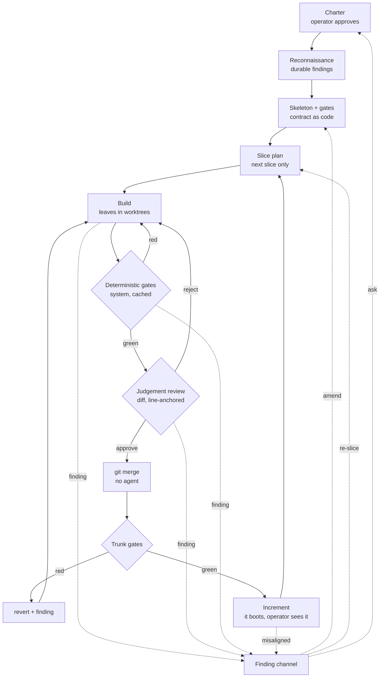
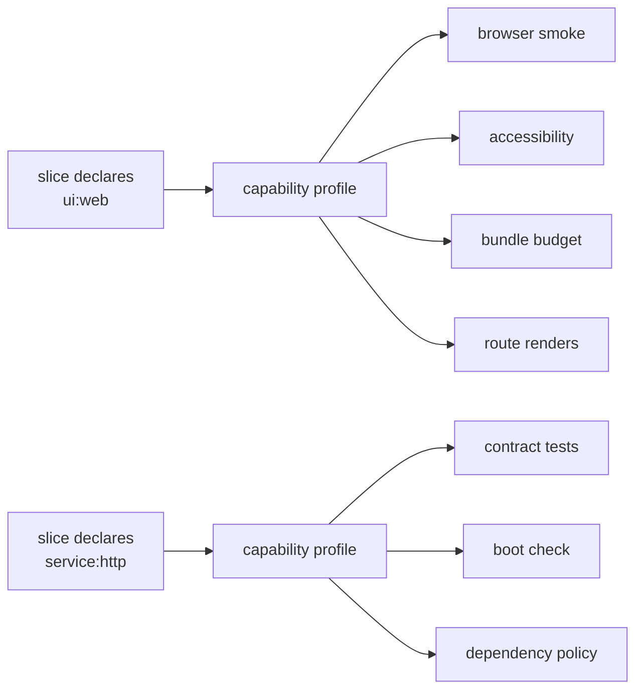
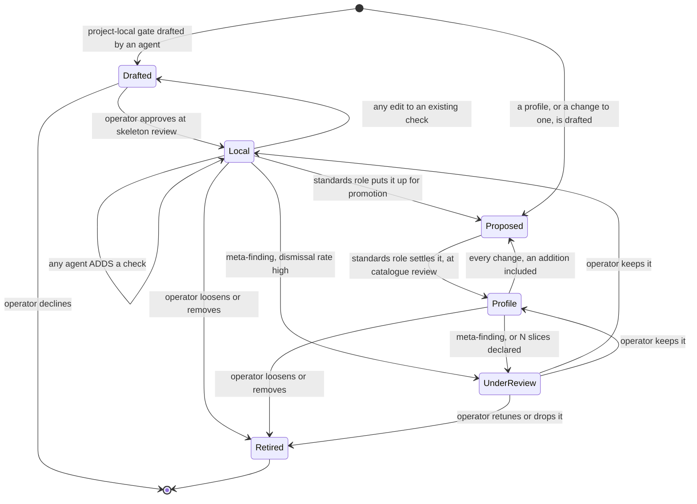
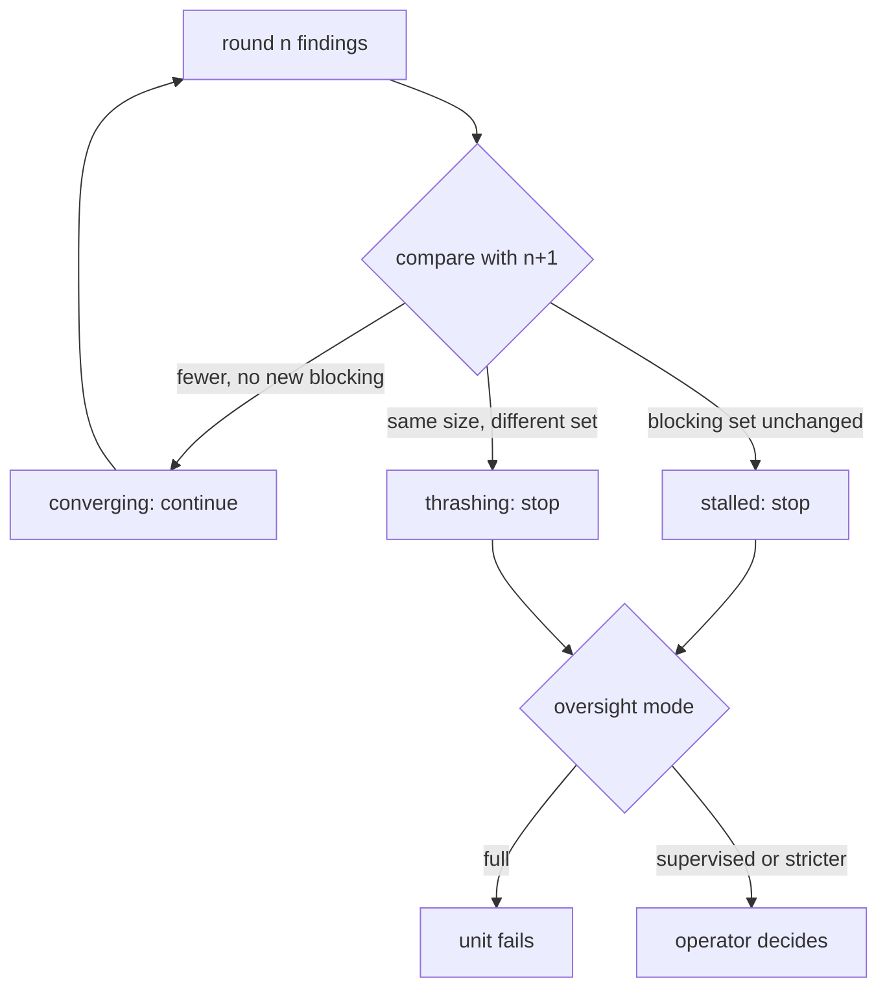

# The Build Loop

How an objective becomes working software: the stages, who owns each decision,
what runs mechanically, what needs judgement, and what reaches the operator.

This page is the authority on the loop. [Coordination](coordination.md) owns
transport and recovery beneath it, [Plan Review](plan-review.md) owns the
charter gate at its head, and [Verification & Quality](verification-quality.md)
owns the review gate's internals. Where any of those describes a stage this page
also describes, this page wins.

!!! warning "Status"

    Designed, not built. The charter gate, worktree isolation, the review gate
    and the reviewer-independence constraints exist today. Reconnaissance, the
    skeleton stage, slice planning, the gate system, the finding channel and
    the machinery budget do not. Driven live against real providers, the
    current loop has never reached assembly.

## The problem

The loop as built is **plan, build, review, assemble**. The whole tree is
planned in one pass from prose, the leaves are built concurrently, and an agent
reconstructs the union at the end by reading its children.

Four mechanisms make parallel software engineering converge rather than
diverge. The loop has none of them.

| Mechanism | Why it is load-bearing | Today |
| --- | --- | --- |
| Probe the unknown first | The plan dies on facts nobody had | The planner researches inside its own session; findings are ephemeral and reach nothing |
| A contract before the work | Parts are only independent if their seams are real | Contracts are prose. The merge brief concedes they "do not survive" implementation |
| A trunk that stays green | Integration risk is paid down continuously | Integration is one phase, at the end, once |
| Work feeds back to the plan | Discovery is the point of doing the work | No path exists. A leaf that learns the plan is wrong has nowhere to say so |

The consequences are measured, not inferred. One assembly spent 1,600,399
prompt tokens against 2,229 completion tokens: 99.86% of its budget re-reading
children it had already read, because each read stays in the conversation and
is re-sent every later turn. Assembly cost is quadratic in what it reads and
fan-in grows with depth, which is indistinguishable from depth itself failing.

A second defect compounds it. A single unit's tests are written by the unit
that wrote the code, so they pass by construction, and nothing between a leaf
and the root ever runs the pieces together.

## Shape



The dotted edges are the mechanism the current loop lacks entirely. Everything
can raise a finding, at any depth, at any time, and a finding is the only thing
that changes the plan.

## Architecture

```d2
direction: right

Operator: Operator

Judgement: {
  label: "Judgement (agents, tokens)"
  Recon: Reconnaissance
  Skeleton: Skeleton owner
  Planner: Slice planner
  Builder: Build units
  Reviewer: Reviewer
  Investigator: Investigator
}

Mechanical: {
  label: "Mechanical (system, no tokens)"
  GateRunner: Gate runner
  Cache: Result cache
  Merger: git merge
  Trunk: Trunk gates
  Budget: Machinery budget
  Boot: Increment boot

  GateRunner -> Cache: "keyed on check + tree + config sha"
  Merger -> Trunk
  GateRunner -> Budget: "duration + cost"
}

Findings: Finding channel
Standards: Standards role

Operator -> Judgement.Recon: "approved charter"
Judgement.Recon -> Judgement.Skeleton: "durable facts"
Judgement.Skeleton -> Judgement.Planner: "contract + gate config"
Judgement.Planner -> Judgement.Builder: "slice"
Judgement.Builder -> Mechanical.GateRunner: "commit"
Mechanical.Cache -> Judgement.Reviewer: "gate results"
Judgement.Reviewer -> Mechanical.Merger: "approve"
Mechanical.Trunk -> Mechanical.Boot: "green"
Mechanical.Boot -> Operator: "running software + prose"

Mechanical.Trunk -> Findings: "red trunk"
Mechanical.GateRunner -> Findings: "gate failure"
Judgement.Reviewer -> Findings: "defect"
Judgement.Builder -> Findings: "blocked-by-fact"
Mechanical.Budget -> Standards: "budget breach"
Standards -> Findings: "gate is the defect"
Findings -> Judgement.Investigator: "second failure"
Findings -> Judgement.Skeleton: "contract-wrong"
Findings -> Judgement.Planner: "re-slice"
Findings -> Operator: "needs-human"
Operator -> Findings: "misaligned"
```

The left column costs tokens and produces judgement. The right column costs
seconds and produces facts. Every arrow crossing from right to left carries
evidence; no arrow crossing from left to right carries an unverified claim.

## Two kinds of check

Almost every question about the loop resolves once these are separated.

| | Deterministic gate | Judgement review |
| --- | --- | --- |
| Examples | format, lint, types, tests, coverage, dependency policy, build, boot | is this right, done well, the thing that was asked for |
| Cost | seconds, no tokens | minutes, tokens |
| Repeatable | yes, and cacheable | no |
| Runs | on every commit | once per proposed change |
| Owner | the system | an agent |

**Nothing reaches a judgement reviewer until every deterministic gate is
green.** A reviewer spending tokens to notice that a file was never formatted is
the most expensive linter ever built.

The system runs every deterministic check. Agents write tests; agents never
report their results. An agent-reported pass is a claim, and the loop already
says so in the words it hands back on rework: a claim that the tests pass is
not evidence that they do.

## Stages

### Charter

Unchanged from [Plan Review](plan-review.md). An interview produces a charter
with objectives and acceptance criteria; the operator approves it; that approval
authorises the work and the spend behind it. Scope is the operator's decision at
every autonomy level, including `full`.

### Reconnaissance

A bounded stage before planning, answering only the questions whose answers
would change the plan. Can this library do what the objective needs. What is
already in the repository. What shape is the API that must be integrated with.

Output is a **findings document**, durable and versioned, and it is the set of
facts the plan is permitted to assume. It is not code.

This is where a discovery that invalidates the approach is supposed to land:
cheaply, before a hundred units are planned on top of it. Today that discovery
happens at a leaf, four levels deep, with nowhere to go.

Reconnaissance runs again whenever a finding invalidates one of its facts.

### Skeleton and gates

One agent, working serially, commits a compiling skeleton to the trunk:

- module layout and type signatures
- one **pending** test per acceptance criterion
- the project's own gate configuration

**The contract becomes code.** A leaf's brief stops being a paragraph and
becomes a signature plus a pending test that must pass. Two leaves implementing
against the same skeleton touch disjoint files, so their union is a three-way
git merge rather than a reconstruction.

**Pending is what keeps the skeleton compatible with a green trunk.** A test
asserting a contract nobody has implemented yet fails, and a skeleton that
committed a plainly failing suite would break the invariant the whole loop
rests on before the first unit runs. So the gate configuration declares each
criterion test pending, and the trunk suite reads a pending failure as green.

Pending is narrow as well as strict, and the narrowness is what stops it
becoming a mute button. Only the **declared** failure is green: the assertion
in the criterion test, failing because nothing implements the contract yet.
Every other way that test can end stays red, because none of them is evidence
the contract is merely unimplemented. A collection error means the skeleton
does not import; an unexpected exception means it is wrong rather than absent;
a timeout or a runner crash means nothing was measured at all. Reading any of
those as green would let a skeleton that does not even load ship as a green
trunk, which is the invariant this mechanism exists to protect.

Pending is strict in both directions too, which is the other half of the same
contract. A pending test failing its declared assertion is green; a pending
test that **passes** is red until the same commit clears its marker.
A unit therefore cannot satisfy its contract and leave the marker behind for
the next unit to inherit, and clearing the marker is the mechanical signal that
the unit is done. A pending marker on a criterion no unit claims is a skeleton
defect, caught at skeleton review while the whole contract is being read.

The gate configuration is part of the skeleton because a definition of done
with nowhere to live is a definition of done nobody enforces. It carries the
linter, the formatter, the test runner, the coverage floor, the dependency
policy, and the command that boots the result.

The skeleton is small by construction, which is what makes it reviewable.

### Slice planning

Plan the next slice, not the whole tree. A slice is the set of units that can
run concurrently against the current trunk.

Depth becomes emergent rather than a parameter. Each slice is planned with
everything the previous slice learned, so the moment of maximum ignorance is
never the moment the whole structure is decided.

A static hundred-item tree planned in one pass is waterfall applied
recursively.

### Build

Each unit gets a git worktree off the current trunk commit and its own
container. Unchanged from today, and this part works.

A unit is **ready** when the skeleton's pending test for it passes, its marker
is cleared in the same commit, and nothing else broke. That is mechanically
checkable and it is not a paragraph, which is the whole point: it is the one
part of "done" a machine can decide alone.

Ready is not done. A ready unit still has to pass review, merge cleanly, and
leave the trunk green, and each of those can send it back. Naming the two
apart matters because they have different owners: readiness is the gates',
and completion is the reviewer's and then the system's, exactly as the
ownership table and the merge section below have them.

### Gates

Every check is content-addressed on `(check_id, tree_sha, config_sha)` and
cached. A leaf is a commit, so the tree hash is free.

Caching is not an optimisation here, it is what makes the trunk invariant
affordable. Without it, *N* leaves merging in a slice run the full suite *N*
times.

Gate results are attributable and signed by the runner. A reviewer reads them;
it never runs the tests itself.

### Review

The reviewer is shown three things: **the diff** between the leaf's head and the
trunk commit it branched from, the cached gate results, and the acceptance
criteria.

Reconnaissance findings are deliberately **not** among them. Recon feeds the
skeleton, the skeleton is the contract, and the reviewer judges the diff against
that contract, so the facts recon established have already been distilled into
code by the time review happens. Shipping the raw findings as well would re-open
the read-everything pattern that cost one assembly 1,600,399 prompt tokens
against 2,229 completion, for information the contract already carries.

It reads, it runs nothing, it writes nothing, and it files one verdict with
findings. The author fixes. A reviewer that edits becomes an author, and the
independence the database constraint protects evaporates while the constraint
still passes.

Reviewer selection and session narrowing are unchanged; see
[Verification & Quality](verification-quality.md).

### Merge

**No agent merges.** On approval the coordinator runs `git merge`. Clean merge
plus a green trunk suite completes the unit. A conflict or a red trunk is a
finding routed to the author, with the conflict as its evidence.

Git's line-based merge invents conflicts between changes that do not collide:
two units adding different functions to the same file overlap in line ranges.
An entity-level merge driver, installed through `.gitattributes` and parsing
with tree-sitter, resolves those without an agent. What remains is a real
collision, which genuinely needs an author.

### Trunk gates and the revert rule

The trunk is green at all times. That invariant is what makes concurrent
leaves safe.

A unit that merges cleanly into a green trunk and turns it red owns that
failure, because its change is the delta. It is reverted immediately, which
restores the trunk in seconds, and its author receives a finding carrying the
failing test and the sibling diff it collided with.

Where the author cannot resolve it, the finding is promoted to
`contract-wrong`: the skeleton permitted two units to make incompatible
assumptions, which is a planning defect, not an implementation one.

No merge algorithm detects this class. Generated unit tests detect roughly a
third of semantic conflicts, so tests are necessary and not sufficient; the
remainder is caught by the skeleton's intentional per-criterion tests and by
review against the contract.

### Increment

Every slice ends with the software **booting**, in a container, reachable.

For an operator who does not read code this is the highest-signal check that
exists: an application that serves a page has cleared a bar no unit test does.
It is also the only review artefact that needs no translation.

## Ownership

Every decision has exactly one owner. Two owners is a silent override; zero is
a deadlock. See [Single-Owner Decisions](../reference/single-owner-decisions.md).

| Decision | Owner | Escalates to |
| --- | --- | --- |
| What we are building | operator, at charter | never delegated |
| What the facts are | reconnaissance | re-runs on an invalidating finding |
| The contract | skeleton owner | operator on a second `contract-wrong` for one interface |
| What a slice contains | slice planner | operator when a finding empties it |
| Which gates apply | derived from the declared capability's profile | operator at skeleton review, when no profile fits and a project-local gate is drafted |
| Whether this is what was wanted | operator, at the increment | never delegated; no machine makes this one |
| Adding a check to a project-local gate | any agent | never |
| Editing a check a project-local gate already has | operator, at skeleton review | never |
| Adding a project-local gate | operator, at skeleton review | never |
| Changing a central profile, promotion into one included | the standards role, at catalogue review | never |
| Loosening or removing a gate, profile or project-local | operator only | never |
| Whether a unit is done | gates, then the reviewer | operator when review stalls, at `supervised` and stricter |
| Whether it merges | the system | the author, when the merge conflicts or the trunk goes red |
| Whether the machinery is healthy | the standards role | operator on a budget breach |
| Whether a gate earns its keep | the meta-finding rule | operator |

The asymmetry in the gate rows is load-bearing. An agent blocked by a gate will
always prefer to weaken it, so the ratchet turns one way, and it turns on the
distinction between adding and editing rather than on anyone's judgement of
which check is stricter. Adding is free because a configuration that only grows
admits strictly less than it did; editing is not, because "this replacement is
no weaker" is not a property the system can decide for arbitrary checks. The
two operator rows are the ones an agent could otherwise use to walk the ratchet
backwards: rewriting a check, and drafting a new gate nobody has read.

Scope bounds the free direction as tightly as the direction does. A
project-local gate belongs to one project, so an agent adding a check to one
costs that project a check its own operator reads at the next skeleton review.
A central profile is not one project's: it is in force for every project that
declares the capability, and none of those operators is in the room. So the
addition rule stops at the project boundary, and every change to a profile, an
addition included, is the standards role's at catalogue review. Promotion is
the one path from a project into the catalogue, which is why a local gate that
keeps recurring is promoted rather than an agent editing the catalogue from
inside a build. Loosening runs the other way and stays the operator's on both
sides, because a ratchet that turns one way is what this whole section is for.

### Decisions are durable

Saying who owns a decision is half of it. The other half is that a decision,
once made, stays made and stays findable, or a later unit that lacked the
context quietly reverses it.

Every decision the table names produces an addressable record carrying its
`question`, its `answer`, its `owner`, the charter objective it `serves`, the
`evidence` it rested on, and the decision it `supersedes` when it replaces one.
Records are immutable: a change is a new record naming its predecessor, so
"what did we decide, and why did it change" is answerable rather than
reconstructed.

Decisions travel with the work. A unit's brief carries the decisions in scope
for it, so a leaf building against a contract is given the decisions that shaped
that contract rather than re-deriving them.

Re-opening one is an action rather than a drift. A `decision-stale` finding
names the decision and the new fact that invalidates it; at `supervised` and
stricter the operator settles it, and at `full` it proceeds automatically but is
recorded and reported in the increment.

`serves` is also what keeps the build anchored to what it is for. A decision
citing no live charter objective is surfaced as a finding, which makes drift
visible while it is happening rather than forty rounds later, and costs nothing
to check because the citation is a required field rather than a judgement.

## The gate system

### Capabilities derive gates

A slice declares what it produces. The gate profile follows from that
declaration; nobody decides it per project.



A prototype forty rounds in that gains a web interface does not require anyone
to notice that browser testing is now needed. The slice declares `ui:web` and
the profile brings its gates. What an operator decides is whether a capability
profile is right, once, when the profile is authored, and never per build.

### Where a profile comes from, and what happens when none fits

No catalogue anticipates every shape of project, so the loop does not pretend
to one. Gate configuration is layered.

**Central profiles** cover the shapes that recur: a web interface, an HTTP
service, a command-line tool, a data pipeline. Each is authored by the
standards role and reviewed once, at catalogue review, then reused by every
project that declares its capability. This is where the weight sits, and it is
why most projects need no gate authoring at all. It is also why nothing inside
a build reaches one: a profile is shared, so a change to it is settled where
every project it charges is in view, never at one project's skeleton review.

**Project-local gates** cover what no profile does. A project needing a check
the catalogue has never seen gets one drafted by an agent and approved by the
operator at skeleton review, where the whole contract is being read anyway.

One property makes that safe: **a project-local gate may only add checks, never
relax or replace a profile's.** The profile is a floor an agent cannot lower,
so the worst a weak draft can do is fail to catch something, never permit
something the profile already refused. That is what stops "an agent can author
gates" from meaning "an agent can author its way out of them".

**Promotion closes the loop.** A project-local gate that recurs across projects
is promoted into a profile by the standards role at catalogue review, so the
catalogue grows from what projects actually needed rather than from what
somebody anticipated. A profile nobody could have written in advance is exactly
the one worth having, and the only way to know which those are is to watch
which local gates keep getting drafted.

### The ratchet



Gates leave only through an operator. Entering is free in exactly one
direction and within exactly one scope, and the definitions are what make the
ratchet hold: **tightening means ADDING a check, never editing one, and the
free addition is a project-local gate's alone.** A brand-new project-local gate
is drafted rather than activated and reaches `Local` only once the operator
approves it at skeleton review. A profile reaches `Profile` only through
`Proposed`, which is catalogue review, and so does every later change to one,
whether it is an addition, an edit or a local gate being promoted.

The restriction to addition is deliberate, and it is the alternative to a
mechanism that cannot exist. "Prove the replacement is stricter than what it
replaced" is undecidable for arbitrary checks, so a monotonicity check over
edits would be a claim the system could not keep, and an agent blocked by a
gate could rewrite it into something weaker that still passes for a tightening.
Addition needs no such proof: a gate configuration that only ever grows admits
strictly less than it did before, which a diff shows and nothing has to infer.

So an edit to an existing check is not a tightening at all. It goes back for
the same approval a new gate takes, to `Drafted` for a project-local gate and
to `Proposed` for a profile, because replacing a check is indistinguishable
from relaxing one without reading both. A gate that blocks work is doing its
job; an agent that could rewrite it would.

An addition to a profile takes that same route for a different reason. It is a
genuine tightening, so nothing has to be proven about it, but it is one every
project declaring the capability inherits, and a project's operator approving
work for projects they cannot see is the two-owner shape rather than the free
direction. Catalogue review is where that reader exists.

### Gates are memories of mistakes

Every gate exists because something went wrong once. A defect whose root cause
is a **class** of mistake rather than an instance ships with the gate that
would have caught it. This is the existing convention-rollout rule generalised
past conventions: the investigation that found the defect proposes the gate.

Where a lesson is mechanical it becomes a gate. Where it is judgement it
becomes a line in a brief or a class of finding. Nothing that was learned
stays only in a transcript.

### Meta-findings

A gate that fires and is repeatedly dismissed is a defect in the gate.

Dismissals and true positives are counted per gate. A gate whose dismissal rate
crosses its threshold raises a **meta-finding** proposing a retune, which an
operator settles. This is measurable, so nobody has to notice by hand that a
check has stopped earning its cost.

Thresholds are tiered rather than flat. A single number applied everywhere
flags the harmless and passes the harmful; a gate declares what property it
proxies for and both of its failure modes.

### Retiring a profile

The dismissal rule above is per gate and per project. A whole profile that has
stopped earning its cost is a different question, because it charges every
project declaring that capability, and no single project accumulates enough
evidence to judge it.

Two triggers, and the second is the one that matters. A profile raises a
catalogue-level meta-finding when its gates are dismissed across many projects,
exactly as a single gate does. It also raises one every **N slices that declared
its capability**, so the review arrives on accumulated use rather than on a
calendar.

`N` is a field of the profile itself, not a global, because a profile that
charges four checks and one that charges forty do not earn the same review
rate; it defaults to 50 and only the operator may raise it, under the same
ratchet as every other loosening. The count is over slices **declaring the
capability**, across every project, and it is reset by the review it triggers.
Declaring rather than running is deliberate: a slice that declared the
capability paid for the profile's gates whether or not any of them fired, and
counting fires would make the profile least examined exactly where it is most
inert.

The unit is deliberately work rather than time. A cadence in days reviews a repo
that has been idle for a month and under-reviews one running hundreds of
sessions a week, and neither has anything to do with whether the profile is
still right. Counting declarations makes the review rate proportional to how
much the profile is actually costing: a heavily-used profile is examined often,
and a profile nobody declares is never examined at all, which is correct because
it is charging nobody.

Retirement itself is the operator's, like every other loosening.

## The finding channel

One stream, one shape, and every producer on it. A lint error already carries a
file and a line; so does a failing test frame; so does a reviewer's
observation. The author works from one list and does not care which produced
each entry.

Seven things raise findings, and the list is exhaustive because a producer with
nowhere to write is a failure path nothing reports: the **gate runner**, the
**trunk gates** on a merge that goes red, the **reviewer**, the **builder**
itself when it discovers it cannot proceed, the **standards role** on a
machinery-budget breach, the **operator** looking at an increment, and the
**meta-finding rule** when a gate's dismissal rate crosses its threshold or a
profile comes due for review.

The last one is on this list rather than beside it because it is a finding
about the machinery instead of about the software, and a channel that carried
only the second kind would leave the first with nowhere to go. That is the
failure the standards role exists to catch, so routing it anywhere else would
be building a second stream to avoid naming this one.

### Classes

| Class | Meaning | Lands on |
| --- | --- | --- |
| `defect` | this unit is wrong | the author |
| `contract-wrong` | the skeleton cannot express what is needed | the skeleton owner |
| `blocked-by-fact` | a fact the plan assumed is false | reconnaissance, then the slice planner |
| `scope-conflict` | two units both claim the same ground | the slice planner |
| `misaligned` | it works, and it is not what was wanted | the charter, then the slice planner |
| `re-slice` | the plan is wrong and nothing built is affected | the slice planner |
| `meta-finding` | a gate or a profile has stopped earning its cost | the operator, via the standards role |
| `needs-human` | a question only the operator can settle | the operator |

`blocked-by-fact` is the one the loop as built cannot express at all. It is
what an agent four levels deep has when it discovers the library cannot do the
thing the whole approach rests on, and today it has nowhere to go: every
channel that exists is anchored to a diff, and this finding is raised before
one. The typed targets below are what give it a home, as a `plan` target
routed to reconnaissance and then the slice planner, on the same stream as
every other finding rather than beside it.

### Anchoring

A finding carries a **typed target**, and the type decides what anchoring
means. Requiring a path and a line range of every finding would be requiring
one of findings raised before any diff exists: `blocked-by-fact` is what
reconnaissance has when a fact turns out to be false, and a budget breach or a
`misaligned` verdict is about a record rather than a line.

| Target | Names | Anchoring |
| --- | --- | --- |
| `code` | a path and a line range | must fall inside the diff under review |
| `slice` | a unit or a slice | the unit id |
| `plan` | the slice plan | the plan id |
| `charter` | an acceptance criterion | the criterion |
| `decision` | a recorded decision | the decision id |
| `gate` | a gate or a profile | the `check_id`, or the `profile_id` |

For a `code` target the diff bound is not presentation. A finding pointing
outside the diff is about code this unit did not write and is subtracted
automatically, the same way an output-policy guard subtracts findings a file
already carried. The other five have no diff to be subtracted against, which is
exactly why they need a target of their own: a pre-diff finding forced into a
`code` shape has to invent a path, and an invented path is subtracted by the
rule above and vanishes.

### Convergence

Findings are keyed on `(target, severity, criterion)`, where the target carries
whatever identifies it: a path and line range for `code`, an id for the rest.
That makes rounds comparable without making a line number a requirement of
findings that never had one.



A fixed round count cannot tell those three apart, and thrashing is the one it
is blind to: an author fixing one thing while breaking another produces the
same number of findings every round and never converges.

A hard ceiling remains as a spend backstop. The normal exit is the progress
test, and the loop records **which** ended it, because running out of budget
and ceasing to converge are different diagnoses.

## A unit is never silent

A unit is in exactly one of three states. There is no fourth, and there is no
absence of state.

| State | Meaning |
| --- | --- |
| `RUNNING` | Working, heartbeat current |
| `BLOCKED(reason)` | Waiting, and naming what it waits on |
| terminal | `DELIVERED`, `FAILED`, `LOST` or `ABANDONED`, each with an outcome record |

`BLOCKED` carries a typed reason that names its subject: `awaiting-operator`
names a finding, `awaiting-dependency` names a sibling unit,
`awaiting-gate` names a check, `awaiting-capacity` names a budget. A reason
naming nothing is refused at the transition, because "blocked on something" is
the state this exists to eliminate.

**Silence is a transition, not a state.** A unit that stops reporting without
reaching a terminal state and without declaring a block is marked `LOST` once
its heartbeat lapses. `LOST` is terminal and it is a failure rather than a
pause: it carries an outcome record like every other terminal, naming the last
heartbeat and the lapse that ended it. It is kept distinct from `FAILED`
because the two are different diagnoses. A `FAILED` unit reported why; a `LOST`
one reported nothing, so the investigation it triggers is into the runner
rather than into the work.

Without that, every other property here is defeated by a unit that simply
stops: the slice waits on something that will never report, and the loop reads
as working. It is the same defect as an agent declaring itself done, inverted.
One asserts an outcome it did not earn; the other asserts nothing at all; both
leave the system unable to tell success from absence.

Every blocked unit and the subject it names is readable per slice, so "what is
this run waiting on" is answered without reading a log. Time-in-wait is measured
per reason and enters the machinery budget, and a unit blocked past that budget
raises a finding owned by **the party that owns the blocker**, never by the unit
that has been waiting.

## The machinery budget

Nobody watches the tools unless something is watching the tools.

Every gate run records duration and cost against its content-addressed key. A
slice carries budgets: wall clock for its gate suite, tokens per delivered
unit, rework rounds, cache hit rate.

**A budget breach is a defect with an owner, not a cost to absorb.** When a
gate suite outgrows its budget the gate configuration is what is wrong, and the
finding belongs to the standards role rather than to whichever unit happened to
trip it.

The same organ answers the questions nobody else asks: whether the tests
have become slow, whether spend per delivered unit is drifting, whether the
cache is being missed, whether rework rounds are climbing.

## Autonomy, and what reaches a human

An operator cannot be assumed to read code. What reaches them is never a diff:
it is plain language plus the running software.

The ladder is over decision classes, not artefacts.

| Decision class | `locked` | `supervised` | `semi` | `full` |
| --- | --- | --- | --- | --- |
| Scope | human | human | human | human |
| Irreversible or outward | human | human | human | human |
| New dependency or external call | human | human | automatic, logged | automatic, logged |
| Contract shape | human | human, as prose | agent | agent |
| Code quality | human | gates and agent | gates and agent | gates and agent |
| Merge | human | automatic when green | automatic | automatic |
| A stalled review | human | human | human | unit fails |

Scope and irreversible actions stay with the operator at every level, `full`
included. That is what makes `full` safe to offer.

At `supervised` a skeleton is presented as prose: what the software will do,
which dependencies it gains, whether it reaches anything outside. Not a diff.

## Who investigates

Nobody investigates today. A failure becomes a status and the loop moves on.

An **investigation** is dispatched automatically on the second failure of
anything: a unit that failed twice, a trunk that went red twice on one
interface, a gate that fires without being understood. Its output is a finding,
never code, and its cost is one session.

The alternative is what the current loop does, which is to hand a failure to
whoever is next and hope.

## The failure classes this answers

The design is not derived from first principles. It is derived from a corpus of
recorded corrections: 285 written-down lessons and 127 substantial session
transcripts, 223 MB in total, of one operator supervising agents on this
codebase. Every class below is a thing a human had to say out loud, usually
more than once, and each names the mechanism that removes the need to say it
again.

### The dominant one, by a wide margin

**An agent deciding for itself that it is finished.** It is the top or
near-top theme in every batch of transcripts independently, and the largest
single count in the corpus: 51 sessions ended with work left unfinished. It is
also the only class that reliably produces profanity.

The mechanism the operator arrived at on their own is the right one, and it is
structural rather than a matter of diligence: **there is no "done" an agent can
declare.** Done is computed. A unit reaches a terminal state when its contract
test passes and it broke nothing else, and a unit that stops anywhere else has
failed rather than finished. Stopping is not an outcome, so it cannot be
mistaken for one.

This generalises past stopping, and once stated that way it absorbs most of the
rest of the corpus:

**Every stage transition carries machine-checkable conditions on both sides,
and the transition is performed by the system rather than asserted by the party
doing the work.**

### The classes, and what each demands

| Class | What it looks like | Mechanism |
| --- | --- | --- |
| **Self-declared completion** | Work stops mid-flow, or "done" is announced with objectives outstanding | No agent-declarable done; a terminal state is computed from the contract test |
| **Premature advancement** | A stage opens before its prerequisites hold: a PR opened before every agent reported, a merge landing on a review still in flight | Each transition is gated on a checkable precondition, re-read immediately before the transition rather than earlier in the turn |
| **Verification honesty** | A setting is changed, it parses, success is reported, and the value never reached the wire | The system runs every deterministic check; an agent-reported result is never evidence |
| **Asserted completeness** | "We are done" with scheduled jobs unaccounted for, or a partial list where a full one was asked for | The complete set is derived, never enumerated by the party reporting on it; an unaccounted member fails the check |
| **Unauthorised action** | Issues filed, pull requests opened or closed, implementation begun, scope reduced, none of it asked for | Outward and irreversible actions stay with the operator at every autonomy level; scope is never reduced by the party doing the work |
| **Procedure drift** | A written procedure is loaded and then not followed | A procedure expressed as prose can be drifted from; the same procedure expressed as gates and preconditions cannot. This is the argument for the whole mechanical split |
| **Silent waiting** | A unit blocked on something says nothing, and is indistinguishable from a unit that has died | A blocked unit names its blocker in a readable state. Silence is not a state, and time-in-wait is budgeted |
| **Lost decisions** | A settled question is re-opened, or previously approved wording is silently replaced | Decisions are durable and addressable; re-opening one is an operator action |
| **Duplicated work** | The same check is run locally that the gate will run again, or a rate-limited reviewer is pinged inside its window | Content-addressed results keyed on `(check_id, tree_sha, config_sha)`; a check already run on this tree is read, not repeated |
| **Workaround before diagnosis** | A bypass is offered for a failing gate instead of the gate's cause being found | Investigation dispatched automatically on the second failure of anything; its output is a finding, never code |
| **Unbounded parallelism** | Enough concurrent work is launched to exhaust the host | Concurrency and spend are budgeted per slice, and the budget is a precondition of dispatch |
| **Machinery health** | Nobody notices the checks have become slow or stopped earning their cost | The machinery budget, and the meta-finding on dismissal rate |
| **Change amplification** | A route added in the right file and the wrong registry: it type-checks, it lints, it passes every gate, and it serves 404 | The gate config is part of the contract, so a capability declares the whole set of artefacts that must move together |
| **Knowledge loss** | The same trap is rediscovered every session | A mechanical lesson becomes a gate, a judgement one becomes a line in a brief. Neither stays only in a transcript |
| **Late defect discovery** | Core defects in planning, reconciliation and delivery keep surfacing during live runs rather than before them | Reconnaissance establishes the facts and the skeleton proves the contract compiles, both before any leaf builds on either |
| **Lost vision** | Design decisions accumulate until nobody can say which problem they serve: *"what is the goal. i lost the vision. does it make sense?"* | Every decision cites the charter objective it serves. A decision citing none is itself a finding |
| **Unsolicited output** | Deliverables produced that nobody asked for | A unit produces what its contract declares. Anything else is out of scope by construction |
| **Ceremony without value** | The route from finished work to landed work feels heavier than the work: *"why is it so complicated for the agents to submit work?"* | The internal review object is local (base, head, diff, gate results, verdict). No forge, no network, no external account |

Two of these were reproduced while writing this page, which is the argument for
taking them seriously rather than a coincidence worth mentioning.

A fan-out of seven agents shared one helper script. One agent rewrote it with a
version that read the wrong field, so it emitted nothing. Six agents hit the
resulting empty output and reported nothing wrong; one escalated and asked
whether the input was the right shape, and that single escalation is the only
reason the defect was found before every agent returned a confident, empty
answer. **Six of seven treated a broken tool as a clean result.**

The same script then crashed part-way through each file on an encoding error,
truncating its output. A partial crash and a genuinely empty file are
indistinguishable to the caller.

Both are the same shape, and it is the shape the loop must refuse: **a check
whose failure is indistinguishable from its pass.** Every gate here therefore
reports three outcomes rather than two, and an outcome that cannot be
established fails closed. Shared mutable state between concurrently-running
units is refused for the same reason: a unit that can damage a sibling's inputs
produces a result that reads exactly like a measurement.

## What is deleted

- The assembly agent and the reconstruct-by-reading merge.
- Whole-tree planning in one pass.
- Depth as a configured parameter.
- The fixed rework-round count as the only exit.
- Agent-reported build and test results as evidence.

## What this costs in enforced rules

Two MANDATORY rules in `CLAUDE.md` are contradicted by this design. Stating
that here is the point: a design page that silently conflicts with an enforced
rule leaves the next contributor to find out at the gate, which is the change
amplification class catalogued above.

**Verified Initiative Completion.** The rule requires `INTEGRATING`, a gated
root assembly task, before `EVALUATING`, and is enforced by
`check_verified_completion_paths.py`. Assembly stops being a stage here, so
`INTEGRATING` has nothing left to represent and no root assembly for its
provenance rule to identify. `EVALUATING` survives untouched, and what the rule
exists for, that an initiative cannot complete straight out of execution
without the whole thing having been run and judged, is carried by the trunk
invariant and the per-slice boot instead. The assembly stage goes; the
verification it carried does not.

**Dependency-Gated Waves.** The rule derives its population from the modules
calling `build_execution_waves` and mandates four parking calls, with no
baseline and no opt-out. Slices replace waves, so that derived population
empties. Every question those calls answer is still live and still needs one
owner: a unit whose declared inputs failed must not dispatch, a unit awaiting a
person must be held without being recorded as failed, a run that stops must
leave no row that nothing will move, and a unit routing could not place must not
sit invisible. Each of those exists because a live run left rows with no exit,
so they are restated against the new shape rather than dropped because the
vocabulary changed. Re-planning each slice against the current trunk makes them
easier to satisfy, not unnecessary.

Unaffected, and depended upon: Roster-Held Gate Roles, whose reviewer selection
and no-self-review constraints this design relies on unchanged. Strengthened:
Single-Owner Decisions. The ownership table and the decision registry are that
rule applied to this loop.

## What no gate can catch

A slice can pass every deterministic check, satisfy its contract, survive
review, merge clean and boot, and still not be what was wanted. No gate catches
that, because the gates check the work against the contract and the contract is
what was wrong.

The reviewer cannot catch it either. It judges the diff against the criteria it
was handed, and those came from the same misunderstanding.

**The only detector is a person looking at something running.** That is what the
booting increment is for, and it is why the increment is a stage rather than a
nicety. Everything else in this loop can be checked by machine; this cannot.

Two consequences follow, and they are the reason slices are sized the way they
are:

- **The first slice produces something that boots.** Not scaffolding, not a
  library with no caller, not a data layer nobody can see. Something the
  operator can look at and recognise, or fail to. Wrongness then surfaces at
  slice one instead of slice forty.
- **A slice is sized to be disposable.** Its size is chosen by how much work you
  are willing to have built wrong, because that is exactly what is at risk
  between one increment and the next.

An operator who looks at an increment and does not recognise it raises a
`misaligned` finding. It never routes to the author: the code did what it was
asked, and what it was asked was wrong. Raising it is a scope decision, so it is
the operator's at every autonomy level.

Where it routes is **derived, not judged**, from which units the changed
criteria reach:

| What the changed criteria touch | Class | Owner |
| --- | --- | --- |
| Only slices not yet built | `re-slice` | the slice planner |
| Any unit already merged to trunk | `contract-wrong` | the skeleton owner |

The split matters because the two cost wildly different amounts. Re-slicing
discards a plan; a contract change discards work that is already on the trunk
and green. Deriving the class from the affected set rather than asking someone
to estimate it keeps a cheap re-scope cheap, and stops an expensive one being
filed as a cheap one by whoever wanted it to be.

## Open questions

1. **None of this is validated by a completed run.** The design is reasoned from
   measured failures rather than proven by a success: driven live, the loop it
   replaces has never reached assembly. Every mechanism here is a hypothesis
   about a defect that was observed, not a technique that has been seen to work.
2. **Slice sizing has no rule.** "Sized to be disposable" is a principle, and
   the number is the one knob deciding how much gets built wrong between one
   increment and the next.
3. **The first skeleton has nothing to check it against.** The booting increment
   is the only detector of work that is correct and unwanted, and the first
   contract is written before any increment exists, so the riskiest moment in
   the loop carries the least protection. The likely answer is that slice one is
   required to be the thinnest end-to-end path that boots, so the contract meets
   a person before anything is built on it, but that is a claim about sequencing
   that nothing here has tested.
