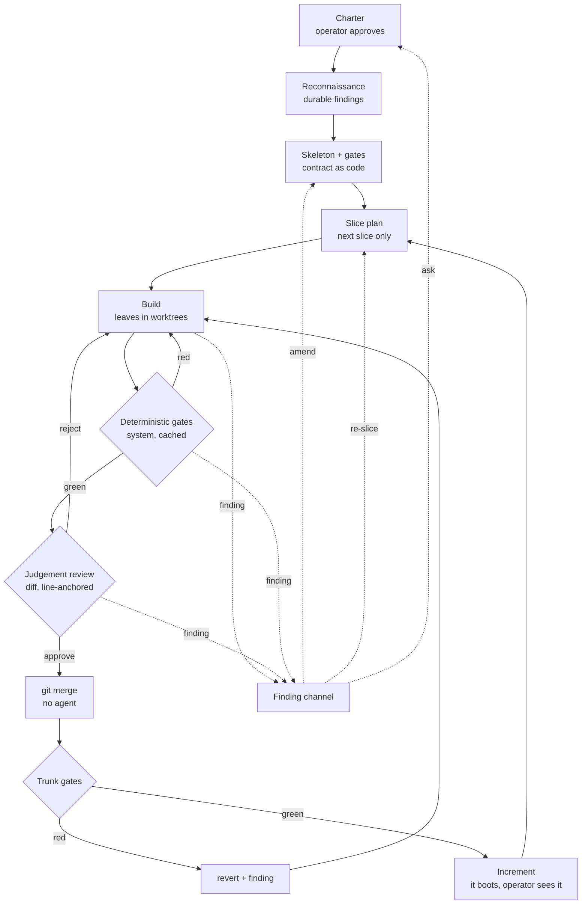
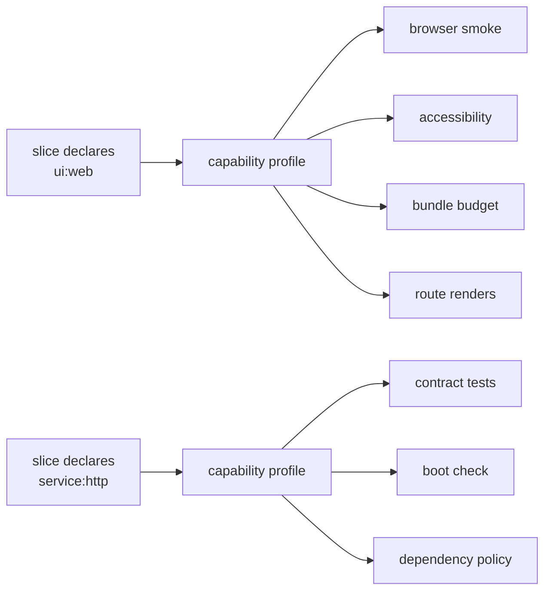
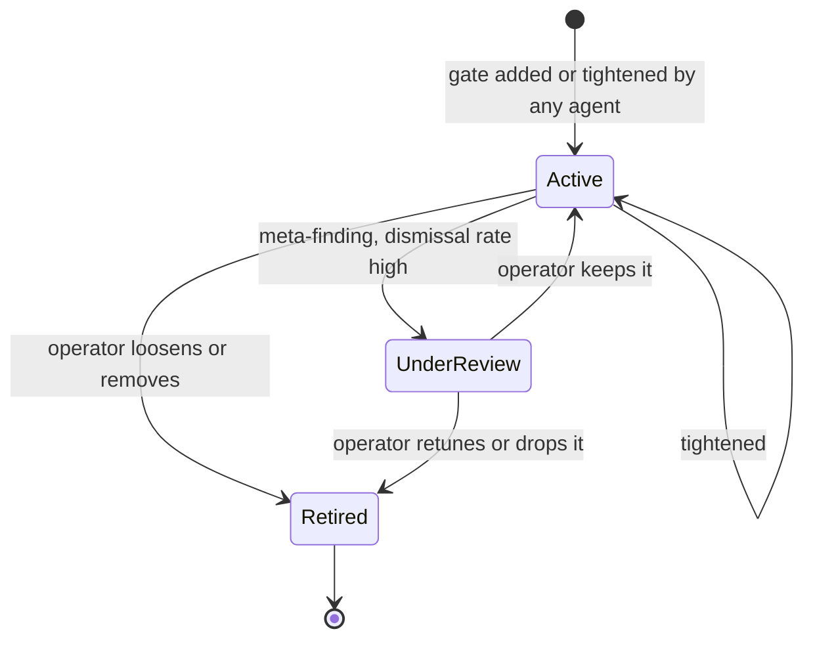
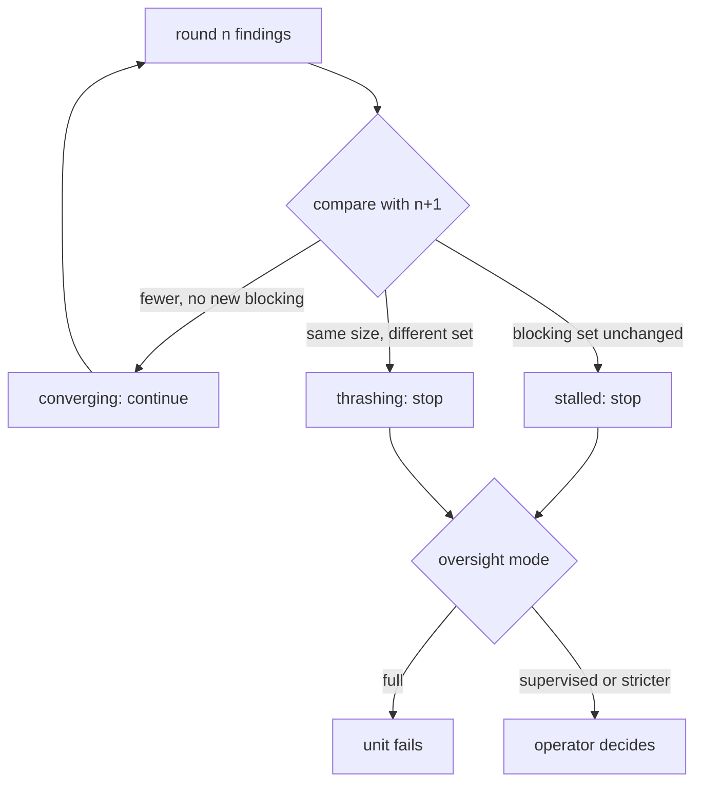

# The Build Loop

How an objective becomes working software: the stages, who owns each decision,
what runs mechanically, what needs judgement, and what reaches the operator.

This page is the authority on the loop. [Coordination](coordination.md) owns
transport and recovery beneath it, [Plan Review](plan-review.md) owns the
charter gate at its head, and [Verification & Quality](verification-quality.md)
owns the review gate's internals. Where any of those describes a stage this page
also describes, this page wins.

!!! warning "Status"

    Designed, not built. The charter gate, worktree isolation, the review gate
    and the reviewer-independence constraints exist today. Reconnaissance, the
    skeleton stage, slice planning, the gate system, the finding channel and
    the machinery budget do not. Driven live against real providers, the
    current loop has never reached assembly.

## The problem

The loop as built is **plan, build, review, assemble**. The whole tree is
planned in one pass from prose, the leaves are built concurrently, and an agent
reconstructs the union at the end by reading its children.

Four mechanisms make parallel software engineering converge rather than
diverge. The loop has none of them.

| Mechanism | Why it is load-bearing | Today |
| --- | --- | --- |
| Probe the unknown first | The plan dies on facts nobody had | The planner researches inside its own session; findings are ephemeral and reach nothing |
| A contract before the work | Parts are only independent if their seams are real | Contracts are prose. The merge brief concedes they "do not survive" implementation |
| A trunk that stays green | Integration risk is paid down continuously | Integration is one phase, at the end, once |
| Work feeds back to the plan | Discovery is the point of doing the work | No path exists. A leaf that learns the plan is wrong has nowhere to say so |

The consequences are measured, not inferred. One assembly spent 1,600,399
prompt tokens against 2,229 completion tokens: 99.86% of its budget re-reading
children it had already read, because each read stays in the conversation and
is re-sent every later turn. Assembly cost is quadratic in what it reads and
fan-in grows with depth, which is indistinguishable from depth itself failing.

A second defect compounds it. A single unit's tests are written by the unit
that wrote the code, so they pass by construction, and nothing between a leaf
and the root ever runs the pieces together.

## Shape



The dotted edges are the mechanism the current loop lacks entirely. Everything
can raise a finding, at any depth, at any time, and a finding is the only thing
that changes the plan.

## Architecture

```d2
direction: right

Operator: Operator

Judgement: {
  label: "Judgement (agents, tokens)"
  Recon: Reconnaissance
  Skeleton: Skeleton owner
  Planner: Slice planner
  Builder: Build units
  Reviewer: Reviewer
  Investigator: Investigator
}

Mechanical: {
  label: "Mechanical (system, no tokens)"
  GateRunner: Gate runner
  Cache: Result cache
  Merger: git merge
  Trunk: Trunk gates
  Budget: Machinery budget
  Boot: Increment boot

  GateRunner -> Cache: "keyed on tree sha"
  Merger -> Trunk
  GateRunner -> Budget: "duration + cost"
}

Findings: Finding channel
Standards: Standards role

Operator -> Judgement.Recon: "approved charter"
Judgement.Recon -> Judgement.Skeleton: "durable facts"
Judgement.Skeleton -> Judgement.Planner: "contract + gate config"
Judgement.Planner -> Judgement.Builder: "slice"
Judgement.Builder -> Mechanical.GateRunner: "commit"
Mechanical.Cache -> Judgement.Reviewer: "gate results"
Judgement.Reviewer -> Mechanical.Merger: "approve"
Mechanical.Trunk -> Mechanical.Boot: "green"
Mechanical.Boot -> Operator: "running software + prose"

Mechanical.Trunk -> Findings: "red trunk"
Mechanical.GateRunner -> Findings: "gate failure"
Judgement.Reviewer -> Findings: "defect"
Judgement.Builder -> Findings: "blocked-by-fact"
Mechanical.Budget -> Standards: "budget breach"
Standards -> Findings: "gate is the defect"
Findings -> Judgement.Investigator: "second failure"
Findings -> Judgement.Skeleton: "contract-wrong"
Findings -> Judgement.Planner: "re-slice"
Findings -> Operator: "needs-human"
```

The left column costs tokens and produces judgement. The right column costs
seconds and produces facts. Every arrow crossing from right to left carries
evidence; no arrow crossing from left to right carries an unverified claim.

## Two kinds of check

Almost every question about the loop resolves once these are separated.

| | Deterministic gate | Judgement review |
| --- | --- | --- |
| Examples | format, lint, types, tests, coverage, dependency policy, build, boot | is this right, done well, the thing that was asked for |
| Cost | seconds, no tokens | minutes, tokens |
| Repeatable | yes, and cacheable | no |
| Runs | on every commit | once per proposed change |
| Owner | the system | an agent |

**Nothing reaches a judgement reviewer until every deterministic gate is
green.** A reviewer spending tokens to notice that a file was never formatted is
the most expensive linter ever built.

The system runs every deterministic check. Agents write tests; agents never
report their results. An agent-reported pass is a claim, and the loop already
says so in the words it hands back on rework: a claim that the tests pass is
not evidence that they do.

## Stages

### Charter

Unchanged from [Plan Review](plan-review.md). An interview produces a charter
with objectives and acceptance criteria; the operator approves it; that approval
authorises the work and the spend behind it. Scope is the operator's decision at
every autonomy level, including `full`.

### Reconnaissance

A bounded stage before planning, answering only the questions whose answers
would change the plan. Can this library do what the objective needs. What is
already in the repository. What shape is the API that must be integrated with.

Output is a **findings document**, durable and versioned, and it is the set of
facts the plan is permitted to assume. It is not code.

This is where a discovery that invalidates the approach is supposed to land:
cheaply, before a hundred units are planned on top of it. Today that discovery
happens at a leaf, four levels deep, with nowhere to go.

Reconnaissance runs again whenever a finding invalidates one of its facts.

### Skeleton and gates

One agent, working serially, commits a compiling skeleton to the trunk:

- module layout and type signatures
- one failing test per acceptance criterion
- the project's own gate configuration

**The contract becomes code.** A leaf's brief stops being a paragraph and
becomes a signature plus a failing test that must pass. Two leaves implementing
against the same skeleton touch disjoint files, so their union is a three-way
git merge rather than a reconstruction.

The gate configuration is part of the skeleton because a definition of done
with nowhere to live is a definition of done nobody enforces. It carries the
linter, the formatter, the test runner, the coverage floor, the dependency
policy, and the command that boots the result.

The skeleton is small by construction, which is what makes it reviewable.

### Slice planning

Plan the next slice, not the whole tree. A slice is the set of units that can
run concurrently against the current trunk.

Depth becomes emergent rather than a parameter. Each slice is planned with
everything the previous slice learned, so the moment of maximum ignorance is
never the moment the whole structure is decided.

A static hundred-item tree planned in one pass is waterfall applied
recursively.

### Build

Each unit gets a git worktree off the current trunk commit and its own
container. Unchanged from today, and this part works.

A unit is done when the skeleton's failing test for it passes and nothing else
broke. That is mechanically checkable and it is not a paragraph.

### Gates

Every check is content-addressed on `(check_id, tree_sha, config_sha)` and
cached. A leaf is a commit, so the tree hash is free.

Caching is not an optimisation here, it is what makes the trunk invariant
affordable. Without it, *N* leaves merging in a slice run the full suite *N*
times.

Gate results are attributable and signed by the runner. A reviewer reads them;
it never runs the tests itself.

### Review

The reviewer is shown three things: **the diff** between the leaf's head and the
trunk commit it branched from, the cached gate results, and the acceptance
criteria.

It reads, it runs nothing, it writes nothing, and it files one verdict with
findings. The author fixes. A reviewer that edits becomes an author, and the
independence the database constraint protects evaporates while the constraint
still passes.

Reviewer selection and session narrowing are unchanged; see
[Verification & Quality](verification-quality.md).

### Merge

**No agent merges.** On approval the coordinator runs `git merge`. Clean merge
plus a green trunk suite completes the unit. A conflict or a red trunk is a
finding routed to the author, with the conflict as its evidence.

Git's line-based merge invents conflicts between changes that do not collide:
two units adding different functions to the same file overlap in line ranges.
An entity-level merge driver, installed through `.gitattributes` and parsing
with tree-sitter, resolves those without an agent. What remains is a real
collision, which genuinely needs an author.

### Trunk gates and the revert rule

The trunk is green at all times. That invariant is what makes concurrent
leaves safe.

A unit that merges cleanly into a green trunk and turns it red owns that
failure, because its change is the delta. It is reverted immediately, which
restores the trunk in seconds, and its author receives a finding carrying the
failing test and the sibling diff it collided with.

Where the author cannot resolve it, the finding is promoted to
`contract-wrong`: the skeleton permitted two units to make incompatible
assumptions, which is a planning defect, not an implementation one.

No merge algorithm detects this class. Generated unit tests detect roughly a
third of semantic conflicts, so tests are necessary and not sufficient; the
remainder is caught by the skeleton's intentional per-criterion tests and by
review against the contract.

### Increment

Every slice ends with the software **booting**, in a container, reachable.

For an operator who does not read code this is the highest-signal check that
exists: an application that serves a page has cleared a bar no unit test does.
It is also the only review artefact that needs no translation.

## Ownership

Every decision has exactly one owner. Two owners is a silent override; zero is
a deadlock. See [Single-Owner Decisions](../reference/single-owner-decisions.md).

| Decision | Owner | Escalates to |
| --- | --- | --- |
| What we are building | operator, at charter | never delegated |
| What the facts are | reconnaissance | re-runs on an invalidating finding |
| The contract | skeleton owner | operator on a second `contract-wrong` for one interface |
| What a slice contains | slice planner | operator when a finding empties it |
| Which gates apply | derived from declared capability | operator, when a capability profile is authored |
| Tightening or adding a gate | any agent | never |
| Loosening or removing a gate | operator only | never |
| Whether a unit is done | gates, then the reviewer | operator when review stalls, at `supervised` and stricter |
| Whether it merges | the system | the author, when the merge conflicts or the trunk goes red |
| Whether the machinery is healthy | the standards role | operator on a budget breach |
| Whether a gate earns its keep | the meta-finding rule | operator |

The asymmetry in the two gate rows is load-bearing. An agent blocked by a gate
will always prefer to weaken it, so the ratchet turns one way: agents may
tighten, only an operator may loosen.

## The gate system

### Capabilities derive gates

A slice declares what it produces. The gate profile follows from that
declaration; nobody decides it per project.



A prototype forty rounds in that gains a web interface does not require anyone
to notice that browser testing is now needed. The slice declares `ui:web` and
the profile brings its gates. What an operator decides is whether a capability
profile is right, once, when the profile is authored, and never per build.

### The ratchet



Gates enter freely and leave only through an operator. A gate that blocks work
is doing its job; an agent that could remove it would.

### Gates are memories of mistakes

Every gate exists because something went wrong once. A defect whose root cause
is a **class** of mistake rather than an instance ships with the gate that
would have caught it. This is the existing convention-rollout rule generalised
past conventions: the investigation that found the defect proposes the gate.

Where a lesson is mechanical it becomes a gate. Where it is judgement it
becomes a line in a brief or a class of finding. Nothing that was learned
stays only in a transcript.

### Meta-findings

A gate that fires and is repeatedly dismissed is a defect in the gate.

Dismissals and true positives are counted per gate. A gate whose dismissal rate
crosses its threshold raises a **meta-finding** proposing a retune, which an
operator settles. This is measurable, so nobody has to notice by hand that a
check has stopped earning its cost.

Thresholds are tiered rather than flat. A single number applied everywhere
flags the harmless and passes the harmful; a gate declares what property it
proxies for and both of its failure modes.

## The finding channel

One stream, two producers, one shape. A lint error already carries a file and a
line; so does a failing test frame; so does a reviewer's observation. The author
works from one list and does not care which produced each entry.

### Classes

| Class | Meaning | Lands on |
| --- | --- | --- |
| `defect` | this unit is wrong | the author |
| `contract-wrong` | the skeleton cannot express what is needed | the skeleton owner |
| `blocked-by-fact` | a fact the plan assumed is false | reconnaissance, then the slice planner |
| `scope-conflict` | two units both claim the same ground | the slice planner |
| `needs-human` | a question only the operator can settle | the operator |

`blocked-by-fact` is the one the current design cannot express at all. It is
what an agent four levels deep has when it discovers the library cannot do the
thing the whole approach rests on.

### Anchoring

A finding carries a path and a line range within the diff under review. This is
not presentation. A finding pointing outside the diff is about code this unit
did not write and is subtracted automatically, the same way an output-policy
guard subtracts findings a file already carried.

### Convergence

Findings are keyed on `(path, line_range, severity, criterion)`, which makes
rounds comparable.



A fixed round count cannot tell those three apart, and thrashing is the one it
is blind to: an author fixing one thing while breaking another produces the
same number of findings every round and never converges.

A hard ceiling remains as a spend backstop. The normal exit is the progress
test, and the loop records **which** ended it, because running out of budget
and ceasing to converge are different diagnoses.

## The machinery budget

Nobody watches the tools unless something is watching the tools.

Every gate run records duration and cost against its content-addressed key. A
slice carries budgets: wall clock for its gate suite, tokens per delivered
unit, rework rounds, cache hit rate.

**A budget breach is a defect with an owner, not a cost to absorb.** When a
gate suite outgrows its budget the gate configuration is what is wrong, and the
finding belongs to the standards role rather than to whichever unit happened to
trip it.

The same organ answers the questions nobody else asks: whether the tests
have become slow, whether spend per delivered unit is drifting, whether the
cache is being missed, whether rework rounds are climbing.

## Autonomy, and what reaches a human

An operator cannot be assumed to read code. What reaches them is never a diff:
it is plain language plus the running software.

The ladder is over decision classes, not artefacts.

| Decision class | `locked` | `supervised` | `semi` | `full` |
| --- | --- | --- | --- | --- |
| Scope | human | human | human | human |
| Irreversible or outward | human | human | human | human |
| New dependency or external call | human | human | automatic, logged | automatic, logged |
| Contract shape | human | human, as prose | agent | agent |
| Code quality | human | gates and agent | gates and agent | gates and agent |
| Merge | human | automatic when green | automatic | automatic |
| A stalled review | human | human | human | unit fails |

Scope and irreversible actions stay with the operator at every level, `full`
included. That is what makes `full` safe to offer.

At `supervised` a skeleton is presented as prose: what the software will do,
which dependencies it gains, whether it reaches anything outside. Not a diff.

## Who investigates

Nobody investigates today. A failure becomes a status and the loop moves on.

An **investigation** is dispatched automatically on the second failure of
anything: a unit that failed twice, a trunk that went red twice on one
interface, a gate that fires without being understood. Its output is a finding,
never code, and its cost is one session.

The alternative is what the current loop does, which is to hand a failure to
whoever is next and hope.

## The failure classes this answers

The design is not derived from first principles. It is derived from a corpus of
recorded corrections: 285 written-down lessons and 127 substantial session
transcripts of a human supervising agents on this codebase. Every class below
is a thing a human had to say out loud, and each one names the mechanism here
that removes the need to say it again.

| Class | What it looks like | Mechanism |
| --- | --- | --- |
| **Verification honesty** | A setting is changed, it parses, success is reported, and the value never reached the wire | The system runs every deterministic check; an agent-reported result is never evidence |
| **Premature advancement** | A stage opens before its prerequisites reported. *"Why did you open the PR if not all agents reported?"* | A slice does not close until every unit in it has a terminal outcome |
| **Unauthorised mutation** | An irreversible action taken without being asked for | Irreversible and outward decisions stay with the operator at every autonomy level |
| **Scope integrity** | The job quietly shrinks when it gets hard, and the shrink is reported as prudence | A finding is the only way scope changes, and it is recorded |
| **Machinery health** | Nobody notices that the checks have become slow or stopped earning their cost | The machinery budget, and the meta-finding on dismissal rate |
| **Change amplification** | Adding a route in the right file and the wrong registry: it type-checks, it lints, it passes every gate, and it serves 404 | The gate config is part of the contract, so a capability declares the whole set of things that must move together |
| **Knowledge loss** | The same environment trap is rediscovered every session | A lesson that is mechanical becomes a gate; one that is judgement becomes a brief line. Neither stays only in a transcript |

Two of these were reproduced while writing this page, which is the argument for
taking them seriously rather than a coincidence worth mentioning.

A fan-out of seven agents shared one helper script. One agent rewrote it with a
version that read the wrong field, so it emitted nothing. Six agents hit the
resulting empty output and reported nothing wrong; one escalated and asked
whether the input was the right shape, and that single escalation is the only
reason the defect was found before every agent returned a confident, empty
answer. **Six of seven treated a broken tool as a clean result.**

The same script then crashed part-way through each file on an encoding error,
truncating its output. A partial crash and a genuinely empty file are
indistinguishable to the caller.

Both are the same shape, and it is the shape the loop must refuse: **a check
whose failure is indistinguishable from its pass.** Every gate here therefore
reports three outcomes rather than two, and an outcome that cannot be
established fails closed. Shared mutable state between concurrently-running
units is refused for the same reason: a unit that can damage a sibling's inputs
produces a result that reads exactly like a measurement.

## What is deleted

- The assembly agent and the reconstruct-by-reading merge.
- Whole-tree planning in one pass.
- Depth as a configured parameter.
- The fixed rework-round count as the only exit.
- Agent-reported build and test results as evidence.

## Open questions

1. **Who authors the gate configuration.** Generating a project's linter, test
   runner and CI definition is itself work, and an agent that writes gates can
   weaken them. The ratchet covers loosening an existing gate; it does not
   cover authoring a weak one in the first place.
2. **Whether reconnaissance findings reach the reviewer.** It would improve
   review quality and it re-opens the quadratic context cost that made assembly
   unaffordable.
3. **Work that is green on every gate and is not what was wanted.** No gate
   catches it and the reviewer probably cannot either. The increment is the only
   thing that surfaces it, which argues for shipping slices small and early
   rather than getting them right.
