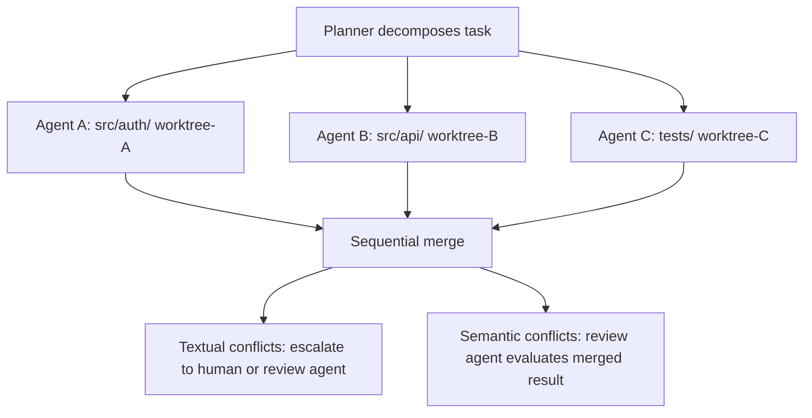

# Coordination & Resilience

This page covers system-level features that span multiple agents and protect against failure: crash recovery with checkpoint resume, graceful shutdown strategies, concurrent workspace isolation (Git worktrees / virtual filesystem / per-branch), and multi-agent coordination topology (centralised, decentralised, context-dependent dispatchers).

## Agent Crash Recovery

When an agent execution fails unexpectedly (unhandled exception, OOM, process
kill), the framework applies a recovery mechanism. Recovery strategies are
implemented behind a `RecoveryStrategy` protocol, making the system pluggable.

### RecoveryStrategy Protocol

| Method | Signature | Description |
|--------|-----------|-------------|
| `recover` | `async def recover(*, task_execution, error_message, context) -> RecoveryResult` | Apply recovery to a failed task execution |
| `finalize` | `async def finalize(execution_id) -> None` | Post-resume cleanup hook called after a successful (non-ERROR) resume; clears strategy-specific state. No-op by default |
| `get_strategy_type` | `def get_strategy_type() -> str` | Return strategy type identifier (must not be empty) |

### RecoveryResult Model

| Field | Type | Description |
|-------|------|-------------|
| `task_execution` | `TaskExecution` | Updated execution after recovery (typically `FAILED`) |
| `strategy_type` | `NotBlankStr` | Strategy identifier |
| `context_snapshot` | `AgentContextSnapshot` | Redacted snapshot (turn count, accumulated cost, message count, max turns; no message contents) |
| `error_message` | `NotBlankStr` | Error that triggered recovery |
| `failure_category` | `FailureCategory` | Machine-readable classification (`TOOL_FAILURE`, `STAGNATION`, `BUDGET_EXCEEDED`, `QUALITY_GATE_FAILED`, `TIMEOUT`, `DELEGATION_FAILED`, `PROVIDER_REFUSED`, `PROVIDER_UNAVAILABLE`, `UNKNOWN`) |
| `failure_context` | `dict[str, Any]` | Structured strategy-specific failure metadata (deep-copied at construction; defaults to `{}`) |
| `criteria_failed` | `tuple[NotBlankStr, ...]` | Acceptance criteria that were not met (unique; validated on construction) |
| `stagnation_evidence` | `StagnationResult \| None` | Stagnation detection result when applicable |
| `checkpoint_context_json` | `str \| None` | Serialised `AgentContext` for resume (`None` for non-checkpoint strategies) |
| `resume_attempt` | `int` (ge=0) | Current resume attempt number (0 when not resuming) |
| `can_resume` | `bool` (computed) | `checkpoint_context_json is not None` |
| `can_reassign` | `bool` (computed) | `retry_count < task.max_retries` |

`failure_category` is decided by `synthorg.engine.failure_classification`, and the typed cause outranks the prose. When the run terminated on a `ProviderError`, the exception class IS the classification. There is exactly one typed entry point, `category_for_error_type()`, because a frozen `ExecutionResult` cannot carry a live exception and every consumer downstream of it holds a class name and nothing else; a second entry point taking the exception would only be an answer that could disagree. The loop writes that name through `recorded_error_type()`, which unwraps the `RetryExhaustedError` the retry handler re-raises every retryable error as, so a timeout is recorded as a timeout rather than as the fact that we retried. The name resolves back to its class and is matched with `issubclass`, so a subclass is not a stranger: `ProviderImageGenerationUnsupportedError` is an `InvalidRequestError` and diagnoses as one. The split is what an operator does next: `PROVIDER_REFUSED` means the provider understood the request and rejected it (a bad parameter, an unknown model, a content filter, a credential, a depleted quota), so retrying reproduces it and the fix is a configuration change; `PROVIDER_UNAVAILABLE` means it could not answer right now (connection, 5xx, rate limit), so the same request may well succeed later.

Only when there is no typed cause does `infer_failure_category()` sniff keywords from the message. `UNKNOWN` is the deliberate default when no rule matches; an honest classification is more useful than a silent `TOOL_FAILURE` lie that would masquerade unknown causes in dashboards, reports, and reconciliation prompts. Checkpoint reconciliation messages include the category and any unmet criteria (both passed through `sanitize_message` to strip paths, URLs, and prompt-injection markers) so the resumed agent has structured context about what failed without carrying leaked secrets.

Attribution follows the same reasoning: both provider categories score as `coordination_overhead`, never `direct`, because the provider never answered and the agent's work was never scored. Blaming an agent for a credential or an outage would corrupt every downstream contribution metric.

**Cross-field invariants.** `RecoveryResult` enforces two cross-field rules at construction:

- `stagnation_evidence` is set iff `failure_category` is `STAGNATION` (and the evidence verdict must not be `NO_STAGNATION`; evidence that the detector ruled out stagnation cannot back a STAGNATION result).
- `criteria_failed` must be non-empty when `failure_category` is `QUALITY_GATE_FAILED`.

Strategies that only have an error string (`FailAndReassignStrategy`, `CheckpointRecoveryStrategy._build_resume_result`) use `infer_failure_category_without_evidence()`, which clamps `STAGNATION` / `QUALITY_GATE_FAILED` to `UNKNOWN`; the unclamped helper would crash construction on any error message containing the keywords "stagnation", "quality", or "criteria" because those strategies cannot supply the required sidecar data.

**Transition-reason wire format.** After a recovery, the post-execution pipeline embeds `failure_category` (and a sanitized summary of `criteria_failed` when present) into the task-status transition reason as `"Post-recovery status: <status> (failure_category=<value>[, unmet_criteria=<summary>])"`.  The `(failure_category=<value>)` suffix is a hook for downstream consumers (e.g. routing / reassignment components) to read category metadata from status history without re-parsing the raw error message. The key name (`failure_category`) and value format are a stable contract: future consumers will depend on it, so changes require a coordinated rollout.

**State-transition log timing.** Per CLAUDE.md, every persisted status hop emits an INFO-level `*_STATUS_TRANSITIONED` event (`WORKFLOW_EXEC_STATUS_TRANSITIONED`, `WORKFLOW_EXEC_NODE_STATUS_TRANSITIONED`) **after** persistence succeeds. A save failure raises before the log fires, so the audit trail only ever records transitions that actually landed; this avoids the "phantom transition" failure mode where a `VersionConflictError` would otherwise leave a log entry showing a hop that the database never accepted. The bootstrap `PENDING -> RUNNING` state is set inline during initial execution creation in `WorkflowExecutionService` rather than as a persisted transition, so no separate event fires for that hop; the persisted hops covered by the transition log today are the three terminal ones (`RUNNING -> COMPLETED` / `-> FAILED` / `-> CANCELLED`). Subsystems that also emit a terminal-state event (`WORKFLOW_EXEC_COMPLETED`, `WORKFLOW_EXEC_FAILED`, `WORKFLOW_EXEC_CANCELLED`) keep those for final-hop summaries; the transition-log event is the cross-hop audit-stream entry carrying `from_status` / `to_status` / identifiers.

### Recovery Strategies

=== "Strategy 1: Fail-and-Reassign"

    **Default / MVP**

    The engine catches the failure at its outermost boundary, logs a redacted
    `AgentContext` snapshot (turn count, accumulated cost; excluding message
    contents to avoid leaking sensitive prompts/tool outputs), transitions the
    task to `FAILED`, and makes it available for reassignment (manual or
    automatic via the task router).

    ```yaml
    recovery:
      strategy: "fail_reassign"            # fail_reassign, checkpoint
    ```

    - Simple, no persistence dependency
    - All progress is lost on crash; acceptable for short single-agent tasks

    On crash:

    1. Catch exception at the `AgentEngine` boundary (outermost `try/except`
       in `AgentEngine.run()`)
    2. Log at ERROR with redacted `AgentContextSnapshot` (turn count,
       accumulated cost, message count, max turns; message contents excluded)
    3. Transition `TaskExecution` -> `FAILED` with the exception as the failure
       reason
    4. `RecoveryResult.can_reassign` reports whether `retry_count < max_retries`

    !!! info
        The `can_reassign` flag is computed and returned in `RecoveryResult`.
        The caller (task router) is responsible for incrementing `retry_count`
        when creating the next `TaskExecution`.

=== "Strategy 2: Checkpoint Recovery"

    The engine persists an `AgentContext` snapshot after each completed turn. On
    crash, the framework detects the failure (via heartbeat timeout or
    exception), loads the last checkpoint, and resumes execution from the exact
    turn where it left off. The immutable `model_copy(update=...)` pattern makes
    checkpointing trivial; each `AgentContext` is a complete, self-contained
    frozen state that serialises cleanly via `model_dump_json()`.

    ```yaml
    recovery:
      strategy: "checkpoint"
    ```

    The checkpoint tuning parameters (`persist_every_n_turns`,
    `heartbeat_interval_seconds`, `max_resume_attempts`) live on the
    `CheckpointConfig` under `recovery.checkpoint`, alongside the
    `strategy` selector. The injected `CheckpointRepository` and
    `HeartbeatRepository` come from the active persistence backend, so
    selecting `strategy: "checkpoint"` without a connected persistence
    backend fails fast at boot.

    ```yaml
    recovery:
      strategy: "checkpoint"
      checkpoint:
        persist_every_n_turns: 5
        max_resume_attempts: 3
    ```

    - Preserves progress; critical for long tasks (multi-step plans,
      epic-level work)
    - Requires persistence layer and reconciliation message on resume
    - Natural fit with the existing immutable state model

    When resuming from a checkpoint, the agent receives a system message
    informing it of the resume point (turn number) and the error that triggered
    recovery. This reconciliation message allows the agent to review its
    progress and adapt. Reconciliation currently conveys the resume point and
    the triggering error; it does not include workspace change detection.

=== "Lightweight Alternative: Session Replay"

    `Session.replay()` (`engine/session.py`) provides a lighter-weight
    alternative to full checkpoint/resume. It reconstructs `AgentContext`
    from the observability event log rather than from a persisted checkpoint
    snapshot.

    - **Read-only reconstruction**: replays turn count, accumulated cost,
      and task status transitions, but not full conversation history
      (events do not store message content; turns are represented as
      placeholder messages).
    - **No persistence dependency**: relies on whichever observability sink
      the operator configured (structlog file, OTLP backend, Postgres).
    - **Partial**: `ReplayResult.replay_completeness` (0.0 to 1.0) indicates
      how much state was recovered.
    - **Use case**: recovery after brain failure when checkpoint persistence
      is not configured or the checkpoint is stale.

    See [Brain / Hands / Session](agent-execution.md#brain-hands-session) for the full
    architecture.

## Graceful Shutdown Protocol

When the process receives SIGTERM/SIGINT (user Ctrl+C, Docker stop, systemd
shutdown), the framework stops cleanly without losing work or leaking costs.
Shutdown strategies are implemented behind a `ShutdownStrategy` protocol.

Shutdown-time `SUSPENDED` is distinct from the in-process `PARKED` state used
when an agent waits for human approval; see
[Approval Timeout Policy](security.md#approval-timeout-policy) for the
agent-driven parking mechanism.

### Who owns the signal

Stopping the process has exactly one owner: the ASGI server. Observing the
signal early has another: `api/signals.py`, which flags
`AppState.shutdown_requested` and closes the cooperative drain gate the moment
SIGTERM arrives, so subsystems can leave at a turn boundary instead of being
cancelled mid-call.

Those two cannot both hold the handler. `loop.add_signal_handler` **replaces**
whatever is registered, uvicorn registers its `handle_exit` before it runs the
app, and the app's lifespan startup is what installs ours, so ours lands second
and uvicorn's is gone. An early-observation handler that does not pass the
signal on therefore silently becomes the only owner of a job it does not do:
the process logs the signal, keeps working, and is SIGKILLed when the
orchestrator's grace period expires, with no teardown at all.

So the entry point that owns the server registers it as the chain
(`set_shutdown_chain`), the handler hands the signal on after setting the early
flag, and **absent a chain the handlers are not installed** and uvicorn's own
are left intact. That is why `api/server.py` builds `uvicorn.Server` itself for
the single-process topology rather than calling `uvicorn.run`, which keeps the
server object internal and leaves nothing to chain to. A reload supervisor or
worker pool registers no chain: the supervisor owns signals there and forwards
them to its children.

### No operator-triggered restart

There is no restart endpoint, and no "saved but not in effect" state for one to
resolve. A setting is either fixed by the deployment (rejected on write, shown
read-only) or applied while the system runs; see
[Subsystem Reconciliation](subsystem-reconciliation.md) and
[Configuration Precedence](../reference/configuration-precedence.md).

Shutdown still matters, because the container runtime performs one: a
`docker stop` or an image update raises `SIGTERM` and the cooperative drain
below runs. The compose file's `restart: unless-stopped` is what brings a
crashed process back, and nothing inside the product asks for that.

### Resuming what a stop interrupted

Shutting down cleanly is half the promise. The other half is that the work
comes back, and until run recovery existed it did not: a plan's waves are
driven by a background task created when an operator approves the plan, so
once that task was gone nothing anywhere asked again whether the plan still
needed driving. A restart left subtasks at `in_progress`, the plan at
`executing`, and the board showing work in flight with nothing behind it,
permanently.

`RunRecoveryReconciler` (`engine/run_recovery/`) answers that on the same
shape the subsystem reconciler uses for wiring: boot is the first pass, the
cadence (`engine.run_recovery_resync_interval_seconds`, which
`engine.run_recovery_sweep_paused` halts) repeats the same idempotent
question, and every plan status gets an answer.

| plan status | what recovery does |
| --- | --- |
| `COMPLETED` / `REJECTED` / `SUPERSEDED` / `FAILED` | nothing; the plan is finished |
| `DRAFT` / `PENDING_REVIEW` | nothing; it is parked on a person, correctly |
| `PLANNING` | fails it with a reason: its items were being written by the intake pipeline, and the brief they were written from is not recoverable |
| `APPROVED` / `EXECUTING` | requeues the orphaned rows, re-judges any task left `IN_REVIEW` that no open human decision is waiting on, then hands the remaining waves back to the coordinator |
| `INTEGRATING` / `EVALUATING` | one rollup pass; the tail stages key on an id derived from the plan and read their own state, so they re-drive themselves |

Every pass also retires **orphaned approvals**, which the table above cannot
cover: an approval names a task, and a plan-status walk only ever reaches
approvals whose plan is still there. A live run ended holding approvals whose
task, plan and project had all been deleted, so they sat in the operator's
queue naming work that no longer existed and nothing could ever settle them.
`retire_orphaned_approvals` (`engine/run_recovery/orphan_approvals.py`) closes
any pending approval whose `task_id` no longer resolves, as `EXPIRED` rather
than `REJECTED`: nobody declined it, the thing it was about stopped existing.
The write is compare-and-set on the pending state, so an operator deciding the
same approval in that moment wins and the sweep leaves it alone.

Five properties are load-bearing:

**A review nobody is waiting on is re-judged, not left.** `IN_REVIEW` is the
one status a plan-level sweep cannot fix by re-driving waves: the row is not
awaiting dispatch and not dead, it is waiting on a judging session that no
longer exists. `_rejudge_stranded_reviews` re-invokes the gates for exactly
those rows, and only those: a task with an open human decision against it is
waiting correctly and is left alone, because re-judging it would decide a
question somebody was asked.

**A resumed wave dispatches what is left, not what the plan wanted.** Waves are
rebuilt from the plan's items, which record the goal rather than the history,
so a resumed run re-proposes every level including the finished ones.
`gate_wave` therefore narrows on three grounds rather than one: what can deliver
(its dependencies arrived), what still awaits dispatch (no outcome yet), and
what is held back without being parked (an input someone will still release). A
wave left with nothing because everything already delivered records a
**successful** phase; only a wave emptied by inputs that died records the
failed one. Confusing the two fails a plan for having made progress.

**Requeueing writes `INTERRUPTED`**, which is the status that says what
happened and the one the lifecycle already documented as eligible for
reassignment on restart. The objective task is left alone (the rollup derives
its status from the items, and a second author of one value is its own defect);
the assembly task is requeued, because nothing else would move it and the tail
would read it as `RUNNING` for ever.

**One driver per plan.** `LiveRunLedger` is claimed by the approval path and by
the sweep alike, so neither can start a second driver on a plan the other is
already building; two drivers assign the same subtasks, the engine refuses the
second, and the wave that lost fails the plan it was helping. The ledger is
in-process by construction and claims nothing about another process, so a
deployment running distributed workers requeues nothing at all: JetStream
redelivery of an unacknowledged claim already owns recovering a dead runner
there, and a second answer could move a row a live worker still holds.

**Whether a plan was resumed is the driver's answer, not the sweep's.** The
driver declines whenever it cannot start one: no coordinator is wired yet, or
the objective task the plan hangs off no longer exists. The first is transient
and the next pass picks it up; the second never resolves, so a sweep that
counted the call as a resume reported one every cadence, for ever, while
nothing touched the plan. `PlanDriver` returns whether a drive now owns the
plan and the sweep reports a skip when it does not, which is what makes a
permanently undrivable run visible instead of continuously rescued.

Because recovery exists, a dispatch cancelled by a **stopping process** is left
exactly as it is rather than failed: the next boot pass finds it and resumes
it. Any other cancellation keeps the old compensation, since nothing is coming
for it. The signal separating them is `AppState.shutdown_requested`, set by the
handler above before the server is told.

### Strategy 1: Cooperative with Timeout (Default / MVP)

The engine sets a shutdown event, stops accepting new tasks, and gives in-flight
agents a grace period to finish their current turn. Agents check the shutdown
event at turn boundaries (between LLM calls, before tool invocations) and exit
cooperatively. After the grace period, remaining agents are force-cancelled.
**All tasks terminated by this strategy (whether they exited cooperatively or
were force-cancelled) are marked `INTERRUPTED`** by the engine layer.
(Strategy 4 uses `SUSPENDED` for successfully checkpointed tasks instead;
see [Strategy 4](#strategy-4-checkpoint-and-stop).)

```yaml
graceful_shutdown:
  strategy: "cooperative_timeout"    # cooperative_timeout, immediate, finish_tool, checkpoint
  grace_seconds: 30                  # time for agents to finish cooperatively
  cleanup_seconds: 5                 # time for final cleanup (persist cost records, close connections)
```

On shutdown signal:

1. Set `shutdown_event` (`asyncio.Event`); agents check this at turn
   boundaries
2. Stop accepting new tasks (drain gate closes)
3. Wait up to `grace_seconds` for agents to exit cooperatively
4. Force-cancel remaining agents (`task.cancel()`); tasks transition to
   `INTERRUPTED`
5. Cleanup phase (`cleanup_seconds`): persist cost records, close provider
   connections, flush logs

!!! info "INTERRUPTED status"
    `INTERRUPTED` indicates the task was stopped due to process shutdown
    (regardless of whether the agent exited cooperatively or was force-cancelled)
    and is eligible for manual or automatic reassignment on restart. Valid
    transitions: `ASSIGNED -> INTERRUPTED`, `IN_PROGRESS -> INTERRUPTED`,
    `INTERRUPTED -> ASSIGNED`, `INTERRUPTED -> CANCELLED`. The direct
    `CANCELLED` is what gives the status an exit a writer can always take:
    reassignment needs an assignee the task may never have had, abandonment
    needs nothing.

!!! tip "Cross-platform compatibility"
    `loop.add_signal_handler()` is not supported on Windows. The implementation
    uses `signal.signal()` as a fallback. SIGINT (Ctrl+C) works cross-platform;
    SIGTERM on Windows requires `os.kill()`.

!!! warning "In-flight LLM cost leakage"
    Non-streaming API calls that are interrupted result in tokens billed but no
    response received (silent cost leak). The engine logs request start (with
    input token count) before each provider call, so interrupted calls have at
    minimum an input-cost audit record. Streaming calls are charged only for
    tokens sent before disconnect.

### Strategy 2: Immediate Cancel

All agent tasks are cancelled immediately via `task.cancel()` with no grace
period. Quickest shutdown but highest data loss; partial tool side effects,
billed-but-lost LLM responses. Tasks are marked `INTERRUPTED`.

```yaml
graceful_shutdown:
  strategy: "immediate"
  cleanup_seconds: 5
```

### Strategy 3: Finish Current Tool

Like cooperative timeout, but uses a per-tool timeout (default 60s) to allow
the current tool invocation to complete. The execution loop finishes the
current tool before checking shutdown at turn boundaries; this strategy
gives a longer window for that. Tasks that exceed the tool timeout are
force-cancelled and marked `INTERRUPTED`.

```yaml
graceful_shutdown:
  strategy: "finish_tool"
  tool_timeout_seconds: 60
  cleanup_seconds: 5
```

### Strategy 4: Checkpoint and Stop

On shutdown signal, agents checkpoint cooperatively during the grace period.
Stragglers are checkpointed via a `checkpoint_saver` callback, then cancelled.
Successfully checkpointed tasks transition to `SUSPENDED` (not `INTERRUPTED`);
failed checkpoints fall back to `INTERRUPTED`. On restart, the engine loads
checkpoints and resumes execution from the exact point of interruption. This
naturally extends [Checkpoint Recovery](#agent-crash-recovery); the only
difference is whether the checkpoint was written proactively (graceful
shutdown) or loaded from the last turn (crash recovery).

!!! info "SUSPENDED vs INTERRUPTED"
    `SUSPENDED` indicates the task was checkpointed before stop and can resume
    from the exact point of interruption.  `INTERRUPTED` indicates the task was
    stopped without a checkpoint and requires full reassignment. Both are
    non-terminal, and both also carry a direct `CANCELLED`:
    `SUSPENDED -> ASSIGNED | CANCELLED`, `INTERRUPTED -> ASSIGNED | CANCELLED`.

```yaml
graceful_shutdown:
  strategy: "checkpoint"
  grace_seconds: 30
  cleanup_seconds: 5
```

## Concurrent Workspace Isolation

When multiple agents work on the same codebase concurrently, they may need to
edit overlapping files. The framework provides a pluggable
`WorkspaceIsolationStrategy` protocol for managing concurrent file access.

### Strategy 1: Planner + Git Worktrees (Default)

The task planner decomposes work to minimise file overlap across agents. Each
agent operates in its own git worktree (shared `.git` object database,
independent working tree). On completion, branches are merged sequentially.

The backend creates that worktree and the agent opens it through a different
mount, so the worktree has to record its location relatively. That needs a git
new enough to know `worktree.useRelativePaths`, and an older one accepts the
key silently rather than refusing it, so the boot preflight asserts a version
floor rather than only presence; see
[api-startup-lifecycle.md](../reference/api-startup-lifecycle.md#binary-preflight).

This is the dominant industry pattern (used by major coding agent products
and IDE background agents).



???+ example "Workspace isolation configuration"

    ```yaml
    workspace_isolation:
      strategy: "planner_worktrees"      # planner_worktrees, sequential, file_locking
      planner_worktrees:
        max_concurrent_worktrees: 8
        merge_order: "completion"        # completion (first done merges first), priority, manual
        conflict_escalation: "human"     # human, review_agent
        cleanup_on_merge: true
        semantic_analysis:
          enabled: false
          file_extensions: [".py"]
          max_files: 50
          max_file_bytes: 524288
          git_concurrency: 10
          llm_model: null
          llm_temperature: 0.1
          llm_max_tokens: 4096
          llm_max_retries: 2
    ```

- True filesystem isolation; agents cannot overwrite each other's work
- Maximum parallelism during execution; conflicts deferred to merge time
- Leverages mature git infrastructure for merge, diff, and history

### Semantic Conflict Detection

Git merges catch textual conflicts (overlapping edits to the same lines), but
many real-world integration bugs are *semantic* - the merge succeeds textually
yet the combined code is broken. The semantic conflict detection subsystem
analyses merged results to catch these issues before they reach main.

**SemanticAnalyzer protocol and composite pattern.** The `SemanticAnalyzer`
protocol defines a single `analyze(workspace, changed_files, repo_root, base_sources)` method.
The default `CompositeSemanticAnalyzer` dispatches all configured analysers
concurrently via `asyncio.TaskGroup` and deduplicates their combined results,
allowing AST-based checks and optional LLM-based analysis to compose
transparently. Analyser failures are logged and skipped without aborting
the remaining analysers.

**AST-based checks.** Four pure-function checks run against the merged source
without external dependencies:

1. **Removed references** - detects calls or imports referencing names that no
   longer exist in the merged code (e.g., Agent A renames a function, Agent B
   calls the old name).
2. **Signature mismatches** - detects functions whose signatures changed between
   base and merged versions in ways that break existing call sites.
3. **Duplicate definitions** - detects multiple top-level definitions of the
   same name in a single file (e.g., two agents independently add a `process()`
   function that git merges into disjoint hunks).
4. **Import conflicts** - detects conflicting imports of the same name from
   different modules.

**Optional LLM-based analysis.** When `llm_model` is configured in
`SemanticAnalysisConfig`, a provider-backed analyser sends the diff to an LLM
for deeper reasoning about subtle semantic issues that AST checks cannot catch.

**SemanticAnalysisConfig.** A frozen Pydantic model controlling the analysis
pipeline: `enabled` toggle, `file_extensions` filter, `max_files` and
`max_file_bytes` limits to bound analysis cost, `git_concurrency` to cap
concurrent `git show` subprocess fan-out, and LLM-specific settings
(`llm_model`, `llm_temperature`, `llm_max_tokens`, `llm_max_retries`).

**Flow through MergeResult and MergeOrchestrator.** After a textually
successful merge, the `MergeOrchestrator` invokes the configured
`SemanticAnalyzer`. Any detected issues are attached to the `MergeResult` as
`semantic_conflicts` (tuple of `MergeConflict` with `conflict_type=SEMANTIC`).
The calling code can then decide whether to accept, revert, or escalate based
on the severity and count of semantic conflicts.

### Future Strategies

Strategy 2: Sequential Dependencies
:   Tasks with overlapping file scopes are ordered sequentially via a dependency
    graph. Prevents conflicts by construction but limits parallelism. Requires
    upfront knowledge of which files a task will touch.

Strategy 3: File-Level Locking
:   Files are locked at task assignment time. Eliminates conflicts at the source
    but requires predicting file access, difficult for LLM agents that
    discover what to edit as they go. Risk of deadlock if multiple agents need
    overlapping file sets.

### State Coordination vs Workspace Isolation

These are complementary systems handling different types of shared state:

| State Type | Coordination | Mechanism |
|-----------|-------------|-----------|
| Framework state (tasks, assignments, budget) | Centralised single-writer (`TaskEngine`) | `model_validate` / `with_transition` via async queue |
| Code and files (agent work output) | Workspace isolation (`WorkspaceIsolationStrategy`) | Git worktrees / branches |
| Agent memory (personal) | Per-agent ownership | Each agent owns its memory exclusively |
| Org memory (shared knowledge) | Single-writer (`OrgMemoryBackend`) | `OrgMemoryBackend` protocol with role-based write access control |

### Worktree Disk Quota

Per-worktree disk usage limits with a background watcher that emits warning
and exceeded events when thresholds are crossed.

**Configuration** (on `PlannerWorktreesConfig`):

| Field | Default | Description |
|-------|---------|-------------|
| `max_disk_gb_per_worktree` | `5.0` | Maximum disk usage in GB per worktree |
| `auto_cleanup_on_threshold` | `True` | Signal cleanup when limit exceeded |
| `cleanup_warning_threshold` | `0.8` | Usage ratio for warning events (0.5-1.0) |

**Watcher** (`DiskQuotaWatcher`): checks worktree disk usage via recursive
directory size computation. Emits `WORKSPACE_DISK_WARNING` at the warning
threshold and `WORKSPACE_DISK_EXCEEDED` at the limit. Does not delete
worktrees directly; signals the `WorkspaceManager` to act.

**Module**: `src/synthorg/engine/workspace/disk_quota.py`

### Persistent Per-Project Workspace and Push Queue Serialisation

Each project gets a 1:1 persistent git-backed working tree on the
runtime volume. `ProjectWorkspaceService.get_or_provision(project_id)`
materialises the working tree under
`<base_root>/projects/<project_id>/` on first touch via the configured
`GitBackend` (`embedded` default; `local_path` / `external_remote` are
opt-in via config). The tree survives across agents, tasks, and
sessions. `GitBackendConfig.kind` is authoritative: a persisted row
whose kind differs from the live config triggers a re-provision under
the new backend and a `WORKSPACE_BACKEND_KIND_CHANGED` log event.

When N agents finish concurrently on one project, their
merge-to-default-branch + push-to-backend operations route through a
per-project FIFO serial queue (`PushQueueCoordinator`) so concurrent
pushes never collide at the git backend. The queue sits in front of
the `WorkspaceIsolationStrategy` seam, so a future virtual-branch
strategy supplies its own `merge_workspace` without changing the
queue. A conflicted merge resolves the caller future without pushing
(the queue refuses to push a broken default branch). `stop()` drains
in flight then exits cleanly; `WorkspacePushError` distinguishes a
forge-rejection push failure from a local `WorkspaceMergeError`.

A workspace outlives its project unless something takes it: the
`project_workspaces` row cascades on the foreign key, disk does not, and a live
run finished with 24 trees under the root, two of them belonging to projects
the operator had deleted during that same run. Deleting a project therefore
discards its managed tree (`discard.py`), and the tree goes BEFORE the row so a
removal that fails takes the delete down with it and leaves a project the
operator can retry; the reverse order would report success over files that are
still there. Only `base_root/projects/<project_id>` is ever removed: a BYO
`LOCAL_PATH` tree is the operator's own directory and is never touched here.

The same layout answers a second question, for the planner rather than the
executor. `inventory.py` renders what a project's workspace actually holds into
the decomposition brief, because the brief's prohibition on assuming files
exist can only stop the planner asserting; it cannot tell it what is true. An
absent workspace and an unlisted one read identically, so absence is stated in
words, and a workspace that exists but cannot be READ is a third answer rather
than a fourth way of saying "empty".

Events emitted: `PROJECT_WORKSPACE_PROVISIONED`,
`PROJECT_WORKSPACE_REUSED`, `PROJECT_WORKSPACE_DISCARDED`,
`PROJECT_WORKSPACE_UNREADABLE`, `WORKSPACE_BACKEND_KIND_CHANGED`,
`WORKSPACE_PATH_TRAVERSAL_REJECTED`,
`WORKSPACE_PUSH_QUEUE_ENQUEUED`, `WORKSPACE_PUSH_QUEUE_MERGED`,
`WORKSPACE_PUSH_QUEUE_FAILED`, `WORKSPACE_PUSH_QUEUE_WORKER_FAILED`.

**Modules**:

- `src/synthorg/engine/workspace/project_workspace_service.py`
- `src/synthorg/engine/workspace/paths.py` (the one definition of the layout)
- `src/synthorg/engine/workspace/discard.py` (removal on project delete)
- `src/synthorg/engine/workspace/inventory.py` (what the planner is told it holds)
- `src/synthorg/engine/workspace/git_backend/` (protocol + 3 strategies + factory)
- `src/synthorg/engine/workspace/push_queue.py`
- `src/synthorg/engine/workspace/service.py` (per-project queue cache + `merge_workspace_with_push`)

### Reproducible per-project environments

Orthogonal to the concurrent workspace isolation above (which arbitrates
simultaneous agent edits to one codebase), this provisions a reproducible
dev environment from committed declarations. Each project declares its dev
environment in committed files so "worked in the agent sandbox" equals
"works on a fresh clone". `EnvironmentService.
get_or_provision(project_id, ...)` resolves the declaration via a
config-selected `EnvironmentStrategy` (`manifest` default; `devcontainer`
and `nix` opt-in), scaffolds a default declaration into a fresh workspace
when absent (`auto_seed`), commits it through `GitWorkspaceCommitter`, and
provisions it once per `(project_id, declaration_hash)` (the persisted
`project_environments` row is the durable cache; a declaration edit
invalidates it). Provisioning is fail-loud: a broken environment never
presents itself as ready.

The bootstrap manifest (`synthorg.env.yaml`) runs its ordered setup
commands into the mounted workspace through whichever sandbox backend the
build/test tool categories resolve to, and emits a stock `bootstrap.sh` so
a fresh clone reproduces with no SynthOrg present; the devcontainer
strategy builds a sealed image (Docker backend only). The provisioned
result threads to the agent's per-tool-call sandbox via the ambient
`ActiveSandboxEnvironment` contextvar (image override + env additions),
bound for the scope of one agent run in the worker execution path. The
override image runs under the existing hardened sandbox host config
(read-only root, `CapDrop: ALL`, `no-new-privileges`).

A transient image build failure (timeout, registry/network hiccup) is
retried with exponential backoff via `GeneralRetryHandler`; a deterministic
build failure (bad Dockerfile) is not. Declaration-sourced env additions
are screened through the sandbox denylist (a declared secret or
exec-hijacking var is dropped), unlike the trusted internal hardening
overrides.

Events emitted: `ENVIRONMENT_PROVISION_START`, `ENVIRONMENT_PROVISIONED`,
`ENVIRONMENT_PROVISION_FAILED`, `ENVIRONMENT_PROVISION_SKIPPED`,
`ENVIRONMENT_REUSED`, `ENVIRONMENT_KIND_CHANGED`,
`ENVIRONMENT_DECLARATION_SCAFFOLDED`, `ENVIRONMENT_ROW_PERSISTED`,
`ENVIRONMENT_LOCKFILE_PATH_REJECTED`, `ENVIRONMENT_IMAGE_BUILD_START`,
`ENVIRONMENT_IMAGE_BUILD_COMPLETE`, `ENVIRONMENT_IMAGE_BUILD_FAILED`,
`ENVIRONMENT_IMAGE_BUILD_RETRY`.

**Modules**:

- `src/synthorg/engine/workspace/environment/` (protocol + 3 strategies +
  factory + service + committer + hash cache + image builder + templates)
- `src/synthorg/tools/sandbox/active_environment.py` (ambient contextvar)
- `src/synthorg/workers/environment_runner.py` (sandbox-backed runner)

## Task Decomposability & Coordination Topology

A subtask that is more than one agent's worth of work is decomposed again
rather than dispatched whole, which makes a decomposition a tree rather than a
list. The recursion point, the size signal that drives it, and the experiment
measuring whether verifying at every merge holds off aggregation collapse as
that tree deepens are in
[Recursive Decomposition](recursive-decomposition.md). It ships off, for a
reason that page states.

Empirical research on agent scaling
([Kim et al., 2025](https://arxiv.org/abs/2512.08296); 180 controlled
experiments across 3 LLM families and 4 benchmarks) demonstrates that **task
decomposability is the strongest predictor of multi-agent effectiveness**,
stronger than team size, model capability, or coordination architecture.

### Task Structure Classification

Each task carries a `task_structure` field classifying its decomposability:

| Structure | Description | Multi-Agent Effect | Example |
|-----------|-------------|------------|---------|
| `sequential` | Steps must execute in strict order; each depends on prior state | **Negative** (-39% to -70%) | Multi-step build processes, ordered migrations, chained API calls |
| `parallel` | Sub-problems can be investigated independently, then synthesised | **Positive** (+57% to +81%) | Financial analysis (revenue + cost + market), multi-file review, research across sources |
| `mixed` | Some sub-tasks are parallel, but a sequential backbone connects phases | **Variable** (depends on ratio) | Feature implementation (design // research -> implement -> test) |

Three sources can name it, in strict precedence:

1. **The planner's declaration** on `DecompositionPlan.task_structure`. It
   reasoned over the whole objective and its own subtask graph, so its answer
   stands.
2. **The task's own explicit `Task.task_structure`**, set by the task creator or
   a manager agent, when the planner declared nothing.
3. **`TaskStructureClassifier`'s heuristic**, derived from task properties
   (language patterns, artifact count, dependency graph), when neither did.

The heuristic is a keyword regex, so it is the last word rather than the first:
a description reading "do the schema first, then run the checks in parallel"
trips both its banks and classifies `mixed`, which is a poor reason to overrule
a planner that decided otherwise. `DecompositionPlan.task_structure` is
therefore optional, with `None` meaning "declared nothing"; `DecompositionService`
resolves it before the plan leaves the service, and `DecompositionResult` refuses
to be constructed around an unresolved one.

### Per-Task Coordination Topology

The [communication pattern](communication.md#communication-patterns) is
configured at the company level, but **coordination topology can be selected
per-task** based on task structure and properties.

| Task Properties | Recommended Topology | Rationale |
|----------------|---------------------|-----------|
| `sequential` + few artifacts (<=4) | **Single-agent (SAS)** | Coordination overhead fragments reasoning capacity on sequential tasks |
| `parallel` + structured domain | **Centralised** | Orchestrator decomposes, sub-agents execute in parallel, orchestrator synthesises. Lowest error amplification (4.4x) |
| `parallel` + exploratory/open-ended | **Decentralised** | Peer debate enables diverse exploration of high-entropy search spaces |
| `mixed` | **Context-dependent** | Sequential backbone handled by single agent; parallel sub-tasks delegated to sub-agents |

### Auto Topology Selector

When topology is set to `"auto"`, the engine selects coordination topology based
on measurable task properties:

```yaml
coordination:
  topology: "auto"                    # auto, sas, centralized, decentralized, context_dependent
  auto_topology_rules:
    sequential_override: "sas"
    parallel_default: "centralized"
    mixed_default: "context_dependent"
    parallel_artifact_threshold: 4      # parallel tasks above this use decentralized topology
  max_concurrency_per_wave: null        # None = unlimited
  max_delegation_rounds: 3             # soft cap; hard abort at 2x (6)
  fail_fast: false
  enable_workspace_isolation: true
  base_branch: main
```

The auto-selector uses task structure, artifact count, and (when available from
the memory subsystem) historical single-agent success rate as inputs. A `parallel`
task with more than `parallel_artifact_threshold` expected artifacts resolves to
**decentralised** (high-entropy, many-output work benefits from peer exploration);
at or below the threshold it uses `parallel_default`. Kim et al.
achieved 87% accuracy predicting optimal architecture from task properties
across held-out configurations.

### Coordination Group Size Bounds

Per-task coordination-group size is **not** the same as per-company size. An
Enterprise Org template with 20-50 agents does not run 20-50-agent coordination
waves; it runs small coordination groups drawn from the roster.

| Scope | Bound | Enforcement |
|-------|-------|-------------|
| Per-coordination-group (agents in a single `coordination_topology` wave) | **3-4 agents** (recommended) | `CoordinationConfig.max_concurrency_per_wave` |
| Per plan-review panel (stakeholder leads reviewing a gated plan) | **4 default, 8 hard cap** | `coordination.plan_review_panel_size` |
| Per-task total team (orchestrator + sub-agents + verifiers) | **~7 agents** | Soft cap; logged warning above threshold |
| Per-company / org roster | **No hard bound** | Organisational-simulation fidelity, not per-task reasoning efficiency |

### Multi-Agent Coordination Pipeline

The `MultiAgentCoordinator` orchestrates the end-to-end pipeline that transforms
a parent task into parallel agent work:

```text
decompose -> route -> resolve topology -> validate -> dispatch -> rollup -> update parent
```

**Pipeline phases:**

1. **Decompose**: `DecompositionService` breaks the parent task into subtasks
   with a dependency DAG via a pluggable `DecompositionStrategy` selected by the
   `coordination.decomposition_strategy` setting (`StrategyRegistry` in
   `engine/coordination/factory.py`):
   - **`agent-session`** (default): a bounded agent session runs AS the staffed
     project owner (`DecompositionContext.owner_identity`, which is resolved and
     stamped onto `Project.lead` in the work pipeline). The owner reasons across turns,
     may call any read-only tools it is granted (a decomposition tool provider
     supplies them; none are wired by default, and any non-read-only tool is
     dropped before the session runs), self-reviews, and submits the plan
     through a terminal `submit_decomposition_plan` tool. The turn cap and
     per-session spend ceiling come from
     `coordination.decomposition_agent_max_turns` /
     `coordination.decomposition_agent_cost_ceiling`. With no owner staffed, or
     with an owner pinned to a provider the registry does not know
     (`DriverNotRegisteredError` only, so an authentication or configuration
     failure still propagates and stays visible), or on a termination that
     prevented the session producing at all (`ERROR`, `SHUTDOWN`, `PARKED`,
     `CANCELLED`), it degrades to the single-shot strategy so a greenlight is
     never blocked, and stamps `Plan.planning_strategy` so the approval gate
     and the dashboard say which planner produced what the operator is being
     asked to approve. A session that **stopped without submitting while it
     still had turns** is not a verdict at all: it is told so, plainly, and the
     loop is re-entered over one unchanged context, carrying the conversation
     and the turn budget, so the rejection it is acting on is still in front of
     it.
     That is what any coding loop does when a check fails, and without it a
     planning session that gave up over a punctuation rule ended the run. A
     session that **spent its budget without submitting** is the planning
     counterpart of the zero-artifact guard, so it raises `DecompositionError`
     and the plan fails visibly with the reason rather than a blind plan
     silently replacing the researched one. A plan that came back **over
     `max_subtasks`** is not one of those cases: every strategy refuses it with
     `DecompositionSubtaskLimitError`, which fails the plan visibly with a
     reason naming both counts. Swapping in the thinner plan the single-shot
     strategy would produce discards what the owner researched and shows the
     operator nothing.
   - **`llm`**: one structured LLM tool call produces the plan.

   Both strategies emit, per subtask, `expected_artifacts` + `acceptance_criteria`
   (arming the fail-loud zero-artifact guard), an owning `required_role`, calibrated
   `stakes`, the objective criteria the item `satisfies`, and, where a real choice
   exists, a `decision` item with options; plan-level `open_questions` and
   `assumptions` surface what the planner could not resolve. These flow through
   `plan_mapping` onto the durable `Plan`/`PlanItem`s. Task title, description, and
   acceptance criteria are routed through `wrap_untrusted(TAG_TASK_DATA, ...)`
   before reaching any prompt, and the system prompt appends the canonical
   `untrusted_content_directive`. See
   [SEC-1: Prompt Safety](../reference/sec-prompt-safety.md). When the plan-approval
   gate is enabled, a bounded **stakeholder review panel** (sized by
   `coordination.plan_review_panel_size`, default 4 and hard-capped at 8, excluding
   the owner) reviews the decomposed plan between decompose and the human gate and
   attaches its consolidated verdict to the durable plan. See
   [Plan Review](plan-review.md).
2. **Route**: `TaskRoutingService` assigns each subtask to an agent based on
   skills, workload, and topology
3. **Resolve topology**: reads topology from routing decisions; falls back to
   `CENTRALIZED` if `AUTO` was not resolved upstream
4. **Validate**: fails the pipeline if all subtasks are unroutable
5. **Dispatch**: a `TopologyDispatcher` executes waves (workspace setup ->
   parallel execution -> merge -> teardown). Every dispatcher **persists the
   assignment before the wave runs**: `AssignmentWriter.persist` moves each
   subtask to `ASSIGNED` with its `assigned_to` through the `TaskEngine` and
   rebuilds the group from what the engine returned, so the local context can
   never lead the central row. Without it the coordinator dispatched on an
   in-memory `ASSIGNED` while the row was still `created`, the engine's
   `ASSIGNED -> IN_PROGRESS` entry sync was refused, and the agent ran work the
   central engine had no record of starting.
   A wave assigns its subtasks one at a time, so a refusal partway leaves the
   ones before it owned by an agent the dispatcher has already given up on.
   Those are released back to `BLOCKED` with the reason before the wave failure
   propagates: `BLOCKED` and not `CANCELLED` because the work is still wanted
   and `BLOCKED -> ASSIGNED` is how a replan wave picks it up. Only rows this
   writer moved are released; a subtask another wave already owns was returned
   untouched, and rewriting it would block a run that is executing.

   The DAG is built over the WHOLE tree. A plan that recursed carries its
   levels in `children`, and `DecompositionResult.dispatch_subtasks` states
   containment as edges the DAG already knows how to order: a container's
   dependencies are augmented with its children's ids, so it lands in a
   strictly later topological level than the subtree it assembles while
   independent subtrees stay in the same wave. A per-subtree loop walked
   deepest-first would have serialised those. The augmentation exists only in
   that derived view: `PlanItem.dependencies` and `Task.dependencies` keep sole
   ownership of the order the plan DECLARED, and containment is a decision
   neither of them makes.

   The DAG decides **when** a subtask runs; whether it **should**, given that
   its declared inputs may have died, is a separate decision with one owner
   (`_dependency_gate.py`, reached through `gate_wave`). Every wave is
   narrowed to the subtasks whose dependencies actually delivered, and each
   one dropped parks `BLOCKED` under `dependency_failed`, naming what it
   waited on. That reads honestly for a container too: the assembly did wait
   on the child that died.

   A dependency parked on a reason a **person or a sweep** will still end is
   the third outcome, not the second. `ATTENDED_BLOCKED_REASONS`
   (`core/task_enums.py`) names them: an escalated completion review, an
   unstaffed reviewer or red-team role, no capable agent. Such an input has
   not failed, so its dependent is left at `CREATED` and simply not proposed
   this pass, counted in `GatedWave.awaiting` rather than parked. Parking it
   would record `dependency_failed` against work that delivered and is
   waiting on a verdict, and a replan reads that reason and goes looking for
   work to redo that nobody said was wrong.

   A wave left with nothing therefore empties three ways that must not be
   confused, and only one of them is a failure. Everything already delivered
   is a **successful** phase; everything held on a person is **awaiting**;
   only inputs that died record the FAILED phase.

   The phase itself is two-valued, and answers only whether the level
   failed, because that is the whole question its consumers ask:
   `CoordinationResult.is_success` is `all(p.success)`, and a coordination
   reporting failure fails the plan exactly as a raise does. So an awaiting
   wave records a non-failed phase, or an initiative is destroyed over a
   question nobody has answered yet. What separates awaiting from delivered
   lives where something reads it: the count on `GatedWave.awaiting` and the
   `awaiting` field of `COORDINATION_WAVE_STARTED`, and the rows themselves,
   which are `CREATED` rather than `COMPLETED` and are what the recovery
   sweep re-drives once the answer lands. A phase list that omits
   the level entirely lets the rollup read the run as still working. Without this, a plan whose first real wave died end to
   end still marched through every later wave, paying for each one, with
   every task failing on its own against inputs nobody wrote.

   Stopping has the same owner, in two shapes. `abandon_after` parks the
   waves the run never reached, because a row left at `created` has no exit
   and nothing watching it, and `abandon_stranded` parks the rows of a wave
   that *failed* before dispatching them, which `abandon_after` skips (a wave
   that ran owns its outcome; one that raised does not). What each park SAYS
   depends on where the work sat: an execution group is one round of agents,
   not one level of the DAG, so the groups after a stop include siblings of
   it whose inputs are untouched. Those park under `run_stopped`; only work
   genuinely below the stop is a `dependency_failed`.

   The fourth shape is the one no wave can see. `build_execution_waves` DROPS
   a subtask routing could not place with any agent, and then everything
   transitively standing on it, into a set local to the build: those rows
   appear in no group, so none of the three shapes above ever meets them.
   `abandon_unreachable` parks them under `dependency_failed`, deriving the
   set as the plan's own subtask ids minus the ids the built groups carry, so
   nothing new is reported out of the builder and no second list can disagree
   with what was actually built. Without it a live run left two rows at
   `created` while the recovery reconciler re-drove the plan every cadence and
   changed nothing, for ever: the plan could not conclude, and its project
   could not be deleted.

   Parking is level-triggered, not edge-triggered, and that matters because
   routing re-runs over every subtask on every pass. A row that already
   carries an outcome is left alone by all four shapes: the state machine has
   no `blocked -> blocked` hop, so re-asserting a park is refused, and the row
   already carries a reason naming its actual dependency, which is more
   specific than any of these. A refused park is reported, because the engine
   answers a refusal with an unsuccessful result rather than an exception.
6. **Rollup**: aggregates subtask statuses into a `SubtaskStatusRollup`
7. **Update parent**: transitions the parent task via `TaskEngine` (if provided)

Each phase produces a `CoordinationPhaseResult` (success/failure + duration).

**Topology dispatchers:**

| Dispatcher | Topology | Workspace Isolation | Wave Strategy |
|-----------|----------|-------------------|---------------|
| `SasDispatcher` | SAS | Never | Sequential waves from DAG |
| `WaveDispatcher` (`isolation_required=False`) | Centralised | Optional (config-driven) | DAG waves, post-execution merge |
| `WaveDispatcher` (`isolation_required=True`) | Decentralised | Mandatory (raises if unavailable) | DAG waves, post-execution merge |
| `ContextDependentDispatcher` | Context-dependent | Per-wave (multi-subtask waves only) | DAG waves, per-wave merge/teardown |

A single `WaveDispatcher` serves both the centralised and decentralised
topologies; the `isolation_required` constructor flag (set by the factory from
the resolved `CoordinationTopology`) controls whether workspace isolation is
optional or mandatory.

The `select_dispatcher` factory maps a resolved `CoordinationTopology` to the
appropriate dispatcher; `AUTO` must be resolved before dispatch.

#### Per-Agent Attribution

After the pipeline completes, `build_agent_contributions()` in
`coordination/attribution.py` produces a `tuple[AgentContribution, ...]` from
routing decisions and wave outcomes:

- **`AgentContribution`**: frozen Pydantic model recording each agent's
  `contribution_score` (0.0 to 1.0), `failure_attribution` classification, and
  optional `evidence` excerpt.
- **Failure attribution categories**: `"direct"` (agent's own failure),
  `"upstream_contamination"` (bad input from another agent),
  `"coordination_overhead"` (system-initiated: budget, shutdown, parking),
  `"quality_gate"` (failed quality check).
- **Integration**: contributions are fed into `PerformanceTracker
  .record_coordination_contributions()` for trend analysis.

---

## Coordination Service Layer

MCP tools for coordination route through dedicated service facades instead of reaching into the coordinator directly, so the handler layer stays thin and audit logging + pagination stay uniform across every read.

| Service | Module | Role |
|---|---|---|
| `CoordinationService` | `src/synthorg/coordination/service.py` | Read-only facade over `coordination_metrics_store`. Powers `synthorg_coordination_get_task_metrics` (newest-first lookup for a given `task_id`, or `None` mapped to a `not_found` envelope) and `synthorg_coordination_metrics_list` (paged metrics with `(items, total)` return shape). Triggering coordination is intentionally out of scope on the MCP surface; callers trigger runs over REST (`POST /tasks/{task_id}/coordinate`) and inspect the resulting metrics via MCP. |

The service imports `AppState` for re-use of the existing resolution stack (`settings_service` + `config_resolver`) rather than introducing a parallel protocol stack.

### Runtime Coordinator Boot Modes

`build_runtime_services` (`src/synthorg/workers/runtime_builder.py`) assembles the live coordinator, and degrades rather than crashing when it cannot:

- **No provider registered**: returns a `NoProviderExecutionService` and `coordinator=None`; the execute seam fails loudly and `POST /tasks/{task_id}/coordinate` honestly 503s instead of walking status labels silently.
- **Provider present but `coordination.decomposition_model` unset**: the coordinator's decomposition strategy requires a non-blank model, so the builder boots the *same* degraded no-coordinator mode (task execution rejected at the seam, `/coordinate` 503s) rather than crashing the boot / reload. A cheap pre-check short-circuits before the expensive engine / MCP-bridge assembly (so a self-heal reload triggered by an unrelated settings write does not churn live MCP sessions), and a single WARNING (`mode="no_coordinator"`) is logged. `coordination.decomposition_model` is a watched reload key, so setting it triggers a rebuild that succeeds: the runtime **self-heals** to full coordination without a process restart.

### Planning Tool Grant (owner-run decomposition)

The owner-run decomposition session (`AgentSessionDecompositionStrategy`) can be
granted live tools through a `DecompositionToolProvider`. The concrete
`PlanningToolProvider` (`src/synthorg/engine/decomposition/planning_tool_provider.py`)
grants:

- the read-only `web_search` tool whenever a web-search provider is configured,
  so the owner researches with real search results before drafting a plan; and
- a read-only `search_memory` tool whenever an agent-memory backend is wired and
  `memory.planning_memory_recall_enabled` is on, fusing the owner's own memory
  with company-wide org knowledge so a plan builds on past retros and org
  playbooks rather than reasoning purely from priors.

It is constructed in `_build_runtime_coordinator` and threaded into
`build_coordinator` as `decomposition_tool_provider`; when neither a web-search
provider nor a memory backend is present the grant is simply absent (the
strategy falls back to its prior-only planning). Only read-only action types
(`EXTERNAL_DATA_REQUEST` / `memory:read`) survive the planning session's tool
filter, so the grant cannot introduce a write capability.

**Memory digest.** Because a tool grant only helps if the model calls it, the
session *also* pre-seeds a compact org / retro digest directly into the planning
brief: `_build_runtime_coordinator` builds a `ContextInjectionStrategy` over the
same memory + org backends and threads it into the strategy as `planning_memory`
(with `memory.planning_memory_digest_budget` as its token cap). The digest is
spliced between the owner's persona prompt and the fenced brief, so prior
learnings reach the plan even when the owner never calls `search_memory`. A zero
budget injects nothing (the tool grant still applies).

## See Also

- [Recursive Decomposition](recursive-decomposition.md): the decomposition tree and the depth experiment
- [Task & Workflow Engine](engine.md): task dispatch, state coordination
- [Agent Execution](agent-execution.md): per-agent execution loop, prompt profiles
- [Verification & Quality](verification-quality.md): review pipeline, verification stage
- [Design Overview](index.md): full index
