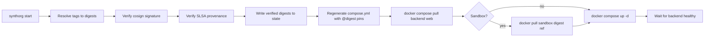

# Deployment & Container Runtime

SynthOrg ships as seven container images to `ghcr.io/aureliolo/synthorg-{backend,web,sandbox,sidecar,openhands,fine-tune-gpu,fine-tune-cpu}`. The **backend** and **web** images are managed as Docker Compose services by the CLI. The **sandbox**, **sidecar**, **openhands**, and **fine-tune-{gpu,cpu}** images are not Compose services; the CLI pre-pulls the sandbox family when requested, and the backend spawns sandbox/sidecar/openhands/fine-tune containers on demand via the Docker API. The CLI verifies cosign signatures for every enabled **published** image (both Compose-managed and on-demand) before starting. The unpublished `desktop` image below carries no signature to verify and is therefore outside that verification.

---

## Images we publish

| Image | Purpose | Base |
|-------|---------|------|
| `backend` | SynthOrg orchestration engine (Litestar + uvicorn) | apko-composed Wolfi base (`docker/backend/apko.yaml`, `python-3.14` resolved via apko lockfile) with `git` (workspace provisioning is on the critical path of every dispatch) and `postgresql-client` (the backup handlers); thin `docker/backend/Dockerfile` layers the uv-built venv on top. What the backend spawns and cannot supply itself is asserted at boot by the binary preflight (see [API startup lifecycle](../reference/api-startup-lifecycle.md)) |
| `web` | React SPA and built docs, served by **Caddy** | Pure apko (no Dockerfile); composes `caddy` + `ca-certificates-bundle` + melange-built `synthorg-web-assets` apk + `/etc/synthorg/Caddyfile` |
| `sandbox` | Ephemeral agent code execution image spawned on demand by the backend | apko-composed Wolfi base (`docker/sandbox/apko.yaml`) with `busybox` and `git`; fully rootless (UID 10001, cap_drop: ALL). Network enforcement handled by a separate sidecar proxy container |
| `sidecar` | Transparent network proxy sidecar for sandbox containers | apko-composed Wolfi base (`docker/sidecar/apko.yaml`) with `iptables` and `busybox`; Go binary providing dual-layer DNS + DNAT enforcement of `allowed_hosts` |
| `openhands` | Sandbox variant for the [OpenHands execution loop](openhands-loop.md): the sandbox base plus `openhands-sdk` + `openhands-tools` bundled (hash-pinned) into an isolated venv at `/opt/openhands`. The agent runs to completion in-container against a `LocalWorkspace`; the host-side adapter feeds the run spec on the container's `stdin` and reads a structured JSON event stream from its `stdout` (no in-container server) | The published `sandbox` base via `ARG BASE_IMAGE` / `FROM ${BASE_IMAGE}`, plus a thin `docker/openhands/Dockerfile` layering the SDK. The SDK closure is resolved in-image only, never the main venv, so the app's pinned litellm is untouched. Egress is confined to the gateway + credentialed-MCP endpoints by the sidecar |
| `fine-tune-gpu` | Ephemeral embedding fine-tuning container (GPU variant, ~4 GB download / ~7 GB on disk: torch with bundled CUDA runtime). Default when fine-tuning is enabled. **amd64 only**; requires an NVIDIA GPU + compatible host driver for practical training speed. | apko-composed Wolfi base (`docker/fine-tune/apko.yaml`) with Python 3.14 + openblas; thin `docker/fine-tune/Dockerfile` layers torch + sentence-transformers on top with `FINE_TUNE_EXTRA=fine-tune-gpu` |
| `fine-tune-cpu` | Ephemeral embedding fine-tuning container (CPU variant, ~1.7 GB: torch without CUDA). Safer default for hosts without an NVIDIA GPU; training is slower. **amd64 only** | Same base + Dockerfile as `fine-tune-gpu`; torch comes from `download.pytorch.org/whl/cpu` via `[tool.uv.sources]` when built with `FINE_TUNE_EXTRA=fine-tune-cpu` |

Each published image is signed with **cosign keyless** via GitHub OIDC and attested with **SLSA Level 3 provenance**. The signing and attesting steps live in the reusable workflows `.github/workflows/reusable-publish-image.yml` (backend, sandbox, sidecar, openhands, fine-tune) and `.github/workflows/reusable-publish-image-loaded.yml` (web); `build-images.yml` is the caller, granting scopes and passing inputs without signing anything itself. That distinction is load-bearing rather than organisational: keyless signing derives the certificate identity from the workflow holding the signing step, so it is the reusable workflow, never the caller, that the CLI verifies against. The signature is bound to the manifest list digest by the main-push run; on release tag-push the workflow's retag jobs apply the version tags (`{{version}}`, `dev`, `{{major}}.{{minor}}`) to the same digest via `docker buildx imagetools create`, so every tag of a single commit shares the main-run's signature without re-signing. **CycloneDX SBOMs** are generated per image and uploaded as GitHub Release artifacts. At pull/start time, `cli/internal/verify/verify.go` verifies cosign signatures and SLSA provenance (bypassable with `--skip-verify`); SBOM contents are not validated at runtime.

## Dev / not-yet-published images

| Image | Purpose | Base |
|-------|---------|------|
| `desktop` | Headless virtual-desktop sandbox the agent drives via the desktop tool (Xvfb + fluxbox + xdotool + scrot, plus Python/Tk for GUI deliverables). Spawned on demand by the backend; the `desktop_image_pin` setting defaults to `ghcr.io/aureliolo/synthorg-desktop:latest` | `debian:trixie-slim` pinned by digest in `docker/desktop/Dockerfile`. Debian rather than apko/Wolfi because the X11/GUI toolchain (Xvfb, fluxbox, Tk) is packaged for glibc Debian, not Wolfi |

Unlike the published images above, `desktop` is **not built or published by `.github/workflows/build-images.yml`**, so it is neither cosign-signed nor SLSA-attested. Its literal `FROM` digest is kept fresh by Renovate (the `dockerfile` manager scans it). Because it is absent from the publish + signing matrix, the desktop tool's `desktop_image_pin` default does not resolve to a published image (tracked in #2033).

The `openhands` image is published, but it is the one published image with no literal `FROM` digest: it takes its base via `ARG BASE_IMAGE` / `FROM ${BASE_IMAGE}`, so Renovate does not track that line and the base moves only when the sandbox base does. A published build passes the sandbox base as `repo@sha256:...`; a pull-request build has no published base digest yet and passes the locally loaded `repo:tag` instead, so the digest pin is a property of published builds, not of every build.

## apko-composed base images

The backend, sandbox, and sidecar images use a **Hybrid A** pattern: apko composes the base image declaratively from Wolfi packages (`python-3.14`, `git`, etc.) with exact versions resolved via `apko.lock.json`, and a thin Dockerfile layers the application on top (`FROM apko-base@sha256:...`, `COPY .venv`, `COPY src`, `ENTRYPOINT`). The sidecar image adds `iptables` for DNAT setup but the sandbox image is minimal (no iptables, no elevated privileges). The web image is **pure apko** (no Dockerfile), composing Caddy plus a melange-packaged static site bundle.

Wolfi is a separate distribution from Alpine. It reuses the `apk` package format but is built against **glibc**, not musl, so Python `manylinux` wheels install natively without source rebuilds and `uv` runs at full speed. This is the decisive reason Wolfi wins over both Alpine and Debian-slim for our workload.

Reconciliation mechanisms:

| Mechanism | Target | Cadence |
|-----------|--------|---------|
| Renovate (Docker ecosystem + digest pinning) | Thin Dockerfile `FROM` lines (apko-base digest) | Weekly (Sat 00:00-06:00 UTC) |
| `apko lock` cron (`.github/workflows/maint-apko-lock.yml`) | `docker/*/apko.lock.json` (backend, sandbox, sidecar, fine-tune). `docker/web/apko.yaml` is intentionally skipped: it depends on the workflow-build-time `synthorg-web-assets@local` melange package, which has no stable upstream to lock against | Weekly (Mon 06:00 UTC); the single `fine-tune` apko base is shared by both `-gpu` and `-cpu` runtime images |

## Image tags and what each one points at

Every published image carries the same tag ladder. `desktop` is absent from
it for the reason above: it is never built or published here, so it has no
release tags and no signature coverage. Which tag a deployment pins decides
how current it is, and the release tags move on release events only.

Two actions apply the ladder, on different events. A push to `main` runs
`.github/actions/publish-image-loaded`, which pushes the image and signs
it. A `v*` tag push runs `.github/actions/publish-image-retag`, which
applies the release tags to that same already-signed digest rather than
rebuilding. The tag policy is deliberately identical between them, so a
release gets the same set either way.

| Tag | Applied on | Points at |
|-----|-----------|-----------|
| `sha-<short>` | every push to `main` | that one commit's build |
| `dev` | a `v*` tag containing `-dev.` | the newest `-dev.` prerelease; it does **not** move on a `main` push |
| `X.Y.Z`, `X.Y` | a `v*` tag; the two-part form only on a stable ref | that release |
| `latest` | a stable `v*` tag | the last stable release |

"Stable" for `latest` is a semver test, not a substring one:
`docker/metadata-action` runs at its default `latest=auto`, which resolves
`latest` from the `type=semver` tag and withholds it from any version
carrying a prerelease component. `-dev.`, `-rc.` and `-beta.` are therefore
all excluded on the same rule, and only `-dev.N` is minted today. The
literal `-dev.` substring does still gate the `X.Y` and raw-version tags,
which is narrower, though `docker/metadata-action` independently withholds
`X.Y` from every prerelease.

`latest` therefore does not mean current. A stretch of prerelease-only
releases leaves it pointing at whatever stable release came before, however
long ago, which is correct for a stable channel and misleading if read as
"the newest build". Probe a specific build by digest or by `sha-<short>`,
and read `dev` for the newest `-dev.` prerelease.

`synthorg init` pins a tag once, into `image_tag` in the CLI config. A
released binary pins its own version, so the stack matches the release that
published it. A binary built from source has no matching release and pins
`dev`, and `init` says so. `--image-tag` overrides either.

## GHCR image retention

Published and dev images accumulate in GHCR on every build, so `maint-ghcr.yml` (a standalone workflow that runs weekly on a schedule, and on its own via `workflow_dispatch`) prunes the non-release ones on a fixed policy. Official releases are never touched.

| Tag class | Example | Retention |
|-----------|---------|-----------|
| Release | `0.8.4`, `0.8`, `latest` | Kept forever (protected by an `exclude-tags` regex on every pass) |
| Dev build | `0.8.4-dev.5`, floating `dev` | Newest 5 kept; older deleted |
| PR / scan | `sha-<short>`, `sha-<short>-amd64`, `scan-<full>-amd64` | Deleted after 7 days |
| Orphaned referrer | cosign `sha256-<digest>`, untagged attestation | Deleted once its parent image is gone |
| Operator hold | `keep-<reason>` | Kept forever; the escape hatch for a version the packages API refuses to delete |

The signatures, attestations, and multi-arch platform children of any kept image are retained automatically; `validate: true` asserts no surviving multi-arch image lost a child after each pass. The job ships in dry-run and only deletes once the repository variable `GHCR_CLEANUP_ENABLED=true` is set. See the **GHCR Cleanup** CI entry in [claude-reference.md](../reference/claude-reference.md) for workflow detail.

## Image verification at launch



`synthorg start` runs `cli/internal/verify/verify.go` which resolves each tag to a digest, verifies the cosign signature and SLSA provenance, and writes the verified digest into `state.VerifiedDigests`. The digest-pinned references are then rendered into `compose.yml` so the started containers run exactly the image the CLI verified. `--skip-verify` bypasses this for air-gapped environments.

## Sandbox image resolution

When `--sandbox` is enabled, the CLI verifies the sandbox image alongside the others, pre-pulls it via `docker pull <digest-ref>` (the sandbox is **not** a compose service; the backend spawns ephemeral sandbox containers on demand via `aiodocker`), and passes the digest-pinned reference to the backend container as `SYNTHORG_SANDBOX_IMAGE`. The backend's `DockerSandboxConfig.image` field reads this env var as its default via a Pydantic `default_factory`; explicit YAML under `sandboxing.docker.image` still wins when set. This keeps the CLI pin and the backend pin version-locked.

The backend gets the Docker socket mounted **read-write** (it needs `create`, `start`, `stop`, and `exec` on the daemon). That is root-equivalent control of the daemon, which is the whole host: enable sandboxing only in a deployment you trust, because none of the container hardening below contains socket-level privilege.

The mount has two halves and only one of them is configurable. The **container target** is always `/var/run/docker.sock`, because that is where the backend's client looks. The **host source** is the `docker_sock` config key (`synthorg config set docker_sock ...`), and its default is `/var/run/docker.sock` on every host, Windows included: what decides it is not the OS the CLI runs on but the kind of container the socket is mounted into, and SynthOrg runs Linux containers everywhere. Binding the Windows named pipe (`//./pipe/docker_engine`) as the source does not fail; Docker creates an empty **directory** at the target, so the backend finds no socket and every sandbox-backed tool is dead with nothing saying so. An operator running a Windows-container daemon can still name the pipe, and the validator still accepts it. `agent_tool_execution` at `GET /api/v1/subsystems` is what names that condition when it happens; use the configured `api.api_prefix` when it is overridden.

A correctly bound socket is still not enough on its own: inside Docker Desktop's Linux VM it is `root:root` mode 0660, and the backend runs as UID 65532, so the CLI also emits `group_add` from `DetectDockerSockGID`. Both halves are required, and each fails the same silent way without the other.

The sandbox container is not given the workspace as a path. The backend reproduces the storage its own mount named (a named volume plus the subpath the workspace sits at within it, or the host side of a bind), because a path string is resolved in the daemon's namespace rather than the backend's; see [Tools](tools.md#how-the-sandbox-reaches-the-workspace). The sandbox image retains a full shell plus `git` but no iptables; it is fully rootless (UID 10001, `cap_drop: ALL`, `no-new-privileges`, read-only root filesystem). Per-host:port `allowed_hosts` network enforcement is handled by a separate sidecar proxy container that shares the sandbox's network namespace, providing dual-layer enforcement: DNS filtering (allowed hostnames forwarded, denied get NXDOMAIN) and transparent TCP proxying (connections to unauthorised hosts are dropped with TCP RST).

The sidecar is the one container that starts as UID 0, and only until its `netfilter` rules exist. Docker cannot hand a capability to a non-root container process: `execve` derives the permitted set from the binary's file capabilities and the ambient set, both empty, so `cap_add` on a non-root image leaves a bounding ceiling and an empty effective set, and `no-new-privileges` (correctly) rules out file capabilities as the way around that. So the sidecar enters as root with exactly three capabilities: `NET_ADMIN` to write the rules, and `SETUID`/`SETGID`, which are what `setgroups(2)` and `setuid(2)` themselves require. It installs the rules through the **`nft`** iptables front end (the legacy one drives `netfilter` over a raw socket and would additionally need `CAP_NET_RAW` in the namespace the sandbox shares), binds its listeners, then drops to UID 10002 for the whole of its serving life, at which point the kernel clears every capability it held. The account is read from the image's own database rather than compiled in, because the rule that exempts the relay's own upstream dials names the same UID.

## Graceful shutdown

The backend tears down in three stages so requests are not cancelled mid-transaction during a rolling restart:

1. **HTTP request drain (25 s budget)**: `RequestDrainMiddleware` (`src/synthorg/api/drain.py`) is wrapped around the Litestar ASGI app as the outermost layer. The first `on_shutdown` hook flips the drain gate; new requests after that return `503 Service Unavailable` with `Retry-After: 5`, while in-flight requests have up to 25 s to finish. A drain that exceeds the budget is logged at WARNING (`api.app.drain.timeout`) and service teardown begins regardless. The budget lives at `_DRAIN_TIMEOUT_SECONDS` in `src/synthorg/api/lifecycle.py`.
2. **Service teardown (~42 s worst-case sum of nominal budgets)**: `_run_shutdown` first stops the background services (quota poller, self-improvement service `close()`), then `_safe_shutdown` runs the per-service shutdown budgets in `src/synthorg/api/lifecycle.py` in this order: approval timeout (1 s), meeting (2 s), TaskEngine drain (8 s nominal, 17 s outer cap with slack), perf (2 s), backup (5 s), settings (2 s), bridge (2 s), distributed backend bundle (3 s; its dead-letter consumer + heartbeat subscriber release the shared NATS connection before the queue drains), distributed queue (3 s), message bus (3 s), notification dispatcher (5 s, stopped after the bus drains so every event is generated but before persistence disconnects so a final delivery flush still reaches the DB), persistence (5 s). The A2A-client close is appended after `_safe_shutdown`, and the three integration draining services (OAuth manager, integration health prober, webhook bridge) drain concurrently via `asyncio.gather` so they cost one drain budget, not three. Most services return well under their cap in practice.
3. **Uvicorn graceful close**: `uvicorn.run` is invoked with `timeout_graceful_shutdown=75`, which covers the drain budget plus the full service teardown sequence with ~8 s headroom over the worst case.

**Recommended `terminationGracePeriodSeconds: 75`** for both Kubernetes pods and Docker Compose stacks. The per-service budgets enforce a fixed total worst-case drain of ~67 s (25 s HTTP drain plus the nominal teardown sequence); the 75 s graceful-shutdown ceiling reserves ~8 s of headroom so the orchestrator does not SIGKILL the process mid-teardown. Raising any individual budget narrows that headroom contract; the budgets are internal constants by design, not settings-registry tunables, because the orchestrator depends on the shape of the contract rather than its operator-tunability. Operators that consistently hit drain timeouts should raise the grace and document the incident motivating the change.

Kubernetes example:

```yaml
apiVersion: v1
kind: Pod
spec:
  terminationGracePeriodSeconds: 75
  containers:
    - name: backend
      image: ghcr.io/aureliolo/synthorg-backend@sha256:...
```

Docker Compose example:

```yaml
services:
  backend:
    image: ghcr.io/aureliolo/synthorg-backend@sha256:...
    stop_grace_period: 75s
    stop_signal: SIGTERM
```

The drain emits observability log events from `observability/events/api.py`:
`api.app.drain.started`, `api.app.drain.completed`, `api.app.drain.timeout`, and
`api.app.drain.send_failed`. Tail those during a deploy to confirm a clean drain.

## Web server

The web image runs **Caddy** inside a pure-apko Wolfi image. Caddy serves the React SPA at `/`, the built documentation at `/docs`, proxies REST requests at `/api/` and WebSocket connections at `/api/v1/ws` to the backend, and emits a per-request CSP nonce via the `templates` directive + `{http.request.uuid}` placeholder. The full security-header set (CSP, HSTS, X-Frame-Options, Referrer-Policy, Permissions-Policy) is configured in `web/Caddyfile`. Pre-compressed `.gz` siblings built by melange are served via Caddy's `precompressed gzip` file_server option.

---

## See Also

- [Tools](tools.md): sandbox backends, lifecycle strategies
- [Backup](backup.md): persistence snapshots and restore
- [Design Overview](index.md): full index
