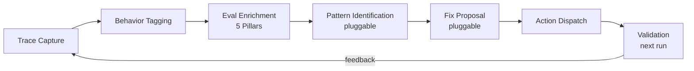

# Evaluation Loop

The closed-loop evaluation framework continuously measures agent performance and identifies improvement opportunities. It is built on top of the existing five-pillar evaluation, performance tracking, trajectory scoring, and training infrastructure documented in [HR and Agent Lifecycle](hr-lifecycle.md).

## Closed-Loop Architecture



The ``EvalLoopCoordinator`` orchestrates existing services into cycles: collect metrics, enrich with five-pillar evaluation, identify failure patterns, propose targeted fixes, dispatch the proposed actions, and validate via next-run trajectory scores. The IDENTIFY and PROPOSE steps are pluggable strategies (`PatternIdentifier` / `FixProposer` in `hr/evaluation/pattern_protocols.py`): the shipped defaults are deterministic (threshold-counting identification + a static per-pillar action table). Setting `hr.eval_loop_pattern_identifier_mode` / `hr.eval_loop_fix_proposer_mode` to `llm` (with `hr.eval_loop_llm_model` set) swaps in provider-backed strategies (`LlmPatternIdentifier` / `LlmFixProposer`) that weigh the pillar scores / pattern combination with a dedicated model call and degrade to the deterministic strategy on a retryable provider error, an empty or unparseable response, or an unexpected internal fault, so a transient or misbehaving model does not stall the cycle (a non-retryable `ProviderError` still propagates and aborts the cycle). Proposed actions are routed to operators by a `RemediationActionDispatcher` (a notification alert per recommended action) when a notification dispatcher is wired.

## Behaviour Tagging

Each turn is tagged with one or more ``BehaviorTag`` categories for fine-grained trace analysis and eval routing:

| Tag | Description |
|-----|-------------|
| `file_operations` | Read, write, edit, list, grep |
| `retrieval` | Search, multi-hop document synthesis |
| `tool_use` | Generic tool selection and chaining |
| `memory` | Recall, preference extraction, persistence |
| `conversation` | Multi-turn dialogue, clarifying questions |
| `summarization` | Context overflow handling |
| `delegation` | Sub-agent spawning, handoff |
| `coordination` | Multi-agent pipeline waves |
| `verification` | Rubric grading, quality assessment |

Tags are inferred by ``BehaviorTaggerMiddleware`` (opt-in, ``after_model`` slot) via tool-name pattern matching. Stored on ``TurnRecord.behavior_tags``.

## Efficiency Ratios

Per-run efficiency ratios measured against ``IdealTrajectoryBaseline``:

- **Step ratio**: observed steps / ideal steps (1.0 = on target)
- **Tool call ratio**: observed calls / ideal calls
- **Latency ratio**: observed time / ideal time
- **Verbosity ratio**: observed output tokens / ideal tokens (from SlopCodeBench)
- **Structural erosion score**: composite 0.0--1.0 (duplicated blocks, cyclomatic complexity delta, dead-branch ratio)
- **PTE**: Prefill Token Equivalents (hardware-aware cost metric, from arXiv:2604.05404)
- **PTE ratio**: observed PTE / ideal PTE

Baselines are human-curated and versioned, not auto-updated from observed runs.

## Quality Erosion Detection

A stagnation variant (``StagnationReason.QUALITY_EROSION``): the agent keeps working but ``structural_erosion_score`` climbs past threshold (default 0.5). ``QualityErosionDetector`` implements the ``StagnationDetector`` protocol and fires corrective prompt injection or termination.

## External Benchmarks

A pluggable ``ExternalBenchmark`` protocol allows adopting external benchmark suites without modifying the framework. ``ExternalBenchmarkRegistry`` manages registration and execution. A run drives the agent under evaluation through an injected ``AgentRunner`` (``run_case(case) -> str``) and grades its live output; the registry is fail-closed, raising ``EvalBenchmarkAgentRunnerUnsetError`` when no runner is configured. Each case is isolated: a non-critical failure in the agent run or the grading is recorded as a failed case (tagged with the stage that broke) so one bad case never aborts the run, while interpreter-critical errors propagate.

### Pin-Validation Benchmark

The ``model-pin-validation`` benchmark is the bundled ``ExternalBenchmark`` that gives ``ModelPinMetadata`` a real consumer. It iterates the prompt-purpose registry and, for each prompt class, runs a canonical probe against the class's pinned design tier (from the [Model Tier Policy](../reference/model-tier-policy.md)) through a deterministic provider, then grades **drift** by comparing a live fingerprint (``sha256(model_id | temperature | top_p | max_tokens | output)``) against a committed golden snapshot. A mismatch (a tier reassignment, a sampling change, or a probe-pipeline change) fails the grade until the golden is regenerated with ``scripts/refresh_model_pin_golden.py``. The same drift also trips the ``pin-drift-regression`` CI canary (``scripts/check_pin_golden_fresh.py``), which recomputes the live fingerprints and diffs them against the committed golden before the benchmark runs, so a pin or tier change cannot land without the golden being refreshed.

On a clean grade the benchmark stamps ``validated_at`` for the prompt class through the ``ModelPinValidationLedger`` (a one-row-per-class ``ModelPinValidationRepository`` record). That ``validated_at`` is the durable "last validated against its tier" timestamp the audit dashboard reads -- the live counterpart to a prompt class's static ``ModelPinMetadata.model_version_pinned_at``. The stamp is best-effort: a persistence failure is logged but never flips a clean drift verdict. It is registered at boot in ``eval_loop_wiring.py`` and exercised by the coordinator's benchmark step.

## Agent Evaluation Testing

Tests tagged ``@pytest.mark.agent_eval(category="file_operations")`` run separately from the default unit suite:

```bash
uv run python -m pytest tests/evals/ -n 8 --eval-timeout=300
```

The ``n1_prefix_replay`` utility replays the first N-1 turns of a recorded trace and lets the agent generate only the final turn for regression testing.

CI: ``evals.yml`` runs nightly and on the ``run-evals`` label.
