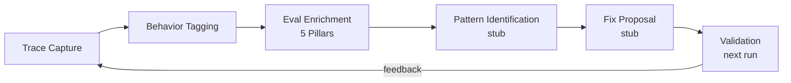

# Evaluation Loop

The closed-loop evaluation framework continuously measures agent performance and identifies improvement opportunities. It is built on top of the existing five-pillar evaluation, performance tracking, trajectory scoring, and training infrastructure documented in [HR and Agent Lifecycle](hr-lifecycle.md).

## Closed-Loop Architecture



The ``EvalLoopCoordinator`` orchestrates existing services into cycles: collect metrics, enrich with five-pillar evaluation, identify failure patterns (stub), propose targeted fixes (stub), and validate via next-run trajectory scores.

## Behaviour Tagging

Each turn is tagged with one or more ``BehaviorTag`` categories for fine-grained trace analysis and eval routing:

| Tag | Description |
|-----|-------------|
| `file_operations` | Read, write, edit, list, grep |
| `retrieval` | Search, multi-hop document synthesis |
| `tool_use` | Generic tool selection and chaining |
| `memory` | Recall, preference extraction, persistence |
| `conversation` | Multi-turn dialogue, clarifying questions |
| `summarization` | Context overflow handling |
| `delegation` | Sub-agent spawning, handoff |
| `coordination` | Multi-agent pipeline waves |
| `verification` | Rubric grading, quality assessment |

Tags are inferred by ``BehaviorTaggerMiddleware`` (opt-in, ``after_model`` slot) via tool-name pattern matching. Stored on ``TurnRecord.behavior_tags``.

## Efficiency Ratios

Per-run efficiency ratios measured against ``IdealTrajectoryBaseline``:

- **Step ratio**: observed steps / ideal steps (1.0 = on target)
- **Tool call ratio**: observed calls / ideal calls
- **Latency ratio**: observed time / ideal time
- **Verbosity ratio**: observed output tokens / ideal tokens (from SlopCodeBench)
- **Structural erosion score**: composite 0.0--1.0 (duplicated blocks, cyclomatic complexity delta, dead-branch ratio)
- **PTE**: Prefill Token Equivalents (hardware-aware cost metric, from arXiv:2604.05404)
- **PTE ratio**: observed PTE / ideal PTE

Baselines are human-curated and versioned, not auto-updated from observed runs.

## Quality Erosion Detection

A stagnation variant (``StagnationReason.QUALITY_EROSION``): the agent keeps working but ``structural_erosion_score`` climbs past threshold (default 0.5). ``QualityErosionDetector`` implements the ``StagnationDetector`` protocol and fires corrective prompt injection or termination.

## External Benchmarks

A pluggable ``ExternalBenchmark`` protocol allows adopting external benchmark suites without modifying the framework. ``ExternalBenchmarkRegistry`` manages registration and execution.

## Agent Evaluation Testing

Tests tagged ``@pytest.mark.agent_eval(category="file_operations")`` run separately from the default unit suite:

```bash
uv run python -m pytest tests/evals/ -n 8 --eval-timeout=300
```

The ``n1_prefix_replay`` utility replays the first N-1 turns of a recorded trace and lets the agent generate only the final turn for regression testing.

CI: ``evals.yml`` runs nightly and on the ``run-evals`` label.
