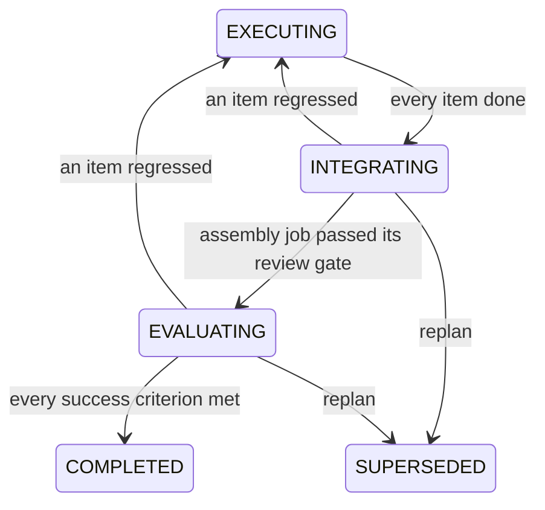

# Initiative Tail

The two stages between "every plan item is done" and delivery, and the driver
that replans an initiative which can no longer advance.

[Project Lifecycle](project-lifecycle.md) owns the graph and the rollup that
opens this tail; [Plan Review](plan-review.md) owns everything before dispatch.

## The problem

The general loop ran **plan, execute, verify** and then stopped. Every plan item
passing its own review gate completed the plan, the project, and the objective.

That is a real guarantee about each piece and no guarantee at all about the
whole. An initiative could deliver a set of individually-verified parts that
nobody had ever assembled, run together, or checked against what the objective
actually asked for, and the board would show it as delivered. Three smaller
leaks kept that from even being reliable per piece:

- a WORK plan item could declare zero expected artifacts, which disarmed the
  fail-loud zero-artifact guard, so a chat-only run with no output reached
  review as though it had produced something;
- the lifecycle-only baseline execution service walked any task straight to
  `COMPLETED`, gate or no gate;
- the coordination parent rollup derived subtask status from run outcomes,
  which report success before verification.

## Shape

**`EXECUTING -> COMPLETED` does not exist.** Neither does the project's
`ACTIVE -> COMPLETED`. Delivery has exactly one predecessor in both machines, so
the tail cannot be skipped by construction rather than by whichever service
happens to be wired. The back-edges carry a regression: an item that stops being
done (integration findings routed back as rework) reopens the build without a
replan.

## INTEGRATE

`engine/initiative/integrate.py` mints **one ordinary task** and dispatches it
through the normal work pipeline.

Making it an ordinary task is the whole design. It inherits the entire existing
verification chain with no second oracle written for it: the review gate runs
`run_completion_gates`, so the build/test oracle reads its `CodeExecutionRecord`
rows and refuses an unverified or failing build, the completion-oracle peer
review fails closed without a distinct reviewer, and output policy, red team,
and vision all apply. A bespoke "integration checker" would have been a second,
weaker gate.

Three shape decisions carry weight:

| decision | why |
| --- | --- |
| forced `LEAF` (`WorkItem.leaf_required`) | splitting an assembly job hands the pieces back to separate agents, which is the state the stage exists to end |
| `plan_id` set, `plan_item_id` unset | it belongs to the initiative without implementing any plan item, so every derivation over items ignores it and it cannot distort the rollup that opened the stage |
| id derived from the plan id (`uuid5`) | idempotency with no "already started" flag to drift from reality: a re-fired stage finds the existing row and stops |

It declares two expected artifacts, the integrated runnable deliverable and the
end-to-end test run over it. Both are named in prose rather than as paths, so
the declared-artifact check does not probe them (see
[agent-execution.md](agent-execution.md#declared-artifact-check)); the
zero-tool-call proxy still applies, and the assembly is judged by the same
review chain as any other task. It runs one stakes level above the plan's highest item, because
assembly is the first point the whole thing runs and the last point before
delivery. Its acceptance criteria are the objective's own.

Outcome, read from the task's persisted status on the next rollup recompute:

- `COMPLETED` (so the gate passed it): plan `INTEGRATING -> EVALUATING`;
- `FAILED` / `REJECTED` / `CANCELLED`: the replan trigger fires with
  `INTEGRATION_FAILED`;
- anything else: still working, nothing happens.

## EVALUATE

`engine/initiative/evaluate.py` runs a bounded session in which the accountable
lead judges the delivered whole against the objective's success criteria. It is
modelled on the SHIP retrospective session: detached, wall-clock bounded, turn
and cost capped, never raising into the rollup.

The verdict is per-criterion and evidenced (`EvaluationReport`), not a single
thumbs-up. Two invariants make it load-bearing:

- **every criterion is judged exactly once.** A submission that drops one, or
  invents one the objective does not have, is rejected back into the session
  for correction rather than accepted with the unanswered criteria treated as
  met;
- **`PARTIAL` is not a pass.** An initiative is delivered when the objective is
  met, not mostly met.

The session's tools are read-only by design (workspace read and list). A session
that could change what it is judging could turn its own failing verdict into a
passing one. They are scoped to the plan's **own** project workspace
(`engine/workspace/paths.py::project_workspace_dir`), not the shared
agent-workspaces base root, so listing a directory returns the deliverable
rather than a tree of sibling projects and the paths in the material resolve
as written.

### What the judge is given

The material (`engine/initiative/evaluate_brief.py`) carries the objective and
its criteria, the plan items and their declared artifacts, and the **recorded**
test-run evidence for the project: the `CodeExecutionRecord` rows written from
the commands that actually ran, newest first and bounded. "The test suite
passes" is then judged against what ran rather than against a claim, and the
brief no longer tells the session to run things it has no tool to run.

### The verdict is a record

The verdict decides whether an initiative delivered, so it is persisted before
anything acts on it. `initiative_evaluation_report` is an append-only,
dual-backend table keyed unique on `(plan_id, attempt)`, carrying the summary
and every `CriterionVerdict` with its outcome and evidence
(`persistence/evaluation_report_protocol.py`, composing `AppendOnlyRepository`).
A re-evaluation is a new attempt with its own row rather than an edit of the
old one: overwriting would erase the evidence the replan points at.

`evaluate.py::_record` writes it **before** the status write, so a lost CAS
race on the completion transition costs the transition rather than a judgement
that cost real money and cannot be re-derived. A record write that fails
**parks the plan**: it returns `False` and `_run` never reaches `_apply`. A
verdict nobody can read afterwards is, to every later reader, no verdict, and
no verdict parks rather than completes; completing on one would leave an
initiative marked delivered with nothing to point at when asked why. The next
recompute re-judges within the attempt cap, so the cost is a re-judgement
rather than an unevidenced delivery.

`GET /plans/{plan_id}/evaluation` returns the attempts newest-first, and the
dashboard's `PlanEvaluationPanel` renders each criterion with the judge's
evidence, so a parked initiative explains itself instead of leaving the
operator with `unmet_count=2` in a log line and nothing else. Empty attempts
is the honest answer for a plan nothing has judged; the plan's own status
tells that apart from one parked at `EVALUATING` because no verdict landed.

### Fail closed

No report, an unresolvable lead, no provider, a timeout, an objective with no
criteria: every one of those leaves the plan sitting at `EVALUATING` with a
warning on each recompute. Nothing completes an initiative on a missing verdict.

This is the deliberate inverse of the red-team gate's policy, and it is the
point of the whole change: an evaluation that did not happen is not a pass. An
operator resolves a parked plan by replanning or cancelling.

## Auto-replan

`replan_initiative` was fully built and reachable only from a human
`POST /plans/{id}/replan`. Nothing noticed when an initiative ran out of ways to
advance, so a stalled plan simply hung until someone looked.
`engine/initiative/replan_trigger.py` is that missing driver. The successor
lands in `PENDING_REVIEW`, which is the human gate the product already has: the
organisation gets itself unstuck, the operator still decides.

### What counts as stalled

A **shape, not a duration**: the plan has outstanding work and none of it can
move without a new decision. There is no threshold to tune and no timer, and the
derivation is exact the moment the last live item dies.

Three cases are deliberately excluded, each because replanning would destroy
something:

| not a stall | why |
| --- | --- |
| work still moving (`CREATED` through `IN_REVIEW`) | it is simply in flight |
| a human wait (`AWAITING_INPUT`, `AUTH_REQUIRED`) | the org is waiting on the operator; a replan would discard the question rather than answer it |
| an item whose task row does not exist yet | dispatch writes the plan's `EXECUTING` status *before* it creates the task rows, so treating this as dead would replan every initiative during its own dispatch window |

The two tail stages produce verdicts no derivation over items can see (every
item is `COMPLETED` when integration fails), so `INTEGRATION_FAILED` and
`EVALUATION_UNMET` are carried in by the stage and re-confirmed by the plan
still sitting in the stage that produced them.

### Loop safety

`Plan.replan_generation` counts how many times an initiative has replanned
itself. A successor opened automatically carries its predecessor's generation
plus one; a human replan resets it to zero, because a human decision is not a
runaway. Past `engine.auto_replan_max_generations` the initiative is **parked,
not failed**: it keeps its status and its stall stays visible for an operator.

Every fire re-reads the plan and re-confirms the stall before doing anything,
which is what makes a redelivered rollup event harmless: the first replan
supersedes the plan, and every later attempt reads a superseded plan and stops.

## Degraded boots

Each collaborator degrades independently, and none of them degrades into a
completion:

| unwired | behaviour |
| --- | --- |
| integrate stage (no work pipeline) | plan parks at `INTEGRATING`, WARNING per recompute |
| evaluate stage (no provider) | plan parks at `EVALUATING`, WARNING per recompute |
| replan trigger (no coordinator) | a stalled plan stays stalled and visible |
| retro capture (no memory layer) | finished work does not feed a retrospective back |

Parking is the honest outcome: an initiative whose pieces were never assembled
has not delivered, and an initiative nobody scored has not been shown to meet
its objective. The operator's remedy is one the product already has: replan
(legal from both tail stages) or cancel.

**Independently means one subsystem each**, four of them, all separate from the
rollup. The rollup activates as soon as persistence and the task engine exist,
which is before setup has configured a provider, so a first boot legitimately
produces a rollup with no tail; each `initiative_*` spec waits on what that one
collaborator actually needs and activates on a later reconciler pass, attaching
onto the already-wired rollup without re-registering the observer, so each comes
online with no restart.

Declaring the four as one subsystem would make the *union* of their
requirements a precondition for any of them, and the table above would be a
lie: a boot with no coordinator would get no integrate stage either. Their
liveness is read one probe per collaborator for the same reason: a shared probe
let a tail whose retro capture never resolved (memory blocked because no
embedder was chosen) read as converged, and the reconciler never revisits that.

The retro capture additionally declares a teardown and `rebuild_on_change`,
because it holds both memory backends for the life of the instance and those
are replaceable while the process runs; without them it would keep writing into
layers nothing else reads.

The evaluate stage therefore reads the replan trigger **per verdict** rather
than capturing one at construction. The two converge on their own schedules, so
a coordinator arriving after the provider registry would otherwise leave the
stage holding the `None` it was built with and park every unmet initiative for
the life of the process.

There is exactly one wiring path per collaborator. Re-running the rollup's own
wiring attaches nothing: a post-setup rewire list is the drift
[subsystem reconciliation](subsystem-reconciliation.md) exists to reject, and
it is what left the tail declining on every deployment while the capability
read as live.

## Settings

Every key below is read when the tail fires, so an edit applies to the next
run of it rather than needing a restart.

| key | default | purpose |
| --- | --- | --- |
| `engine.auto_replan_enabled` | true | master switch for the stall trigger |
| `engine.auto_replan_max_generations` | 2 | generation cap stopping a runaway chain |
| `engine.auto_replan_timeout_seconds` | 600 | ceiling on one re-decomposition |
| `engine.integration_stage_timeout_seconds` | 1800 | ceiling on minting + dispatching the assembly job |
| `engine.evaluation_session_max_turns` | 10 | evaluate session turn cap |
| `engine.evaluation_session_cost_ceiling` | 1.0 | evaluate session spend ceiling |
| `engine.evaluation_session_timeout_seconds` | 300 | evaluate wall-clock ceiling |

## Enforcement

`scripts/check_verified_completion_paths.py` (pre-push + CI) holds up the three
structures this page depends on: the forbidden edges stay forbidden and
`COMPLETED` keeps exactly one predecessor in both machines; only the evaluate
stage writes `PlanStatus.COMPLETED`; and both plan-shaped models still enforce
that a WORK unit declares a deliverable. Opt out per-line with
`# lint-allow: verified-completion -- <reason>`.
