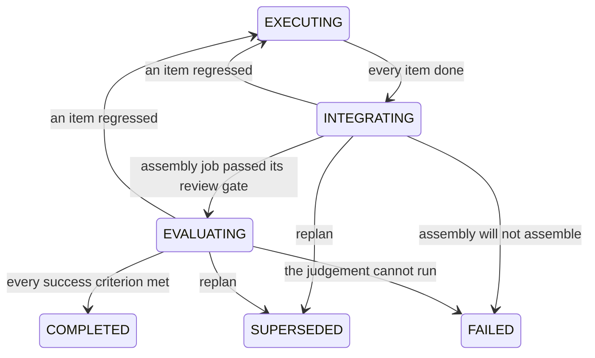

# Initiative Tail

The two stages between "every plan item is done" and delivery, and the driver
that replans an initiative which can no longer advance.

[Project Lifecycle](project-lifecycle.md) owns the graph and the rollup that
opens this tail; [Plan Review](plan-review.md) owns everything before dispatch.

## The problem

The general loop ran **plan, execute, and verify**, then stopped. Every plan item
passing its own review gate completed the plan, the project, and the objective.

That is a real assurance about each piece and none at all about the
whole. An initiative could deliver a set of individually-verified parts that
nobody had ever assembled, run together, or checked against what the objective
actually asked for, and the board would show it as delivered. Three smaller
leaks kept that from even being reliable per piece:

- a WORK plan item could declare zero expected artifacts, which disarmed the
  fail-loud zero-artifact guard, so a chat-only run with no output reached
  review as though it had produced something;
- the lifecycle-only baseline execution service walked any task straight to
  `COMPLETED`, gate or no gate;
- the coordination parent rollup derived subtask status from run outcomes,
  which report success before verification.

## Shape

**`EXECUTING -> COMPLETED` does not exist.** Neither does the project's
`ACTIVE -> COMPLETED`. Delivery has exactly one predecessor in both machines, so
the tail cannot be skipped by construction rather than by whichever service
happens to be wired. The back-edges carry a regression: an item that stops being
done (integration findings routed back as rework) reopens the build without a
replan.

**Both tail stages reach `FAILED`.** A replan resolves the tail failures
somebody chooses to re-plan; without the direct edge, the ones nobody re-plans
sit in the tail with no reachable exit, which is the deadlock shape that made a
whole project undeletable. See
[Every state has an exit a writer can always take](project-lifecycle.md#every-state-has-an-exit-a-writer-can-always-take).

## INTEGRATE

`engine/initiative/integrate.py` mints **one ordinary task** and dispatches it
through the normal work pipeline.

This stage is the **root** assembly, and on a plan that recursed it is no
longer the only one. An item with children is the assembly of the work below
it, dispatched as an ordinary plan item with an assembly brief over its own
children and its own namespaced evidence paths, keyed on its whole address in
the tree (`.synthorg/integration/<slug>/<slug>/`, one segment per level) so no
two containers can write over each other, so a wide fan-in at the top becomes
the narrow ones the recursion-depth sweep measured. Those carry their container's
`plan_item_id` like any other item, so `item_is_done` reads them normally and
`derive_plan_status` opens `INTEGRATING` only once every subtree has assembled.
The root's brief then names the plan's **workstreams** rather than every leaf in
the tree: listing a hundred titles is what a flat render becomes the moment a
plan is a tree. `engine/assembly.py` owns the brief, the paths, and the stakes
ladder that both callers share. See
[recursive-decomposition.md](recursive-decomposition.md).

Making it an ordinary task is the whole design. It inherits the entire existing
verification chain with no second oracle written for it: the review gate runs
`run_completion_gates`, so the build/test oracle reads its `CodeExecutionRecord`
rows and refuses an unverified or failing build, the completion-oracle peer
review fails closed without a distinct reviewer, and output policy, red team,
and vision all apply. A bespoke "integration checker" would have been a second,
weaker gate.

Three shape decisions carry weight:

| decision | why |
| --- | --- |
| forced `LEAF` (`WorkItem.leaf_required`) | splitting an assembly job hands the pieces back to separate agents, which is the state the stage exists to end |
| `plan_id` set, `plan_item_id` unset | it belongs to the initiative without implementing any plan item, so every derivation over items ignores it and it cannot distort the rollup that opened the stage. That provenance rule still identifies exactly the ROOT assembly: a subtree assembly carries its container's `plan_item_id` and is that item's progress |
| id derived from the plan id (`uuid5`) | idempotency with no "already started" flag to drift from reality: a re-fired stage finds the existing row and stops |

It declares two expected artifacts, `.synthorg/integration/report.md` (what was
assembled, where the runnable deliverable is, what had to be fixed) and
`.synthorg/integration/end-to-end.txt` (the run's own output, verbatim). They
are workspace-relative paths rather than prose because the declared-artifact
check can only probe a path (see
[agent-execution.md](agent-execution.md#declared-artifact-check)), and a stage
whose declarations no probe can reach arms nothing: a chat-only integration would
reach review with the check silently abstaining. The stage cannot know where a
given objective's deliverable lives, so it does not guess at that path; it names
two files of its own that the brief instructs the agent to write, and checks
those. The zero-tool-call proxy still applies, and the assembly is judged by the
same review chain as any other task. It runs one stakes level above the plan's
highest item, because assembly is the first point the whole thing runs and the
last point before delivery. Its acceptance criteria are the objective's own.

Outcome, read from the task's persisted status on the next rollup recompute:

- `COMPLETED` (so the gate passed it): plan `INTEGRATING -> EVALUATING`;
- `FAILED` / `REJECTED` / `CANCELLED`: the replan trigger fires with
  `INTEGRATION_FAILED`;
- anything else: still working, nothing happens.

## EVALUATE

`engine/initiative/evaluate.py` runs a bounded session in which the accountable
lead judges the delivered whole against the objective's success criteria. It is
modelled on the SHIP retrospective session: detached, wall-clock bounded, turn
and cost capped, never raising into the rollup.

The verdict is per-criterion and evidenced (`EvaluationReport`), not a single
thumbs-up. Two invariants make it load-bearing:

- **every criterion is judged exactly once.** A submission that drops one, or
  invents one the objective does not have, is rejected back into the session
  for correction rather than accepted with the unanswered criteria treated as
  met;
- **`PARTIAL` is not a pass.** An initiative is delivered when the objective is
  met, not mostly met.

The session's tools are read-only by design (workspace read and list). A session
that could change what it is judging could turn its own failing verdict into a
passing one. They are scoped to the plan's **own** project workspace
(`engine/workspace/paths.py::project_workspace_dir`), not the shared
agent-workspaces base root, so listing a directory returns the deliverable
rather than a tree of sibling projects and the paths in the material resolve
as written.

### What the judge is given

The material (`engine/initiative/evaluate_brief.py`) carries the objective and
its criteria, the plan items and their declared artifacts, and the **recorded**
test-run evidence for the project: the `CodeExecutionRecord` rows written from
the commands that actually ran. The list is newest-first and bounded. "The test suite
passes" is then judged against what ran rather than against a claim, and the
brief no longer directs the session to run things it has no tool to run.

### The verdict is a record

The verdict decides whether an initiative delivered, so it is persisted before
anything acts on it. `initiative_evaluation_report` is an append-only,
dual-backend table keyed unique on `(plan_id, attempt)`, carrying the summary
and every `CriterionVerdict` with its outcome and evidence
(`persistence/evaluation_report_protocol.py`, composing `AppendOnlyRepository`).
A re-evaluation is a new attempt with its own row rather than an edit of the
old one: overwriting would erase the evidence the replan points at.

`evaluate.py::_record` writes it **before** the status write, so a lost CAS
race on the completion transition costs the transition rather than a judgement
that cost real money and cannot be re-derived. A record write that fails
**parks the plan**: it returns `False` and `_run` never reaches `_apply`. A
verdict nobody can read afterwards is, to every later reader, no verdict, and
no verdict parks rather than completes; completing on one would leave an
initiative marked delivered with nothing to point at when asked why. The next
recompute re-judges within the attempt cap, so the cost is a re-judgement
rather than a delivery with no evidence behind it.

`GET /plans/{plan_id}/evaluation` returns the attempts newest-first, and the
dashboard's `PlanEvaluationPanel` renders each criterion with the judge's
evidence, so a parked initiative explains itself instead of leaving the
operator with `unmet_count=2` in a log line and nothing else. Empty attempts
is the honest answer for a plan nothing has judged; the plan's own status
distinguishes that from one parked at `EVALUATING` because no verdict landed.

### Fail closed

No report, an unresolvable lead, no provider, a timeout, an objective with no
criteria: every one of those leaves the plan sitting at `EVALUATING` with a
warning on each recompute. Nothing completes an initiative on a missing verdict.

This is the deliberate inverse of the red-team gate's policy, and it is the
point of the whole change: an evaluation that did not happen is not a pass. An
operator resolves a parked plan by replanning or cancelling.

## Auto-replan

`replan_initiative` was fully built and reachable only from a human
`POST /plans/{id}/replan`. Nothing noticed when an initiative ran out of ways to
advance, so a stalled plan simply hung until someone looked.
`engine/initiative/replan_trigger.py` is that missing driver. The successor
lands in `PENDING_REVIEW`, which is the human gate the product already has: the
organisation gets itself unstuck, the operator still decides.

### What counts as stalled

A **shape, not a duration**: the plan has outstanding work and none of it can
move without a new decision. There is no threshold to tune and no timer, and the
derivation is exact the moment the last live item dies.

Several cases are deliberately excluded, each because replanning would destroy
something:

| not a stall | why |
| --- | --- |
| work still moving (`CREATED` through `IN_REVIEW`) | it is simply in flight |
| a human wait (`AWAITING_INPUT`, `AUTH_REQUIRED`) | the org is waiting on the operator; a replan would discard the question rather than answer it |
| a WORK item whose task row does not exist yet | dispatch writes the plan's `EXECUTING` status *before* it creates the task rows, so treating this as dead would replan every initiative during its own dispatch window |
| an undecided DECISION item that carries options | a human wait like the row above: somebody can still answer it, and the parked question is how they are asked |
| a `BLOCKED` task parked on a reason someone will still end (`oracle_escalated`, `reviewer_unstaffed`, `red_team_unstaffed`, `no_capable_agent`) | the same shape of wait as the two rows above, expressed through `BLOCKED` instead of its own status. `BLOCKED` is otherwise dead by default, so this one reads the REASON rather than the status (`ATTENDED_BLOCKED_REASONS`): without it, asking a human to decide a review is itself what makes the initiative look stalled, and the replan supersedes the plan the question was about |

The two tail stages produce verdicts no derivation over items can see (every
item is `COMPLETED` when integration fails), so `INTEGRATION_FAILED` and
`EVALUATION_UNMET` are carried in by the stage and re-confirmed by the plan
still sitting in the stage that produced them.

A DECISION item has no task row by construction, so the missing-row carve-out
above is narrowed to WORK items, which is the only case its justification (the
dispatch window) describes. Read the other way it made every undecided decision
count as live for ever: a plan whose one outstanding item was a decision could
never derive a stall, so the replan trigger never fired and the initiative hung
with nothing watching. An undecided DECISION with **no options** counts as
dead: nobody can resolve it, so the plan derives `BLOCKED` and replans.
`plan_validation.validate_decision_options` additionally rejects an optionless
DECISION at parse time, so the unanswerable shape stops being producible.

### Loop safety

`Plan.replan_generation` counts how many times an initiative has replanned
itself. A successor opened automatically carries its predecessor's generation
plus one; a human replan resets it to zero, because a human decision is not a
runaway. Past `engine.auto_replan_max_generations` the trigger refuses.

Every fire re-reads the plan and re-confirms the stall before doing anything,
which is what makes a redelivered rollup event harmless: the first replan
supersedes the plan, and every later attempt reads a superseded plan and stops.

### A refusal is an answer

The trigger owns two refusals nobody else can see: the generation cap and the
`engine.auto_replan_enabled` master switch. Both used to be evaluated inside
the detached task, where the rollup could not learn of either, so it read "a
trigger is attached" as "a replan will happen" and asked again on every
recompute. A live run scheduled a replan that was refused three times in twelve
minutes and kept going, while its plan read `executing` with four of seven
items dead and a warning rewritten in the log as the only trace.

So the rollup **asks**, and the trigger **answers** with a
`ReplanDisposition`. `SCHEDULED`, `ALREADY_RUNNING` and `UNAVAILABLE` all mean
something is or will be happening; `DISABLED` and `BUDGET_EXHAUSTED` mean no
automatic route remains, and so does no trigger being attached at all. Those
three are one outcome with three reasons.

### No automatic route left

An initiative in that state needs a person, and the loop's own rule for
reaching one is by exception: a question needing an answer. So
`engine/initiative/stall_escalation.py` keeps exactly one OPEN
`initiative:stalled` decision per plan, sends one notification on the edge that
opens it, and leaves the plan where it is, still open to a manual replan while
the operator thinks. Later passes find the decision open and say nothing:
neither a second alert, nor a second ask of the replan trigger, since an
initiative waiting on a person is not one to keep considering for an automatic
replan, and refusing it at WARNING every cadence would be the repeating log
line the decision replaced.

One OPEN rather than one ever. Answering the decision closes it, and a plan
that is still stalled on the next pass raises a fresh one. That is the correct
reading: the answer was taken, it did not move the initiative, and the operator
is owed the news rather than silence. What must hold for it to stay bounded is
that answering CHANGES something, which is why the answer is re-confirmed
against the live state on the branch the recorded reason selects rather than
re-derived over the items alone.

Failing the plan there was the tempting answer and is the wrong one twice over.
It is the system deciding whether an initiative the operator may still want
should end, which is a de-escalation of a decision the human owns; and it does
not even fix the surface it looks like it fixes, because the objective task is
held at `IN_PROGRESS` until the plan COMPLETES, so the initiative's own board
row would not move either. What moves instead is the plan's own surface: the
open decision is resolved beside the plan row (`api/_plan_decisions.py`) and
rendered as "Awaiting your decision", so `executing` stops being the whole
story.

Both answers act. Approving replans the initiative once on the operator's
authority through `ReplanTriggerService.grant`, which applies neither the cap
nor the switch (both bound what the org does unasked, and somebody has just
asked) and stamps generation zero on the successor. Rejecting fails the plan
with the stall reason. A plan that recovered in between is re-confirmed and
left alone either way.

## Degraded boots

Each collaborator degrades independently, and none of them degrades into a
completion:

| unwired | behaviour |
| --- | --- |
| integrate stage (no work pipeline) | plan parks at `INTEGRATING`, WARNING per recompute |
| evaluate stage (no provider) | plan parks at `EVALUATING`, WARNING per recompute |
| replan trigger (no coordinator) | a derived stall escalates to the operator as a decision, exactly as an exhausted budget does |
| stall escalation (no approval store) | a derived stall fails the plan with its reason; parking it silently is what left a dead initiative reading `EXECUTING` |
| retro capture (no memory layer) | finished work does not feed a retrospective back |

Parking is the honest outcome **while something can still move it**: an
initiative whose pieces were never assembled has not delivered, and an
initiative nobody scored has not been shown to meet its objective. The
operator's remedy is one the product already has: replan (legal from both tail
stages) or cancel.

Parking a plan nothing can move is a different thing, and it is a deadlock. A
derived stall that no automatic route can clear has no remaining actor of its
own: the items are all dead, the stages cannot fire, and no later event changes
either fact. The remaining actor is a person, so it escalates; only where
nothing in the deployment can ask one does the rollup fail the plan with the
stall reason rather than parking it. An unsuccessful `coordinate(...)` fails
the plan exactly as a raised one does. Both were the same collapse in a live
run: five tasks died in 1.85s and the plan sat at `EXECUTING` for ever, because
only a raise had been treated as failure.

**Independently means one subsystem each**, five of them, all separate from the
rollup. The rollup activates once persistence and the task engine exist,
which is before setup has configured a provider, so a first boot legitimately
produces a rollup with no tail; each `initiative_*` spec waits on what that one
collaborator actually needs and activates on a later reconciler pass, attaching
onto the already-wired rollup without re-registering the observer, so each comes
online with no restart.

Declaring the five as one subsystem would make the *union* of their
requirements a precondition for any of them, and the table above would be a
lie: a boot with no coordinator would get no integrate stage either. The stall
escalation is its own subsystem for the sharper version of that reason: it is
needed exactly when the replan trigger is absent or refusing, so folding it
into the trigger's spec would leave a boot with one reading as covered for the
other. Their
liveness is read one probe per collaborator for the same reason: a shared probe
let a tail whose retro capture never resolved (memory blocked because no
embedder was chosen) read as converged, and the reconciler never revisits that.

The retro capture additionally declares a teardown and `rebuild_on_change`,
because it holds both memory backends for the life of the instance and those
are replaceable while the process runs; without them it would keep writing into
layers nothing else reads.

The evaluate stage therefore reads the replan trigger **per verdict** rather
than capturing one at construction. The two converge on their own schedules, so
a coordinator arriving after the provider registry would otherwise leave the
stage holding the `None` it was built with and park every unmet initiative for
the life of the process.

There is exactly one wiring path per collaborator. Re-running the rollup's own
wiring attaches nothing: a post-setup rewire list is the drift
[subsystem reconciliation](subsystem-reconciliation.md) exists to reject, and
it is what left the tail declining on every deployment while the capability
read as live.

## Settings

Every key below is read when the tail fires, so an edit applies to the next
run of it rather than needing a restart.

| key | default | purpose |
| --- | --- | --- |
| `engine.auto_replan_enabled` | true | master switch for the stall trigger |
| `engine.auto_replan_max_generations` | 2 | generation cap stopping a runaway chain |
| `engine.auto_replan_timeout_seconds` | 600 | ceiling on one re-decomposition |
| `engine.integration_stage_timeout_seconds` | 1800 | ceiling on minting + dispatching the assembly job |
| `engine.evaluation_session_max_turns` | 10 | evaluate session turn cap |
| `engine.evaluation_session_cost_ceiling` | 1.0 | evaluate session spend ceiling |
| `engine.evaluation_session_timeout_seconds` | 300 | evaluate wall-clock ceiling |

## What proves the tail ran

Reading the code cannot settle whether the tail fires, and neither can watching
a run go by: three live runs each ended with someone asserting from inspection
that the machinery was wired, while no plan had ever reached `INTEGRATING`. So
the claims are stated here as rows a query returns, and a run that cannot
produce those rows has not proved anything regardless of what its log said.

**The oracle blocked an unverified build.** The blocking authority is the
integration task's ordinary review gate, whose build/test oracle is a pure
function of persisted `code_execution_record` rows.

| evidence | where it is read back |
| --- | --- |
| the integration task exists, `plan_id` set and `plan_item_id` null, and is not `completed` | `tasks` row, `GET /tasks/{id}` |
| no passing test evidence backs it | `code_execution_record` rows for the project |
| the plan did not advance out of `integrating` | `GET /plans/{id}`, `GET /plans/{id}/transitions` |
| the stall was named, not swallowed | `plans.replan_generation`, the `initiative.integration.failed` event |
| the stall reached a person once it could go no further | the `initiative:stalled` row in `GET /approvals`, `PlanRow.pending_decision` |
| no evaluation report was written | `GET /plans/{id}/evaluation` is empty |

**A passing wave marked the objective complete.**

| evidence | where it is read back |
| --- | --- |
| a report with one verdict per objective criterion, each met, each with evidence | `GET /plans/{id}/evaluation` |
| the report was written before the status changed | `initiative_evaluation_report.created_at` against the `lifecycle_transitions` row |
| the `evaluating -> completed` hop names `initiative-evaluate` | `GET /plans/{id}/transitions` |
| the project mirrored and the objective task closed | `projects`, `tasks` |
| the deliverable exists and runs | `.synthorg/integration/` in the project workspace |

The transition ledger carries the actor for every hop, so "who moved this" is a
query rather than an inference. That is load-bearing for the second table: a
`completed` plan whose transition names anything but `initiative-evaluate`
reached the status by a path this design forbids, and the row is the only place
that shows it.

[The end-to-end run](../guides/end-to-end-run.md) walks a run through the
dashboard and reads each row back.

## Enforcement

`scripts/check_verified_completion_paths.py` (pre-push + CI) holds up the three
structures this page depends on: the forbidden edges stay forbidden and
`COMPLETED` keeps exactly one predecessor in both machines; only the evaluate
stage writes `PlanStatus.COMPLETED`; and both plan-shaped models still enforce
that a WORK unit declares a deliverable. Opt out per-line with
`# lint-allow: verified-completion -- <reason>`.
