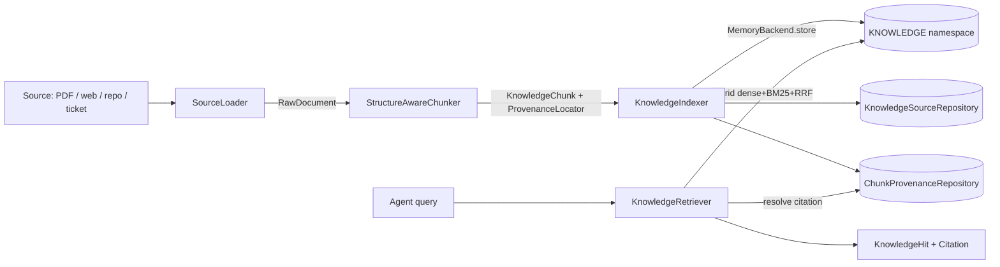

# Knowledge and Provenance Substrate

!!! warning "Designed behaviour; runtime in active development"

    This page is the source of truth for the **designed** behaviour of this
    subsystem. The components are built and unit-tested; the ingestion and
    retrieval pipeline runs inside a live agent, which is in active development
    (see the [Roadmap](../roadmap/index.md)).

SynthOrg separates three storage concerns:

- **Agent memory** (Mem0): what an agent remembers about a run. See
  [Memory and Persistence](memory.md).
- **Living documentation**: the org documenting itself as a dual-purpose wiki
  plus RAG namespace. See [Living Documentation](living-documentation.md).
- **Knowledge substrate** (this page): heavy-duty document/knowledge RAG over
  an ingested external corpus (specs, codebases, web pages, tickets) where
  every retrieved chunk carries a traceable citation.

The distinction matters: a product studio must answer "what does the 500-page
spec say about retries?" grounded with a citation that resolves to the exact
page and region, not paraphrased from an agent's fallible memory. Grounded,
citable output is the trust backbone for the red-team grounding check, the
benchmark, research mode, and deliverable receipts.

## What is reused, what is new

The substrate **reuses** the proven memory retrieval stack rather than
reinventing vector infrastructure:

- The `MemoryBackend` protocol is the pluggable vector store. Knowledge chunks
  are stored as memory entries in a dedicated namespace under a synthetic
  `SYSTEM_KNOWLEDGE_AGENT_ID`, mirroring how living documentation uses
  `SYSTEM_DOCS_AGENT_ID`.
- Hybrid retrieval (dense + BM25 sparse + Reciprocal Rank Fusion + optional LLM
  rerank) comes for free via the per-agent `backend.retrieve` path
  (`memory/ranking.py::fuse_ranked_lists`, `memory/sparse.py::BM25Tokenizer`).
- Persistence, manifest wiring, and the system-agent indexing idiom follow the
  living-documentation engine's patterns.

What is **new** is everything the living-documentation chunker cannot express:
multi-source loading, structure-aware chunking (AST for code, sections for
documents, page/region for PDFs), and a provenance model precise enough for
citations. The living-documentation `DocChunker` is structurally bound to
`LivingDocument`/`DocBlock` and cannot represent a PDF page, a source file, or
a web page without discarding the page, AST, and offset data that citations
need. The substrate therefore ships a parallel `src/synthorg/knowledge/`
package, not an extension of `docs_engine`.

## Pipeline



## Surface

```text
src/synthorg/knowledge/
  models.py          KnowledgeSource, KnowledgeChunk, ProvenanceLocator union,
                     Citation, KnowledgeHit, RawDocument / RawUnit
  config.py          KnowledgeConfig + loader / chunker discriminators
  constants.py       namespace, system agent id, tag prefixes, chunk budgets
  errors.py          KnowledgeError family (DomainError subclasses)
  loaders/
    protocol.py      SourceLoader
    pdf.py           PdfLoader (pdfplumber, per-page; thread-offloaded)
    web.py           WebLoader (injected HtmlFetcher + HTMLParseGuard sanitise)
    repo.py          RepoLoader (deterministic local tree walk)
    ticket.py        TicketLoader (staged on the #1991 governed connection)
    factory.py       build_source_loader
  chunking/
    protocol.py      StructureAwareChunker + ChunkPiece
    code.py          tree-sitter AST chunker (function / class / method units)
    document.py      OffsetChunker: char-offset chunker shared by documents,
                     ticket threads, and PDF pages (paragraph-packed)
    factory.py       build_chunker + chunk_raw_document orchestration
  indexer.py         KnowledgeIndexer
  freshness.py       content-hash dedup and invalidation
  retrieval.py       KnowledgeRetriever
  service.py         KnowledgeService
  factory.py         build_knowledge_service -> KnowledgeRuntime
  tool_factory.py    KnowledgeToolFactory (per-task agent tools)
```

## Data model

All models are frozen Pydantic v2 with `extra="forbid"`.

### Enums

| Enum | Values | Purpose |
|------|--------|---------|
| `SourceType` | `PDF`, `WEB`, `REPO`, `TICKET`, `DESIGN_DOC` | Origin of an ingested source. |
| `ContentKind` | `CODE`, `DOCUMENT`, `PDF_PAGE`, `TICKET_THREAD` | Drives chunker selection. |
| `SourceStatus` | `PENDING`, `INDEXED`, `STALE`, `FAILED` | Ingestion lifecycle state. |

A new top-level `MemoryCategory.KNOWLEDGE` is added (alongside `PROJECT_DOC`)
so knowledge entries are routed and filtered distinctly from agent memory.

### KnowledgeSource

A registered corpus source. Identified by `source_id`; scoped to a project or
global (`project_id = None`).

| Field | Type | Notes |
|-------|------|-------|
| `source_id` | `NotBlankStr` | Primary key. |
| `source_type` | `SourceType` | |
| `project_id` | `NotBlankStr \| None` | `None` means global (shared across projects). |
| `uri` | `NotBlankStr` | File path, URL, `repo@ref`, or ticket reference. |
| `title` | `NotBlankStr` | Human label. |
| `content_hash` | `NotBlankStr` | Hash of source bytes; short-circuits re-ingest. |
| `status` | `SourceStatus` | |
| `chunk_count` | `int` | |
| `created_at` / `updated_at` | `AwareDatetime` | |
| `last_indexed_at` | `AwareDatetime \| None` | |
| `last_error` | `NotBlankStr \| None` | Safe error description on failure. |

### ProvenanceLocator (the citation precision model)

A discriminated union on `locator_kind`. Each variant captures exactly enough
to resolve a chunk back to its source region.

| Variant | Fields |
|---------|--------|
| `PdfLocator` | `page: int`, `bbox: tuple[float, float, float, float] \| None`, `char_start: int`, `char_end: int` |
| `WebLocator` | `url: NotBlankStr`, `css_path: str \| None`, `char_start: int`, `char_end: int` |
| `CodeLocator` | `path: NotBlankStr`, `line_start: int`, `line_end: int`, `symbol: str \| None`, `ast_path: str \| None` |
| `TicketLocator` | `ticket_id: NotBlankStr`, `comment_id: str \| None`, `char_start: int`, `char_end: int` |

### KnowledgeChunk, Citation, KnowledgeHit

- `KnowledgeChunk`: `chunk_id`, `source_id`, `content_kind`, `chunk_index`,
  `text`, `content_hash`, `locator: ProvenanceLocator`, `tags`.
- `Citation`: the resolvable handle returned with every hit: `source_id`,
  `chunk_id`, `source_type`, `title`, `uri`, `locator`, `content_hash`.
- `KnowledgeHit`: `chunk_text`, `relevance_score`, `citation`.

`RawDocument` / `RawUnit` are the loader output (unit text plus raw locator
fields) handed to the chunker. External dict ingestion at the loader boundary
goes through `parse_typed()`.

## Ingestion

### Loaders

Every loader satisfies the `SourceLoader` protocol
(`load(source: KnowledgeSource) -> RawDocument`). Selection is factory-based on
`SourceType`, so a new source type is a new strategy plus a registry entry.

| Loader | Source | Notes |
|--------|--------|-------|
| `PdfLoader` | `PDF`, `DESIGN_DOC` | pdfplumber per page (parsing offloaded to a worker thread); one `RawUnit` per page with a `PdfLocator(page, char offsets)`. Citations resolve to the page; word-level `bbox` refinement is a planned follow-up (the field exists, unset today). |
| `WebLoader` | `WEB` | Fetches via an injected `HtmlFetcher` (the factory wires one on the governed HTTP path: network policy, SSRF, DNS pinning), sanitises with `HTMLParseGuard` to strip scripts and hidden-injection vectors, and emits one `DOCUMENT` unit with a `WebLocator`. |
| `RepoLoader` | `REPO` | Walks the local repo tree deterministically, skips VCS-internal / vendored / binary / oversized files, and emits one `CODE` unit per text file with a `CodeLocator` (repo-relative path + line span). |
| `TicketLoader` | `TICKET` | Live fetch routes through the merged governed external-API access tool (#1991). Transport wiring is staged after the MVP corpus, so the loader currently raises `KnowledgeSourceUnavailableError` rather than degrade silently. |

PDF support is **pdfplumber** (MIT). pymupdf is deliberately excluded: its AGPL
licence is incompatible with the project's BUSL-to-Apache model.

### Structure-aware chunking

Every chunker satisfies `StructureAwareChunker`
(`chunk_unit(unit: RawUnit) -> tuple[ChunkPiece, ...]`). Selection is
factory-based on `ContentKind`; `chunk_raw_document` dispatches each unit and
assigns deterministic positional chunk ids. Naive fixed-window chunking is
never the primary strategy; it is only an explicit last-resort fallback.

| Chunker | ContentKind | Strategy |
|---------|-------------|----------|
| `CodeChunker` (`code.py`) | `CODE` | tree-sitter parse via the standard `Parser` + `get_language`; split at function / class / method boundaries; `CodeLocator` with line span, symbol, and AST path. Language is chosen from the file extension; an unknown extension or absent grammar degrades to a deterministic line-window split. |
| `OffsetChunker` (`document.py`) | `DOCUMENT`, `TICKET_THREAD`, `PDF_PAGE` | Paragraph-packed split under a token budget; refines the unit's locator (`WebLocator` / `TicketLocator` / `PdfLocator`) with each chunk's char offsets, so PDF chunks keep their page (and bbox). |

## Retrieval

`KnowledgeRetriever.search(query, *, project_id, limit)` builds a `MemoryQuery`
(text plus the KNOWLEDGE namespace plus scope tags) and calls
`backend.retrieve(SYSTEM_KNOWLEDGE_AGENT_ID, query)`, which already runs the
dense + BM25 RRF hybrid and optional rerank. Each `MemoryEntry` becomes a
`KnowledgeHit`; the retriever resolves the full `Citation` by batched lookup
(`ChunkProvenanceRepository.get_many`). The scope filter matches
`project:<id>` OR `scope:global`.

Two retrieval paths, both first-class:

1. **Transparent** (`ProjectAwareMemoryFacade`): the facade fans out via
   `asyncio.TaskGroup` to the agent's own memories, project living-docs, AND
   the knowledge namespace, merging by descending relevance. An agent gets
   cited corpus hits without calling any special tool.
2. **Explicit** (`SearchKnowledgeTool`, MCP `knowledge:search`): an agent or
   operator runs a corpus-only query.

### Untrusted-content boundary (SEC-1)

Every `KnowledgeHit.chunk_text` is wrapped via `wrap_untrusted(...)` at the
retrieval boundary, on both the explicit tool result and the facade fan-out.
This applies to **all** source types, not only HTML: a PDF, source file, or
ticket comment can carry injected instructions just as a web page can.
Wrapping happens at retrieval, never on storage.

## Freshness and invalidation

`KnowledgeSource.content_hash` is the hash of the source bytes;
`KnowledgeChunk.content_hash` is per chunk (both via
`synthorg.versioning.hashing.compute_content_hash`).

- A re-ingest whose top-level source hash is unchanged short-circuits with no
  work.
- Otherwise the source is re-loaded and re-chunked, new chunk hashes are
  compared against the stored provenance rows, and only changed or new chunks
  are re-embedded. Removed chunks are deleted by `chunk:<id>` / `source:<id>`
  tag (idempotent, mirroring `DocIndexer._delete_prior`). Editing one line of
  a 500-page spec re-embeds one chunk, not the whole document.
- `reindex(source_id)` forces a reload; `list(stale_only=True)` surfaces
  sources whose source hash has drifted. Status transitions log at INFO after
  the persistence write.

## Persistence

Two repository protocols in `persistence/knowledge_protocol.py`, both
composing the generic categories from `_generics.py`:

- `KnowledgeSourceRepository(IdKeyedRepository, FilteredQueryRepository)`:
  `save` / `get` / `delete` / `list_items` / `query` / `count` over
  `KnowledgeSource`, filtered by project, scope, type, status, and a
  stale-only flag.
- `ChunkProvenanceRepository(IdKeyedRepository, FilteredQueryRepository)`:
  `ChunkProvenanceRow` keyed by `chunk_id` (a row is replaced on re-index, so
  it is keyed rather than an immutable event log). Two bespoke methods are
  added under [ADR-0001](../decisions/0001-repository-protocol-consolidation.md)
  D7: `get_many(chunk_ids)` (performance: resolve citations for a whole hit
  page in one round trip, avoiding N+1 reads) and `delete_by_source(source_id)`
  (domain invariant: re-index must purge a source's provenance atomically;
  callers must not bypass it with per-row deletes).

Concrete SQLite and Postgres implementations live under
`persistence/{sqlite,postgres}/` and are exposed on `PersistenceBackend`.
Schema ships as new yoyo revisions for both backends (never edit an existing
revision). Dual-backend conformance tests are required.

## Namespace and tags

| Constant | Value |
|----------|-------|
| `KNOWLEDGE_MEMORY_NAMESPACE` | `knowledge` |
| `SYSTEM_KNOWLEDGE_AGENT_ID` | `_system:knowledge` |

| Tag prefix | Purpose |
|------------|---------|
| `source:<id>` | Identifies the source doc; used for idempotent re-index delete. |
| `chunk:<id>` | Identifies the chunk; used for citation resolution and targeted delete. |
| `project:<id>` | Project scope filter. |
| `scope:global` | Marks a global (cross-project) source. |
| `kind:<content_kind>` | Lets a search hit expose its content kind without a repository lookup. |

## API surface

REST (read-only, dashboard):

| Method | Path | Returns |
|--------|------|---------|
| `GET` | `/projects/{project_id}/knowledge` | Paginated `KnowledgeSource[]` |
| `GET` | `/knowledge` | Paginated global `KnowledgeSource[]` |
| `GET` | `/projects/{project_id}/knowledge/search?q=...` | `KnowledgeHit[]` ordered by relevance |

Agent tools (in-process, per-task binding):

- `SearchKnowledgeTool` (`memory:read` action type)
- `IngestKnowledgeTool` (`knowledge:ingest` action type, admin via TrustService)

MCP handlers (operator-driven, `meta/mcp/domains/knowledge.py`):

- `knowledge:search` (read capability)
- `knowledge:ingest`, `knowledge:reindex` (admin capability, guardrail triple)

## Configuration

`KnowledgeConfig` (frozen) defaults to `enabled=False` until setup wires it.
It carries the `pdf_loader` and `code_chunker` discriminators (defaults
`pdfplumber` / `tree_sitter`) and a `reranker_enabled` flag. Chunk budgets and
namespace/tag constants live in `knowledge/constants.py` as module-level
`Final` values because they are part of the on-disk plus RAG-index contract: a
runtime change would silently invalidate previously indexed chunks (the same
rationale and gate allow-list as the living-documentation engine). Optional
dependencies (`pdfplumber`, `tree-sitter`, `tree-sitter-language-pack`) ship
under a `knowledge` extras group and import lazily; their absence raises
`KnowledgeDependencyError` with install guidance so the base install stays
lean.

## Acceptance

Ingest a mixed corpus (a repo, a PDF, and several web pages); an agent answers
a question with citations that resolve to the exact source chunk (PDF page and
region, code line span, or web URL and offset); changing a source invalidates
and re-indexes only the changed chunks. Validated end-to-end under the
simulation harness by `tests/integration/knowledge/test_knowledge_round_trip.py`,
plus the per-component unit suite under `tests/unit/knowledge/` and dual-backend
persistence conformance under `tests/conformance/persistence/`.
