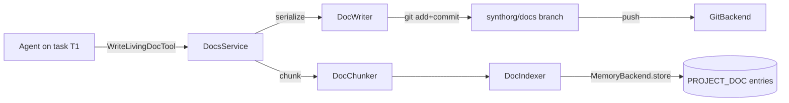

# Living Documentation

Per-project documentation that is **dual-purpose**: human-browsable as a
wiki in the dashboard AND chunked + embedded into the existing
hybrid-retrieval memory pipeline as a first-class RAG namespace. Status
reports and deliverables land here as living documents, versioned in
the project git workspace.

See also: [memory.md](memory.md), [engine.md](engine.md),
[page-structure.md](page-structure.md),
[knowledge-substrate.md](knowledge-substrate.md) (the sibling document/knowledge
RAG subsystem for ingested external corpora with citations).

## Goal

The org documents itself. A status report written by an agent on task
T1 is browsable in the dashboard immediately AND is retrieved by an
agent on task T2 days later via the standard memory search path.

## Surface

```text
src/synthorg/docs_engine/
  models.py          - LivingDocument + DocBlock discriminated union
  serializer.py      - deterministic JSON on disk (sorted keys, indent=2)
  chunker.py         - block-aware deterministic chunker
  indexer.py         - PROJECT_DOC entries with project + slug + type tags
  writer.py          - serialise -> workspace -> commit on docs branch
  slug.py            - kebab-case derivation with collision suffix
  service.py         - DocsService: write_doc, read_doc, list, search, history
  retrieval_facade.py - ProjectAwareMemoryFacade (TaskGroup fan-out)
  factory.py         - build_docs_service(...) -> DocsRuntime
  tool_factory.py    - DocsToolFactory: per-task agent tools
  constants.py       - chunk size, branch name, namespace, ...
  errors.py          - DocNotFoundError, DocVersionConflictError, ...
```

## Storage model

Each living doc is one JSON file at
``<workspace>/.synthorg/docs/<doc_type>/<slug>.json``. The bytes are
deterministic: identical doc state always produces identical bytes, so
git diffs stay localised when content changes and disappear entirely
on re-writes that change nothing.



## Doc types (taxonomy)

`DocType` is a `StrEnum` in `synthorg.docs_engine.enums`:

| Type | Purpose |
|---|---|
| `status_report` | Periodic or per-task summary an agent writes for progress and decisions. |
| `deliverable` | The artifact the studio is producing (PRD, design doc, research memo). Iteratively edited. |
| `knowledge_note` | Freeform knowledge captured by an agent during work. |
| `codebase_analysis` | Architecture and health assessment of an imported codebase, produced by the brownfield-intake analysis pass. |
| `run_narrative` | Human-readable account of a completed brief (decisions with rationale, who did what, outcomes), generated by the Chief-of-Staff narrator from the project brain and flight recorder. Decisions and metrics are deterministic, sourced blocks; the LLM writes only connective prose. |

All five share storage, chunking, and indexing. The type drives wiki
filtering and renderer affordances only.

## Block schema

`LivingDocument.body` is a `tuple[DocBlock, ...]` where `DocBlock` is a
discriminated union (`block_kind` literal). Day-one block kinds:

- `HeadingBlock(level=1..6, text)`
- `ProseBlock(text)` (plain text day one; no markdown)
- `BulletListBlock(items=(...))`
- `CodeBlock(language?, code)`
- `DecisionBlock(decision, rationale)`
- `MetricBlock(name, value, unit?)`
- `LinkBlock(label, url)`

Every block carries a stable `block_id` UUID so re-orders produce
meaningful git diffs even though the JSON encoding reshuffles bytes.

## RAG namespace

`MemoryCategory.PROJECT_DOC` is a new top-level memory category. Every
indexed chunk lives in one fixed namespace `project_docs`; per-project
scoping uses tags:

| Tag prefix | Purpose |
|---|---|
| `project:<id>` | Project scope. The retrieval facade filters by this. |
| `doc_slug:<slug>` | Identifies the source doc. Used by the indexer to delete prior chunks idempotently. |
| `doc_type:<value>` | Doc taxonomy bucket. Lets search hits expose the type without a per-hit repository lookup. |

Chunks store under the synthetic `SYSTEM_DOCS_AGENT_ID = "_system:docs"`
agent ID so the per-agent storage abstraction stays intact.

## Retrieval paths

Two paths, both first-class:

1. **Transparent** (`ProjectAwareMemoryFacade`): when an agent on
   project P calls `memory.retrieve(agent_id, query)`, the facade
   fans out via `asyncio.TaskGroup` to the agent's own memories AND to
   `PROJECT_DOC` entries scoped to P. Results merge by descending
   relevance score. Project docs become first-class RAG members
   without any special-casing in agent code.
2. **Explicit** (`SearchLivingDocsTool`, `DocsService.search`): an
   agent calls the docs-only search tool when it wants a doc-specific
   query (e.g. "list deliverables tagged checkout").

## Versioning

Each doc write goes through the existing per-project push queue (#1974)
to commit on a dedicated `synthorg/docs` branch. History equals
`git log`. Persistence stores only the latest commit pointer + the SHA
last seen by the indexer:

```text
project_docs(project_id, slug, doc_type, title, tags,
             head_commit_sha,
             last_indexed_commit_sha,  -- nullable; gaps replayed on boot
             created_at, updated_at)
```

A gap between `head_commit_sha` and `last_indexed_commit_sha` indicates
chunks that were committed but never reached the memory backend (e.g.
transient outage). A boot-time replay job re-indexes those commits;
the indexer is idempotent because prior chunks are deleted by the
`doc_slug:<slug>` tag before fresh ones are stored.

## Slug policy

Slugs are derived from the title: `kebab(title)`. On collision against
existing slugs in the same project + doc_type bucket, the service
appends `-2`, `-3`, ... Agents never supply slugs via the write tool
(decision 9 in the plan). The slug + project_id is the composite
primary key on the metadata row.

## API surface

REST (read-only, web dashboard):

| Method | Path | Returns |
|---|---|---|
| `GET` | `/projects/{project_id}/docs` | Paginated `DocSummary[]` (recency-first) |
| `GET` | `/projects/{project_id}/docs/{slug}` | `LivingDocument` |
| `GET` | `/projects/{project_id}/docs/{slug}/history` | `DocVersion[]` from git log |
| `GET` | `/projects/{project_id}/docs/search?q=...` | `DocSearchHit[]` ordered by relevance |

Agent tools (in-process; per-task binding):

- `WriteLivingDocTool` (`docs:write` action type, admin via TrustService)
- `SearchLivingDocsTool` (`memory:read` action type)

MCP handlers (operator-driven, via `synthorg.meta.mcp.domains.docs`):

- `docs:write` (admin capability)
- `docs:get`, `docs:list`, `docs:search`, `docs:history` (read capability)

## Web dashboard

Page lives at `web/src/pages/ProjectDocsPage.tsx`, route
`/projects/:projectId/docs[/slug]`. Layout: doc list sidebar +
`DocViewer` main area. `DocBlockRenderer` has one renderer per block
kind, all using design tokens (no hardcoded hex / pixel spacing).
Untrusted-content wrap (SEC-1) is applied at the agent retrieval
boundary, not on storage.

## Acceptance (#1976)

The org produces a status report and a deliverable doc; both are
browsable in the dashboard AND retrievable by an agent via memory on
a later task. Validated end-to-end by
`tests/integration/docs_engine/test_service_round_trip.py`:

- `test_write_then_read_returns_same_doc`
- `test_write_commits_on_docs_branch`
- `test_search_returns_indexed_doc`
- `test_facade_surfaces_doc_for_other_agent` (decision 8a, the
  "another agent on a later task" path)
- `test_reindex_replaces_prior_chunks`
- `test_versioned_read_via_git_show`

Plus the per-component unit suite under `tests/unit/docs_engine/`
(40 tests covering models, serializer, chunker, indexer, slug,
PROJECT_DOC category) and the dual-backend persistence conformance
under `tests/conformance/persistence/test_docs_repository.py`
(28 SQLite + Postgres tests).
