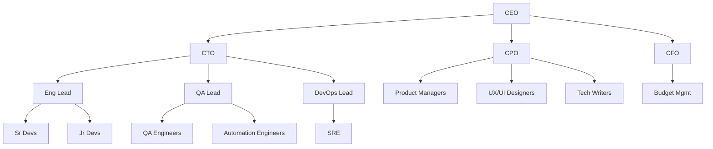

# Organisation & Templates

A deployment declares a roster: which roles exist, how many agents hold each,
and which department each sits in. The declaration is plumbing for the build,
not a simulation anyone is meant to watch. Three things read it:

- **Decomposition** is offered only the roles the roster actually staffs, so a
  plan item is owned by a role somebody holds. Roles that judge work are
  excluded from that list (see [Built-in Roles](agents.md#built-in-roles)).
- **Selection** decides which agent takes a unit of work, and which agent is
  available to check a unit it did not write.
- **Posture** expands to the runtime feature flags the deployment starts with.

Nothing on this page decides what gets built or whether it works. It decides who
is available when the work is split up and when a finished part needs checking.

## Company Types

Templates are pre-built rosters. Each declares its agents, departments,
reporting lines and a posture:

| Template | Size | Posture | Autonomy | Communication | Workflow | Use Case |
|----------|------|---------|----------|---------------|----------|----------|
| **Solo Builder** | 3-4 | autonomous | full | event_driven | kanban | Quick prototypes, solo projects |
| **Tech Startup** | 4-7 | autonomous | semi | hybrid | agile_kanban | Small projects, MVPs |
| **Engineering Squad** | 6-10 | cost_disciplined | semi | hybrid | agile_kanban | Software throughput on a budget |
| **Product Studio** | 9-14 | knowledge_heavy | semi | event_driven | agile_kanban | Discovery-led product development |
| **Agency** | 10-15 | supervised_client_facing | supervised | hierarchical | kanban | Creative and marketing client work |
| **Enterprise Org** | 20-50 | supervised_client_facing | supervised | hierarchical | agile_kanban | Large roster with department policies |
| **Research Lab** | 5-10 | research_autonomous | full | event_driven | kanban | Research and analysis |
| **Consultancy** | 4-6 | supervised_client_facing | supervised | hierarchical | kanban | Senior client-facing advisory |
| **Data Team** | 5-8 | knowledge_heavy | full | event_driven | kanban | Analytics and ML pipelines |
| **Support Desk** | 5-7 | supervised_client_facing | supervised | hierarchical | kanban | Customer support, incident response |
| **Security Team** | 6-8 | security_hardened | supervised | hierarchical | kanban | Threat modelling, security review |
| **Growth Marketing Studio** | 5-8 | cost_disciplined | semi | hybrid | agile_kanban | Content, campaigns, growth |
| **Custom** | Any | none | semi | hybrid | agile_kanban | Anything |

A template's **posture** expands to a coherent bundle of runtime feature flags
(knowledge substrate, conversational chat modes, mid-flight steering, red-team
gate, economical reasoning), so a template configures runtime behaviour and not
only who is on the roster. See [Operating Postures](#operating-postures).

!!! info "Roster size is not wave size"
    The `Size` column describes the whole roster, not the number of agents
    working a single wave. Wave size is bounded separately by
    `coordination.max_concurrency_per_wave` (settings-registry default **5**),
    so a 50-agent roster does not run 50-agent waves. See
    [Task Decomposability & Coordination Topology](coordination.md#task-decomposability-coordination-topology)
    for the full bounds, and
    [S1 Multi-Agent Architecture Decision §2](../research/s1-multi-agent-decision.md#section-2-team-size-bounds)
    for the cited per-group recommendation.

See the [Template System](#template-system) section for details on how templates are defined,
inherited, and customised.

### Operating Postures

A template declares a named **posture** that resolves to a frozen bundle of
runtime feature flags. The bundle threads into the company configuration: the
config-resident knob (`security.red_team`) is set on the rendered `RootConfig`,
and the settings-resident flags (conversational chat modes, mid-flight steering,
per-stakes reasoning depth) are seeded into the settings service at setup so the
failure-tolerant boot wiring enables them, but only where the write actually
changes something: conversational chat propose/routing, group chat, and
steering all ship on by default, so no posture writes them, and the table below names
only the writes that differ from a fresh deployment's defaults. Boot wiring
degrades cleanly when a dependency (provider, persistence, memory backend) is
absent.

| Posture | Enables |
|---------|---------|
| `autonomous` | *(nothing beyond the shipped defaults: steering is already on)* |
| `supervised_client_facing` | Agent invite |
| `knowledge_heavy` | *(nothing beyond the shipped defaults: propose and steering are already on)* |
| `cost_disciplined` | Economical reasoning (`engine.reasoning_effort_{high,critical}` dialled one notch down; `low`/`normal` already sit at the registered floor) |
| `security_hardened` | Red-team completion gate (knowledge-substrate grounding) |
| `research_autonomous` | *(nothing beyond the shipped defaults: propose, routing and steering are already on)* |

`cost_disciplined` deliberately leaves the capability floors alone. Reasoning
depth tunes how hard the bound model thinks, which is a spend lever; the floors
decide whether work may run at all, so lowering them would let a cost posture
silently weaken a security posture it was merged with.

Postures resolve through a pluggable `PostureExpansionStrategy` (default: a
curated named-bundle registry). Inheritance is child-wins: a child template's
posture replaces its parent's. A template pack may declare a posture that unions
additively into the host template's bundle (each flag takes the more-capable
value). The toolsmith is intentionally not posture driven: enabling it needs an
explicit capability allowlist, so it stays an operator opt-in.

### Skill Pattern Taxonomy

Each template is classified using a five-pattern taxonomy that describes how its agents
interact to accomplish work. Based on
[Google Cloud's agent skill design patterns](https://cloud.google.com/blog/topics/developers-practitioners/5-agent-skill-design-patterns):

| Pattern | Description |
|---------|-------------|
| **Tool Wrapper** | On-demand domain expertise; agents self-direct using specialised context |
| **Generator** | Consistent structured output from reusable templates |
| **Reviewer** | Modular rubric-based evaluation; separates what to check from how to check it |
| **Inversion** | Agent interviews user before acting; structured requirements gathering |
| **Pipeline** | Strict sequential workflow with hard checkpoints between stages |

Templates declare which patterns they exhibit via the `skill_patterns` metadata field:

| Template | Skill Patterns |
|----------|----------------|
| **Solo Builder** | Tool Wrapper |
| **Tech Startup** | Tool Wrapper, Generator, Pipeline |
| **Engineering Squad** | Pipeline, Reviewer, Tool Wrapper |
| **Product Studio** | Inversion, Pipeline, Reviewer |
| **Agency** | Pipeline, Generator, Reviewer |
| **Enterprise Org** | Tool Wrapper, Generator, Reviewer, Inversion, Pipeline |
| **Research Lab** | Inversion, Generator, Reviewer |
| **Consultancy** | Generator, Inversion, Reviewer |
| **Data Team** | Generator, Reviewer, Tool Wrapper |
| **Support Desk** | Inversion, Reviewer, Tool Wrapper |
| **Security Team** | Inversion, Reviewer, Tool Wrapper |
| **Growth Marketing Studio** | Generator, Reviewer, Tool Wrapper |

Patterns compose naturally: a Pipeline can embed a Reviewer step at each gate, a Generator
can begin with an Inversion phase to gather variables, and individual Pipeline stages can
activate different Tool Wrapper skills depending on the domain.

---

## Organisational Hierarchy

Each `Role` declares an optional `reports_to`, and those declarations form a
reporting graph rooted at the CEO. `core/authority.py` is what reads it, and it
answers one question: which of two roles is the more senior. Owner selection,
plan-review panel selection and department-head detection compare reporting
depth through those helpers instead of reading a per-agent seniority number.

A large template declares a graph of roughly this shape:



Each node becomes an [agent](agents.md) once an operator staffs the role.
Position in the graph decides delegation and approval authority and nothing
else: a role's model capability is a separate axis driven by what the work
demands, never by where the role sits. See
[Authority: role and reporting graph](hr-lifecycle.md#authority-role-and-reporting-graph).

---

## Department Configuration

???+ example "Full department configuration YAML"

    ```yaml
    departments:
      - name: "engineering"
        head: "cto"
        budget_percent: 60
        policies:
          review_requirements:
            min_reviewers: 2
          approval_chains:
            - action_type: "code_review"
              approvers: ["Software Architect", "CTO"]
        teams:
          - name: "backend"
            lead: "backend_lead"
            members: ["sr_backend_1", "mid_backend_1", "jr_backend_1"]
          - name: "frontend"
            lead: "frontend_lead"
            members: ["sr_frontend_1", "mid_frontend_1"]
        reporting_lines:
          - subordinate: "Backend Developer"
            subordinate_id: "backend-senior"
            supervisor: "Software Architect"
          - subordinate: "Backend Developer"
            subordinate_id: "backend-mid"
            supervisor: "Backend Developer"
            supervisor_id: "backend-senior"
          - subordinate: "Frontend Developer"
            supervisor: "Software Architect"
      - name: "product"
        head: "cpo"
        budget_percent: 20
        teams:
          - name: "core"
            lead: "pm_lead"
            members: ["pm_1", "ux_designer_1", "ui_designer_1"]
      - name: "operations"
        head: "coo"
        budget_percent: 10
        teams:
          - name: "devops"
            lead: "devops_lead"
            members: ["sre_1"]
      - name: "quality"
        head: "qa_lead"
        budget_percent: 10
        teams:
          - name: "qa"
            lead: "qa_lead"
            members: ["qa_engineer_1", "automation_engineer_1"]
    ```

Each department defines:

- **head** (optional): the agent who leads the department (typically a C-suite or Lead role).  Defaults to ``None`` when no head is designated; hierarchy resolution skips the team-lead-to-head link for headless departments. When multiple agents share the same role name, use the companion ``head_id`` field to disambiguate. In template YAML this is written as ``head_merge_id`` (matching the agent's ``merge_id``); the renderer maps it to ``head_id`` at runtime, paralleling how ``subordinate_id``/``supervisor_id`` work in ``reporting_lines``
- **budget_percent**: the share of the company's task-execution budget allocated to this department (covers agent compute and API costs, not provider subscriptions or seat licensing)
- **teams**: named sub-groups within the department; each has a lead and members
- **reporting_lines**: explicit subordinate/supervisor relationships within the department. Each entry has ``subordinate`` and ``supervisor`` (role names), plus optional ``subordinate_id``/``supervisor_id`` for disambiguating agents that share the same role name (typically matching the agent's ``merge_id``)
- **policies** (optional): department-level operational policies. Contains ``review_requirements`` (minimum reviewers, required reviewer roles, self-review toggle) and ``approval_chains`` (ordered approver lists keyed by action type such as ``code_review``, ``security_review``, or ``change_management``).  Defaults to a single required reviewer and no approval chains when omitted

---

## Changing Headcount

The roster changes through two mechanisms, both ending at an operator:

- **Operator edit**: a human adds or removes agents via config or the dashboard
- **Gate-role hire**: a task parks when no roster agent holds the role that must
  judge it, and the review-staffing reconciler opens exactly one approval-gated
  [hire](hr-lifecycle.md#hiring-process) for that role org-wide

---

## Template System

Templates are YAML/JSON files defining a complete company setup. The framework uses templates as
the primary mechanism for bootstrapping organisations.

### Template Structure

```yaml
# templates/startup.yaml (simplified; real templates also declare
# min_agents/max_agents, tags, and department policies)
template:
  name: "Tech Startup"
  description: "Small team for building MVPs and prototypes"
  version: "1.0"

  variables:
    - name: "sprint_length"
      description: "Sprint duration in days"
      var_type: "int"
      default: 7
    - name: "wip_limit"
      description: "Work-in-progress limit per column"
      var_type: "int"
      default: 3

  posture: "autonomous"            # expands to a runtime feature-flag bundle

  company:
    type: "startup"
    budget_monthly: "{{ budget | default(50.00) }}"
    autonomy:
      level: "semi"

  # Built-in templates omit the agent `name` field entirely; Faker
  # auto-generates names at render time using the locales selected in the
  # Names setup step. User-defined templates may instead set an explicit
  # name or a Jinja2 placeholder (e.g. {{ name | auto }}).
  # The `model` field is a capability reference: either a structured dict
  # (priority / min_context / requires_vision / requires_reasoning, plus an
  # optional family or model_pattern), or an
  # explicit model id/alias string to pin a configured model. The matcher
  # resolves it against the configured providers. Built-in templates use
  # capability dicts so they resolve on any provider, Ollama Cloud included.
  agents:
    - role: "CEO"                     # name omitted -> Faker at render time
      model:                          # capability requirement
        priority: "quality"
        min_context: 100000
        requires_reasoning: true

    - role: "CTO"
      model:
        priority: "quality"
        min_context: 100000
        requires_reasoning: true

    - role: "Full-Stack Developer"
      merge_id: "fullstack-senior"
      model:
        priority: "balanced"

    - role: "Full-Stack Developer"
      merge_id: "fullstack-mid"
      model:
        priority: "cost"

    - role: "Product Manager"
      model:
        priority: "speed"

  departments:
    - name: "executive"
      budget_percent: 20
      head_role: "CEO"
      reporting_lines:
        - subordinate: "CTO"
          supervisor: "CEO"
    - name: "engineering"
      budget_percent: 60
      head_role: "CTO"
      reporting_lines:
        - subordinate: "Full-Stack Developer"
          subordinate_id: "fullstack-senior"
          supervisor: "CTO"
        - subordinate: "Full-Stack Developer"
          subordinate_id: "fullstack-mid"
          supervisor: "CTO"
    - name: "product"
      budget_percent: 20
      head_role: "Product Manager"

  workflow: "agile_kanban"     # operational configs vary per template;
  communication: "hybrid"      # see Company Types table for each template's defaults

  workflow_config:             # optional Kanban/Sprint sub-configurations
    kanban:
      wip_limits:
        - column: "in_progress"
          limit: {{ wip_limit | default(3) }}
        - column: "review"
          limit: 2
      enforce_wip: true
    sprint:
      duration_days: {{ sprint_length | default(7) }}

  workflow_handoffs:
    - from_department: "engineering"
      to_department: "product"
      trigger: "Feature implementation completed for product review"
      artifacts:
        - "pull_request"
        - "release_notes"

  escalation_paths:
    - from_department: "engineering"
      to_department: "executive"
      condition: "Technical blocker requiring executive decision"
      priority_boost: 1
```

Templates support **Jinja2-style variables** (`{{ variable | default(value) }}`) for
user-customisable values.

### Template Inheritance

Templates can extend other templates using `extends`:

```yaml
template:
  name: "Extended Startup"
  extends: "startup"         # inherits all agents, departments, config
  agents:
    - role: "QA Engineer"    # appended to parent agents
      level: "mid"
    - role: "Full-Stack Developer"
      merge_id: "fullstack-mid"
      department: "engineering"
      _remove: true          # removes matching parent agent by key
```

Inheritance resolves parent-to-child chains up to **10 levels deep**. Circular inheritance
is detected via chain tracking and raises `TemplateInheritanceError`.

**Built-in inheritance tree:**

```text
solo_founder (base)
  -> startup (extends solo_founder)
     -> dev_shop (extends startup)
     -> product_team (extends startup)

research_lab (base)
  -> data_team (extends research_lab)

Standalone (no inheritance): agency, consultancy, full_company,
                             support_desk, security_team, growth_marketing
```

Each template's roster size is declared by its own `min_agents` / `max_agents`
(see the Company Types table); extending templates inherit the parent roster
and append (or `_remove`) their own agents.

Every shipped template staffs a **Completion Reviewer** in quality assurance,
and the security-hardened ones additionally staff a **Red Team**, because both
completion gates select a holder of their role rather than building one: an org
that staffs neither parks its reviewed work instead of shipping it unreviewed.
The gate excludes the executor and nothing else, so a one-agent org is the
inherently impossible case: the sole agent is always the executor and there is
nobody left to judge. Two agents suffice whenever the non-executing one holds
`Completion Reviewer`. `solo_founder` is three agents because it staffs two
working agents alongside the reviewer, which is a template invariant rather
than an org-wide minimum.
`tests/unit/templates/test_builtin_staffing.py` holds every builtin to that
standard.

### Merge Semantics

The merge behaviour during template inheritance follows these rules:

Scalars (`company_name`, `company_type`)
:   Child wins if present.

`config` dict
:   Deep-merged (child keys override parent).

`agents` list
:   Merged by `(role, department, merge_id)` composite key. When `merge_id` is omitted, it
    defaults to an empty string, making the key `(role, department, "")`. The child template
    can override, append, or remove (`_remove: true`) parent agents.

`departments` list
:   Merged by department `name` (case-insensitive). A child department with the same `name`
    replaces the parent entry entirely; departments with new names are appended.
    A child department with `_remove: true` removes the matching parent department.

`workflow_config` dict
:   Not merged during inheritance. Each template's ``workflow_config`` is
    transformed into a ``workflow`` dict by ``_build_workflow_dict`` during
    rendering (before the merge step).  A child template that uses ``extends``
    must declare its own ``workflow_config`` if it needs one; the parent's
    ``workflow_config`` is not carried forward as raw config.

`workflow` dict
:   The renderer always produces a ``workflow`` dict from ``workflow_config``
    (or schema defaults), so ``workflow`` is always present in the child's
    rendered output. At merge time the child's ``workflow`` replaces the
    parent's entirely; the "inherit from parent" path cannot trigger.

`workflow_handoffs` and `escalation_paths`
:   Child replaces entirely if present; otherwise inherited from parent.
    Unlike ``workflow``, these fields may be absent from the rendered output,
    so the inherit-from-parent fallback applies.

After merging, agent names are deduplicated: if parent and child auto-generation
produces the same name, later occurrences receive a numeric suffix (e.g.,
``"Kenji Matsuda 2"``).

### Template Packs

Packs are small, focused template fragments (same schema as full templates)
that can be applied additively to a running org or composed into templates
via the `uses_packs` field.

**Built-in packs** (in `src/synthorg/templates/packs/`):

| Pack | Agents | Description |
|------|--------|-------------|
| `security-team` | Security Engineer, Security Operations, Red Team | Threat modelling and compliance; the pack's hardened posture arms the red-team completion gate, so it staffs a holder of the role |
| `data-team` | Data Analyst, Data Engineer, ML Engineer | Data analytics pipeline |
| `qa-pipeline` | QA Lead, QA Engineer, Automation Engineer | Quality assurance |
| `creative-marketing` | Content Writer, Brand Strategist | Content and brand |
| `design-team` | UX Designer, UX Researcher | Design and user research |
| `verifier-harness` | Planner, Generator, Evaluator | Three-agent verification with calibrated rubric grading (see [Verification & Quality: Verification Stage](verification-quality.md#verification-stage)) |

**User packs** live in `~/.synthorg/template-packs/` (YAML files). User packs
override built-in packs of the same name.

**Composition via `uses_packs`:**

```yaml
template:
  name: "Full Company"
  extends: "startup"
  uses_packs:
    - "security-team"
    - "qa-pipeline"
```

Resolution order: `extends` parent is merged first, then each pack in
`uses_packs` order, then the template's own fields override last. Circular
pack dependencies are detected and raise `TemplateRenderError`.

**Live application:**

The `POST /api/v1/template-packs/apply` endpoint applies a pack to a running
org by adding its agents and departments to the existing config. Department
names are deduplicated (case-insensitive); agent names are deduplicated by
name.

---

## Company Builder

The web dashboard includes a setup wizard with a mode selection gate after account creation
(conditional; only shown when no admin exists). The user chooses **Guided Setup**
(recommended, full wizard) or **Quick Setup** (minimal: company name + provider, configure
the rest later in Settings). Guided mode steps: Mode, Template (searchable grid with
category/size filters, recommended/others grouping, and structural metadata cards showing
agent count, departments, autonomy level, and workflow), Company (name, description,
currency, and model spend profile), Providers (configure LLM providers with auto-detection
for local instances (with probe-detected base URLs) and full provider form supporting
API key, subscription, custom configurations, and manually entered base URLs),
Agents (customise names, roles, and model assignments),
Theme (set UI preferences for palette, density, animation, sidebar, and typography), and
Complete (review summary and launch). Quick mode steps: Mode, Company, Providers, and
Complete, skipping template, agents, and theme. Providers are configured before agents so
model assignment is available during agent customisation. When a template is selected, all
template agents are auto-created with models matched to configured providers via a tier
classification engine that respects each agent's priority axis (quality, speed, cost, or
balanced). All configuration is persisted to the database via REST API calls. To re-run the
setup wizard from scratch, use `synthorg wipe` (walks you through an interactive backup,
wipes all data, and optionally restarts the stack to re-open the wizard).

---

## MCP Service Facades

The organisation domain exposes service facades on `AppState` for MCP handler shims
(`CompanyReadService`, `DepartmentService`, `TeamService`, `RoleVersionService`). The
facade inventory and the MCP args contract live in the
[MCP Handler Contract reference](../reference/mcp-handler-contract.md#organisation-domain-service-facades).
