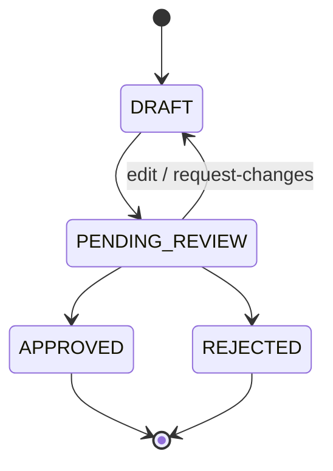

# Plan Review

The plan-review subsystem turns the decomposed breakdown of an objective from a
transient value into a durable, reviewable, editable first-class entity. When the
plan-approval gate is enabled, splittable team work is decomposed into a `Plan`,
persisted, and parked for a human decision before any team builds. An operator can
read, rework, or send the plan back for changes through the `/plans` API and the
Plan Review workspace, then approve or reject it through the existing `/approvals`
decision path.

## Durable Plan Entity

`Plan` (`core/plan.py`) is the first-class replacement for a plan that previously
lived only as a `DecompositionResult` serialised into an approval's metadata. It is
persisted, versioned, and revisable, and outlives the approval decision: the approval
carries only the plan's `plan_id`.

- **`Plan`**: `id` (UUID), `project`, `objective_id`, `objective_title`
  (denormalised at creation so the surface never resolves, or falls back to, a raw
  id), `parent_task_id`, `items` (ordered tuple forming a dependency DAG),
  `task_structure`, `coordination_topology`, `status`, `forecast_id`, `review` (the
  consolidated stakeholder-panel review, or `None`), `open_questions` and
  `assumptions` (what the planner surfaced for the human), `objective_criteria` (the
  objective's acceptance criteria, denormalised for the coverage map),
  `version_history` (snapshots of prior submitted versions), `version`,
  `created_at`, `updated_at`. A model validator rejects an empty item list,
  duplicate item ids, an unresolvable dependency, or a dependency **cycle**
  (topological sort), so a malformed plan is caught at construction rather than as a
  dispatch failure.
- **`PlanItem`**: `id` (a canonical UUID string, because dispatch rebuilds each
  child task from it), `title`, `description`, `dependencies`, `owner`,
  `acceptance_criteria`, `expected_artifacts`, `required_skills`, `required_tags`,
  `estimated_complexity`, `stakes`, `kind` (`WORK` or `DECISION`), `options` and
  `chosen_option_id` (decision items), and `satisfies` (the objective criteria this
  item advances). A validator rejects a non-UUID id, a self-dependency, or duplicate
  dependencies.

### Decision items

A `PlanItem` with `kind = DECISION` is a real choice the plan hinges on (stack,
architecture) rather than a unit of work. It carries `options` (at least two
`PlanOption`s, exactly one `recommended`, unique ids) and an optional
`chosen_option_id`; a `WORK` item carries neither (`validate_decision_options`).
The generator emits a decision where a genuine choice exists; the reviewer records
the pick on the review workspace, and `PlanItem.resolved_option()` resolves it to
the chosen option or, absent a pick, the recommended one. Decision items are not
executed: `decomposition_from_plan` strips them from the dispatchable tree (and
from remaining items' dependencies), and on approval each resolved decision is
recorded into the project brain as a first-class `DECISION` entry
(`api/controllers/_plan_decision_record.py`) so the company's shaping choices
survive rather than vanishing.

### Stakeholder review panel

Before the plan is parked for the human, a bounded panel of stakeholder agents
reviews it (`engine/plan_review/`). `select_review_panel` seats the relevant leads
(CTO, CFO, department heads for the domains touched, a senior peer), sized to the
plan and excluding the owner (no self-review). Each panellist runs a bounded
persona session (`AgentSessionPlanReviewPanel`) and submits a structured verdict
(`ENDORSED` / `CONCERNS` / `REVISION_REQUESTED`) with categorised findings; a
deterministic synthesis (`synthesise_review`) consolidates them onto `Plan.review`
(overall verdict = the most severe). The panel is wired best-effort at startup and
runs as a distinct pipeline phase between decompose and the human gate; when no
panel is attached the plan is parked with `review = None`.

### Lifecycle (`PlanStatus`)

An edit or request-changes is accepted only from a non-terminal status.

`DRAFT` and `PENDING_REVIEW` are the reworkable statuses; `APPROVED`, `REJECTED`,
and `SUPERSEDED` are terminal. An operator rework or request-changes is accepted
only from a reworkable status, so a decided plan cannot be revived. Each edit bumps
`version`, and every write is version-guarded (optimistic concurrency): a stale
writer is rejected with a conflict rather than silently clobbering a concurrent edit.

## Persistence

`PlanRepository` (`persistence/plan_protocol.py`) composes the ADR-0001 generics
`IdKeyedRepository[Plan, NotBlankStr]` + `FilteredQueryRepository[Plan,
PlanFilterSpec]`, with SQLite and Postgres implementations kept in parity. The
`plans` table stores `items` as JSON (a non-empty array, CHECK-enforced), and
`review` / `open_questions` / `assumptions` / `objective_criteria` /
`version_history` as JSON columns; Postgres uses `TIMESTAMPTZ` for the timestamps
and a composite `(project, status, id)` index for the combined-filter list query.
`update()` takes an `expected_version` guard and raises
`PersistenceVersionConflictError` when the stored version has moved.

Per-item discussion lives in a separate append-only store,
`PlanItemCommentRepository` (`persistence/plan_comment_protocol.py`, composing
`AppendOnlyRepository`), backed by the `plan_item_comments` table. Comments are
immutable and written independently of the version-guarded plan row, so posting a
comment never conflicts with a concurrent rework.

## Decomposition Projection

`engine/decomposition/plan_mapping.py` projects both directions so the gate, the
API, and the resume path stay in step:

- `plan_from_decomposition()` builds a durable `Plan` from an executed
  `DecompositionResult` (subtasks become plan items).
- `decomposition_from_plan()` rebuilds a dispatchable `DecompositionResult` from a
  (possibly operator-edited) durable plan, so the tree that builds on approval is
  exactly the plan under review. Each child task carries the item's acceptance
  criteria and expected artifacts, so the fail-loud zero-artifact guard engages on
  the plan-review dispatch path.

## API

`PlanController` (`api/controllers/plans.py`, path `/plans`) owns the plan-native
capabilities the approval flow lacks; approve/reject stay on `/approvals`.

| Method | Path | Purpose |
|--------|------|---------|
| `GET` | `/plans` | List plans (cursor pagination; `status` / `project` / `objective_id` filters) |
| `GET` | `/plans/{id}` | Fetch a plan |
| `PATCH` | `/plans/{id}` | Rework items (new revision, back to `PENDING_REVIEW`) |
| `POST` | `/plans/{id}/request-changes` | Send back to `DRAFT` with a note |
| `GET` | `/plans/{id}/comments` | List a plan's comments oldest-first (optional `item_id`) |
| `POST` | `/plans/{id}/comments/items/{item_id}` | Post a comment on an item |

`PlanService` (`api/services/plan_service.py`) owns the lifecycle transitions with
uniform `API_PLAN_*` audit logging, the terminal-status guard, version-conflict
translation, and the `sync_status()` used by the approval-resume path so the
decision transition gets the same audit coverage as an operator edit. On a rework
it snapshots the pre-edit version into `version_history` (bounded), so a reviewer
can diff how a revision addressed the panel's concerns. Edits and decisions publish
`plan.updated` / `plan.changes_requested` events, and a posted comment publishes
`plan.comment_added`, all on the `plans` WebSocket channel. The comment endpoints
live on `PlanCommentController` (`api/controllers/plan_comments.py`); the author is
taken from the authenticated user, never the request body.

## Dispatch on Approval

Approve/reject route through the existing idempotent `/approvals/{id}` path into
`try_plan_review_resume` (`api/controllers/_plan_review_resume.py`), keyed off the
`ApprovalSource.PLAN_REVIEW` discriminator:

- The decision is reflected onto the durable plan first (`APPROVED` / `REJECTED`).
- On approve, the durable plan is loaded and rebuilt via `decomposition_from_plan`
  and dispatched through `coordinate(precomputed_plan=...)`. A dispatch failure
  (missing coordinator, missing task, missing plan, or a coordinator error) marks
  the parent task `FAILED` so the stuck plan surfaces on the board and stays
  re-runnable; the plan stays `APPROVED` because the decision stands.
- On reject, the parent task is cancelled and nothing builds.
- The gate persists the plan before parking the approval; if the approval write
  fails, the just-created plan is compensated (deleted) so no orphan remains.

## Configuration

The subsystem is gated and sized by five `coordination.*` settings
(`settings/definitions/coordination.py`), all applied on the next
runtime-services rebuild:

| Setting | Default | Purpose |
|---------|---------|---------|
| `coordination.plan_approval_required` | `false` | Master gate: when off, splittable team work dispatches straight to the coordinator and no plan is parked. Everything below is inert until this is on. |
| `coordination.plan_review_panel_enabled` | `true` | Whether the stakeholder panel runs before the human sees the plan. Defaults on, but only takes effect once approval is gated and a provider is wired; otherwise the plan is parked with `review = None`. |
| `coordination.plan_review_panel_size` | `4` (max `8`) | Maximum panellists seated (the relevant leads sized to the plan, not everyone). |
| `coordination.plan_review_panel_max_turns` | `6` | Hard turn cap per panellist session before it must submit a verdict. |
| `coordination.plan_review_panel_cost_ceiling` | `1.0` | Per-reviewer spend ceiling (base currency); the session halts once accumulated cost reaches it. |

## Workspace

The Plan Review workspace (`web/src/pages/PlansPage.tsx`, `PlanDetailPage.tsx`, and
`web/src/pages/plans/`) is a pure API consumer: it hydrates from `GET /plans`, walks
every cursor page so the review inbox can filter and sort across the whole set, and
writes every change through the API. The detail page reworks items (title,
description, owner, complexity, stakes) or sends the plan back for changes, and
surfaces a disconnected-updates banner when the WebSocket drops. Beyond the item
list, it renders review panels derived from the plan (no extra persisted state):

- **Needs your input** (`PlanOpenQuestionsPanel`): the planner's open questions and
  assumptions to answer or correct before approving.
- **Cost forecast** (`PlanForecastPanel`): the plan's `forecast_id` hydrated to show
  the estimate with its band, decision state, and any hard-ceiling halt.
- **Staffing** (`PlanStaffingPanel`): per-owner item load derived from item owners,
  flagging bottlenecks and unassigned work.
- **Success-criteria coverage** (`PlanCoveragePanel`): each objective criterion and
  the items that advance it, flagging any criterion nothing covers.
- **Stakeholder review** (`PlanReviewPanel`): the panel's consolidated verdict and
  each lead's findings.
- **Changes since last revision** (`PlanVersionDiff`): items added / removed /
  modified versus the last version snapshot.
- **Timeline** (`PlanTimeline`): execution waves derived from the dependency DAG.
- **Decision options and discussion** (`PlanItemCard`): each decision item's options
  (pick recorded via `PATCH /plans/{id}`) and a per-item comment thread that updates
  live over the `plans` channel.
