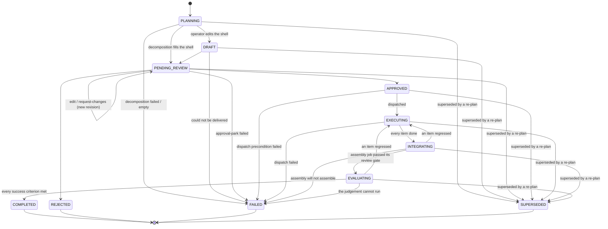

# Plan Review

The plan-review subsystem turns the decomposed breakdown of an objective from a
transient value into a durable, reviewable, editable first-class entity. When the
plan-approval gate is enabled, splittable team work is decomposed into a `Plan`,
persisted, and parked for a human decision before any team builds. An operator can
read, rework, or send the plan back for changes through the `/plans` API and the
Plan Review workspace, then approve or reject it through the existing `/approvals`
decision path.

Plan Review is the single review surface for shaping an initiative: a request
yields one plan reviewed as a whole, never a scatter of per-item approvals. This is
the sole reason approval-gating defaults on (see [Conversational
entry](#conversational-entry)); mid-build implementation forks are a separate,
narrow surface documented in [agent-execution.md](agent-execution.md).

## Durable Plan Entity

`Plan` (`core/plan.py`) is the first-class replacement for a plan that previously
lived only as a `DecompositionResult` serialised into an approval's metadata. It is
persisted, versioned, and revisable, and outlives the approval decision: the approval
carries only the plan's `plan_id`.

- **`Plan`**: `id` (UUID), `project`, `objective_id`, `objective_title`
  (denormalised at creation so the surface never resolves, or falls back to, a raw
  id), `parent_task_id`, `items` (ordered tuple forming a dependency DAG),
  `task_structure`, `coordination_topology`, `status`, `failure_reason` (why a
  `FAILED` plan failed, `None` otherwise), `forecast_id`, `review` (the
  consolidated stakeholder-panel review, or `None`), `open_questions` and
  `assumptions` (what the planner surfaced for the human), `objective_criteria` (the
  objective's acceptance criteria, denormalised for the coverage map),
  `version_history` (snapshots of prior submitted versions), `version`,
  `created_at`, `updated_at`. A model validator rejects an empty item list for
  every status except the `PLANNING` / `FAILED` shells (which may carry no
  items), duplicate item ids, an unresolvable dependency, or a dependency
  **cycle** (topological sort); a second validator ties `failure_reason` to the
  `FAILED` status (present iff FAILED). A malformed plan is caught at construction
  rather than as a dispatch failure.
- **`PlanItem`**: `id` (a canonical UUID string, because dispatch rebuilds each
  child task from it), `title`, `description`, `dependencies`, `owner`,
  `acceptance_criteria`, `expected_artifacts`, `required_skills`, `required_tags`,
  `estimated_complexity`, `stakes`, `kind` (`WORK` or `DECISION`), `options` and
  `chosen_option_id` (decision items), and `satisfies` (the objective criteria this
  item advances). A validator rejects a non-UUID id, a self-dependency, or duplicate
  dependencies.

### Open questions are asked, not filed

`open_questions` is what the planner could not resolve on its own, and for a
while it was written to the plan and read by nothing: the org asked two good
questions, `GET /meta/chat/questions` returned `[]`, and the escalation fired
into a void. Asking the human is the single most-wanted behaviour on the
product's own goal list, so a question that reaches no human is not a record,
it is a loss.

Each open question is now filed as a **parked question** alongside the plan
approval, inside the same guard, with `action_type=CLARIFY_ACTION_TYPE`, the
plan's parent task, and metadata carrying the plan id. That puts it on the
surface that already exists: it appears in `GET /meta/chat/questions` and is
answered or declined through the same narrow door as every agent-raised
question, with no second decision path.

The approval carries no question **index**. An index identifies a position in
`open_questions`, and the first answer rewrites that tuple, so every remaining
approval's index would point at a different question than the one its own text
asks; the question text on the approval is the identity, and settling removes
one matching entry rather than every duplicate.

The answer goes back onto the plan the agents execute: answering removes the
entry from `plan.open_questions` and appends the answer to `plan.assumptions`
through `PlanService`, under a compare-and-set retry so two answers landing at
once cannot lose one of the write-backs; declining keeps the existing
declined-question note.

That write-back is a fast path, not what makes the answer stick. It runs after
the decision is already durable on the approval, so a persistence failure there
would leave the plan asking something the operator answered, and the endpoint
cannot report the decision as failed when it demonstrably happened. The decided
approvals are the record, so `replay_decided_questions` reconciles the plan
against them before dispatch rebuilds anything from it. The reconciliation
counts rather than matches: a plan should still list one occurrence of a
question per approval for that text still `PENDING`, so the surplus above that
count is exactly what the plan has not heard. That keeps a repeat pass a no-op
and stops one answer settling the occurrence that belongs to a second,
identically worded question. An `EXPIRED` approval is not a decision and is
never replayed: nobody answered it, so its occurrence stays open.

Question text is persisted raw and fenced with `wrap_untrusted(TAG_TASK_DATA,
...)` only at the LLM prompt boundary, per SEC-1.

### Decision items

A `PlanItem` with `kind = DECISION` is a real choice the plan hinges on (stack,
architecture) rather than a unit of work. It carries `options` (at least two
`PlanOption`s, exactly one `recommended`, unique ids) and an optional
`chosen_option_id`; a `WORK` item carries neither (`validate_decision_options`).
The generator emits a decision where a genuine choice exists; the reviewer records
the pick on the review workspace, and `PlanItem.resolved_option()` resolves it to
the chosen option or, absent a pick, the recommended one. Decision items are not
executed: `decomposition_from_plan` strips them from the dispatchable tree (and
from remaining items' dependencies), and on approval each resolved decision is
recorded into the project brain as a first-class `DECISION` entry
(`api/controllers/_plan_decision_record.py`) so the company's shaping choices
survive rather than vanishing.

### Stakeholder review panel

Before the plan is parked for the human, a bounded panel of stakeholder agents
reviews it (`engine/plan_review/`). `select_review_panel` seats the relevant leads
(CTO, CFO, department heads for the domains touched, a senior peer), sized to the
plan and excluding the owner (no self-review). Each panellist runs a bounded
persona session (`AgentSessionPlanReviewPanel`) and submits a structured verdict
(`ENDORSED` / `CONCERNS` / `REVISION_REQUESTED`) with categorised findings; a
deterministic synthesis (`synthesise_review`) consolidates them onto `Plan.review`
(overall verdict = the most severe). The panel is wired at startup without failing
boot, and runs as a distinct pipeline phase between decompose and the human gate.

**A finding sends the plan back to be re-planned.** The panel exists to catch a
plan before the operator has to, so its verdict drives another planning pass
rather than riding along as commentary: `build_reviewed_plan`
(`engine/pipeline/plan_revision.py`) re-decomposes against a brief carrying every
finding, then re-reviews, until the panel stops objecting or
`coordination.plan_review_max_revision_rounds` is spent. Any finding counts,
whatever verdict carries it, since an endorsement that still notes a gap has
still noted one. Each round is its own `plan_review_panel_revision_N` phase, so
how many panels ran is readable rather than inferred, and each round briefs from
the ORIGINAL objective plus the MOST RECENT review: findings describe the plan
they were raised against, so carrying a superseded round's forward asks the planner
to fix a plan that no longer exists. Reaching the cap is not a failure. The plan
is parked for the operator carrying whatever is still outstanding, which is
exactly what happened before anything read the findings, and
`pipeline.plan_review.revision_exhausted` says so. Setting the cap to `0` keeps
that older behaviour deliberately: the panel still reviews and its findings
still reach the plan and the operator, but nothing acts on them.

**The finding vocabulary answers the questions the brief asks.**
`PlanReviewFindingCategory` names the kinds a reviewer produces: `GAP`,
`MISSING_OWNER`, `MISCALIBRATED_STAKES`, `RISKY_DECISION`, `BUDGET_CONCERN`,
`SEQUENCING`, `UNVERIFIABLE_CRITERIA`, `OVERSIZED_SCOPE`, and `OTHER` last. It is
sized to the brief rather than guessed: the brief poses a question per kind, and
three of them had no category to land in, so reviewers proposed one the enum
could not express, were rejected, and resubmitted under a worse one, at a turn
per reviewer per panel. `SEQUENCING` is the one with recorded live evidence, a
plan of six items with zero dependency edges and an item naming three it declared
no dependency on: a claim about the graph, not about any single item, which `GAP`
reads as a missing item and `OTHER` discards the kind of entirely.

The vocabulary has one owner. `CATEGORY_GUIDANCE` in
`engine/plan_review/review_tool.py` maps each kind to its meaning, and both the
`submit_plan_review` tool schema and the reviewer brief render from it, so a
category the brief asks about cannot be one the schema omits. A member with no
entry fails `render_category_guidance` rather than reaching a reviewer as a bare
name it would then reinterpret. `OTHER` stays reachable, and a finding landing
there is worth reading as a signal about the enum rather than a routine outcome.

The category is persisted inside the `Plan.review` JSON document (`plans.review`,
`TEXT` on SQLite and `JSONB` on Postgres) rather than in a constrained column, so
widening the vocabulary ships no migration; the generated dashboard enums do
follow, via `scripts/generate_dto_types_ts.py`.

**An absent review says why it is absent.** `review = None` used to mean three
different things at once, and the operator saw the same empty
`evidence_package` for all of them. The session now returns a
`PlanReviewOutcome` carrying either a review or the reason there is none, and
the reason is persisted on `Plan.review_absent_reason`, surfaced in the
approval payload and shown as a blocking banner on the dashboard gate:

| outcome | what the operator is told |
| --- | --- |
| a seated panel produced verdicts | the review, as before |
| no panel is attached | no panel was seated for this plan; the plan carries zero quality signal |
| a seated panel produced no verdict | the panel ran and returned nothing; the plan carries zero quality signal |
| every seated reviewer failed on a provider error | not a review outcome at all: plan preparation FAILS (FAILED plan + FAILED task) rather than presenting an unreviewed plan as merely unreviewed |

The last row is the load-bearing one. A provider outage during review is an
outage, and parking the plan for approval turns it into a human rubber-stamp on
a plan nothing checked.

"No verdict" is reached only after one correction. A panellist holds exactly
one tool, `submit_plan_review`, so a session that answered in prose has not
abstained: it did the wrong thing. The session pushes back once, saying prose
is not a verdict and naming the tool, and only a second non-submission is
recorded as an absent opinion. Recording the first as absent sends the plan to
its human gate with no quality signal, and every panellist fails that way at
once, so the panel abstains unanimously for a reason no reviewer chose.

`request_plan_approval` takes the outcome as a **required** argument, on both
the port and the gate: an optional one with a `None` default reintroduces the
blank state the type exists to forbid, one caller at a time. The PLANNING shell
opened before decomposition says so explicitly rather than leaving the field
empty, and its provenance is replaced wholesale when the filled plan is parked.

### Lifecycle (`PlanStatus`)

**Plan-first-from-greenlight.** When a splittable initiative is greenlit, a
`PLANNING` **shell** (no items yet) is persisted *before* decomposition runs, so
every greenlit objective leaves a first-class, visible plan even if decomposition
never completes. Decomposition fills the shell in place (moving it to
`PENDING_REVIEW`); a decomposition that fails or produces no items transitions the
shell to `FAILED`, carrying a `failure_reason` the review surface shows, rather
than leaving a silent orphan task. A plan the planner built **over the request's
`max_subtasks`** takes the same route: the reason names the produced count and
the limit, so the operator can raise the ceiling or narrow the objective instead
of silently receiving a thinner plan. A plan can also reach `FAILED` *after*
decomposition succeeded, if parking the approval fails: it is then FAILED with its
items intact, so `FAILED` permits (but does not require) an empty item list.

`FAILED` therefore means "could not be delivered", not the narrower "never
reached a review decision". Four routes land here: decomposition, the approval
park, dispatch, and a project teardown over a plan with no items (superseding an
itemless plan is what the `items` CHECK forbids, so the cascade fails it with
"project deleted" instead).

Dispatch reaches `FAILED` from either side of one line. An approved plan is
moved to `EXECUTING` *before* `coordinate(...)` runs (load-bearing ordering, so
the rollup never encounters a `PLANNING` project with tasks running), so a raise from
`coordinate` fails an `EXECUTING` plan, while the precondition branches that
return before it (no coordinator, no parent task, a project that cannot be
linked) fail an `APPROVED` one. Both carry the redacted cause, so a plan never
sits dispatched with no children and no explanation.

The `PLANNING` and `FAILED` statuses are the only ones permitted to carry an empty item
list (enforced by the model validator and the SQLite / Postgres `items` CHECK);
every other status requires a non-empty, validated item DAG. A `failure_reason` is
present iff the status is `FAILED` (a cross-field model validator enforces both
directions).

An edit or request-changes is accepted only from a reworkable status.

`DRAFT` and `PENDING_REVIEW` are the reworkable statuses; `PLANNING` is a transient
shell (not operator-reworkable); `COMPLETED`, `REJECTED`, `SUPERSEDED`, and `FAILED`
are terminal. An operator rework or request-changes is accepted only from a
reworkable status, so a decided or failed plan cannot be revived (a retry is a
fresh run). Each edit bumps `version`, and every write is version-guarded
(optimistic concurrency): a stale writer is rejected with a conflict rather than
silently clobbering a concurrent edit.

Both land the plan back in `PENDING_REVIEW` carrying a new revision, because
both produce revised items: nothing is dispatched from a reworkable status, so
there is no running work to retire and no successor to point a project at. A
change request that parked the plan in `DRAFT` instead is what left one sitting
with nobody assigned to revise it, since the org has no trigger on `DRAFT` and
the operator's only remaining route was to hand-author the item list through
`/plans/{id}/replan`. A snapshot of the prior revision reaches `version_history`
either way, so a reviewer can diff what changed, and `Plan.review` is cleared:
the panel's findings referenced items that no longer exist.

**Premises travel with the items that rest on them.** `assumptions` and
`open_questions` belong to the pass that derived them, so a re-plan passes its
own (`PlanPremises`) and an operator hand-edit does not: the operator revised
the work, not the premises, and has nothing fresh to supply. Getting this
backwards is not cosmetic. A live re-plan replaced all ten items with "build
the engine from scratch" while the plan went on asserting the engine already
existed, because the rework carried the superseded premises forward. The plan
contradicted itself, and the false assumption the operator had just refuted was
the one left standing.

**Approval is not the end of the plan's life.** `APPROVED` dispatches the plan and
hands it to `EXECUTING`, where its items' tasks are in flight. Every item being
done opens the tail rather than completing the plan: `INTEGRATING` assembles the
verified pieces into one running deliverable, `EVALUATING` scores that whole
against the objective's success criteria, and only then is `COMPLETED` reachable.
There is no `EXECUTING -> COMPLETED` edge, which is what stops the tail from
being skipped. These transitions are driven by the initiative rollup
rather than by an operator, and the whole table is enforced by a state machine
(`core/plan_transitions.py`) that every status write funnels through. See
[Initiative tail](initiative-tail.md) for the two tail stages and
[Project lifecycle](project-lifecycle.md) for how completion composes with the
verify gate.

## Persistence

`PlanRepository` (`persistence/plan_protocol.py`) composes the ADR-0001 generics
`IdKeyedRepository[Plan, NotBlankStr]` + `FilteredQueryRepository[Plan,
PlanFilterSpec]`; the SQLite and Postgres implementations are kept in parity. The
`plans` table stores `items` as JSON (a non-empty array for every status except
the `PLANNING` / `FAILED` shells, which may carry no items, CHECK-enforced), the
nullable `failure_reason` (non-blank when present, CHECK-enforced), and
`review` / `open_questions` / `assumptions` / `objective_criteria` /
`version_history` as JSON columns; Postgres uses `TIMESTAMPTZ` for the timestamps
and a composite `(project, status, id)` index for the combined-filter list query.
`update()` takes an `expected_version` guard and raises
`PersistenceVersionConflictError` when the stored version has moved.

`plans.parent_task_id` is a real `REFERENCES tasks (id) ON DELETE RESTRICT`,
indexed `(parent_task_id, id)` for the equality-then-ordering shape the delete
guard queries with. RESTRICT rather than CASCADE because a plan is a reviewed
decision record with its own delivery verdicts hanging off it: destroying that
as a side effect of removing a task is a decision an operator should make
deliberately, and `DELETE /plans/{id}` is where they make it. A task delete that
a plan references is refused with `PLAN_PARENT_TASK_IN_USE` (409) naming the
plan, in `TaskEngine.delete_task` so every caller inherits it, with the
constraint as the backstop for a race. `plan_item_comments.plan_id` is the
mirror-image case: a remark ON a plan means nothing without it, so it CASCADEs.

The reference cannot stop a task deleted mid-decomposition, so the approval gate
re-reads the parent before it fills the shell and parks the approval, raising
`PLAN_PARENT_TASK_MISSING`; the pipeline routes that through its compensation,
so the plan lands `FAILED` with the reason and never reaches `PENDING_REVIEW`
asking for a decision on work with no owner.

### Deleting a plan under review

`DELETE /plans/{id}` and `DELETE /tasks/{id}` expire the pending approvals
that decide about the row **before** removing it, and the delete is
conditional on that succeeding. An approval is a question about something
that exists: once the row is gone the queue still offers approve and reject,
and answering drives the resume path at an id that resolves to nothing.
Expired rather than rejected, because a rejection is a reviewer's verdict and
nobody made one.

A decision that lands between the read and the write is not overwritten. The
verdict was made while the row still existed and the resume path is acting on
it, so the delete is refused with a 409 and the operator retries once the
dispatch has settled; every approval the refused attempt had already expired
is put back, so a refused delete leaves the queue as it found it. Two
concurrent deletes of the same row do not conflict: an approval another
delete already retired satisfies this one rather than blocking it.

Per-item discussion lives in a separate append-only store,
`PlanItemCommentRepository` (`persistence/plan_comment_protocol.py`, composing
`AppendOnlyRepository`), backed by the `plan_item_comments` table. Comments are
immutable and written independently of the version-guarded plan row, so posting a
comment never conflicts with a concurrent rework. Each comment carries an
`author_kind` (`human`/`agent`), the responding agent's id for an agent comment,
and a flat `reply_to_id` linking a reply to the message it answers: the item *is*
the thread, so a reply is a parent link, not a nested tree. This keeps the
append-only immutability (each comment and reply is its own row) while making a
comment reply-bearing and agent-answerable.

When a reply model is configured, a *human* comment is answered inline by the
responsible role: `PlanItemReplyService` (`engine/plan_review/reply.py`) resolves
the responder (the item's `owner` role if an active agent holds it, else the
Chief of Staff) and makes ONE grounded, fenced completion call (not a ReactLoop,
no tools) over the item's own text, then appends an attributed agent reply linked
to the operator's comment. It is **loop-safe** (only a human comment is answered,
so an agent reply never triggers another) and **failure-isolated**: the human
`POST .../comments` always returns 201 even if reply generation fails, and the
reply is gated live per comment by `coordination.plan_review_reply_enabled`
(opt-out, default on). Lightweight discussion never re-plans the plan; only
`request-changes` does that.

## Owners come from the roster

Every plan item names an accountable owning role, and that role is the thing a
dispatch looks up. A role nobody holds produces an item with nobody behind it,
discovered at dispatch if at all, so the roster is bound at every level rather
than trusted at one:

- `DecompositionContext.available_roles` carries the distinct roles behind the
  active agents (`roster_from_agents`), populated wherever a decomposition is
  started: the pipeline, the coordination and manual-decomposition endpoints,
  and the stalled-initiative replan.
- The submit-plan tool schema puts an `enum` on `required_role`, so a
  schema-enforcing provider cannot emit an unknown role at all, and the system
  prompt lists the roster in prose, because the enum only reaches a provider
  that enforces schemas.
- Parse time rejects an unknown owner with a correctable `DecompositionError`
  naming the offending role and the valid set, alongside the kind/artifact
  invariant. The planning session can resubmit inside the same session.
- `PATCH /plans/{id}` refuses an operator edit that owns an item to a role no
  agent holds, and the review surface flags such an owner as its own attention
  row rather than counting it under "all assigned".

An empty roster means "no roster known" and skips every check: an org with no
agents has nothing to validate against, and failing there would block a
greenlight for a reason unrelated to the plan.

The prompt deliberately names no example role. The one that used to sit in the
tool schema was not in the shipped org template, and the planner reproduced it.

## Decomposition Projection

`engine/decomposition/plan_mapping.py` projects both directions so the gate, the
API, and the resume path stay in step:

- `plan_from_decomposition()` builds a durable `Plan` from an executed
  `DecompositionResult` (subtasks become plan items).
- `decomposition_from_plan()` rebuilds a dispatchable `DecompositionResult` from a
  (possibly operator-edited) durable plan, so the tree that builds on approval is
  exactly the plan under review. Each child task carries the item's acceptance
  criteria and expected artifacts, so the fail-loud zero-artifact guard engages on
  the plan-review dispatch path.

## Conversational entry

A plan is stood up from the unified chat one way: the charter interview
(a `/meta/chat/turn` classified `charter`). It has a precondition an operator
must meet before any of this is reachable: `charter.interview_model` ships
blank, so the `charter_engine` subsystem stays down on an empty-company boot
and `GET /subsystems` reports it waiting on that setting. Naming a
provider-bound pair is what brings the interview up; `charter_dispatch`, which
owns the approve path, then activates once the work pipeline exists. Until
both are up there is no conversational route to an initiative at all.

The interview asks until it has
enough to draft a charter, the operator reviews and approves what it drafted,
and `meta/charter/dispatch.py` then builds the single `WorkItem` that carries
`plan_required=True` **and** the `charter_id` of the approval that authorised
it. Because `plan_required` forces a `SPLITTABLE` routing verdict into the
(default-on) gate, decomposition parks a `PLAN_REVIEW` approval carrying the
drafted plan, and the operator reviews that as a whole.

The `propose` capability cannot produce a plan and has no field in which to ask
for one (`ProposeDecision` is clarify-XOR-steer, `extra="forbid"`). It steers
work a charter already authorised; its directives park on their own confirmation
path. Committing the organisation to a body of effort and a budget is the
operator's decision, taken once, in the interview, and recorded by their
approval; it is never inferred from a message by a classifier.

That is held in two halves, because a claim and its truth are different
questions. Structurally, `WorkItem` refuses `plan_required=True` with no
`charter_id`, so no adapter can construct a brief that opens an initiative
without naming an approval. Substantively, the spine resolves that id against
the charter store on every plan-forcing brief (`_require_authorised_initiative`,
through the `CharterAuthority` port) and refuses anything that does not resolve
to an APPROVED charter, naming which of the two it was. With no store attached
it refuses as well: an authorisation nothing can check is not one.

The approval is therefore recorded on the charter **before** its dispatch runs,
which is also the honest order (the operator took the decision before any of it
ran), and `task_id` is stamped on afterwards as dispatch provenance. The window
between the two writes is a charter that is authorised with no run behind it;
approving again resumes the dispatch rather than reporting the charter decided.

## API

`PlanController` (`api/controllers/plans.py`, path `/plans`) owns the plan-native
capabilities the approval flow lacks. Whole-plan approve/reject stay atomic on the
canonical `/approvals/{id}` path; because a plan review is decision-gathering with
its own surface, it is excluded from the generic Approvals inbox (a `source` filter
on `GET /approvals`) and gains its own red nav badge, and the operator approves or
rejects it **inline on the Plan Review page** (the toolbar resolves the plan's
parked approval from its `plan_id` metadata and drives the same `/approvals` path,
so approval stays atomic).

| Method | Path | Purpose |
|--------|------|---------|
| `GET` | `/plans` | List plans (cursor pagination; `status` / `project` / `objective_id` filters) |
| `GET` | `/plans/{id}` | Fetch a plan |
| `GET` | `/plans/{id}/evaluation` | The evaluate stage's judgements, newest first (see [Initiative Tail](initiative-tail.md#the-verdict-is-a-record)) |
| `GET` | `/plans/{id}/transitions` | The plan's recorded status transitions, newest first: who asked, why, and from which version (see [Initiative Tail](initiative-tail.md)) |
| `PATCH` | `/plans/{id}` | Rework items (new revision, back to `PENDING_REVIEW`) |
| `DELETE` | `/plans/{id}` | Remove a plan that is not a record of work. Always deletable while undispatched (`PLANNING` / `DRAFT` / `PENDING_REVIEW` / `FAILED`); a plan deletes only when it has **zero live task rows**, because "its items are building" is checked against the tasks rather than inferred from the status: a dispatch that died before writing a single row leaves nothing building. That check and the delete are ONE repository call in one transaction (`delete_if_no_live_tasks`), never a count followed by a delete: a task filed between the two would be stranded on a plan id that no longer resolves, and nothing would report it. A terminal plan is refused outright (its record and its delivery verdicts outlive it), and a genuinely building plan is refused naming the count (409). Expires the plan's parked `PLAN_REVIEW` approval FIRST, and deletes only if that lands: left pending, a reviewer could still approve it, and the resume path would then fail the parent task over a plan that no longer exists. A concurrent decision wins instead (409, nothing deleted), because the verdict was made while the plan still existed and the dispatch is already acting on it |
| `POST` | `/plans/{id}/request-changes` | Re-plan against the operator's note. The org decomposes afresh from a brief the note leads and the plan's outstanding panel findings follow (`_plan_rework.py`), and the revised items replace the reviewed ones through the same validated path an edit takes, so the plan comes back under review carrying a new version rather than parked for a revision nobody performs. LLM-bound, like any other turn that asks the org to think. Refused rather than parked when it cannot be honoured: 503 when no planner or task engine is running, 409 when the objective task is gone, 422 when neither the note nor a finding says what should change. Every refusal lands before any write, so the operator's plan stays reviewable |
| `GET` | `/plans/{id}/comments` | List a plan's comments oldest-first (optional `item_id`) |
| `POST` | `/plans/{id}/comments/items/{item_id}` | Post a comment on an item (optional `reply_to_id`); a responsible role may answer inline |

`PlanService` (`api/services/plan_service.py`) owns the lifecycle transitions with
uniform `API_PLAN_*` audit logging, the terminal-status guard, version-conflict
translation, and the `sync_status()` used by the approval-resume path so the
decision transition gets the same audit coverage as an operator edit. On a rework
it snapshots the pre-edit version into `version_history` (bounded), so a reviewer
can diff how a revision addressed the panel's concerns. Edits and decisions publish
`plan.updated` / `plan.changes_requested` events (a delete publishes
`plan.updated` too, so an open list drops the row), and a posted comment publishes
`plan.comment_added`, all on the `plans` WebSocket channel. The event is a refresh
signal (its payload stays the minimal locator); a subscriber reloads the item's
thread, so an inline agent reply (broadcast the same way when it lands) surfaces
without a new channel or payload shape.

`PlanReviewApprovalGate` publishes the same `plan.updated` when it fills and
parks a plan, and when it marks one FAILED. Those writes happen on a background
spine, after the request that started them returned, so the gate is handed a
narrow publisher (`PlanNotifier`, built from the channels plugin at
construction) rather than resolving one from a request it does not have. It is
what stops a page open during decomposition from rendering the
pre-decomposition snapshot beside a fresh approval prompt. The comment endpoints
live on
`PlanCommentController` (`api/controllers/plan_comments.py`); a human comment's
author is taken from the authenticated user, never the request body, and an agent
reply is attributed to the responding role.

## Dispatch on Approval

Approve/reject route through the existing idempotent `/approvals/{id}` path into
`try_plan_review_resume` (`api/controllers/_plan_review_resume.py`), keyed off the
`ApprovalSource.PLAN_REVIEW` discriminator:

- The decision is reflected onto the durable plan first (`APPROVED` / `REJECTED`).
- On approve, three writes settle the plan's own record before anything is built
  from it, in this order:
    1. `replay_decided_questions` writes back every answer already decided
       against the plan, so an answer whose write-back failed after its decision
       was durable costs a retry rather than the operator's answer.
    2. `retire_open_questions` closes whatever nobody answered. Past this point
       the plan's context is stamped onto every child task's brief, so a late
       answer would reach no task, no agent and no prompt while the operator was
       told it was sent. It runs after the replay so a decision already taken
       lands before its row shuts.
    3. `record_resolved_decisions` writes each decision item's resolved option
       (the reviewer's pick, else the owner's recommendation) to
       `chosen_option_id`. Dispatch strips decision ids from the work items'
       dependencies because the decision is made by approval time, while
       `item_is_done` asks whether `chosen_option_id` is set: unwritten, the two
       disagree and an initiative can dispatch every item and never complete.
- Then the project is linked and the plan moves to `EXECUTING`, the durable plan
  is rebuilt via `decomposition_from_plan`
  and dispatched through `coordinate(precomputed_plan=...)`. A dispatch failure
  (missing coordinator, missing task, missing plan, or a coordinator error) marks
  the parent task `FAILED` so the stuck plan surfaces on the board, and moves the
  plan to `FAILED` carrying the redacted cause. The decision stands, but the plan
  does not: leaving it `APPROVED` would show a plan the operator greenlit with
  nothing running under it and nothing saying why.
- On reject, the parent task is cancelled and nothing builds.
- The gate persists the plan before parking the approval; if the approval write
  fails, the filled plan is marked `FAILED` (carrying the reason) rather than
  deleted, so the failure stays visible in Plan Review instead of vanishing.

## Configuration

The feature reads five `coordination.*` settings
(`settings/definitions/coordination.py`) plus one shared `budget.*` bound, split
across two subsystems that own different halves of it. The master gate belongs to
`plan_review_gate`, whose activation reads `coordination.plan_approval_required`.
The other five are panel configuration: `plan_review_panel` bakes them into a frozen
config when it is built, so its `SubsystemSpec` declares exactly those five with
`rebuild_on_change`, and a write tears the panel down and rebuilds it rather than
waiting for a restart.

| Setting | Default | Purpose |
|---------|---------|---------|
| `coordination.plan_approval_required` | `true` | Master gate: when off, splittable team work dispatches straight to the coordinator and no plan is parked. On by default so every greenlit initiative parks a plan for holistic review. Everything below is inert until this is on. |
| `coordination.plan_review_panel_enabled` | `true` | Whether the stakeholder panel runs before the plan reaches the human. Defaults on, but only takes effect once approval is gated and a provider is wired; otherwise the plan is parked with `review = None`. |
| `coordination.plan_review_panel_size` | `4` (max `8`) | Maximum panellists seated (the relevant leads sized to the plan, not everyone). |
| `coordination.plan_review_panel_max_turns` | `6` | Hard turn cap per panellist session before it must submit a verdict. |
| `coordination.plan_review_panel_cost_ceiling` | `1.0` | Per-reviewer spend ceiling (base currency); the session halts once accumulated cost reaches it. |
| `coordination.plan_review_max_revision_rounds` | `2` (max `5`) | How many times a reviewed plan may be sent back to be re-planned before it is parked for the operator regardless. Each round costs a fresh decomposition and a fresh panel, so the cap is what stops a panel and a planner that disagree from arguing indefinitely. `0` makes the panel advisory: findings are still recorded and shown, but nothing acts on them. |
| `budget.session_token_ceiling` | `2000000` | Per-reviewer token ceiling, shared with every other bounded helper session. The money ceiling above measures nothing against a connection that bills by flat subscription, where cost never rises and the panellist's only other bound is its turn cap. |

## Workspace

The Plan Review workspace (`web/src/pages/PlansPage.tsx`, `PlanDetailPage.tsx`, and
`web/src/pages/plans/`) is a pure API consumer: it hydrates from `GET /plans`, walks
every cursor page so the review inbox can filter and sort across the whole set, and
writes every change through the API. The detail page reworks items (title,
description, owner, complexity, stakes) or sends the plan back for changes, and
surfaces a disconnected-updates banner when the WebSocket drops. Beyond the item
list, it renders review panels derived from the plan (no extra persisted state):

- **Decomposition failure** (`PlanFailureBanner`): shown only for a `FAILED` plan,
  surfacing its `failure_reason` so the operator can see why the run failed and
  start a fresh one.
- **Delivery verdict** (`PlanEvaluationPanel`): the evaluate stage's judgements
  hydrated from `GET /plans/{id}/evaluation`, newest first, each objective
  criterion with the judge's evidence, so a parked initiative explains which
  criteria failed. Hidden when nothing has judged the plan.
- **Needs your input** (`PlanOpenQuestionsPanel`): the planner's open questions and
  assumptions to answer or correct before approving. Each question carries its
  own answer box, because this panel is the only surface that can decide one:
  the generic Approvals inbox filters every `plan_review` row out by design
  (`useApprovalsData`), so a question sent anywhere else is a question nobody
  can settle. Sending an answer approves that question's own parked approval
  with the answer as its comment, which is what writes it onto the plan. A
  question with no parked approval left says so rather than offering a box:
  once the plan starts building, its questions are retired unanswered and an
  answer would reach no task, no agent, and no prompt.
- **Cost forecast** (`PlanForecastPanel`): the plan's `forecast_id` hydrated to show
  the estimate with its band, decision state, and any hard-ceiling halt.
- **Staffing** (`PlanStaffingPanel`): per-owner item load derived from item owners,
  flagging bottlenecks and unassigned work.
- **Success-criteria coverage** (`PlanCoveragePanel`): each objective criterion and
  the items that advance it, flagging any criterion nothing covers.
- **Stakeholder review** (`PlanReviewPanel`): the panel's consolidated verdict and
  each lead's findings.
- **Changes since last revision** (`PlanVersionDiff`): items added / removed /
  modified versus the last version snapshot.
- **Timeline** (`PlanTimeline`): execution waves derived from the dependency DAG.
- **Decision options and discussion** (`PlanItemCard`): each decision item's options
  (pick recorded via `PATCH /plans/{id}`) and a per-item comment thread that updates
  live over the `plans` channel.
