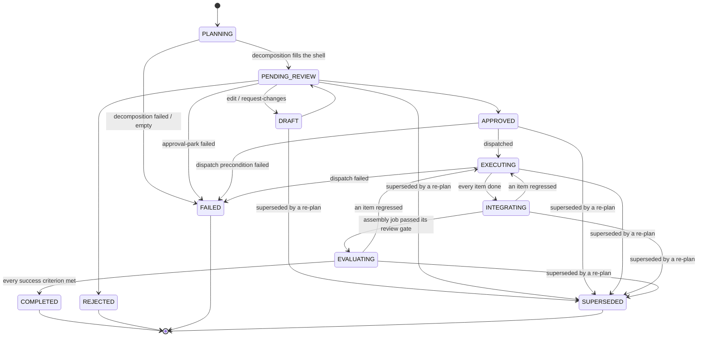

# Plan Review

The plan-review subsystem turns the decomposed breakdown of an objective from a
transient value into a durable, reviewable, editable first-class entity. When the
plan-approval gate is enabled, splittable team work is decomposed into a `Plan`,
persisted, and parked for a human decision before any team builds. An operator can
read, rework, or send the plan back for changes through the `/plans` API and the
Plan Review workspace, then approve or reject it through the existing `/approvals`
decision path.

Plan Review is the single review surface for shaping an initiative: a request
yields one plan reviewed as a whole, never a scatter of per-item approvals. This is
the sole reason approval-gating defaults on (see [Conversational
entry](#conversational-entry)); mid-build implementation forks are a separate,
narrow surface documented in [agent-execution.md](agent-execution.md).

## Durable Plan Entity

`Plan` (`core/plan.py`) is the first-class replacement for a plan that previously
lived only as a `DecompositionResult` serialised into an approval's metadata. It is
persisted, versioned, and revisable, and outlives the approval decision: the approval
carries only the plan's `plan_id`.

- **`Plan`**: `id` (UUID), `project`, `objective_id`, `objective_title`
  (denormalised at creation so the surface never resolves, or falls back to, a raw
  id), `parent_task_id`, `items` (ordered tuple forming a dependency DAG),
  `task_structure`, `coordination_topology`, `status`, `failure_reason` (why a
  `FAILED` plan failed, `None` otherwise), `forecast_id`, `review` (the
  consolidated stakeholder-panel review, or `None`), `open_questions` and
  `assumptions` (what the planner surfaced for the human), `objective_criteria` (the
  objective's acceptance criteria, denormalised for the coverage map),
  `version_history` (snapshots of prior submitted versions), `version`,
  `created_at`, `updated_at`. A model validator rejects an empty item list for
  every status except the `PLANNING` / `FAILED` shells (which may carry no
  items), duplicate item ids, an unresolvable dependency, or a dependency
  **cycle** (topological sort); a second validator ties `failure_reason` to the
  `FAILED` status (present iff FAILED). A malformed plan is caught at construction
  rather than as a dispatch failure.
- **`PlanItem`**: `id` (a canonical UUID string, because dispatch rebuilds each
  child task from it), `title`, `description`, `dependencies`, `owner`,
  `acceptance_criteria`, `expected_artifacts`, `required_skills`, `required_tags`,
  `estimated_complexity`, `stakes`, `kind` (`WORK` or `DECISION`), `options` and
  `chosen_option_id` (decision items), and `satisfies` (the objective criteria this
  item advances). A validator rejects a non-UUID id, a self-dependency, or duplicate
  dependencies.

### Decision items

A `PlanItem` with `kind = DECISION` is a real choice the plan hinges on (stack,
architecture) rather than a unit of work. It carries `options` (at least two
`PlanOption`s, exactly one `recommended`, unique ids) and an optional
`chosen_option_id`; a `WORK` item carries neither (`validate_decision_options`).
The generator emits a decision where a genuine choice exists; the reviewer records
the pick on the review workspace, and `PlanItem.resolved_option()` resolves it to
the chosen option or, absent a pick, the recommended one. Decision items are not
executed: `decomposition_from_plan` strips them from the dispatchable tree (and
from remaining items' dependencies), and on approval each resolved decision is
recorded into the project brain as a first-class `DECISION` entry
(`api/controllers/_plan_decision_record.py`) so the company's shaping choices
survive rather than vanishing.

### Stakeholder review panel

Before the plan is parked for the human, a bounded panel of stakeholder agents
reviews it (`engine/plan_review/`). `select_review_panel` seats the relevant leads
(CTO, CFO, department heads for the domains touched, a senior peer), sized to the
plan and excluding the owner (no self-review). Each panellist runs a bounded
persona session (`AgentSessionPlanReviewPanel`) and submits a structured verdict
(`ENDORSED` / `CONCERNS` / `REVISION_REQUESTED`) with categorised findings; a
deterministic synthesis (`synthesise_review`) consolidates them onto `Plan.review`
(overall verdict = the most severe). The panel is wired best-effort at startup and
runs as a distinct pipeline phase between decompose and the human gate; when no
panel is attached the plan is parked with `review = None`.

### Lifecycle (`PlanStatus`)

**Plan-first-from-greenlight.** When a splittable initiative is greenlit, a
`PLANNING` **shell** (no items yet) is persisted *before* decomposition runs, so
every greenlit objective leaves a first-class, visible plan even if decomposition
never completes. Decomposition fills the shell in place (moving it to
`PENDING_REVIEW`); a decomposition that fails or produces no items transitions the
shell to `FAILED`, carrying a `failure_reason` the review surface shows, rather
than leaving a silent orphan task. A plan the planner built **over the request's
`max_subtasks`** takes the same route: the reason names the produced count and
the limit, so the operator can raise the ceiling or narrow the objective instead
of silently receiving a thinner plan. A plan can also reach `FAILED` *after*
decomposition succeeded, if parking the approval fails: it is then FAILED with its
items intact, so `FAILED` permits (but does not require) an empty item list.

`FAILED` therefore means "could not be delivered", not the narrower "never
reached a review decision". Four routes land here: decomposition, the approval
park, dispatch, and a project teardown over a plan with no items (superseding an
itemless plan is what the `items` CHECK forbids, so the cascade fails it with
"project deleted" instead).

Dispatch reaches `FAILED` from either side of one line. An approved plan is
moved to `EXECUTING` *before* `coordinate(...)` runs (load-bearing ordering, so
the rollup never sees a `PLANNING` project with tasks running), so a raise from
`coordinate` fails an `EXECUTING` plan, while the precondition branches that
return before it (no coordinator, no parent task, a project that cannot be
linked) fail an `APPROVED` one. Both carry the redacted cause, so a plan never
sits dispatched with no children and no explanation.

The `PLANNING` and `FAILED` statuses are the only ones permitted to carry an empty item
list (enforced by the model validator and the SQLite / Postgres `items` CHECK);
every other status requires a non-empty, validated item DAG. A `failure_reason` is
present iff the status is `FAILED` (a cross-field model validator enforces both
directions).

An edit or request-changes is accepted only from a reworkable status.

`DRAFT` and `PENDING_REVIEW` are the reworkable statuses; `PLANNING` is a transient
shell (not operator-reworkable); `COMPLETED`, `REJECTED`, `SUPERSEDED`, and `FAILED`
are terminal. An operator rework or request-changes is accepted only from a
reworkable status, so a decided or failed plan cannot be revived (a retry is a
fresh run). Each edit bumps `version`, and every write is version-guarded
(optimistic concurrency): a stale writer is rejected with a conflict rather than
silently clobbering a concurrent edit.

**Approval is not the end of the plan's life.** `APPROVED` dispatches the plan and
hands it to `EXECUTING`, where its items' tasks are in flight. Every item being
done opens the tail rather than completing the plan: `INTEGRATING` assembles the
verified pieces into one running deliverable, `EVALUATING` scores that whole
against the objective's success criteria, and only then is `COMPLETED` reachable.
There is no `EXECUTING -> COMPLETED` edge, which is what stops the tail from
being skipped. These transitions are driven by the initiative rollup
rather than by an operator, and the whole table is enforced by a state machine
(`core/plan_transitions.py`) that every status write funnels through. See
[Initiative tail](initiative-tail.md) for the two tail stages and
[Project lifecycle](project-lifecycle.md) for how completion composes with the
verify gate.

## Persistence

`PlanRepository` (`persistence/plan_protocol.py`) composes the ADR-0001 generics
`IdKeyedRepository[Plan, NotBlankStr]` + `FilteredQueryRepository[Plan,
PlanFilterSpec]`, with SQLite and Postgres implementations kept in parity. The
`plans` table stores `items` as JSON (a non-empty array for every status except
the `PLANNING` / `FAILED` shells, which may carry no items, CHECK-enforced), the
nullable `failure_reason` (non-blank when present, CHECK-enforced), and
`review` / `open_questions` / `assumptions` / `objective_criteria` /
`version_history` as JSON columns; Postgres uses `TIMESTAMPTZ` for the timestamps
and a composite `(project, status, id)` index for the combined-filter list query.
`update()` takes an `expected_version` guard and raises
`PersistenceVersionConflictError` when the stored version has moved.

`plans.parent_task_id` is a real `REFERENCES tasks (id) ON DELETE RESTRICT`,
indexed `(parent_task_id, id)` for the equality-then-ordering shape the delete
guard queries with. RESTRICT rather than CASCADE because a plan is a reviewed
decision record with its own delivery verdicts hanging off it: destroying that
as a side effect of removing a task is a decision an operator should make
deliberately, and `DELETE /plans/{id}` is where they make it. A task delete that
a plan references is refused with `PLAN_PARENT_TASK_IN_USE` (409) naming the
plan, in `TaskEngine.delete_task` so every caller inherits it, with the
constraint as the backstop for a race. `plan_item_comments.plan_id` is the
mirror-image case: a remark ON a plan means nothing without it, so it CASCADEs.

The reference cannot stop a task deleted mid-decomposition, so the approval gate
re-reads the parent before it fills the shell and parks the approval, raising
`PLAN_PARENT_TASK_MISSING`; the pipeline routes that through its compensation,
so the plan lands `FAILED` with the reason and never reaches `PENDING_REVIEW`
asking for a decision on work with no owner.

Per-item discussion lives in a separate append-only store,
`PlanItemCommentRepository` (`persistence/plan_comment_protocol.py`, composing
`AppendOnlyRepository`), backed by the `plan_item_comments` table. Comments are
immutable and written independently of the version-guarded plan row, so posting a
comment never conflicts with a concurrent rework. Each comment carries an
`author_kind` (`human`/`agent`), the responding agent's id for an agent comment,
and a flat `reply_to_id` linking a reply to the message it answers: the item *is*
the thread, so a reply is a parent link, not a nested tree. This keeps the
append-only immutability (each comment and reply is its own row) while making a
comment reply-bearing and agent-answerable.

When a reply model is configured, a *human* comment is answered inline by the
responsible role: `PlanItemReplyService` (`engine/plan_review/reply.py`) resolves
the responder (the item's `owner` role if an active agent holds it, else the
Chief of Staff) and makes ONE grounded, fenced completion call (not a ReactLoop,
no tools) over the item's own text, then appends an attributed agent reply linked
to the operator's comment. It is **loop-safe** (only a human comment is answered,
so an agent reply never triggers another) and **failure-isolated**: the human
`POST .../comments` always returns 201 even if reply generation fails, and the
reply is gated live per comment by `coordination.plan_review_reply_enabled`
(opt-out, default on). Lightweight discussion never resets the plan; only
`request-changes` does that.

## Owners come from the roster

Every plan item names an accountable owning role, and that role is the thing a
dispatch looks up. A role nobody holds produces an item with nobody behind it,
discovered at dispatch if at all, so the roster is bound at every level rather
than trusted at one:

- `DecompositionContext.available_roles` carries the distinct roles behind the
  active agents (`roster_from_agents`), populated wherever a decomposition is
  started: the pipeline, the coordination and manual-decomposition endpoints,
  and the stalled-initiative replan.
- The submit-plan tool schema puts an `enum` on `required_role`, so a
  schema-enforcing provider cannot emit an unknown role at all, and the system
  prompt lists the roster in prose, because the enum only reaches a provider
  that enforces schemas.
- Parse time rejects an unknown owner with a correctable `DecompositionError`
  naming the offending role and the valid set, alongside the kind/artifact
  invariant. The planning session can resubmit inside the same session.
- `PATCH /plans/{id}` refuses an operator edit that owns an item to a role no
  agent holds, and the review surface flags such an owner as its own attention
  row rather than counting it under "all assigned".

An empty roster means "no roster known" and skips every check: an org with no
agents has nothing to validate against, and failing there would block a
greenlight for a reason unrelated to the plan.

The prompt deliberately names no example role. The one that used to sit in the
tool schema was not in the shipped org template, and the planner reproduced it.

## Decomposition Projection

`engine/decomposition/plan_mapping.py` projects both directions so the gate, the
API, and the resume path stay in step:

- `plan_from_decomposition()` builds a durable `Plan` from an executed
  `DecompositionResult` (subtasks become plan items).
- `decomposition_from_plan()` rebuilds a dispatchable `DecompositionResult` from a
  (possibly operator-edited) durable plan, so the tree that builds on approval is
  exactly the plan under review. Each child task carries the item's acceptance
  criteria and expected artifacts, so the fail-loud zero-artifact guard engages on
  the plan-review dispatch path.

## Conversational entry

A work request in the unified chat (a `/meta/chat/turn` classified `propose`) is a
first-class producer of plans. A conversational brief becomes ONE durable
objective, not a list of
candidate work items to approve individually. `ConversationalPlanDispatcher`
(`meta/chief_of_staff/plan_intake.py`) provisions or reuses a project, builds a
single `WorkItem` with `plan_required=True`, and runs `intake_only` synchronously so
the operator gets an immediate `PlanDraftSummary` (task id, project, title). Execution
is backgrounded: `continue_from_intake` decomposes the objective and, because
`plan_required` forces a `SPLITTABLE` routing verdict into the (default-on) gate,
parks a `PLAN_REVIEW` approval carrying the drafted plan. The propose turn therefore
never parks per-item work approvals; it hands back a pointer into Plan Review, and
the dashboard's Request-work result links there. Steering directives a turn also
raises stay on their own confirmation path (compensated if the plan draft fails).

### One request, however many times it is sent

The project id is a `uuid5` derived from the normalised objective (lower-cased,
with runs of whitespace collapsed), not from the conversation, because every turn opens a new
conversation: keying on it made a re-send a different request by construction,
and an operator who waited fifteen seconds with no feedback and sent again got a
second project, a second plan and a second decomposition run over one objective.

A re-send inside `chief_of_staff.work_request_dedupe_window_seconds` that finds
its earlier request still in `PLANNING` joins it, and the reply says so: folding
two sends into one silently is worse than forking them, because the operator is
left believing they filed two. Past `PLANNING` the plan has been reviewed and
dispatched, so a new brief is never folded into it: that would file work against
a decision made about different words. The derivation is what makes this hold
across workers and restarts without a lock, since two racing sends derive the
same id and one create loses. Setting the window to 0 turns the reuse off, so
every send opens its own initiative.

## API

`PlanController` (`api/controllers/plans.py`, path `/plans`) owns the plan-native
capabilities the approval flow lacks. Whole-plan approve/reject stay atomic on the
canonical `/approvals/{id}` path; because a plan review is decision-gathering with
its own surface, it is excluded from the generic Approvals inbox (a `source` filter
on `GET /approvals`) and gains its own red nav badge, and the operator approves or
rejects it **inline on the Plan Review page** (the toolbar resolves the plan's
parked approval from its `plan_id` metadata and drives the same `/approvals` path,
so approval stays atomic).

| Method | Path | Purpose |
|--------|------|---------|
| `GET` | `/plans` | List plans (cursor pagination; `status` / `project` / `objective_id` filters) |
| `GET` | `/plans/{id}` | Fetch a plan |
| `GET` | `/plans/{id}/evaluation` | The evaluate stage's judgements, newest first (see [Initiative Tail](initiative-tail.md#the-verdict-is-a-record)) |
| `PATCH` | `/plans/{id}` | Rework items (new revision, back to `PENDING_REVIEW`) |
| `DELETE` | `/plans/{id}` | Remove a plan that never became work (`PLANNING` / `DRAFT` / `PENDING_REVIEW` / `FAILED` only; 409 otherwise). Expires the plan's parked `PLAN_REVIEW` approval in the same operation: left pending it would still be approvable, and the resume path would then fail the parent task over a plan that no longer exists |
| `POST` | `/plans/{id}/request-changes` | Send back to `DRAFT` with a note |
| `GET` | `/plans/{id}/comments` | List a plan's comments oldest-first (optional `item_id`) |
| `POST` | `/plans/{id}/comments/items/{item_id}` | Post a comment on an item (optional `reply_to_id`); a responsible role may answer inline |

`PlanService` (`api/services/plan_service.py`) owns the lifecycle transitions with
uniform `API_PLAN_*` audit logging, the terminal-status guard, version-conflict
translation, and the `sync_status()` used by the approval-resume path so the
decision transition gets the same audit coverage as an operator edit. On a rework
it snapshots the pre-edit version into `version_history` (bounded), so a reviewer
can diff how a revision addressed the panel's concerns. Edits and decisions publish
`plan.updated` / `plan.changes_requested` events (a delete publishes
`plan.updated` too, so an open list drops the row), and a posted comment publishes
`plan.comment_added`, all on the `plans` WebSocket channel. The event is a refresh
signal (its payload stays the minimal locator); a subscriber reloads the item's
thread, so an inline agent reply (broadcast the same way when it lands) surfaces
without a new channel or payload shape.

`PlanReviewApprovalGate` publishes the same `plan.updated` when it fills and
parks a plan, and when it marks one FAILED. Those writes happen on a background
spine, after the request that started them returned, so the gate is handed a
narrow publisher (`PlanNotifier`, built from the channels plugin at
construction) rather than resolving one from a request it does not have. It is
what stops a page open during decomposition from rendering the
pre-decomposition snapshot beside a fresh approval prompt. The comment endpoints
live on
`PlanCommentController` (`api/controllers/plan_comments.py`); a human comment's
author is taken from the authenticated user, never the request body, and an agent
reply is attributed to the responding role.

## Dispatch on Approval

Approve/reject route through the existing idempotent `/approvals/{id}` path into
`try_plan_review_resume` (`api/controllers/_plan_review_resume.py`), keyed off the
`ApprovalSource.PLAN_REVIEW` discriminator:

- The decision is reflected onto the durable plan first (`APPROVED` / `REJECTED`).
- On approve, the durable plan is loaded and rebuilt via `decomposition_from_plan`
  and dispatched through `coordinate(precomputed_plan=...)`. A dispatch failure
  (missing coordinator, missing task, missing plan, or a coordinator error) marks
  the parent task `FAILED` so the stuck plan surfaces on the board, and moves the
  plan to `FAILED` carrying the redacted cause. The decision stands, but the plan
  does not: leaving it `APPROVED` would show a plan the operator greenlit with
  nothing running under it and nothing saying why.
- On reject, the parent task is cancelled and nothing builds.
- The gate persists the plan before parking the approval; if the approval write
  fails, the filled plan is marked `FAILED` (carrying the reason) rather than
  deleted, so the failure stays visible in Plan Review instead of vanishing.

## Configuration

The subsystem is gated and sized by five `coordination.*` settings
(`settings/definitions/coordination.py`), all applied on the next
runtime-services rebuild:

| Setting | Default | Purpose |
|---------|---------|---------|
| `coordination.plan_approval_required` | `true` | Master gate: when off, splittable team work dispatches straight to the coordinator and no plan is parked. On by default so every greenlit initiative parks a plan for holistic review. Everything below is inert until this is on. |
| `coordination.plan_review_panel_enabled` | `true` | Whether the stakeholder panel runs before the human sees the plan. Defaults on, but only takes effect once approval is gated and a provider is wired; otherwise the plan is parked with `review = None`. |
| `coordination.plan_review_panel_size` | `4` (max `8`) | Maximum panellists seated (the relevant leads sized to the plan, not everyone). |
| `coordination.plan_review_panel_max_turns` | `6` | Hard turn cap per panellist session before it must submit a verdict. |
| `coordination.plan_review_panel_cost_ceiling` | `1.0` | Per-reviewer spend ceiling (base currency); the session halts once accumulated cost reaches it. |

## Workspace

The Plan Review workspace (`web/src/pages/PlansPage.tsx`, `PlanDetailPage.tsx`, and
`web/src/pages/plans/`) is a pure API consumer: it hydrates from `GET /plans`, walks
every cursor page so the review inbox can filter and sort across the whole set, and
writes every change through the API. The detail page reworks items (title,
description, owner, complexity, stakes) or sends the plan back for changes, and
surfaces a disconnected-updates banner when the WebSocket drops. Beyond the item
list, it renders review panels derived from the plan (no extra persisted state):

- **Decomposition failure** (`PlanFailureBanner`): shown only for a `FAILED` plan,
  surfacing its `failure_reason` so the operator can see why the run failed and
  start a fresh one.
- **Delivery verdict** (`PlanEvaluationPanel`): the evaluate stage's judgements
  hydrated from `GET /plans/{id}/evaluation`, newest first, each objective
  criterion with the judge's evidence, so a parked initiative explains which
  criteria failed. Hidden when nothing has judged the plan.
- **Needs your input** (`PlanOpenQuestionsPanel`): the planner's open questions and
  assumptions to answer or correct before approving.
- **Cost forecast** (`PlanForecastPanel`): the plan's `forecast_id` hydrated to show
  the estimate with its band, decision state, and any hard-ceiling halt.
- **Staffing** (`PlanStaffingPanel`): per-owner item load derived from item owners,
  flagging bottlenecks and unassigned work.
- **Success-criteria coverage** (`PlanCoveragePanel`): each objective criterion and
  the items that advance it, flagging any criterion nothing covers.
- **Stakeholder review** (`PlanReviewPanel`): the panel's consolidated verdict and
  each lead's findings.
- **Changes since last revision** (`PlanVersionDiff`): items added / removed /
  modified versus the last version snapshot.
- **Timeline** (`PlanTimeline`): execution waves derived from the dependency DAG.
- **Decision options and discussion** (`PlanItemCard`): each decision item's options
  (pick recorded via `PATCH /plans/{id}`) and a per-item comment thread that updates
  live over the `plans` channel.
