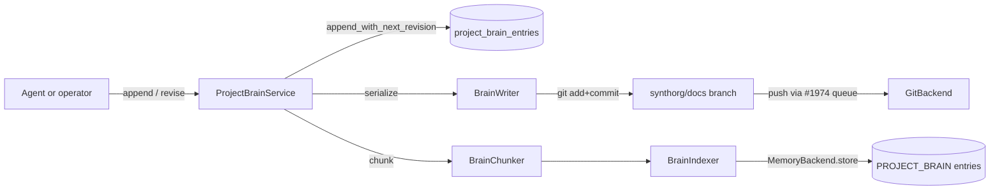

# Long-Horizon Project Brain

A structured, queryable store of a project's living state: the decisions taken
and why, the questions still open, what is blocking progress, the standing risks,
the cross-task dependencies, and how the plan has evolved. It is the answer to
"where were we and why" after a run that spans days or weeks and many sessions.

See also: [memory.md](memory.md) (agent memory; lossy vector recall),
[living-documentation.md](living-documentation.md) (the sibling prose wiki and
RAG namespace this brain reuses for workspace versioning),
[knowledge-substrate.md](knowledge-substrate.md) (the citation/provenance
patterns this brain mirrors), [persistence.md](persistence.md) (repository
boundary and schema patterns), [coordination.md](coordination.md) (the
per-project workspace and push queue).

!!! note "Two unrelated meanings of 'brain'"

    [agent-execution.md](agent-execution.md) uses **Brain** for the agent
    inference loop (the Brain / Hands / Session vocabulary). That is a different
    concept. The **project brain** on this page is a per-project structured
    state store, not an execution plane. The two never interact.

## Goal

The org remembers its own reasoning. A decision taken on task T1, with its
rationale, the alternatives weighed, a confidence, and provenance links, is
queryable later: by an agent resuming on task T2 days afterwards, and by the
operator in the dashboard, without re-deriving it from scratch. The brain
answers "what is decided, what is open, what is blocked, what is at risk, what
depends on what, and why" as **structured data**, not prose an agent must
re-read and re-interpret.

This is the concrete acceptance bar (issue #1996): after a multi-session gap the
org resumes and correctly answers "what is decided, what is open, what is
blocked, and why" from the project brain, not by re-deriving. Validated under the
simulation harness.

## Why agent memory and living docs are not enough

| Store | What it holds | Why it cannot be the brain |
|---|---|---|
| Agent memory (Mem0) | What an agent remembers about a run | Lossy, per-agent, vector-recalled. No authoritative "current state of the project", no guaranteed retention of a specific decision's rationale. |
| Living documentation | Prose status reports and deliverables | Unstructured. You cannot query "all unresolved blockers" or "the current plan revision" without re-reading and re-parsing prose. |
| Approval-gate `DecisionRecord` | Review-gate verdicts per task (executor, reviewer, criteria, outcome) | Narrow: it records whether work passed review, not project-level decisions, open questions, blockers, risks, or the evolving plan. The brain does not touch it. |

The brain fills the gap: first-class typed records, queryable by structured
filter, with a complete append-only history of how each one changed.

## Scope

In scope: six record kinds (decision, open question, blocker, risk, dependency,
plan revision); append-only storage with a full revision history; a git-backed
snapshot in the project workspace; RAG indexing and transparent re-entry
retrieval; agent tools to write and search; an operator MCP and REST surface; a
read-only dashboard.

Out of scope: any mutation of the approval-gate `DecisionRecord`; any automatic
re-derivation or summarisation engine. Agents and the operator write brain
entries explicitly as work proceeds; the brain stores and serves them, it does
not infer them.

## Surface

```text
src/synthorg/project_brain/
  models.py          - BrainEntry envelope + per-kind payload union
  constants.py       - branch name, namespace, system agent id, limits
  errors.py          - BrainEntryNotFoundError, BrainEntryRevisionConflictError, ...
  serializer.py      - deterministic JSON on disk (sorted keys, indent=2)
  chunker.py         - block-aware deterministic chunker for an entry
  indexer.py         - PROJECT_BRAIN entries with project + entry + kind tags
  writer.py          - serialise -> workspace -> commit on docs branch
  query.py           - current-state projection (latest revision per entry)
  mutation.py        - build_entry / apply_overrides revision transforms
  service.py         - ProjectBrainService: append, revise, query, history
  replay.py          - boot re-index of never-indexed / stale-revision entries
  factory.py         - build_project_brain_service(...) -> ProjectBrainRuntime
  tool_factory.py    - ProjectBrainToolFactory: per-task agent tools
  state.py           - ProjectBrainStateSlice + project_brain_service_of
  feature.py         - feature manifest (controllers, mcp, ghost-wired symbols)
```

The package mirrors `docs_engine/` deliberately: same write-serialise-commit-index
shape, the same per-project workspace and push queue, the same retrieval facade.

## Data model

One **envelope** model with a **discriminated payload union** on `entry_kind`.
A single envelope keeps one table, one repository, one MCP sub-domain, and one
conformance suite, while per-kind payloads carry the fields and status rules
unique to each kind. This mirrors the proven `DocBlock` discriminated union in
the living-documentation engine.

Every model is a frozen Pydantic v2 `BaseModel` with `extra="forbid"`; all
collections are tuples; derived values use `@computed_field`. Timestamps are
`AwareDatetime` and are rejected if naive. Identifiers are `NotBlankStr`.

All brain-specific enums (`BrainEntryKind`, `BrainEntryStatus`, `CitationKind`,
and the per-kind enums such as `BlockerSeverity`, `RiskLevel`, `DependencyKind`)
live in the feature package, not in `core/enums.py`. Only the single new
`MemoryCategory.PROJECT_BRAIN` member is added to `core/enums.py`.

### Envelope

```python
class BrainEntry(BaseModel):
    model_config = ConfigDict(frozen=True, allow_inf_nan=False, extra="forbid")

    entry_id: NotBlankStr        # logical id, stable across revisions
    revision: int                # ge=1; monotonic per entry_id, server-assigned
    project_id: NotBlankStr
    entry_kind: BrainEntryKind   # discriminator
    title: BrainTitle            # bounded non-blank
    rationale: BrainRationale    # bounded; the "why"
    status: BrainEntryStatus
    author: NotBlankStr          # agent id or operator id
    recorded_at: AwareDatetime   # UTC
    related_task_ids: tuple[NotBlankStr, ...] = ()
    related_entry_ids: tuple[NotBlankStr, ...] = ()
    supersedes_entry_id: NotBlankStr | None = None
    tags: tuple[NotBlankStr, ...] = ()
    confidence: float | None = None          # ge=0.0, le=1.0
    citations: tuple[Citation, ...] = ()     # provenance for documentary mode
    payload: BrainPayload                    # discriminated on entry_kind
```

`entry_id` is the **logical** identity: it is stable across every revision of the
same record. `revision` is server-assigned (never caller-chosen) and increments
by one each time the record changes. The pair `(entry_id, revision)` is unique.

### Citation

```python
class CitationKind(StrEnum):
    TASK; DOC_SLUG; KNOWLEDGE_SOURCE; ENTRY; EXTERNAL_URL

class Citation(BaseModel):
    model_config = ConfigDict(frozen=True, allow_inf_nan=False, extra="forbid")
    source_ref: NotBlankStr
    source_kind: CitationKind
    locator: str | None = None   # page, line range, anchor, ...
```

Citations let a brain entry point at the evidence behind it: a task, a living
doc, a knowledge-substrate source chunk, another brain entry, or an external URL.
They supply the provenance that documentary mode (#1985) needs.

### Kinds, payloads, and status

`BrainEntryKind` is the discriminator. `BrainEntryStatus` is a single shared
status enum; each payload validates, in a `model_validator`, which subset of
statuses is legal for its kind, so an open question can never be marked
`MITIGATED` and a risk can never be marked `RESOLVED`.

| Kind | Payload fields | Legal statuses |
|---|---|---|
| `DECISION` | `alternatives: tuple[NotBlankStr, ...]`, `decision_outcome: NotBlankStr` | `ACCEPTED`, `SUPERSEDED` |
| `OPEN_QUESTION` | `answer: str \| None` | `OPEN`, `RESOLVED` |
| `BLOCKER` | `severity: BlockerSeverity`, `resolution: str \| None` | `BLOCKED`, `CLEARED` |
| `RISK` | `likelihood: RiskLevel`, `impact: RiskLevel`, `mitigation: str \| None` | `ACTIVE`, `MITIGATED`, `RETIRED` |
| `DEPENDENCY` | `depends_on: NotBlankStr`, `dependency_kind: DependencyKind` | `OPEN`, `RESOLVED` |
| `PLAN_REVISION` | `summary: BrainRationale`, `supersedes_plan_entry_id: NotBlankStr \| None` | `ACTIVE`, `SUPERSEDED` |

`BrainPayload` is `Annotated[DecisionPayload | OpenQuestionPayload | ... ,
Field(discriminator="entry_kind")]`. Each payload is frozen with `extra="forbid"`
and carries a literal `entry_kind` so Pydantic resolves the union without
ambiguity.

### Projections

- `BrainSummary`: lightweight list-view projection (kind, title, status, author, recorded_at, revision).
- `BrainEntryVersion`: one git-history entry (commit hash, author, timestamp, revision).
- `BrainChunk`: indexer-ready chunk with the originating `entry_id`.
- `BrainSearchHit`: a retrieval result with `relevance_score` in `[0.0, 1.0]`.

## Storage decision

The brain uses **three layers**, each with a distinct job. This is the same
shape as the living-documentation engine, chosen because the issue requires the
brain to be both "structured, queryable" and "persisted in the project workspace
(versioned)", and neither requirement alone covers the other.

| Layer | Role | Why it is needed |
|---|---|---|
| SQL append-only (`project_brain_entries`) | System of record and structured query. The revision chain is the full version history. | Fast filtered projections ("what is open", "what is blocked") in one indexed query; dual-backend; the authoritative store. |
| Git JSON snapshot (`<workspace>/.synthorg/brain/<kind>/<entry_id>.json` on the `synthorg/docs` branch) | A versioned, human-readable copy that travels with the project. | The issue's literal "persisted in the project workspace (versioned)". Makes the brain portable: it clones, exports, and hands off with the workspace, independent of the framework database. Gives documentary mode commit-aligned, point-in-time provenance. |
| Memory index (`MemoryCategory.PROJECT_BRAIN`) | RAG re-entry retrieval. | An agent resuming a project retrieves relevant brain state transparently through the existing `ProjectAwareMemoryFacade` fan-out, with no special-casing in agent code. |

### Alternatives weighed

- **SQL only.** Cleanest query story, and the append-only revision chain is
  already a complete history. Rejected because it does not satisfy the literal
  "persisted in the project workspace (versioned)" requirement: the brain would
  not travel with the project, the operator could not `git log` it, and
  documentary mode would lose commit-aligned provenance. A lesser product.
- **Git JSON only.** The most literal reading of the requirement. Rejected
  because "structured, queryable" then degrades to reading and parsing every
  file (or rebuilding an in-memory index on boot); filtering "what is open or
  blocked" becomes O(all files) with no efficient projection.

The hybrid keeps the SQL store authoritative for queries, the git layer
authoritative for portability and provenance, and the memory index purely
derived (it can be rebuilt from SQL at any time).

### Write path



The SQL append is the durable commit point. The git snapshot and the memory
index follow. If indexing fails (for example a transient memory-backend outage)
the SQL row and the git commit still stand; a boot-time replay re-indexes the
gap, idempotently, because prior chunks are deleted by the `brain_entry:<id>`
tag before fresh ones are stored. The gap is tracked per entry as a revision
integer: the `project_brain_index_state` table records the last revision the
indexer successfully stored for each entry, and the boot replay re-indexes every
entry whose current revision exceeds its last-indexed revision (or that has no
row at all). A never-revised entry left behind by a failed index is therefore
healed at the next boot rather than waiting for a future write.

## Persistence

Only `src/synthorg/persistence/` emits SQL. The new protocol lives at
`persistence/project_brain_protocol.py` and composes one generic category from
`persistence/_generics.py`:

```python
@runtime_checkable
class ProjectBrainRepository(
    AppendOnlyRepository[BrainEntry, BrainFilterSpec],
    Protocol,
):
    ...
```

`AppendOnlyRepository` is the right base because every change is an append (a new
revision), never an in-place update. The protocol adds bespoke methods under
[ADR-0001](../decisions/0001-repository-protocol-consolidation.md) D7 (a real
domain invariant the generic surface cannot express), exactly as
`DecisionRepository` does:

- `append_with_next_revision(...) -> BrainEntry`: assigns
  `revision = COALESCE(MAX(revision), 0) + 1` partitioned by `entry_id` inside a
  single `INSERT`, eliminating the time-of-check-to-time-of-use race under
  concurrent writers. `UNIQUE(entry_id, revision)` is the backstop.
- `get_current(project_id, entry_id) -> BrainEntry | None`: the latest revision
  of one entry.
- `list_current(filter_spec, *, limit, offset) -> tuple[BrainEntry, ...]`: the
  **current-state projection**, the latest revision of every entry matching the
  filter. This is the correctness heart of the acceptance criterion. The query
  selects the top revision per `entry_id` with
  `ROW_NUMBER() OVER (PARTITION BY entry_id ORDER BY revision DESC) = 1`, then
  applies the kind and status filters. Window functions behave identically on
  SQLite (3.25 and later) and Postgres; the protocol documents this.
- `history(project_id, entry_id, *, limit, offset) -> tuple[BrainEntry, ...]`:
  the full revision chain for one entry, oldest first.
- `get(entry_id, revision) -> BrainEntry | None`: an exact revision lookup.

```python
class BrainFilterSpec(BaseModel):
    model_config = ConfigDict(frozen=True, allow_inf_nan=False, extra="forbid")
    project_id: NotBlankStr           # required; the brain is always project-scoped
    entry_kind: BrainEntryKind | None = None
    status: BrainEntryStatus | None = None
    tag: NotBlankStr | None = None
    author: NotBlankStr | None = None
    related_task_id: NotBlankStr | None = None
    updated_since: AwareDatetime | None = None
```

### Retention

`purge_before(threshold)` is guarded so retention can never silently destroy the
"why". It purges only **non-current historical revisions** older than the
threshold and always retains the latest revision of every `entry_id`. Current
state survives any retention sweep; only superseded history beyond the window is
collected.

### Backends and schema

Concrete implementations mirror the living-documentation repositories:
`persistence/sqlite/project_brain_repo.py` and
`persistence/postgres/project_brain_repo.py`, using positional placeholders,
`format_iso_utc` / `coerce_row_timestamp` for datetimes, JSON-encoded tuples and
payloads, and `_escape_like` for tag matching. The repository is exposed as
`.project_brain` on the `PersistenceBackend` protocol and on both backend
classes.

The table `project_brain_entries` has primary key `(project_id, entry_id,
revision)`, a `UNIQUE(entry_id, revision)` constraint, a foreign key
`project_id -> projects` with `ON DELETE CASCADE`, and indices supporting the
current-state projection and the filter dimensions. SQLite stores timestamps as
`TEXT` and the payload as a JSON-validated `TEXT` column; Postgres uses
`TIMESTAMPTZ`. A new yoyo revision ships for each backend (a new
`<14-digit-timestamp>_project_brain.sql`, never editing an existing revision)
alongside the canonical `schema.sql` for both backends, and a dual-backend
conformance suite at
`tests/conformance/persistence/test_project_brain_repository.py`.

## Service layer and query surface

`ProjectBrainService` is the single async entry point. Controllers stay thin and
hold no logic; everything routes through the service.

| Method | Purpose |
|---|---|
| `append_entry(...)` | Create a new logical entry at revision 1. |
| `revise_entry(...)` | Append the next revision of an existing entry. |
| `resolve(entry_id, ...)` | Convenience over `revise_entry` that sets a resolved-style status (answers a question, resolves a dependency). |
| `supersede(entry_id, by_entry_id, ...)` | Mark a decision or plan revision superseded and link the successor. |
| `clear_blocker(entry_id, ...)` | Convenience over `revise_entry` that sets a blocker to `CLEARED` with a resolution. |
| `get_entry(project_id, entry_id, revision=None)` | One entry, latest or at an exact revision. |
| `get_current(project_id, entry_id)` | Latest revision of one entry. |
| `list_current(project_id, ...)` | Current-state projection, filtered by kind and status. |
| `count_current(project_id, ...)` | Count of current-state entries matching the same filters. |
| `query(project_id, query, ...)` | Semantic search over indexed brain entries. |
| `history(project_id, entry_id, ...)` | Full SQL revision chain of one entry. |
| `git_history(project_id, entry_id, ...)` | Git-commit history of the entry's on-disk snapshot, newest-first. |

The lifecycle helpers (`resolve`, `supersede`, `clear_blocker`) are typed sugar:
each is an append of a new revision with a status change, so the audit trail
stays complete and uniform. The service owns a per-project write lock so that
revision assignment, the workspace snapshot, and indexing happen atomically for a
given project.

To keep `service.py` well within the service-tier size budget, the writer (which
serialises the JSON snapshot and commits it), the chunker and indexer, and the
current-state projection helpers each live in their own module; the service
orchestrates them.

## Retrieval and the PROJECT_BRAIN memory category

A new `MemoryCategory.PROJECT_BRAIN = "project_brain"` is added to
`core/enums.py`. Brain chunks are stored under the synthetic
`SYSTEM_BRAIN_AGENT_ID = "_system:brain"` agent id in a fixed namespace
`project_brain`, with tags for scoping and idempotent re-index:

| Tag prefix | Purpose |
|---|---|
| `project:<id>` | Project scope. The retrieval facade filters on this. |
| `brain_entry:<entry_id>` | Identifies the source entry. The indexer deletes prior chunks by this tag before storing fresh ones. |
| `brain_kind:<kind>` | Lets a search hit expose the kind without a repository lookup. |

A new `MemoryCategory` member, rather than reusing `PROJECT_DOC`, is the right
call: brain entries have a different structure and a different retention model
from prose docs, and a distinct category lets an agent retrieve brain state
independently rather than tag-filtering it out of the doc corpus. Both
`PROJECT_DOC` and `KNOWLEDGE` were introduced exactly this way.

Two retrieval paths, both first-class, exactly as for living docs:

1. **Transparent.** `ProjectAwareMemoryFacade` gains a fourth fan-out leg.
   When an agent on project P retrieves memory, the facade fans out via
   `asyncio.TaskGroup` to the agent's own memories, `PROJECT_DOC`, `KNOWLEDGE`,
   and now `PROJECT_BRAIN` scoped to P. Brain state becomes a first-class RAG
   member with no special-casing in agent code: this is the re-entry path the
   acceptance criterion turns on.
2. **Explicit.** `SearchBrainTool` and `ProjectBrainService.query` answer a
   brain-specific semantic query ("what risks did we accept around payments").

## Untrusted content (SEC-1)

Brain text is authored by agents and the operator, so it is untrusted when it
re-enters an agent's context. A new tag `TAG_BRAIN_STATE = "brain-state"` is
defined in `engine.prompt_safety` (it matches the required
`[a-z][a-z0-9-]{0,31}` pattern) and added to the untrusted-content directive
set. Brain entries surfaced through the retrieval facade are wrapped with
`wrap_untrusted(TAG_BRAIN_STATE, ...)` at the retrieval boundary, never on
storage, mirroring the living-documentation and knowledge-substrate boundaries.

## Feeds to documentary mode and mid-flight steering

The brain is a source the rest of EPIC #1987 consumes.

**Documentary mode (#1985)** reads the brain's current state and history to
narrate the run: the decisions taken and their rationale, who recorded them and
when, and the outcomes. The `citations` tuple, the `related_task_ids`, and the
commit-aligned git snapshot supply the provenance the narrative attaches to each
claim. The brain is queried by the narrator; it does not itself produce prose.

[**Mid-flight steering (#1997)**](mid-flight-steering.md) both writes to and
reads from the brain. When the operator issues a steering redirect, the brain
receives a new `PLAN_REVISION` entry (tagged `steering`, with the directive as
its rationale and the operator as author) **before** the directive propagates to
agents, so a crash between propagation and persistence cannot lose the steering
history. In-flight agents picking up the directive query `list_current` at safe
boundaries to read the latest steering state.

## API and tool surface

### Agent tools (in-process, per-task binding)

- `WriteBrainEntryTool`: append or revise a brain entry. Routed through the
  trust and capability system as a write action.
- `SearchBrainTool`: semantic search over the project's brain (a `memory:read`
  action).

Constructed per task by `ProjectBrainToolFactory`, exactly as
`DocsToolFactory` builds the living-doc tools.

### MCP (operator-driven, `synthorg.meta.mcp.domains.brain`)

Eight tools, defined in `meta/mcp/domains/brain.py` and contributed to the MCP
registry through the `project_brain` feature manifest (`feature.py`). Write and
lifecycle tools require the admin capability and call
`require_admin_guardrails()` first; read tools do not.

| Tool | Capability | Purpose |
|---|---|---|
| `brain:append` | admin | Create or revise an entry. |
| `brain:resolve` | admin | Resolve an open question or dependency. |
| `brain:supersede` | admin | Supersede a decision or plan revision. |
| `brain:clear_blocker` | admin | Clear a blocker with a resolution. |
| `brain:get` | read | One entry, latest or at a revision. |
| `brain:list` | read | Current-state list, filtered by kind and status. |
| `brain:query` | read | Semantic search across indexed entries. |
| `brain:history` | read | Revision chain of one entry. |

### REST (read-only, web dashboard)

The controller at `api/controllers/project_brain.py` is read-only; writes happen
in-process via the agent tool or the MCP handler.

| Method | Path | Returns |
|---|---|---|
| `GET` | `/projects/{project_id}/brain` | Current-state `BrainSummary[]`, filter by kind and status, cursor-paginated. |
| `GET` | `/projects/{project_id}/brain/{entry_id}` | The latest `BrainEntry`. |
| `GET` | `/projects/{project_id}/brain/{entry_id}/history` | `BrainEntryVersion[]` from the git snapshot history (`git_history`), distinct from the SQL revision chain. |
| `GET` | `/projects/{project_id}/brain/search?q=...` | `BrainSearchHit[]` ordered by relevance. |

Responses use the standard `ApiResponse` / `PaginatedResponse` wrappers and the
`require_read_access` guard, and return 503 when the subsystem is not wired,
mirroring `project_docs.py`.

## Web dashboard

A read-only operator board at `web/src/pages/ProjectBrainPage.tsx`, route
`/projects/:projectId/brain`, with supporting components under
`web/src/pages/project-brain/`. The board has a section per kind (Decisions,
Open Questions, Blockers, Risks, Dependencies, Plan), showing current state by
default with per-entry revision history available on demand, and filters by kind
and status. It reuses `web/src/components/ui` and design tokens only (no
hardcoded colours or spacing). Untrusted-content handling stays server-side; the
dashboard renders already-stored structured data.

## Constraints honoured

- **Persistence boundary**: only `persistence/` emits SQL; the new protocol
  composes `AppendOnlyRepository`; bespoke methods are justified under ADR-0001
  D7; records are append-only (a status change is a new revision, never an
  in-place update).
- **Immutability**: every model is frozen with `extra="forbid"`; `@computed_field`
  for derived values.
- **Time**: UTC only via `persistence._shared`; naive datetimes rejected.
- **Regional defaults**: British English throughout; no region, currency, or
  locale privileged; metric units.
- **SEC-1**: brain content entering agent context is wrapped via
  `wrap_untrusted(TAG_BRAIN_STATE, ...)`.
- **Workspace versioning**: snapshots commit through
  `ProjectWorkspaceService.get_or_provision` and the per-project push queue, on
  the shared `synthorg/docs` branch.
- **Logging**: `get_logger`, event-name constants, structured keyword arguments,
  and SEC-1 redaction (no `str(exc)`, no `exc_info`).
- **Ghost-wiring discipline (#1987)**: every boot-constructed symbol is listed
  ENFORCED in `scripts/_ghost_wiring_manifest.txt` in the same change.
- **Module-size budget**: the unified envelope keeps each persistence aggregator
  to a single added property; the one new `core/enums.py` member is added
  LOC-neutral.

## Acceptance

The org runs across a multi-session gap, then resumes and correctly answers
"what is decided, what is open, what is blocked, and why" from the brain rather
than re-deriving it. Validated under the simulation harness, plus:

- **Unit** (`tests/unit/project_brain/`): models and the payload union, the
  per-kind status validators, deterministic serialisation round-trip, the
  chunker, the indexer, the current-state projection, identifier and revision
  assignment, the `PROJECT_BRAIN` category, and the SEC-1 wrap.
- **Conformance** (`tests/conformance/persistence/test_project_brain_repository.py`,
  SQLite and Postgres): save and get, current-state and history ordering,
  revision uniqueness under the CAS, retention that retains the latest revision,
  and foreign-key cascade on project deletion.
- **Integration** (`tests/integration/project_brain/`): append then read back
  the same entry; an append commits on the `synthorg/docs` branch; a revision
  appends a new row and current state reflects the latest; a supersede chain;
  search returns an indexed entry; the facade surfaces brain state for a
  different agent on a later task; re-index replaces prior chunks; and the
  multi-session-gap resume answers decided / open / blocked / why.
- **Web**: a Vitest suite for `ProjectBrainPage`.
