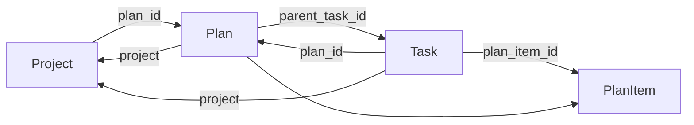
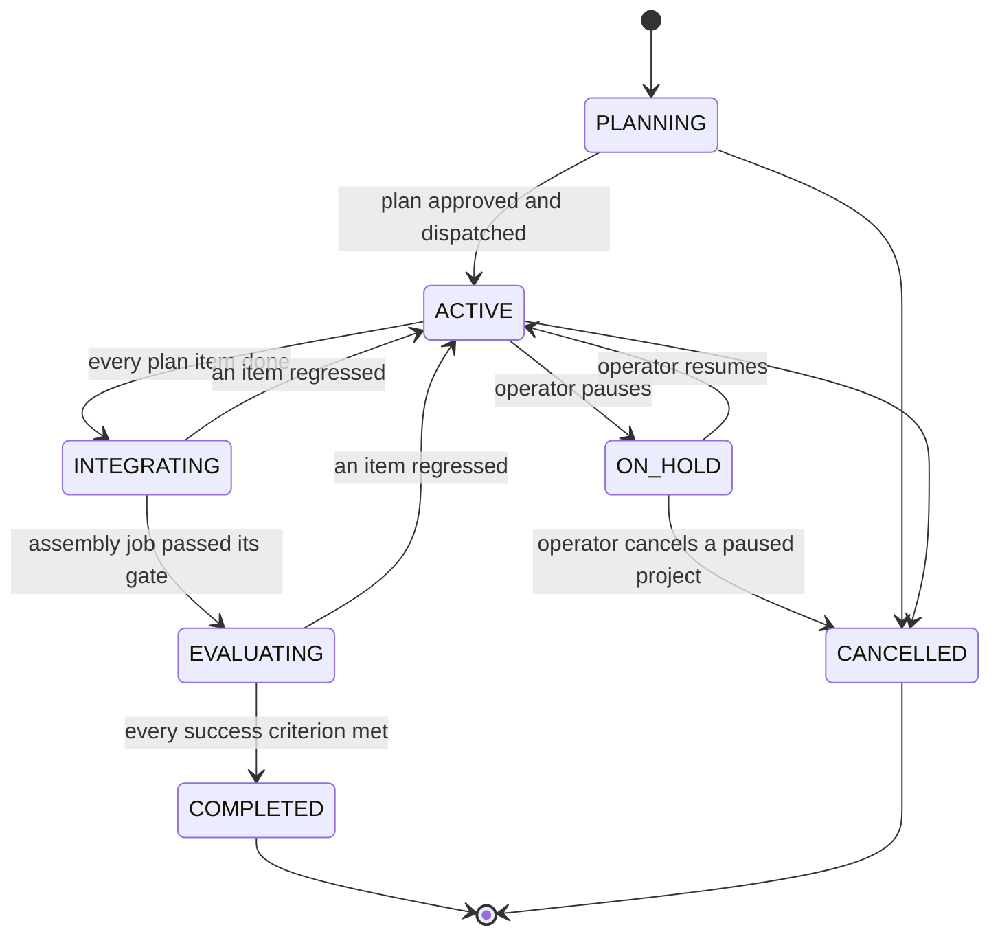

# Project Lifecycle

How a greenlit objective becomes one trackable initiative: the project knows the
plan it is executing, the plan's items know the tasks implementing them, and the
project's status advances from that work.

This page owns the project side of the graph. [Plan Review](plan-review.md) owns
the plan's authoring and review phases; [Engine](engine.md) owns the task
lifecycle.

## The graph

Three entities, linked by scalar foreign keys pointing *upward* only.



| edge | field | notes |
| --- | --- | --- |
| Project to Plan | `Project.plan_id` | the plan being executed |
| Plan to Project | `Plan.project` | set at plan creation, immutable |
| Plan to Task | `Plan.parent_task_id` | the objective task the plan decomposes; a real FK, `ON DELETE RESTRICT` |
| Task to Plan | `Task.plan_id` | stamped at dispatch |
| Task to PlanItem | `Task.plan_item_id` | stamped at dispatch |
| Task to Project | `Task.project` | set at intake, immutable |

`Plan.parent_task_id` is the one downward-pointing edge, and the only one the
database enforces, because it is the one whose violation strands a row an
operator cannot reach: an orphaned plan cannot be approved (its parent 404s),
superseded, or deleted. Deleting a task a plan references is refused
(409) rather than allowed to orphan it; the exit is `DELETE /plans/{id}`. See
[Plan review](plan-review.md#persistence).

**No entity stores a collection of its children.** Reverse lookups are indexed
queries: `TaskFilterSpec(plan=...)` for a plan's tasks,
`TaskFilterSpec(project=...)` for a project's tasks, and
`PlanFilterSpec(project=...)` for a project's plan history.

This is a deliberate correction. `Project.task_ids` previously existed as a
stored tuple of child ids and was never populated by anything, so the dashboard
showed a task count of zero next to a full task list. A collection embedded in a
row has to be written by every actor that creates a child, in the same
transaction, forever; a scalar upward key is written once by the actor that
already owns the write. The dead field was removed rather than filled in.

`Project.plan_id` always names the one plan the project is working
through. Every earlier revision stays reachable through
`PlanFilterSpec(project=...)`, which returns superseded plans too.

## Re-planning a dispatched initiative

A plan under review is edited in place: same entity, bumped version, back to
pending review. Once a plan is dispatched that is no longer possible, because
its items are already building and rewriting them would leave running tasks
implementing items that no longer exist. Revising a dispatched plan is
therefore a re-plan (`POST /plans/{id}/replan`), which:

1. retires the current revision to `SUPERSEDED`;
2. cancels the in-flight tasks it dispatched, through their audited
   lifecycle transitions, so no live work points at a withdrawn revision;
3. opens a successor plan entity carrying the objective and framing forward,
   entering `PENDING_REVIEW` because its items hold no approval;
4. repoints `Project.plan_id` at the successor.

The ordering protects one invariant: a project never has two live plans. If a
later step fails, the recoverable state is an initiative whose plan is
superseded and whose successor is missing, which an operator resolves by
planning again. The alternative ordering would leave two live plans with
`Project.plan_id` naming one arbitrarily and the rollup deriving status from a
revision the operator had already abandoned.

The successor is not dispatched by the re-plan. It goes through review like any
other plan, and approval activates the project and repoints it through the same
path first dispatch uses, so there is one dispatch path rather than two.

## Status lifecycles

Both `Plan` and `Project` have a real transition table on the shared
`core/state_machine.py`, exactly as `Task` does. Illegal jumps are impossible
rather than merely unwritten.



The project mirrors its plan's tail stage by stage, so the cockpit distinguishes
an initiative still building from one whose pieces are being assembled, and both
from one awaiting a verdict. `INTEGRATING` and `EVALUATING` also carry the
`ON_HOLD` and `CANCELLED` edges, omitted above for readability; every other edge
in `core/project_transitions.py` is shown.

**`ACTIVE -> COMPLETED` does not exist**, and neither does the plan's
`EXECUTING -> COMPLETED`. Delivery has exactly one predecessor, which is what
makes the tail structural rather than a convention: see
[Initiative Tail](initiative-tail.md).

`ON_HOLD` has no direct hop to `COMPLETED`: an operator who paused an initiative
must resume it before it can finish, so work never completes out from under a
deliberate hold. Resuming returns to `ACTIVE`, from which the tail is
re-derived, rather than dropping the operator back into a half-finished stage
whose gate has already run.

### There is no failed project

`ProjectStatus` has no failure value, and this is a design decision rather than
an omission.

Nothing downstream can honestly derive that an initiative is dead. A
completion-oracle `REJECT` routes a task back to `IN_PROGRESS` for rework, not to
failure. A task that does reach `FAILED` stays reassignable (`FAILED -> ASSIGNED`
in the task state machine). So a derived failure would flap the moment the work
was retried, and it would assert a judgement the system is not entitled to make.

Ending an initiative is a human act, and `CANCELLED` already expresses it.
Recovery is a human act too: replan. Failed and blocked work surfaces as
**derived counts** on the progress view, so the operator can tell that an initiative
needs attention without the system pretending to have decided its fate.

The general rule: **statuses are what the organisation decides; "something is
wrong" is signal.**

## Completion

An item is done when:

```text
kind is WORK      ->  its dispatched task reached COMPLETED
kind is DECISION  ->  an option has been chosen
```

Every item being done is **the start of the tail, not the end of the plan**. A
set of individually-verified pieces has not been shown to work together, so the
plan moves to `INTEGRATING` and delivery becomes the evaluate stage's verdict.
An itemless plan never self-advances: it has delivered nothing, so "every item
is done" being vacuously true must not read as progress.

A project is `COMPLETED` when the plan it is executing is, and nothing in the
rollup can write `COMPLETED` onto a plan. See
[Initiative Tail](initiative-tail.md).

Decision items are included deliberately. They never dispatch as tasks
(`decomposition_from_plan` strips them before dispatch), but an unresolved
decision is real work the operator still owes, so an initiative cannot complete
around one.

### How this composes with the verify gate

The rollup reads **persisted `Task.status`**, never execution outcomes.

That single choice is what keeps an initiative from completing on unverified
work. Under the wired agent runtime a task reaches `COMPLETED` through
`ReviewGateService._apply_decision`, which runs the full gate chain (build/test
oracle, completion-oracle peer review, output policy, red team, vision).
Requiring `COMPLETED` therefore inherits every one of those gates without the
rollup making a single oracle call.

This used to be a property of which writers were wired rather than a structural
invariant, because two paths reached `COMPLETED` without the oracle chain. Both
are now fenced:

- `LifecycleAdvancingExecutionService`
  (`workers/execution_service/_lifecycle.py`), the lifecycle-only baseline the
  app self-constructs when no agent runtime is installed, refuses to advance a
  **plan-linked** task out of `IN_REVIEW`. Stopping there is honest for a boot
  with no runtime to verify anything; jumping to `COMPLETED` was a lie. A
  directly filed task keeps the baseline's full happy path.
- The coordination parent rollup (`engine/coordination/parent_rollup.py`) reads
  each subtask's **persisted status** rather than the `DispatchResult` outcomes
  it used to derive from. Those outcomes report execution success *before*
  verification, so a task parked in `IN_REVIEW` awaiting the oracle counted as
  completed. Immediately after `coordinate()` most subtasks are therefore
  `IN_REVIEW` and the parent stays `IN_PROGRESS`; the initiative rollup
  re-derives the parent on every later task event, so it lands its terminal
  status once the gate has ruled on each child.

The objective task itself is held open for exactly as long as its plan is: every
item passing its own gate does not deliver the objective, the tail does.

## Rollup

`ProjectRollupService` (`engine/initiative/rollup.py`) registers as a
`TaskEngine` observer, so it observes every task status write regardless of which
path produced it: the review gate's decision, the execution loop's failure
handling, an operator cancellation.

**It recomputes; it does not accumulate.** The event is only a trigger. On each
one the service re-queries every task for the plan and derives plan and project
status from scratch, then writes under optimistic concurrency.

Two properties follow, and both are the reason for the design:

- **Idempotent, therefore self-healing.** `TaskEngine` observers are explicitly
  best-effort: a bounded queue, drained at shutdown, so events can be dropped or
  redelivered. A full recompute means the next event repairs any drift and a
  duplicate event changes nothing. An incremental counter would be corrupted
  permanently by a single dropped event, which is why there is no reconciler
  worker: correctness does not depend on delivery.
- **Verification-derived, not execution-derived**, as above.

Writes are version-guarded (`expected_version`) with a bounded retry, and a
per-plan in-process lock serialises same-process recomputes. A losing write
re-reads and recomputes rather than clobbering the winner.

The rollup also fires the loop's detached tails, each best-effort and each
unable to block or fail it:

- **Integrate and evaluate**, while the plan reads as `INTEGRATING` or
  `EVALUATING`. Both stages are idempotent, so firing on every recompute rather
  than on an edge is safe and needs no "already started" flag to keep in step
  with reality. An unwired stage parks the plan visibly instead of completing
  it. See [Initiative Tail](initiative-tail.md).
- **Auto-replan**, while the plan reads as stalled: outstanding items exist and
  none of them can advance without a new decision.
- **The SHIP retrospective**, on the edge a project first reaches `COMPLETED`
  (and only that transition, never a recompute over an already-terminal
  project), so finished work feeds a retrospective back into org and agent
  memory. See the "Retrospective Capture on SHIP" section of
  [memory-learning.md](memory-learning.md) for the capture pipeline.

## Where linkage is written

At dispatch, in `_dispatch_approved_plan`
(`api/controllers/_plan_review_resume.py`), and **before** the coordinator runs:

1. `Project.plan_id` is repointed and the project goes `PLANNING -> ACTIVE`.
2. The plan goes `APPROVED -> EXECUTING`.
3. `decomposition_from_plan` stamps `plan_id` + `plan_item_id` onto every child
   task it builds.

The ordering is load-bearing: `coordinate()` awaits the whole subtask tree, so a
rollup event fired mid-dispatch would otherwise observe a project still
`PLANNING` with its tasks already running.

`Task.plan_item_id` makes the previously implicit correlation explicit. The child
task id is still minted deterministically from the plan item id
(`subtask_uuid`), but reading the graph no longer requires knowing that trick.

## Operator surface

`GET /projects/{id}/progress` returns the initiative view: plan status, every
plan item with its task status, derived counts (`total` / `done` / `failed` /
`blocked`), and the critical path.

The critical path is the longest dependency chain through the plan's item DAG
(`engine/initiative/critical_path.py`): the chain that sets the delivery date, so
shortening any other chain does not bring the plan in sooner. It is computed
server-side, which keeps the dashboard a pure API consumer and makes the same
view reachable by any API client rather than existing only in the browser.

The project detail page renders it as the initiative cockpit, subscribing to the
`plans` channel alongside `projects` and `tasks` so a plan status change
refreshes it live. A project with no plan yet returns the same shape with an
empty item list rather than a 404, so the view is stable across an initiative's
whole life.

## Persistence

`projects.plan_id`, `tasks.plan_id`, and `tasks.plan_item_id` are nullable TEXT
columns; `tasks.plan_id` is indexed because the rollup and the progress endpoint
both query by it. `plans.parent_task_id` is the one enforced reference
(`REFERENCES tasks (id) ON DELETE RESTRICT`, indexed `(parent_task_id, id)`).
`projects` records `created_at` / `updated_at`, which is what lets conversational
intake bound project reuse by age rather than by an in-process cache. The `plans`
status CHECK carries the full enum including `executing` and `completed`. SQLite
and Postgres are in parity, with one yoyo revision per backend.

Deleting a project resolves its children first and only then removes the row:
every non-terminal plan is retired (SUPERSEDED, or FAILED with "project deleted"
when it has no items, because the `items` CHECK forbids superseding an itemless
plan) and every non-terminal task is cancelled, each through its own audited
transition. The cascade and the delete are separate audited operations rather
than one transaction, because the task transitions emit domain events that
cannot be rolled back; consistency comes from idempotent forward recovery
instead, so re-issuing a failed delete re-runs the cascade as a no-op over the
already-resolved children.

Forward recovery is what makes a *partial* cascade safe, not a licence to
delete past one. A plan the initiative rollup is writing concurrently gets a
bounded re-read budget, and exhausting it aborts the delete with a 409 rather
than counting the plan retired: `plans.project` carries no foreign key, so a
project removed over a plan still live leaves an orphan nothing can reach.
Contention is transient, so repeating the delete is the resolution.
