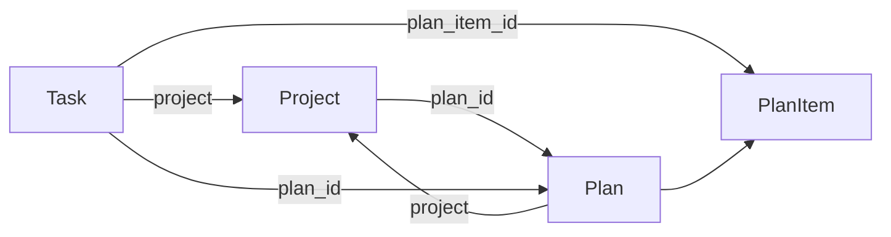
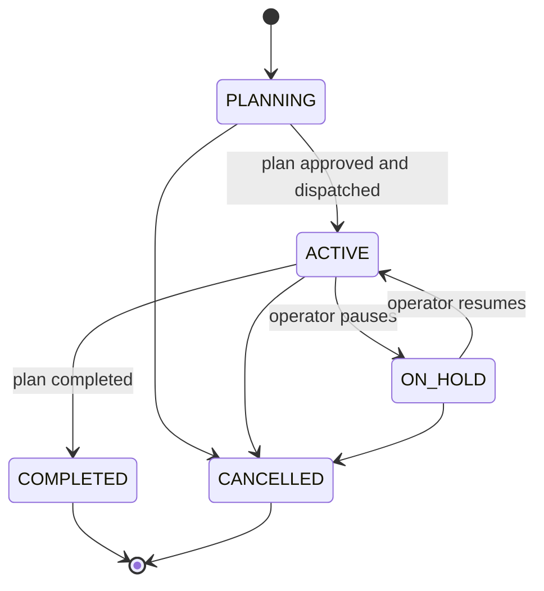

# Project Lifecycle

How a greenlit objective becomes one trackable initiative: the project knows the
plan it is executing, the plan's items know the tasks implementing them, and the
project's status advances from that work.

This page owns the project side of the graph. [Plan Review](plan-review.md) owns
the plan's authoring and review phases; [Engine](engine.md) owns the task
lifecycle.

## The graph

Three entities, linked by scalar foreign keys pointing *upward* only.



| edge | field | notes |
| --- | --- | --- |
| Project to Plan | `Project.plan_id` | the plan currently being executed |
| Plan to Project | `Plan.project` | set at plan creation, immutable |
| Task to Plan | `Task.plan_id` | stamped at dispatch |
| Task to PlanItem | `Task.plan_item_id` | stamped at dispatch |
| Task to Project | `Task.project` | set at intake, immutable |

**No entity stores a collection of its children.** Reverse lookups are indexed
queries: `TaskFilterSpec(plan=...)` for a plan's tasks,
`TaskFilterSpec(project=...)` for a project's tasks, and
`PlanFilterSpec(project=...)` for a project's plan history.

This is a deliberate correction. `Project.task_ids` previously existed as a
stored tuple of child ids and was never populated by anything, so the dashboard
showed a task count of zero next to a full task list. A collection embedded in a
row has to be written by every actor that creates a child, in the same
transaction, forever; a scalar upward key is written once by the actor that
already owns the write. The dead field was removed rather than filled in.

`Project.plan_id` always names the one plan the project is executing. A re-plan
repoints it in the same write that supersedes the previous revision, and every
earlier revision stays reachable through `PlanFilterSpec(project=...)`, which
returns superseded plans too.

## Status lifecycles

Both `Plan` and `Project` have a real transition table on the shared
`core/state_machine.py`, exactly as `Task` does. Illegal jumps are impossible
rather than merely unwritten.



`ON_HOLD` has no direct hop to `COMPLETED`: an operator who paused an initiative
must resume it before the rollup can finish it, so work never completes out from
under a deliberate hold.

### There is no failed project

`ProjectStatus` has no failure value, and this is a design decision rather than
an omission.

Nothing downstream can honestly derive that an initiative is dead. A
completion-oracle `REJECT` routes a task back to `IN_PROGRESS` for rework, not to
failure. A task that does reach `FAILED` stays reassignable (`FAILED -> ASSIGNED`
in the task state machine). So a derived failure would flap the moment the work
was retried, and it would assert a judgement the system is not entitled to make.

Ending an initiative is a human act, and `CANCELLED` already expresses it.
Recovery is a human act too: replan. Failed and blocked work surfaces as
**derived counts** on the progress view, so the operator sees that an initiative
needs attention without the system pretending to have decided its fate.

The general rule: **statuses are what the organisation decides; "something is
wrong" is signal.**

## Completion

An item is done when:

```text
kind is WORK      ->  its dispatched task reached COMPLETED
kind is DECISION  ->  an option has been chosen
```

A plan is `COMPLETED` when it has items and every one is done. A project is
`COMPLETED` when the plan it is executing is. An itemless plan never
self-completes: it has delivered nothing, so "every item is done" being
vacuously true must not read as success.

Decision items are included deliberately. They never dispatch as tasks
(`decomposition_from_plan` strips them before dispatch), but an unresolved
decision is real work the operator still owes, so an initiative cannot complete
around one.

### How this composes with the verify gate

The rollup reads **persisted `Task.status`**, never execution outcomes.

That single choice is what makes "an initiative cannot complete on unverified
work" true by construction. A task only reaches `COMPLETED` through
`ReviewGateService._apply_decision`, which runs the full gate chain (build/test
oracle, completion-oracle peer review, output policy, red team, vision).
Requiring `COMPLETED` therefore inherits every one of those gates without the
rollup making a single oracle call.

The contrast is load-bearing. The coordination-level parent rollup
(`engine/coordination/parent_rollup.py`) derives subtask status from
`DispatchResult` outcomes, which report execution success *before* verification:
a task parked in `IN_REVIEW` awaiting the oracle counts as completed there. That
is correct for advancing a parent task within one coordination run, and wrong for
deciding whether an initiative delivered. The initiative rollup does not reuse
it.

## Rollup

`ProjectRollupService` (`engine/initiative/rollup.py`) registers as a
`TaskEngine` observer, so it sees every task status write regardless of which
path produced it: the review gate's decision, the execution loop's failure
handling, an operator cancellation.

**It recomputes; it does not accumulate.** The event is only a trigger. On each
one the service re-queries every task for the plan and derives plan and project
status from scratch, then writes under optimistic concurrency.

Two properties follow, and both are the reason for the design:

- **Idempotent, therefore self-healing.** `TaskEngine` observers are explicitly
  best-effort: a bounded queue, drained at shutdown, so events can be dropped or
  redelivered. A full recompute means the next event repairs any drift and a
  duplicate event changes nothing. An incremental counter would be corrupted
  permanently by a single dropped event, which is why there is no reconciler
  worker: correctness does not depend on delivery.
- **Verification-derived, not execution-derived**, as above.

Writes are version-guarded (`expected_version`) with a bounded retry, and a
per-plan in-process lock serialises same-process recomputes. A losing write
re-reads and recomputes rather than clobbering the winner.

## Where linkage is written

At dispatch, in `_dispatch_approved_plan`
(`api/controllers/_plan_review_resume.py`), and **before** the coordinator runs:

1. `Project.plan_id` is repointed and the project goes `PLANNING -> ACTIVE`.
2. The plan goes `APPROVED -> EXECUTING`.
3. `decomposition_from_plan` stamps `plan_id` + `plan_item_id` onto every child
   task it builds.

The ordering is load-bearing: `coordinate()` awaits the whole subtask tree, so a
rollup event fired mid-dispatch would otherwise observe a project still
`PLANNING` with its tasks already running.

`Task.plan_item_id` makes the previously implicit correlation explicit. The child
task id is still minted deterministically from the plan item id
(`subtask_uuid`), but reading the graph no longer requires knowing that trick.

## Operator surface

`GET /projects/{id}/progress` returns the initiative view: plan status, every
plan item with its task status, derived counts (`total` / `done` / `failed` /
`blocked`), and the critical path.

The critical path is the longest dependency chain through the plan's item DAG
(`engine/initiative/critical_path.py`): the chain that sets the delivery date, so
shortening any other chain does not bring the plan in sooner. It is computed
server-side, which keeps the dashboard a pure API consumer and makes the same
view reachable by any API client rather than existing only in the browser.

The project detail page renders it as the initiative cockpit, subscribing to the
`plans` channel alongside `projects` and `tasks` so a plan status change
refreshes it live. A project with no plan yet returns the same shape with an
empty item list rather than a 404, so the view is stable across an initiative's
whole life.

## Persistence

`projects.plan_id`, `tasks.plan_id`, and `tasks.plan_item_id` are nullable TEXT
columns; `tasks.plan_id` is indexed because the rollup and the progress endpoint
both query by it. The `plans` status CHECK carries the full enum including
`executing` and `completed`. SQLite and Postgres are in parity, with one yoyo
revision per backend.
