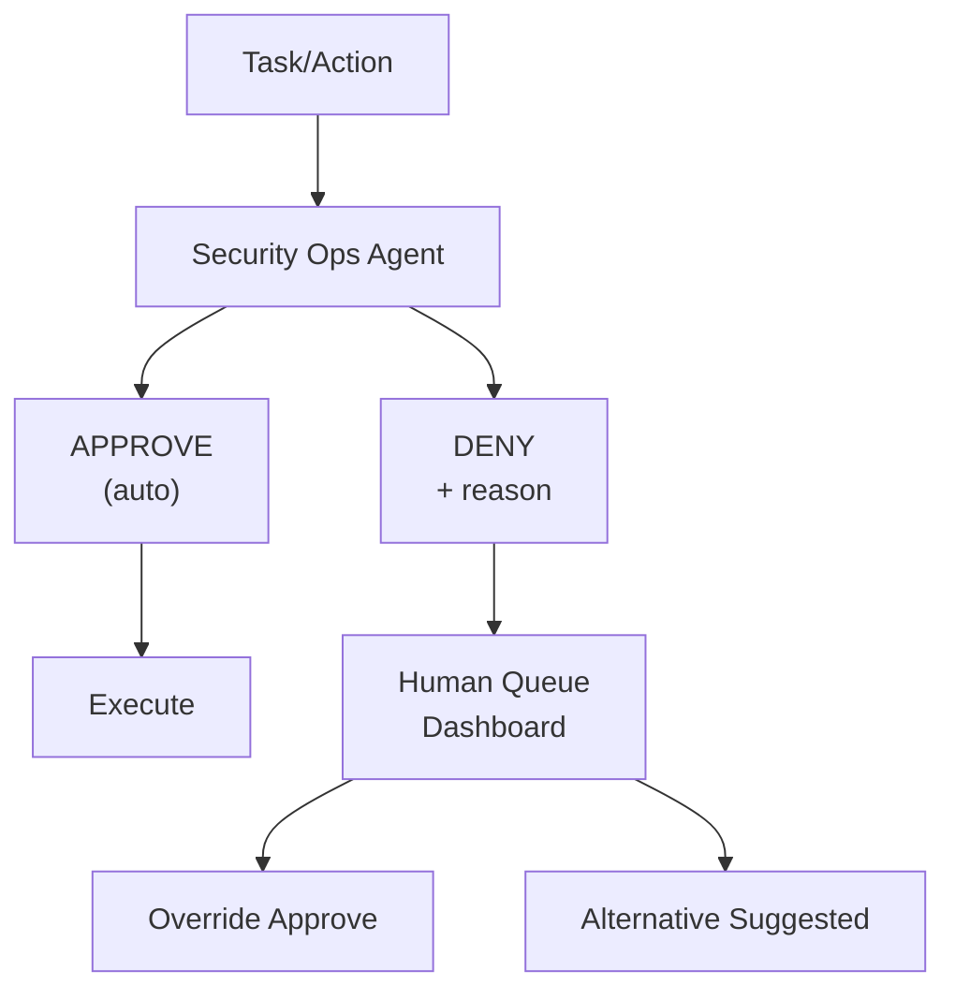

# Security & Approval System

!!! info "Runtime enforcement"

    This page is the source of truth for the behaviour of this subsystem. Governance runs on the live agent runtime behind the provider-present switch: the approval producer parks blocked actions, the boot `ApprovalGate` resumes them on a decision, an agent can call SynthOrg's own MCP tools scoped to its static tool-access level with the admin guardrails fail-closed, and the autonomy controller routes changes through the configured `AutonomyChangeStrategy`.

SynthOrg enforces a fail-closed security model: every agent action is evaluated by a rule engine (with an optional LLM fallback) before execution, every output is scanned for leaked secrets, and every credential flows through an isolated **hands** plane that never enters the model context. Four configurable autonomy levels (`full`, `semi`, `supervised`, `locked`) control which actions require human approval, and each agent's tool access is a static `access_level` set per agent or department.

## Approval Workflow



## Autonomy Levels

The framework provides four built-in autonomy presets that control which actions agents can
perform independently versus which require human approval. Most users only set the level.

```yaml
autonomy:
  level: "semi"                  # full, semi, supervised, locked
  presets:
    full:
      description: "Agents work independently. Human notified of results only."
      auto_approve: ["all"]
      human_approval: []

    semi:
      description: "Most work is autonomous. Major decisions need approval."
      auto_approve: ["code", "test", "docs", "vcs", "comms:internal", "db:query"]
      human_approval: ["deploy", "org", "budget", "comms:external", "tool"]
      security_agent: true

    supervised:
      description: "Read-only and test actions auto-approved; all mutations need approval."
      auto_approve: ["code:read", "vcs:read", "test:run", "db:query"]
      human_approval:
        ["code:write", "code:create", "code:delete", "code:refactor",
         "test:write", "docs:write", "vcs:commit", "vcs:push", "vcs:branch",
         "deploy", "comms", "budget", "org", "db:mutate", "db:admin",
         "arch:decide", "tool"]
      security_agent: true

    locked:
      description: "Human must approve every action."
      auto_approve: []
      human_approval: ["all"]
      security_agent: true        # still runs for audit logging
```

Built-in templates set autonomy levels appropriate to their archetype (e.g. `full` for
Solo Builder, Research Lab, and Data Team, `supervised` for Agency, Enterprise Org, and
Consultancy). See the
[Company Types table](organization.md#company-types) for per-template defaults.

**Autonomy scope** ([Decision Log](../architecture/decisions.md) D6): Four-level
resolution chain: per-agent > per-initiative (operator-set `Project.autonomy_mode`)
> per-department > company default. The per-initiative mode lets an operator set an
oversight tier for one initiative (`PATCH /projects/{id}/autonomy-mode`); a
transition to `full` (gate-off pass-through) is a CEO-only deliberate opt-in
(`confirm=true`) audited at WARNING, and a project-lookup failure fails closed to
`locked` so a transient fault never silently loosens an operator's override.

**Runtime changes** ([Decision Log](../architecture/decisions.md) D7): Human-only
promotion via REST API (no agent, including CEO, can escalate privileges). The
agent-level change flows through the `AutonomyChangeStrategy` / approval queue; the
per-initiative mode is a direct, version-guarded write on the project row (409 on a
concurrent-write conflict). Automatic downgrade on: high error rate (one level down),
budget exhausted (supervised), security incident (locked). Recovery from
auto-downgrade is human-only.

### Autonomy change strategy plugin surface

The `AutonomyChangeStrategy` protocol (`security/autonomy/protocol.py`:
`request_promotion` / `auto_downgrade` / `request_recovery`) is a
pluggable subsystem following the risk-tier-classifier pattern: a
`StrEnum` discriminator + frozen config + safe default +
`StrategyRegistry` factory. The wrapping strategies delegate
downgrade, recovery, and the override store to a base
`HumanOnlyPromotionStrategy` (where the override store lives) and
override only the promotion decision.

| `AutonomyStrategyType` | Implementation | Behaviour |
|---|---|---|
| `HUMAN_ONLY` | `HumanOnlyPromotionStrategy` | Promotions + recovery always require human approval. Byte-identical with the pre-plugin default. |
| `BUDGET_AWARE` | `BudgetAwarePromotionStrategy` | Denies promotion while risk-budget headroom (injected `RiskBudgetSignalProvider`) is below `budget_warn_fraction`; otherwise delegates the decision to the base. |
| `ESCALATION_CHAIN` | `EscalationChainPromotionStrategy` | Records the configured approver-role `escalation_chain` and returns pending (`False`); per-role approvals arrive out-of-band. |

Selection: `AutonomyStrategyConfig` (frozen, default
`kind=HUMAN_ONLY`) + `AutonomyStrategyDeps` (the base strategy and
signal providers that cannot live in frozen config).
`change_strategy_factory.build_autonomy_change_strategy(config, deps)`
dispatches via the `StrEnum`-keyed `StrategyRegistry`; a wrapping
strategy missing its required signal provider raises
`AutonomyStrategyConfigError` at construction. The strategy is built
at boot from `config.autonomy.change_strategy` and attached to
application state; the autonomy controller consults it on every
change request (the request is enqueued as an approval, the queue
being the apply driver). With the `HUMAN_ONLY` default every promotion pends for
human review. The strategy verdict is enforced, not audit-only: a
strategy that returns `True` from `request_promotion` produces an
auto-decided approval item (`status=APPROVED`,
`decided_by="strategy:<name>"`, `decided_at` set) and the registry
applies the level change immediately, so the queue remains the apply
driver and the audit trail stays intact while a non-`HUMAN_ONLY`
strategy actually takes effect. The risk-budget signal provider the
`BUDGET_AWARE` strategy requires is not wired by the boot seam:
selecting that kind without supplying its provider fails fast at
construction.

## Security Operations Agent

A special meta-agent that reviews all actions before execution:

- Evaluates safety of proposed actions
- Checks for data leaks, credential exposure, destructive operations
- Validates actions against company policies
- Maintains an audit log of all approvals/denials
- Escalates uncertain cases to human queue with explanation
- **Cannot be overridden by other agents** (only human can override)

**Rule engine** ([Decision Log](../architecture/decisions.md) D4): Hybrid
approach. Rule engine for known patterns (credentials, path traversal, destructive ops) plus
user-defined custom policy rules (`custom_policies` in security config). Sub-ms, covers ~95%
of cases. LLM fallback only for uncertain cases (~5%). Full autonomy mode:
rules + audit logging only, no LLM path. Hard safety rules (credential exposure, data
destruction) **never bypass** regardless of autonomy level.

**Integration point** ([Decision Log](../architecture/decisions.md) D5):
Pluggable `SecurityInterceptionStrategy` protocol. Initial strategy intercepts before every
tool invocation; slots into existing `ToolInvoker` between permission check and tool
execution. Post-tool-call scanning detects sensitive data in outputs.

## Output Scan Response Policies

After the output scanner detects sensitive data, a pluggable `OutputScanResponsePolicy`
protocol decides how to handle the findings. Each policy sets a `ScanOutcome` enum on the
returned `OutputScanResult` so downstream consumers (primarily `ToolInvoker`) can
distinguish intentional policy decisions from scanner failures:

| Policy | Behaviour | `ScanOutcome` | Default for |
|--------|----------|---------------|-------------|
| **Redact** (default) | Return scanner's redacted content as-is | `REDACTED` | `SEMI`, `SUPERVISED` autonomy |
| **Withhold** | Clear redacted content; content withheld by policy | `WITHHELD` | `LOCKED` autonomy |
| **Log-only** | Discard findings (logs at WARNING), pass original output through | `LOG_ONLY` | `FULL` autonomy |
| **Autonomy-tiered** | Delegate to a sub-policy based on effective autonomy level | *(set by delegate)* | Composite policy |

The `ScanOutcome` enum (`CLEAN`, `REDACTED`, `WITHHELD`, `LOG_ONLY`) is set by the scanner
(initial `REDACTED` when findings are detected) and may be transformed by the policy (e.g.
`WithholdPolicy` changes `REDACTED` -> `WITHHELD`). The `ToolInvoker._scan_output` method
branches on `ScanOutcome.WITHHELD` first to return a dedicated error message ("content
withheld by security policy") with `output_withheld` metadata, distinct from the generic
fail-closed path used for scanner exceptions.

Policy selection is declarative via `SecurityConfig.output_scan_policy_type`
(`OutputScanPolicyType` enum). A factory function (`build_output_scan_policy`) resolves the
enum to a concrete policy instance. The policy is applied *after* audit recording, preserving
audit fidelity regardless of policy outcome.

## Review Gate Invariants

Review gates enforce no-self-review as a structural invariant, not a convention.
An agent must never act as reviewer on a task it executed. The invariant is enforced
at three layers, each independently sufficient:

1. **Service-layer preflight**: `ReviewGateService.check_can_decide()` runs before
   the approval row is persisted. A `SelfReviewError` at preflight raises `403
   Forbidden` with a generic message (the error's `task_id` and `agent_id`
   attributes are available for structured logs but never leaked in the HTTP body).
   The preflight-before-persist ordering ensures a rejected self-review attempt
   never leaves a decided approval row or a broadcast WebSocket event behind.
2. **Pydantic model validator**: `DecisionRecord._forbid_self_review` rejects
   construction when `executing_agent_id == reviewer_agent_id`. Type-level invariants
   catch bugs in any caller that bypasses the service layer.
3. **SQL `CHECK` constraint**: the `decision_records` table carries
   `CHECK(reviewer_agent_id != executing_agent_id)`, providing a last-resort
   defence at the database boundary. If a direct SQL caller somehow bypasses
   both the service and the model, the DB rejects the write.

### Failed-run review decisions

A hard failure reaches the queue as a `review:task_failed` item (not silently
dropped), so a human always closes the loop on a failed run. `complete_review`
branches on the reviewed task's status:

- **Completed run** (`IN_REVIEW`): approve transitions `IN_REVIEW -> COMPLETED`,
  reject transitions `IN_REVIEW -> IN_PROGRESS` (rework).
- **Failed run** (`FAILED`): approve **acknowledges** the failure (records the
  decision and consumes the approval, no phantom `COMPLETED`; the task stays
  `FAILED`), reject **retries** via the sole valid exit from `FAILED`
  (`FAILED -> ASSIGNED`). The red-team completion gate does not run on an
  acknowledgement.

The state change commits through `TaskEngine.transition_task` (strict), so a
rejected transition raises rather than being swallowed: the failure is logged
(`APPROVAL_GATE_REVIEW_TRANSITION_FAILED`, with the `approval_id`) and
propagates, instead of the best-effort sync path silently leaving the task in
its prior state while the approval reads as decided.

### Auditable Decisions Drop-Box

Every completed review appends an immutable `DecisionRecord` to the drop-box
(`DecisionRepository`) capturing full context at decision time: executor,
reviewer, outcome (`DecisionOutcome`: `APPROVED` / `REJECTED` / `AUTO_APPROVED`
/ `AUTO_REJECTED` / `ESCALATED`), reason, acceptance-criteria snapshot, approval
ID cross-reference, and a server-assigned monotonic version per task.

- **Append-only**: the protocol exposes no update or delete operations; the
  SQL schema backs this up by enforcing a `FOREIGN KEY ... ON DELETE RESTRICT`
  on `task_id`, preventing cascade-deletes that would erase audit trails.
- **Atomic versioning**: `append_with_next_version` computes the next version
  inside a single `INSERT ... (SELECT COALESCE(MAX(version), 0) + 1 ...)`
  statement, eliminating the TOCTOU race that a read-then-write pattern would
  create under concurrent reviewers. The `UNIQUE(task_id, version)` constraint
  rejects any residual collision as `DuplicateRecordError`.
- **Best-effort append after transition**: a failed append is logged at WARNING
  (structured `logger.warning` with `error_type` + `safe_error_description`, never
  `logger.exception`) for audit forensics but does not roll back the review
  transition itself. Only known transient persistence errors (`QueryError`,
  `DuplicateRecordError`) are treated as non-fatal; programming errors
  (`ValidationError`, `TypeError`, etc.) propagate loudly so schema drift
  surfaces in dev/CI instead of being masked as silent audit loss.
- **Unassigned executor, no record**: when a task reaches the review gate
  without an assigned executor (an anomalous operational state), the service
  logs an ERROR event and refuses to write a decision record rather than
  smuggling a sentinel string through the `NotBlankStr` `executing_agent_id`
  field and contaminating the audit trail.

### Design Rationale: Append-Only vs Consolidation

The drop-box is deliberately append-only, not consolidated into org memory.
Org-memory consolidation is lossy by design (it summarises, compresses, and
discards detail for context-window efficiency), appropriate for conversational
knowledge but unsuitable for compliance-grade audit data, where every decision
must be reproducible and verifiable after the fact. Keeping the decision log as
a dedicated append-only store avoids coupling audit integrity to memory
consolidation heuristics and makes tamper-evident review trivial (any record
ever written stays written, verbatim).

## Credential Isolation Boundary

Credentials flow exclusively through the **hands** plane (tool execution) via the sandbox credential proxy (`tools/sandbox/`).  They never enter the **brain** plane (`AgentContext`, turn records, conversation history) or the **session** plane (observability events, replay).

Two enforcement points maintain this boundary:

1. **Task metadata validator**: `engine/_validation.py::validate_task_metadata()` runs at the engine input boundary before execution begins. It recursively scans all dict keys in `Task.metadata` (including nested dicts and dicts inside lists), rejecting any key matching credential patterns (`token`, `secret`, `api_key`, `password`, `bearer`) with an `EXECUTION_CREDENTIAL_ISOLATION_VIOLATION` error event (`execution.credential_isolation.violation`) and raises `ExecutionStateError`.
2. **Sandbox credential manager**: `tools/sandbox/credential_manager.py::SandboxCredentialManager` strips 14 credential-like patterns from environment variable overrides before they enter sandbox containers. Stripped keys are logged via `SANDBOX_CREDENTIAL_STRIPPED`.

See also: [Engine > Brain / Hands / Session](agent-execution.md#brain-hands-session).

## Approval Timeout Policy

When an action requires human approval (per autonomy level), the agent must wait. The
framework provides configurable timeout policies that determine what happens when a human
does not respond. All policies implement a `TimeoutPolicy` protocol, configurable per autonomy
level and per action risk tier.

During any wait (regardless of policy) the agent **parks** the blocked task (saving its
full serialised `AgentContext` state: conversation, progress, accumulated cost, turn count)
and picks up other available tasks from its queue. When approval arrives, the agent **resumes**
the original context exactly where it left off. This mirrors real company behaviour: a developer
starts another task while waiting for a code review, then returns to the original work when
feedback arrives.

Approval parking is distinct from the checkpoint-based `SUSPENDED` state produced by
graceful shutdown: the former is an in-process, voluntary pause initiated by the agent
when a high-risk action needs human sign-off, the latter is an externally-driven save
of in-flight context across a process restart. See
[Graceful Shutdown Protocol](coordination.md#graceful-shutdown-protocol) for the
shutdown-time mechanism.

=== "Wait Forever"

    The action stays in the human queue indefinitely. No timeout, no auto-resolution. The agent
    works on other tasks in the meantime.

    ```yaml
    approval_timeout:
      policy: "wait"                     # wait, deny, tiered, escalation
    ```

    Safest: no risk of unauthorized actions. Can stall tasks indefinitely if human is
    unavailable.

=== "Deny on Timeout"

    All unapproved actions auto-deny after a configurable timeout. The agent receives a denial
    reason and can retry with a different approach or escalate explicitly.

    ```yaml
    approval_timeout:
      policy: "deny"
      timeout_minutes: 240               # 4 hours
    ```

    Industry consensus default ("fail closed"). May stall legitimate work if human is
    consistently slow.

=== "Tiered Timeout"

    Different timeout behaviour based on action risk level. Low-risk actions auto-approve after
    a short wait. Medium-risk actions auto-deny. High-risk/security-critical actions wait
    forever.

    ```yaml
    approval_timeout:
      policy: "tiered"
      tiers:
        low_risk:
          timeout_minutes: 60
          on_timeout: "approve"          # auto-approve low-risk after 1 hour
          actions: ["code:write", "comms:internal", "test"]
        medium_risk:
          timeout_minutes: 240
          on_timeout: "deny"             # auto-deny medium-risk after 4 hours
          actions: ["code:create", "vcs:push", "arch:decide"]
        high_risk:
          timeout_minutes: null          # wait forever
          on_timeout: "wait"
          actions: ["deploy", "db:admin", "comms:external", "org:hire"]
    ```

    Pragmatic: low-risk tasks do not stall, critical actions stay safe. Auto-approve on
    timeout carries risk. Tuning tier boundaries requires operational experience.

=== "Escalation Chain"

    On timeout, the approval request escalates to the next human in a configured chain. If the
    entire chain times out, the action is denied.

    ```yaml
    approval_timeout:
      policy: "escalation"
      chain:
        - role: "direct_manager"
          timeout_minutes: 120
        - role: "department_head"
          timeout_minutes: 240
        - role: "ceo"
          timeout_minutes: 480
      on_chain_exhausted: "deny"         # deny if entire chain times out
    ```

    Mirrors real organisations: if one approver is unavailable, the next in line covers.
    Requires configuring an escalation chain.

!!! info "Approval API Response Enrichment"
    The approval REST API enriches every `ApprovalItem` response with computed
    urgency fields so the dashboard can display time-sensitive indicators without
    client-side computation:

    - **`seconds_remaining`** (`float | null`): seconds until `expires_at`, clamped
      to 0.0 for expired items; `null` when no TTL is set.
    - **`urgency_level`** (enum): `critical` (< 1 hr), `high` (< 4 hrs),
      `normal` (>= 4 hrs), `no_expiry` (no TTL). Applied to all list, detail,
      create, approve, and reject endpoints.

    On top of urgency, the read layer resolves nested evidence objects at
    response time (no persistence migration) via `resolve_approval_context`
    (`api/controllers/approvals/_enrichment.py`), which batch-resolves each
    distinct task, project, agent, and produced-artifact set once (no N+1) and
    is best-effort per field: a failed lookup leaves that sub-object `null`
    rather than breaking the queue.

    - **`task`** (`{ id, title, status } | null`), **`project`** (`{ id, name }`),
      **`agent`** (`{ id, name }`): resolved names so the queue shows a readable
      title and attribution instead of raw UUIDs.
    - **`run`** (`{ outcome, produced_artifact_count, artifacts[] } | null`):
      the run's truthful `RunOutcome` (`core/run_outcome.py`), derived from the
      task status and produced-artifact count: `FAILED` (status FAILED),
      `EMPTY` (terminal with zero artifacts), else `SUCCEEDED`. The outcome is
      `null` (unknown, never falsely `EMPTY`) when a non-`FAILED` task's artifact
      listing is unavailable, and `null` while the run is still in flight.
    - **Risk from outcome**: `risk_from_task_outcome(stakes, outcome)` maps
      base stakes to risk and escalates one level (capped at `CRITICAL`) for a
      `FAILED` or `EMPTY` run, so a high-stakes failure never reads `LOW`. A
      failed run is surfaced as a `review:task_failed` item; a completed run as
      `review:task_completion`.

!!! abstract "Park/Resume Mechanism"

    The park/resume mechanism relies on `AgentContext` snapshots (frozen Pydantic models). When
    a task is parked, the full context is persisted to the
    [`PersistenceBackend`](memory-operational.md). When approval arrives, the
    framework loads the snapshot, restores the agent's conversation and state, and resumes
    execution from the exact point of suspension. This works naturally with the
    `model_copy(update=...)` immutability pattern.

    **Design decisions** ([Decision Log](../architecture/decisions.md)):

    - **D19: Risk Tier Classification.** Pluggable `RiskTierClassifier` protocol. Configurable
      YAML mapping with sensible defaults. Unknown action types default to HIGH (fail-safe).
    - **D20: Context Serialisation.** Pydantic JSON via persistence backend. `ParkedContext`
      model with metadata columns + `context_json` blob. Conversation stored verbatim;
      summarization is a context window management concern at resume time, not a persistence
      concern.
    - **D21: Resume Injection.** Tool result injection. Approval requests modelled as tool
      calls (`request_human_approval`). Approval decision returned as `ToolResult`,
      semantically correct (approval IS the tool's return value).

### Risk-tier classifier plugin surface

The `RiskTierClassifier` protocol (`security/timeout/protocol.py`,
`classify(action_type) -> ApprovalRiskLevel`) is a pluggable subsystem
following the `security/autonomy/` pattern: a `StrEnum` discriminator +
frozen config + safe default + `StrategyRegistry` factory.

| `RiskClassifierType` | Implementation | Behaviour |
|---|---|---|
| `DEFAULT` | `DefaultRiskTierClassifier` | Static action-type -> tier map; unknown -> HIGH (D19). Byte-identical with the pre-plugin behaviour. |
| `WORKLOAD_ADAPTIVE` | `WorkloadAdaptiveRiskClassifier` | Wraps a base classifier; elevates one tier when an injected in-flight probe (`Callable[[], int]`) is at/above `workload_threshold`. CRITICAL is the ceiling. |
| `OPERATOR_CONFIGURABLE` | `OperatorConfigurableRiskClassifier` | Classifies from an operator-defined `action_type -> tier` map; unknown -> HIGH (D19 fail-safe). |
| `TIME_BASED` | `TimeBasedRiskElevationClassifier` | Wraps a base classifier; elevates one tier inside a configured off-hours window (wraps midnight) and/or weekends. Uses the `Clock` seam. |

Selection: `RiskClassifierConfig` (frozen, on `TieredTimeoutConfig.risk_classifier`,
default `kind=DEFAULT`) + `RiskClassifierDeps` (the in-flight probe and
`Clock` collaborators that cannot live in frozen config).
`risk_classifier_factory.build_risk_tier_classifier(config, deps)`
dispatches via the `StrEnum`-keyed `StrategyRegistry`; a non-default
kind missing its required dependency raises `RiskClassifierConfigError`
at construction (fail fast).

The factory is wired at the tiered-timeout-policy seam
(`timeout/factory.py::create_timeout_policy`). The two other
`DefaultRiskTierClassifier()` consumers -- `SecOpsService.risk_classifier`
and the `request_human_approval` tool wrapper in
`engine/_security_factory.py` -- remain on the hardcoded default for
now; moving them to the factory is the natural next step once a
`SecurityConfig.risk_classifier` field is designed (out of scope for
the plugin-surface deliverable, which is the timeout policy seam).

!!! info "EvidencePackage (HITL Approval Payload)"
    `ApprovalItem.evidence_package` (optional `EvidencePackage | None`) carries a structured
    approval payload for human review. See
    [Event Stream: EvidencePackage Schema](communication-events.md#evidencepackage-schema) for the
    full model specification. Existing approval paths (hiring, promotion, pruning) can adopt
    the package incrementally; the field defaults to `None`.

## Runtime Policy Engine

A pluggable runtime pre-execution gate that evaluates structured action requests
(tool invocations, delegations, approval executions) against loaded policy
definitions *before* the action runs. This complements the existing
`security/rules/` preventive rule engine, which already evaluates actions
before tool execution, by adding a structured policy-as-code decision layer.

**Cedar adapter** (primary): uses `cedarpy` for stateless embedded evaluation.
Policies are loaded from files at company boot. No external process needed.

**Configuration** (`SecurityConfig.policy_engine`):

| Field | Default | Description |
|-------|---------|-------------|
| `engine` | `"none"` | Backend: `"cedar"` or `"none"` |
| `policy_files` | `()` | Paths to Cedar policy files |
| `evaluation_mode` | `"log_only"` | `"enforce"` blocks; `"log_only"` logs only |
| `fail_closed` | `False` | Deny on evaluation errors if `True` |

**Integration points** (via R1 middleware):

- `wrap_tool_call`: `PolicyGateMiddleware` with `action_type="tool_invoke"`
- `before_decompose`: coordination middleware with `action_type="delegation"`
- `ApprovalGate.park_context()`: with `action_type="approval_execute"`

**Safety defaults**: engine defaults to `"none"` (disabled). When enabled,
`evaluation_mode` defaults to `"log_only"` so first adoption never breaks
existing flows. Operators graduate to `"enforce"` after observing decisions.

**Module**: `src/synthorg/security/policy_engine/`

## Signed Audit Trail

An observability sink that signs security events with Ed25519 and chains
them in an append-only hash chain for tamper-evident audit. Ed25519 is the
baseline signing arm; the `backend="asqav"` config slot reserves a future
quantum-safe ML-DSA-65 (FIPS 204) arm. Wraps the existing
`observability/sinks.py` logging handler protocol; no changes to event
producers.

**Features**:

- Ed25519 signatures per security event (post-quantum ML-DSA-65 arm reserved
  via `backend`)
- SHA-256 hash chain linking each entry to its predecessor
- RFC 3161 timestamping via a configurable TSA preset with local-clock
  fallback (emits `SECURITY_TIMESTAMP_FALLBACK` on fallback)
- `AuditChainVerifier` for end-to-end chain integrity verification

**Configuration** (`AuditChainConfig`, opt-in):

| Field | Default | Description |
|-------|---------|-------------|
| `enabled` | `False` | Opt-in activation |
| `backend` | `"asqav"` | Signing backend slot (signer is Ed25519) |
| `tsa_preset` | `NONE` | Well-known TSA preset, or `CUSTOM` for `tsa_url` |
| `tsa_url` | `None` | Custom RFC 3161 TSA endpoint (required for `CUSTOM`) |
| `tsa_timeout_sec` | `5.0` | HTTP timeout for TSA calls |
| `tsa_hash_algorithm` | `"sha256"` | TSA MessageImprint hash (`sha256`/`sha512`) |
| `tsa_verify_signature` | `True` | Verify the TSA response against trusted roots |
| `tsa_trusted_roots_path` | `None` | PEM root bundle (required when verifying a non-`NONE` preset) |
| `signing_key_path` | `None` | Path to the Ed25519 signing key (ephemeral when unset) |
| `chain_storage_path` | `None` | Path for chain persistence |

**Module**: `src/synthorg/observability/audit_chain/`

## OWASP Agentic Top 10 (ASI) Coverage Matrix

The OWASP Agentic Top 10 (ASI) coverage matrix, mapping each risk to its primary mitigating modules, lives in [Security Coverage and Operational Bounds](../reference/security-coverage.md#owasp-agentic-top-10-asi-coverage-matrix). Summary: 5 covered, 5 partial, 0 uncovered.

## A2A Security

*Applies when the [A2A External Gateway](communication-a2a.md) is
enabled (`a2a.enabled: true`). All A2A security controls are inactive when the gateway
is disabled (the default).*

### Authentication Schemes

The gateway supports multiple authentication schemes for both inbound and outbound A2A
communication, configurable per direction:

| Scheme | Inbound (external -> SynthOrg) | Outbound (SynthOrg -> external) |
|--------|-------------------------------|--------------------------------|
| `apiKey` | Validate API key in request header | Send API key with outbound requests |
| `oauth2` | Validate OAuth2 bearer token | Obtain and send bearer token |
| `bearer` | Validate static bearer token | Send static bearer token |
| `mTLS` | Verify client certificate | Present client certificate |
| `none` | No authentication (development only) | No authentication |

!!! warning "Production Requirement"

    `none` authentication is intended for local development and testing only. Production
    deployments must not use `none` for inbound requests. Configure any of the
    authenticated schemes (`apiKey`, `oauth2`, `bearer`, or `mTLS`).

### Inbound Request Validation

Every inbound A2A request passes through two validation layers before reaching internal
agents:

1. **DelegationGuard**: the same
   [five loop prevention mechanisms](communication-coordination.md#loop-prevention) that protect
   internal delegation also apply to external requests. External agents are treated as
   delegation sources with the gateway as the entry point into the delegation chain.

2. **External-specific checks**:
    - Agent Card verification (see below)
    - Request signature validation (when configured)
    - Rate limiting scoped to external callers (separate from internal per-pair limits)
    - Payload size validation (configurable max request body size)

### Agent Trust Establishment

External agent identity is verified through two independent layers, both configurable:

Allowlist (default, always available)
:   The `a2a.allowed_agents` list controls which external agents can interact with the
    organisation. Entries are matched against the Agent Card URL or agent ID. An empty
    allowlist with `a2a.enabled: true` rejects all inbound requests (fail-closed). The
    allowlist is operator-managed via the A2A configuration.

Agent Card signature verification (opt-in)
:   When `a2a.agent_card_verification.require_signatures` is enabled, inbound requests
    must include a JWS-signed Agent Card. The gateway verifies the signature against a
    set of trusted public keys or JWKS endpoints. This provides cryptographic proof of
    agent identity beyond the allowlist.

    ```yaml
    a2a:
      agent_card_verification:
        enabled: true
        require_signatures: false    # opt-in for high-security deployments
        trusted_jwks_urls: []        # JWKS endpoints for key discovery
        trusted_public_keys: []      # inline PEM-encoded public keys
    ```

The two layers are independent: the allowlist gates access (who may connect), signatures
verify identity (who is connecting). Both can be enabled simultaneously for defence in
depth.

### Push Notification Webhook Security

A2A push notifications allow external agents to receive task updates via webhooks.
SynthOrg implements generic webhook receiving (signature verifiers) reusable beyond A2A:

| Protection | Description |
|------------|-------------|
| **HMAC signature verification** | Webhook payloads are signed with a shared secret using the configured algorithm (default: HMAC-SHA256). The receiver verifies the signature before processing |
| **Timestamp validation** | Requests include a timestamp header. The receiver rejects requests with timestamps outside the configured clock skew tolerance (default: 300 seconds) |
| **Nonce/replay prevention** | Each request includes a unique nonce. The receiver maintains a TTL-based dedup window (`replay_window_seconds`, default: 300 seconds) to reject replayed requests |

The `WebhookReceiver` is a standalone reusable component, not A2A-specific. It
protects any endpoint that receives webhook callbacks from external systems.

### SSRF Prevention

A2A push notification webhook URLs submitted by external agents must be validated
against SSRF attacks. The framework provides a consolidated `SsrfValidator` service
that unifies URL validation across all outbound connection points:

| Consumer | Current Implementation | Consolidation target |
|----------|----------------------|-------------------|
| Notification adapters (ntfy) | `synthorg.tools.ssrf` (via `notifications/adapters/_ssrf.py`) | `SsrfValidator` protocol seam |
| Git clone URLs | `git_url_validator` module | `SsrfValidator` |
| Provider discovery | `ProviderDiscoveryPolicy` allowlist + `resolve_discovery_target` DNS pinning | `SsrfValidator` + allowlist |
| OAuth token endpoints | `synthorg.tools.ssrf` (`resolve_outbound_target` + pinned transport) | `SsrfValidator` |
| A2A push notification webhooks | (new) | `SsrfValidator` |

For HTTP(S) consumers (webhooks, notifications, provider discovery), the `SsrfValidator`
rejects URLs targeting private IP ranges (10.0.0.0/8, 172.16.0.0/12, 192.168.0.0/16),
loopback addresses, link-local addresses, and non-HTTP(S) schemes. Git clone URLs
continue to use the existing `git_url_validator` module, which supports SSH and SCP-like
syntax with its own validation rules. A configurable allowlist permits legitimate internal
endpoints (e.g., local providers, internal Git servers). DNS rebinding mitigation follows
the existing pattern from `git_url_validator`: resolved IPs are pinned and re-validated
before connection.

### Quadratic Communication Enforcement

The `MessageOverhead.is_quadratic` detection (see
[Microservices Anti-Patterns](communication-coordination.md#microservices-anti-patterns-assessment))
is enforced on the in-memory message bus via the
`QuadraticEnforcementStrategy` enum. This is particularly relevant for A2A
federation where external agent connections can amplify quadratic scaling. The
enforcer compares a sliding-window inter-agent publish count against
`team_size^2 * quadratic_threshold`; the strategy decides the response. Detection
runs only once the participant count reaches `min_team_size`.

Four built-in strategies ship:

| Strategy | Behaviour | Default |
|----------|----------|---------|
| `alert_only` | Detect and emit a `communication.quadratic.detected` event + `NotificationDispatcher` warning | Yes |
| `soft_throttle` | Alert, then apply publish backpressure (`throttle_delay_seconds`) to the over-communicating bus | No |
| `hard_block` | Alert, then reject new agent connections once the participant count reaches `max_agent_connections` (raises `QuadraticConnectionBlockedError`, HTTP 429) | No |
| `disabled` | No detection or enforcement (zero hot-path cost) | No |

Alerts are rate-limited to one per `window_seconds` so a sustained burst does not
flood the log or the notification channel. The config lives under
`communication.message_bus.quadratic_enforcement`:

???+ example "Quadratic enforcement configuration"

    ```yaml
    communication:
      message_bus:
        quadratic_enforcement:
          strategy: "alert_only"        # alert_only, soft_throttle, hard_block, disabled
          quadratic_threshold: 0.5      # fraction of team_size^2 marking a window quadratic
          window_seconds: 60.0          # sliding window for counting publishes
          min_team_size: 3              # smallest team for which detection runs
          throttle_delay_seconds: 0.05  # backpressure delay under soft_throttle
          max_agent_connections: 50     # participant ceiling under hard_block
    ```

### A2AConfig

The gateway is configured under the `a2a` key in the company YAML:

???+ example "Full A2A configuration"

    ```yaml
    a2a:
      enabled: false                     # gateway disabled by default
      auth:
        inbound: apiKey                  # apiKey, oauth2, bearer, mTLS, none
        outbound: bearer                 # auth scheme for outbound requests
        api_key: "${A2A_API_KEY}"        # inbound API key (env var recommended)
        outbound_token: "${A2A_OUTBOUND_TOKEN}"  # outbound bearer token
      allowed_agents: []                 # allowlist of external agent IDs/URLs
      agent_card_verification:
        enabled: false                   # Agent Card verification
        require_signatures: false        # JWS signature verification (opt-in)
        trusted_jwks_urls: []
        trusted_public_keys: []
      push_notifications:
        enabled: false                   # push notification support
        webhook_receiver:
          signature_algorithm: hmac-sha256
          clock_skew_seconds: 300        # timestamp tolerance
          replay_window_seconds: 300     # nonce dedup window
      rate_limiting:
        external_max_per_minute: 30      # per-external-agent rate limit
        external_burst_allowance: 5
      max_request_body_bytes: 1048576    # 1 MB payload limit
    ```

See [A2A External Gateway](communication-a2a.md) for the architecture
overview, Agent Card projection, and concept mapping tables.

---

## Session Revalidation and the Revocation Window

Long-lived authenticated streams (WebSocket and SSE) re-load the user record on a shared 10-minute cadence and tear down when the user is deleted, demoted below read access, or has the session JTI revoked, so revocation takes effect within at most one revalidation interval, not instantly. The full mechanism, including the per-connection sliding-window failure model and its tunables, lives in [Security Coverage and Operational Bounds](../reference/security-coverage.md#session-revalidation-and-the-revocation-window).

## Adversarial Red-Team Gate

The red-team gate is an opt-in adversarial check in the completion gate
chain before a deliverable transitions IN_REVIEW -> COMPLETED, after the
normal `ReviewPipeline` has returned PASS and after the completion oracle
(build/test then peer review) has passed. It is followed by the vision
gate; see the [Order of Operations](verification-quality.md#order-of-operations)
table in Verification & Quality for the canonical gate sequence. It is also
**stakes-gated**: it runs only when the task's `stakes` are at or above
the configured `red_team_min_stakes` threshold (default `HIGH`), so the
adversarial pass is reserved for consequential work and a low-stakes
deliverable is not gated. A below-threshold task logs
`RED_TEAM_GATE_SKIPPED` (reason `below_stakes_threshold`) and proceeds
on the review pipeline's verdict. The `stakes` value is itself a
documented heuristic signal (see [Stakes-aware routing](providers.md#stakes-aware-routing-orthogonal-layer)),
not a security guarantee. It treats every about-to-ship artefact as
untrusted input and attacks it along four locked surfaces:

- CORRECTNESS: does the deliverable do what was asked.
- SECURITY: input validation, secret handling, injection sinks, OWASP-style defects.
- REQUIREMENTS: brief / acceptance-criteria coverage vs. the deliverable's actual content.
- GROUNDING: traceability of every assertive factual claim (numbers, percentages, named entities) to a source.

### Shape

- The red team is a built-in `Role` (`name="Red Team"`, department `quality_assurance`) carried in `BUILTIN_ROLES`. The role is instantiated as a real `AgentIdentity` at boot via `build_red_team_agent_identity` and dispatched through `AgentEngine.run` like any other agent.
- The gate's only agent-side side effect is one `submit_red_team_report` tool call carrying a frozen `RedTeamReport` (`execution_id`, `task_id`, `findings`, `summary`). The tool is registered ONCE on the engine's tool registry; `execution_id` / `task_id` flow through tool arguments, NOT through constructor-bound state, so the tool is a singleton.
- The agent prompt wraps the deliverable in `<untrusted-artifact>` and the brief in `<task-data>` via `wrap_untrusted` (SEC-1). The system prompt explicitly forbids deference to seniority and authority cues in the deliverable, mitigating the authority-deference failure pattern (`docs/design/communication-coordination.md`).

### Severity x autonomy routing

Mirrors `AutonomyTieredPolicy` in `security/output_scan_policy.py`:

| Severity   | LOCKED | SUPERVISED | SEMI       | FULL       |
|------------|--------|------------|------------|------------|
| CRITICAL   | BLOCK  | BLOCK      | BLOCK      | BLOCK      |
| HIGH       | BLOCK  | BLOCK      | BLOCK      | BLOCK      |
| MEDIUM     | BLOCK  | BLOCK      | PASS+      | PASS+      |
| LOW / INFO | PASS+  | PASS+      | PASS+      | PASS+      |

`PASS+` is `RedTeamVerdict.PASS_WITH_FINDINGS`: the deliverable
proceeds but findings attach to the audit trail. `BLOCK` returns the
task to IN_PROGRESS with the structured critique as the rework brief.

### Grounding subsystem

A small `GroundingChecker` protocol is the swap point between two
implementations, selected by `RedTeamConfig.grounding_checker_kind`
without changing the gate. The default `HeuristicGroundingChecker` is
deterministic regex-based: it flags assertive numeric / temporal claims
with no citation marker. Heuristic-source findings are capped at LOW
severity by `HEURISTIC_GROUNDING_MAX_SEVERITY` so the heuristic never
blocks on its own. The `KnowledgeSubstrateGroundingChecker` resolves
each claim against the project-scoped knowledge corpus via LLM
claim-extraction plus semantic entailment, and escalates by confidence
up to `SUBSTRATE_GROUNDING_MAX_SEVERITY` (HIGH) on the GROUNDING surface
so a substrate finding can BLOCK and reroute to rework; it is capped at
HIGH (never CRITICAL) because an authoritative grounding gap is a
quality defect, not a security incident. It resolves the knowledge
service lazily (the checker is built before the substrate wires) and
degrades to the heuristic when the substrate is absent.

### Configuration

`CompanyConfig.security.red_team.enabled` is `False` by default. When
enabled, the boot path in `workers/runtime_builder.py` constructs the
full subsystem via `security/redteam/builder.py::build_red_team_runtime`,
which returns a `RedTeamRuntime` NamedTuple (gate, submit tool, repo,
runner). Operators flip the flag once the review-gate integration
point is wired in their deployment. `grounding_checker_kind`
(`"heuristic"` default, or `"knowledge_substrate"`) selects the
grounding implementation; the substrate checker degrades to the
heuristic when no provider or knowledge service is wired.
`on_missing_deliverable` (`"block"` default, or `"skip"`) governs the
fail-closed vs fail-skip posture when no reviewable deliverable can be
built for a completing task. `stakes_routing.red_team_min_stakes`
(`HIGH` default) sets the stakes threshold at or above which the gate
fires; the configured value is threaded onto `ReviewGateService` at
startup (`set_red_team_min_stakes`) so a below-threshold completion
skips the adversarial pass and logs `RED_TEAM_GATE_SKIPPED`. The
per-execution report repo is
also published on `SecurityStateSlice.red_team_reports` by the runtime
wiring and read at receipt-build time, so a completed deliverable's
`DeliverableReceipt.red_team` snapshots the run's findings; it degrades
to an empty section when the subsystem is disabled. The snapshot
(including finding prose) is returned over the project-scoped receipt
REST endpoint and rendered in the dashboard receipt panel by design:
the receipt is the deliverable's provenance record, surfaced to
project read-access principals for review. The `ReceiptRenderer`
separately keeps that agent-authored prose out of the living-doc / RAG
channel, so the only consumer of the verbatim findings is the
human-facing receipt view.

### Failure modes

- AGENT FAULTS: agent never files a report, or the dispatch raises.
  The gate fails OPEN with a synthetic INFO-severity finding;
  completion is not blocked by an agent fault, but the audit record
  shows the degraded review.
- GROUNDING FAULTS: the configured grounding checker raises. The gate
  logs the failure and proceeds without grounding findings (fail-OPEN).
  The substrate checker additionally degrades internally: a missing
  provider / knowledge service or a failed claim-extraction call falls
  back to the heuristic, and a per-claim search or entailment failure
  skips that claim (fail-soft), so a transient corpus or provider fault
  never blocks a deliverable on no evidence.

## See Also

- [Tools](tools.md): tool categories, sandboxing, access levels
- [Budget](budget.md): risk budget, shadow mode enforcement
- [Verification & Quality](verification-quality.md): verification stage and review pipeline (the red-team gate is the LAST adversarial layer AFTER the review pipeline passes)
- [Design Overview](index.md): full index
