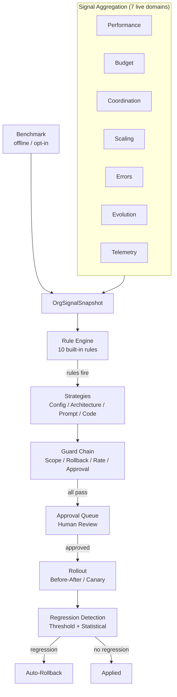

# Self-Improving Company

The self-improvement meta-loop observes company-wide signals from 7 existing subsystems plus the offline golden-company benchmark, and produces deployment and product-level improvement proposals through a rule-first hybrid pipeline with mandatory human approval.

Company autonomy ships at `supervised` so most state-mutating agent actions queue for approval before execution; raise to `semi` or `full` via `company.autonomy_level` (or `config.autonomy.level` in the company YAML) once operators trust the organisation. Rank order: `full` > `semi` > `supervised` > `locked`.

## Architecture Overview

The meta-loop operates at the **company altitude** (distinct from per-agent evolution in #243) and follows the pluggable protocol + strategy + factory + config discriminator pattern used throughout SynthOrg.



## Package Structure

```text
src/synthorg/meta/
  models.py            -- ImprovementProposal, RollbackPlan, CodeChange, etc.
  signal_models.py     -- OrgSignalSnapshot, signal domain summaries
  protocol.py          -- SignalAggregator, ImprovementStrategy, ProposalGuard, CIValidator
  config.py            -- SelfImprovementConfig (frozen, safe defaults)
  service.py           -- SelfImprovementService orchestrator
  factory.py           -- Component construction from config

  rules/               -- Signal pattern detection
    engine.py          -- RuleEngine (evaluates rules, sorts by severity)
    builtin.py         -- 9 built-in signal-detector rules with configurable thresholds
    benchmark_rule.py  -- BenchmarkRegressionRule (golden-benchmark regression, the 10th rule)
    custom.py          -- Declarative custom rules (CustomRuleDefinition, DeclarativeRule, METRIC_REGISTRY, Comparator)
    protocol.py        -- SignalRule protocol
    service.py         -- CustomRuleService (custom signal rule CRUD service layer)

  strategies/          -- Proposal generation
    config_tuning.py   -- Config field changes
    architecture.py    -- Structural changes (roles, workflows)
    prompt_tuning.py   -- Org-wide constitutional principles
    code_modification.py -- Framework code changes (LLM-generated)

  toolsmith/           -- Self-extending toolkit (TOOL_CREATION altitude)
    models.py          -- ToolBlueprint, ToolBlueprintState, CapabilityGap, ToolValidationResult
    config.py          -- ToolsmithConfig (enabled, gap thresholds, allowlists, sandbox, validation)
    protocol.py        -- CapabilityGapSink, CapabilityGapStore, ToolBlueprintGenerator, GoldenScorecardProvider, ToolValidationGate, overflow handler
    gap_store.py       -- RingBufferCapabilityGapStore (recurrence aggregation)
    cycle_scheduler.py -- ToolsmithCycleScheduler (periodic autonomous detection driver)
    strategy.py        -- LLMToolBlueprintGenerator (LLM authors a sandbox tool)
    dynamic_registry.py -- DynamicToolRegistry + LayeredToolRegistry/HandlerMap (runtime registration)
    script_handler.py  -- Per-tool closure handler (runs script_body in the sandbox)
    validation_gate.py -- BenchmarkToolValidationGate (per-tool brief + golden delta)
    golden_scorecard.py -- EvalGoldenScorecardProvider, GoldenScoreRunner (eval-spine adapter for the golden-delta gate)
    applier.py         -- ToolCreationApplier (validate, persist, register, retire)
    service.py         -- ToolsmithService (orchestration + gap sink seam)
    overflow.py        -- CodeModificationOverflowHandler (service-access gap routing)
    factory.py         -- build_toolsmith wiring

  signals/             -- Signal aggregation from existing subsystems
    performance.py     -- PerformanceTracker wrapper
    budget.py          -- Budget analytics wrapper
    coordination.py    -- Coordination metrics wrapper
    scaling.py         -- ScalingService wrapper
    errors.py          -- Classification pipeline wrapper
    evolution.py       -- EvolutionService wrapper
    telemetry.py       -- Telemetry pipeline wrapper
    benchmark.py       -- BenchmarkSignalAggregator (offline golden-benchmark curve)
    snapshot.py        -- Parallel snapshot builder

  guards/              -- Proposal validation chain
    scope_check.py     -- Altitude scope enforcement
    rollback_plan.py   -- Rollback plan validation
    rate_limit.py      -- Submission rate limiting
    approval_gate.py   -- Mandatory human approval routing

  rollout/             -- Staged deployment
    before_after.py    -- Whole-org with Clock-backed observation window
    canary.py          -- Canary subset with Clock-backed observation window
    ab_test.py         -- A/B test group assignment and observation loop
    ab_comparator.py   -- Control vs treatment comparison (Welch-backed)
    ab_models.py       -- GroupAssignment, ABTestVerdict, GroupMetrics (sample-backed)
    roster.py          -- OrgRoster protocol + CallableOrgRoster / NoOpOrgRoster
    group_aggregator.py -- GroupSignalAggregator protocol + TrackerGroupAggregator
    inverse_dispatch.py -- RollbackHandler protocol + 6 mutator protocols + default handlers
    rollback.py        -- RollbackExecutor (dispatches by operation_type)
    mutators/          -- Concrete mutators (config / prompt / architecture / code /
                          principle-removal / branch) + build_architecture_adapters
    regression/        -- Tiered detection
      threshold.py     -- Layer 1: instant circuit-breaker
      statistical.py   -- Layer 2: StatisticalDetector (Welch-backed)
      welch.py         -- Hand-rolled Welch's t-test (no numpy/scipy dep)
      composite.py     -- Combines both layers

  appliers/            -- Change execution
    config_applier.py  -- RootConfig reconstruction
    architecture_applier.py -- Role/workflow creation
    prompt_applier.py  -- Constitutional principle injection
    code_applier.py    -- Local CI + GitHub API push + draft PR
    github_client.py   -- GitHub REST API client (httpx, no git CLI)

  validation/          -- CI and scope validation for code modifications
    scope_validator.py -- Path allowlist/denylist enforcement
    ci_validator.py    -- Local ruff + mypy + pytest runner

  mcp/                 -- Unified MCP API server with capability-based scoping
    server.py          -- Server singleton lifecycle
    tools.py           -- Legacy 9 signal tool definitions
    registry.py        -- MCPToolDef model + DomainToolRegistry
    scoping.py         -- MCPToolScoper (wildcard capability matching)
    invoker.py         -- MCPToolInvoker (handler dispatch + error mapping)
    errors.py          -- ArgumentValidationError + GuardrailViolationError
    tool_builder.py    -- read_tool / write_tool / admin_tool builders
    domains/           -- 22 domain tool definition modules (245 tools)
    handlers/          -- domain handler modules + common envelope helpers
                         (ok / err / not_supported / require_admin_guardrails)

  chief_of_staff/      -- Interactive agent role + advanced capabilities
    role.py            -- CustomRole definition
    prompts.py         -- Analysis + explanation + clarify-propose prompt templates
    config.py          -- ChiefOfStaffConfig (learning, alerts, chat, propose, routing, group chat, invite, direct MCP, narrative)
    enums.py           -- Conversational-interface enums (routing / group-chat / invite)
    models.py          -- ProposalOutcome, OutcomeStats, OrgInflection, Alert,
                          ChatQuery/Response, Conversation, ConversationTurn,
                          ProposedWork, ProposeDecision, ConversationalProposal,
                          ProposeArgs, ProposedApprovalSummary, ProposeResult
    protocol.py        -- OutcomeStore, ConfidenceAdjuster, OrgInflectionSink, AlertSink
    outcome_store.py   -- MemoryBackendOutcomeStore (episodic memory persistence)
    learning.py        -- EMA + Bayesian confidence adjusters
    inflection.py      -- OrgInflectionDetector (snapshot comparison)
    monitor.py         -- OrgInflectionMonitor (async background loop)
    monitor_builder.py -- build_org_inflection_monitor (ghost-wiring entry for the monitor daemon)
    alerts.py          -- ProactiveAlertService + LoggingAlertSink + PersistentAlertSink
    _capability_gate.py -- resolve_cos_autonomous_cap (persona master + per-capability live gate)
    chat.py            -- ChiefOfStaffChat (LLM-powered explanations)
    propose.py         -- ChiefOfStaffProposer (clarify-and-propose v1)
    _intake_parking.py -- Conversational-intake parking + steering execution helpers
    _propose_parking.py -- Proposal parking + compensation mixin for the proposer
    refinement.py      -- ChiefOfStaffRefinementRouter (work-item refinement routing)
    resume_service.py  -- ConversationalResumeService (ungated repo facade for approval-resume + history reads)
    routing.py         -- RoleRouter (LLM / keyword concern routing to role agents)
    responder.py       -- Responder selection for the concern-routed clarify-propose loop
    transcript.py      -- Shared conversation-transcript rendering
    conversation_lock.py -- ConversationLockRegistry (per-conversation turn serialisation, self-evicting)
    group_chat.py      -- GroupChatService (round-robin multi-agent group chat)
    _group_budget.py   -- Per-round token budgeting for the multi-agent group chat
    group_models.py    -- Domain + boundary models for the multi-agent group chat
    group_prompt.py    -- Prompt + transcript rendering for the multi-agent group chat
    group_roster.py    -- Roster + transcript helpers for the multi-agent group chat
    group_invite.py    -- GroupInviteCoordinator (agent-initiated invite, human-consented)
    actor.py           -- ConversationalActor (direct MCP acting under trust)
    narrative/         -- Documentary mode (post-run run narrative)
      models.py        -- RunNarrativeInputs, ReducedRun, NarrativeProse, SourceRef
      constants.py     -- Scan / decision / agent / source bounds + section titles
      errors.py        -- NarrativeSourceUnavailableError, NarrativeGenerationError
      reader.py        -- NarrativeReader (flight-recorder + brain + task seams)
      reducer.py       -- reduce_run (deterministic fact rollup)
      assembler.py     -- assemble_blocks (typed DocBlock body, sourced)
      synthesiser.py   -- NarrativeSynthesiser (LLM connective prose only)
      service.py       -- ChiefOfStaffNarrator (orchestrate + persist)
      factory.py       -- build_chief_of_staff_narrator (ghost-wiring entry)

  telemetry/           -- Cross-deployment analytics (opt-in, anonymized)
    config.py          -- CrossDeploymentAnalyticsConfig (disabled by default)
    models.py          -- AnonymizedOutcomeEvent, EventBatch, AggregatedPattern, ThresholdRecommendation
    protocol.py        -- AnalyticsEmitter, AnalyticsCollector, RecommendationProvider
    anonymizer.py      -- Pure anonymization functions (strict allowlist)
    emitter.py         -- HttpAnalyticsEmitter (async httpx, batching, retry)
    collector.py       -- InMemoryAnalyticsCollector (event storage + pattern queries)
    aggregator.py      -- aggregate_patterns() (cross-deployment pattern identification)
    recommender.py     -- DefaultThresholdRecommender (pattern-to-threshold recommendations)
    factory.py         -- Component construction from config
```

## Design Decisions

| Decision | Choice | Rationale |
|----------|--------|-----------|
| Meta-analyst | Interactive Chief of Staff agent | Company metaphor, conversational UX, evolvable via #243 |
| Signal access | MCP tools | First slice of API-as-MCP; agents use native tool interface |
| Proposal generation | Rule-first hybrid | Rules detect (cheap, auditable); LLM synthesises (creative, scoped) |
| Altitudes | Config + Architecture + Prompt + Code + Tool Creation | All pluggable, config enabled by default, others opt-in |
| Scope | Deployment + product level | Code modification altitude for framework improvements |
| Rollout | Before/after default, canary + A/B test opt-in | Per-proposal choice; A/B uses group assignment + statistical comparison |
| Regression | Tiered: threshold + statistical | Layer 1 for catastrophic, Layer 2 for subtle degradation |
| Signals consumed | seven live signal domains + offline benchmark | Performance, budget, coordination, scaling, errors, evolution, telemetry, plus the opt-in golden-benchmark curve |
| Evolution boundary | Org-wide default; override + advisory alternatives | Clear separation from per-agent #243 |
| Safe defaults | Disabled, opt-in, mandatory approval | Never auto-applies without human review |
| Cross-deployment analytics | Dedicated protocol in `meta/telemetry/` | Domain events, not log records; follows meta/ pluggable pattern |
| Analytics anonymisation | Strict allowlist (enums + numerics only) | Maximum privacy; free text dropped, UUIDs hashed, timestamps coarsened |
| Analytics aggregation | In-process API endpoints | Zero extra infra; any deployment can be emitter and/or collector |

### Signals MCP args contract

The nine `synthorg_signals_*` tools follow the shared args conventions:

- Windowed reads (`get_org_snapshot` plus the six per-domain read tools)
  take a `since` / `until` ISO 8601 pair (timezone-aware; an inverted
  window is rejected at the args boundary), not a `window_days` count.
- `synthorg_signals_get_proposals` paginates and filters by an
  `ApprovalStatus` value (proposals live in the shared approval queue,
  so they carry `ApprovalStatus`, not a bespoke proposal status).
- `synthorg_signals_submit_proposal` is an `admin_tool`: it enforces the
  guardrail triple (`confirm` + `reason` + actor) and emits
  `MCP_ADMIN_OP_EXECUTED` once the proposal is accepted.

## Signal Domains

| Domain | Source | Key Metrics |
|--------|--------|-------------|
| Performance | `PerformanceTracker` | Quality, success rate, collaboration, trends (all windows) |
| Budget | Budget pure functions | Spend, category breakdown, orchestration ratio, forecast |
| Coordination | Coordination metrics | 9 composable metrics (Ec, O%, Ae, etc.) |
| Scaling | `ScalingService` | Decision outcomes, success rate, signal patterns |
| Errors | Classification pipeline | Category distribution, severity histogram, trends |
| Evolution | `EvolutionService` | Proposal outcomes, approval rate, axis distribution |
| Telemetry | Telemetry pipeline | Event counts, top event types, error events |
| Benchmark | `ScorecardHistory` (offline, opt-in) | Latest golden-benchmark total, run-over-run delta, regression flag |

## Built-in Rules

| Rule | Severity | Triggers When |
|------|----------|---------------|
| `quality_declining` | WARNING | Org quality below threshold |
| `success_rate_drop` | WARNING | Success rate below threshold |
| `budget_overrun` | CRITICAL | Budget exhaustion imminent |
| `coordination_cost_ratio` | WARNING | Coordination spend too high |
| `coordination_overhead` | WARNING | Coordination overhead % too high |
| `straggler_bottleneck` | INFO | Straggler gap ratio consistently high |
| `redundancy` | INFO | Work redundancy rate too high |
| `scaling_failure` | WARNING | Scaling decisions failing too often |
| `error_spike` | WARNING | Error findings exceed threshold |
| `benchmark_regression` | CRITICAL | Latest golden-benchmark run dropped below its predecessor |

All thresholds are configurable via constructor arguments. `benchmark_regression` is the strongest "something got worse" signal (the golden benchmark is the organisation's ground-truth quality measure), so it fires at CRITICAL and suggests the `PROMPT_TUNING` and `CODE_MODIFICATION` altitudes that can move a benchmark score back up.

## Benchmark-Driven Feedback (Learning Curve)

The golden-company benchmark is the organisation's ground-truth quality measure, and its score across runs is the **learning curve**. Each benchmark run records a per-run scorecard summary into `meta.scorecard_history_dir`; `read_learning_curve` (`synthorg.meta.learning_curve`) assembles the chronological `LearningCurve` with run-over-run deltas and per-run regression flags. `GET /learning/curve` serves it read-only for the dashboard chart; an unset directory yields an empty curve (a legitimate "no benchmark history yet" state, not a failure).

The curve is not just charted; the benchmark quality signal **drives** improvement through three feedback paths, each closing on a tested action rather than a write-only signal:

1. **Evolution**: `BenchmarkSignalAggregator` summarises the curve into `OrgSignalSnapshot.benchmark` (an optional, offline eighth aggregator on `SnapshotBuilder`). The `benchmark_regression` rule then fires CRITICAL on a regression and suggests the `PROMPT_TUNING` and `CODE_MODIFICATION` altitudes.
2. **Scaling / hiring**: `BenchmarkSignalSource` (`hr/scaling/signals/benchmark.py`) emits `benchmark_score_trend` and `benchmark_is_regression` into the `ScalingContext`; `PerformancePruningStrategy` defers pruning while a regression is in progress (`defer_during_benchmark_regression`, default `True`) so the org does not shed capacity while quality is dropping.
3. **Procedural memory and fine-tuning**: successful runs capture reusable lessons and failures capture corrected-failure lessons (see [Memory Learning](memory-learning.md)); the continual-improvement fine-tune harvests those plus accepted deliverables and curates them by the same benchmark score, promoting a new embedder only on a measured benchmark win.

Disabling a learning subsystem measurably flattens the curve; this is validated end to end under the simulation harness (a rising curve with learning enabled, a flat curve with it disabled), since a single release cannot demonstrate the effect on its own.

### Golden-delta gate for authored tools

`BenchmarkToolValidationGate` trusts an authored tool only when its per-tool acceptance brief passes AND the golden-company scorecard does not regress (`candidate_total >= baseline_total + min_score_margin`). The golden stage needs a `GoldenScorecardProvider`, selected by `toolsmith.validation.golden_scorecard_provider`:

- `none` (the default) wires no provider, so a `require_golden_delta` gate **fails closed**: once a candidate's per-tool brief passes and the golden stage is entered, a missing provider raises `ToolValidationConfigError` (rejecting the apply) rather than trusting a tool the gate could not validate. (A tool whose brief fails never reaches the golden stage.)
- `eval` wires `EvalGoldenScorecardProvider`, which adapts the golden-company eval spine into the gate's seam so the no-regression check runs end-to-end (an unknown value fails loudly at wiring; selecting `eval` without the in-repo eval harness on disk fails loudly too).

The provider depends only on an injected scorecard runner, so the framework's production code stays decoupled from the out-of-package eval harness. The default deterministic eval ignores authored tools, so the candidate arm equals the baseline: a no-regression **smoke check** that registers any tool whose presence does not break the golden run. A genuinely-measured delta (a candidate arm scored against a live provider, or a cassette recorded with the candidate tool active) is what makes a regressing tool score below baseline and be rejected.

### Autonomous capability-gap detection

The detection half runs without an operator trigger. Two seams wire at boot (in `api/lifecycle_helpers/toolsmith_wiring.py`, gated on `tool_creation_enabled` plus a provider and connected persistence):

- **Gap feed**: `install_capability_gap_sink(runtime.service)` registers the service as the MCP layer's capability-gap sink. Every `capability_gap` MCP envelope (an agent requesting an unfulfilled capability) then records a `CapabilityGap` into the `RingBufferCapabilityGapStore` for recurrence aggregation. The record is fire-and-forget (the handler does not block the agent's turn on a store write); a write failure is logged via `safe_error_description` without a traceback (SEC-1), never surfaced as an unhandled task-exception traceback.
- **Periodic cycle**: `ToolsmithCycleScheduler` drives `ToolsmithService.run_cycle()` on a fixed cadence (`toolsmith.cycle_interval_seconds`, default one hour, floored at 60s), so a recurring gap is detected and turned into a `TOOL_CREATION` proposal automatically. It extends the shared `AsyncCycleScheduler` base (`core/scheduler.py`), which owns the periodic-lifecycle machinery (deferred loop-bound primitives, lifecycle lock across start/stop, stop-drain hard-deadline marking the scheduler unrestartable). Each tick re-reads the `meta.toolsmith_cycle_paused` kill-switch (fail-safe to enabled) so an operator can halt self-extension at runtime without a restart.

The cycle only ever **proposes**: every authored-tool proposal still flows through the guard chain and human approval below, so autonomous detection never auto-applies a new tool.

## Proposal Lifecycle

1. **Signal collection**: `SnapshotBuilder` runs the 7 core aggregators (plus an opt-in benchmark aggregator) in parallel
2. **Rule evaluation**: `RuleEngine` checks all enabled rules against the snapshot
3. **Strategy dispatch**: Matching strategies generate proposals (rule-first hybrid)
4. **Guard chain**: Sequential evaluation (scope, rollback plan, rate limit, approval gate)
5. **Human approval**: Proposals queue in `ApprovalStore` for mandatory review
6. **Rollout**: Before/after comparison, canary subset, or A/B test (per proposal)
7. **Regression detection**: Tiered (threshold circuit-breaker + statistical significance)
8. **Auto-rollback**: On regression, `RollbackExecutor` dispatches the applier-materialised inverse operations (the concrete `previous_value` / created-id captures the appliers record at apply time, not the proposal's static plan)

## Configuration

### Runtime override setting (`meta.self_improvement`)

`SelfImprovementConfig` ships with safe defaults in code. Operators can override any subset at runtime via the `meta.self_improvement` JSON setting (namespace `META`, advanced level, default `"{}"`).  The loader `load_self_improvement_config(settings_service)`:

- reads the JSON blob,
- performs a shallow merge onto the defaults (unknown keys are dropped, malformed JSON falls back to pure defaults),
- logs `META_SELF_IMPROVEMENT_LOAD_FAILED` at WARNING on every fallback path so operators can audit silent defaults.

Example override (enable the master switch + tighten the cadence):

```json
{"enabled": true, "schedule": {"cycle_interval_hours": 72}}
```

Every meta-loop entry point (`GET /meta/config`, `GET /meta/rules`, `GET /meta/signals`) reads the config via `self_improvement_config_of(app_state)`, which caches the parsed `SelfImprovementConfig` on `MetaStateSlice` so the JSON is parsed once rather than per request. The `MetaSelfImprovementSettingsSubscriber` invalidates that cache (wires the field back to `None`) on an operator edit, so setting changes are still picked up without a server restart.

### Interactive endpoints

- **`POST /meta/chat`** (Chief of Staff explain-only entry point): rate-limited via `per_op_rate_limit_from_policy("meta.chat", key="user")` at **5 requests per 60 seconds per authenticated user**.  The policy is defined in `api/rate_limits/policies.py` under the `meta.chat` key. Clients exceeding the limit receive HTTP 429 with `Retry-After`. An `alert_id` or `proposal_id` on the request scopes the answer: `alert_id` resolves through the durable alert repository and routes to `explain_alert`; `proposal_id` resolves the parked `ApprovalItem` and folds its title/description/metadata into the free-form answer (not `explain_proposal`, which needs a full `ImprovementProposal` that doesn't survive into the approval queue). Alert takes priority when both are set; a stale/unresolvable id or an unwired dependency falls back to the plain free-form path.

- **Server-side idempotency (all four mutating chat endpoints):** `/meta/chat`, `/meta/chat/propose`, `/meta/chat/group`, and `/meta/chat/act` each accept an optional `Idempotency-Key` header. When present, the endpoint runs under `IdempotencyService.run_idempotent` (scopes `meta.chat` / `.propose` / `.group` / `.act`): a replay with the same key and an identical request body returns the cached response instead of re-executing, so a client retry (including the axios 429/`Retry-After` retry) never double-parks a proposal, double-acts, or duplicates a turn; the same key with a different body is a `409`. Absent the header the endpoint runs normally (no idempotency).

- **`GET /meta/alerts`** (durable org-alert log): cursor-paginated, newest-first, with optional `severity`/`alert_type` filters. Backs the dashboard's alert list and the `alert_id` chat-scoping lookup above. Degrades to an empty page (not a 503) when the alert repository is unwired.

- **`POST /meta/chat/propose`** (Chief of Staff clarify-and-propose entry point): the same human conversation, but the model either asks ONE clarifying question or emits one or more concrete `WorkItem`s parked behind the human approval queue (source `CONVERSATIONAL_INTAKE`). Nothing executes until the human approves; on approval the parked `WorkItem` runs through the work pipeline via the approval-decision seam (still no autonomous acting). Same rate-limit policy shape as `/meta/chat` (`meta.chat.propose`, 5/60s/user) and the same `Idempotency-Key` discipline. Opt-in via `meta.chief_of_staff.propose_enabled`; the builder requires a registered LLM provider and a connected persistence backend (503 otherwise). The work pipeline is consulted only at approval-decision time, so its absence surfaces as a 503 from Flow 0 when an approved item is executed, not at endpoint build. When `routing_enabled` is on, a concern router (`routing.py`) classifies each turn to the best-fit role agent (CFO for budget, CEO for strategy, and so on, most senior holder of a tied role) so the turn answers in that agent's persona; an uncertain classification falls back to the generic Chief of Staff. A `routing_strategy` of `keyword` uses a static keyword map (operator-overridable via `routing_keyword_rules`) with no extra LLM call. The result carries a structured `routing_reason` (`routed`, `routing_disabled`, `no_role_router`, `no_active_agents`, `below_confidence_floor`, `role_unresolved`, `classify_call_failed`, `response_invalid`, `no_keyword_match`) so a human can see why the generic Chief of Staff answered rather than that outcome being indistinguishable from a routed one. The injected conversation history is windowed to `propose_history_token_budget` tokens (oldest turns dropped first) so a long thread cannot grow the prompt without bound.

- **`POST /meta/chat/group`** (multi-agent group chat): one human, several agents, in a single conversation. Each round drives the active roster once in a stable round-robin, sharing the transcript, with per-round token budgeting and a participant cap; a single agent's dispatch failure skips that agent (surfaced in `participants_skipped`) rather than aborting the round, and each agent call is bounded by `agent_call_timeout_seconds`. The round windows the shared history to `propose_history_token_budget` tokens and reserves room for each turn's estimated INPUT prompt before dispatch, so a large history cannot consume the whole round budget on one call: when the input alone would leave no room for the output reserve the round stops with `truncated_reason = input_budget_exhausted` (alongside the existing `token_budget_exhausted` / `max_total_turns_reached`). When `invite_enabled` is on, an agent may request to bring another agent in: the request parks a `CONVERSATIONAL_INVITE` approval and the invited agent joins only after a human approves, receiving a fenced inviter+reason handover on its first turn. A partial-unique index plus an accept-time roster re-check keep the participant cap honest against concurrent invites. Because a round feeds each earlier peer's contribution to later participants, an authority-deference vector exists; the peer-contribution block is scanned for authority cues (reusing `AuthorityDeferenceGuard`) as **detect-and-log only**. This is terminal by design, not a stopgap: the `<peer-contribution>` untrusted-content fence is the actual injection defence (the model treats fenced text as inert data), and redaction is deliberately out of scope because an authority phrase is often legitimate business content. Rate-limited (`meta.chat.group`, 5/60s/user) and idempotent under an `Idempotency-Key` (scope `meta.chat.group`). Opt-in via `meta.chief_of_staff.group_chat_enabled`; requires a provider, agent registry, and connected persistence (503 otherwise); invites additionally require a wired approval store.

- **`POST /meta/chat/act`** (direct MCP acting under trust): the chat agent acts directly through SynthOrg's own MCP under its configured trust level rather than only proposing. The action runs through the engine's governed tool invoker and shared `ApprovalGate`, so a sensitive action escalates and parks exactly as a task action does (`source = PARKED_CONTEXT`) and resumes via the worker's taskless branch. Rate-limited (`meta.chat.act`, 5/60s/user) and idempotent under an `Idempotency-Key` (scope `meta.chat.act`). The live `direct_mcp_enabled` gate is re-checked per request (`ensure_feature_enabled`), so toggling it off kills further acting on the next request without a restart. The optional `conversation_id` on the request is **opaque correlation metadata only**: no conversation row is created or validated for `/act`, so it is never persisted or checked; real conversation-timeline integration for direct acting is a follow-up. Opt-in via `meta.chief_of_staff.direct_mcp_enabled`; requires a boot `AgentEngine` with an MCP self-consumer AND an enabled `SecurityConfig`. The builder is **fail-closed**: with `direct_mcp_enabled` on but security governance inactive it refuses to build the actor (the endpoint 503s) rather than exposing ungated write/admin acting.

- **Streaming (`POST /meta/chat/stream`, `POST /meta/chat/act/stream`):** SSE variants alongside the buffered endpoints, emitting `progress` / `complete` / `error` frames (the same convention as the model-pull stream). `/meta/chat/stream` streams a free-form Chief-of-Staff answer token-by-token (`progress` = one text delta, `complete` = the assembled answer plus sources and confidence); the scoped alert/proposal deep-explain paths stay on the buffered `/meta/chat`, which produces a short structured answer where streaming buys nothing. `/meta/chat/act/stream` emits one `progress` per continuing action turn (a turn that requested tools and looped again, carrying those tools) then a terminal `complete` with the full result of the turn that ended the loop, driven by an optional `turn_observer` hook the engine's ReAct loop calls after each continuing turn (never the terminal turn, which returns before the hook). Streaming and idempotency are mutually exclusive per request: a token stream cannot be replayed from cache, so the streaming endpoints take no `Idempotency-Key`. Both wrap `revalidated_sse_stream`, so a mid-flight auth revocation or client disconnect tears the stream down (a disconnect also cancels the running action). The dashboard streams the read-only explain chat (with a Stop control backed by a per-turn `AbortController`) but deliberately keeps **direct acting on the buffered idempotent `/meta/chat/act`**: acting mutates, so a streamed action that failed mid-run would re-execute its already-run tools on retry, whereas the buffered path replays the cached result. `/meta/chat/act/stream` therefore stays available for API consumers that accept the no-dedupe trade-off.

- **`GET /meta/chat/conversations`** (owner-scoped conversation list) and **`GET /meta/chat/conversations/{id}`** (one conversation's turns): cursor-paginated, newest-first, scoped to the caller (`created_by`) so a conversation is never cross-tenant visible; a foreign or unknown id returns `404` (`ConversationNotFoundError`), never `403`. These back resuming a prior chat/propose/group conversation after a reload: the dashboard fetches the list and, on selection, hydrates the transcript from the turns, staying a pure API consumer (nothing is persisted client-side).

- **`GET /agents/active`** (active-agent roster): the stable runtime UUIDs, names, and roles of the currently active agents. Backs the participant picker for group chat and the acting-agent picker for direct acting.

**Dashboard inline surfacing.** The Chat page reads `GET /meta/config` and surfaces each mode's gating state inline before a request rather than only reacting to a 503: an enabled mode whose per-capability model is blank shows a "no model configured" notice naming the setting (`chief_of_staff.chat_model` / `propose_model`), and direct action shows an "enabled but not yet live" notice while its effective `direct_mcp_ready` is false (the fail-closed governance gate above). The config exposes `direct_mcp_ready` as the effective actor-wired state so the cross-warning needs no restart to clear. The charter interview keeps the always-available / 503-on-demand contract but now persists its last turn failure inline so a blank `charter.interview_model` stays visible after the toast fades.

### YAML defaults

```yaml
self_improvement:
  enabled: false                    # Master switch (opt-in)
  chief_of_staff_enabled: false     # Agent persona (opt-in)
  config_tuning_enabled: true       # Config changes (on when enabled)
  architecture_proposals_enabled: false  # Structural changes (opt-in)
  prompt_tuning_enabled: false      # Prompt policies (opt-in)
  code_modification_enabled: false  # Framework code changes (opt-in)
  tool_creation_enabled: false      # Self-extending toolkit (opt-in)
  chief_of_staff:
    # Explain-only chat (POST /meta/chat).
    chat_snapshot_window_days: 7              # Trailing signal window, live-resolved per request
    # Clarify-and-propose (POST /meta/chat/propose). All opt-in.
    propose_enabled: false                   # Master switch
    propose_model: example-small-001         # LLM model id
    propose_temperature: 0.3                 # Lower than chat: structured output
    propose_max_tokens: 2000                 # Per-turn token budget
    propose_history_token_budget: 4000       # Windowed transcript budget (oldest turns dropped first); also bounds group-chat input
    propose_max_proposals_per_turn: 5        # Approval-queue fan-out bound
    propose_max_clarification_turns: 5       # Cap before force-closing the conversation
    propose_default_risk_level: medium       # Risk stamp on each parked ApprovalItem
    # Concern routing in front of clarify-and-propose. All opt-in.
    routing_enabled: false                   # Master switch
    routing_strategy: llm                    # "llm" (classifier) or "keyword" (static map)
    routing_model: example-small-001         # Classifier model id (llm strategy)
    routing_temperature: 0.0                 # Deterministic classification
    routing_max_tokens: 200                  # Per-classification token budget
    routing_confidence_floor: 0.6            # Below this, fall back to the generic persona
    routing_default_role: CEO                # Role to try when the named role has no active agent
    routing_keyword_rules: []                # Operator override for the keyword map (bespoke roles)
    # Multi-agent group chat (POST /meta/chat/group). All opt-in.
    group_chat_enabled: false                # Master switch
    group_chat_max_participants: 5           # Per-conversation participant cap
    group_chat_round_token_budget: 12000     # Total token budget for one round
    group_chat_token_reserve_ratio: 0.2      # Reserve held back so the budget trips early
    group_chat_per_agent_max_tokens: 1500    # Output cap for a single contribution
    group_chat_max_total_turns: 60           # Lifetime turn cap for one conversation
    agent_call_timeout_seconds: 120.0        # Wall-clock cap for one conversational agent call
    # Agent-initiated invite (group chat, gated by human consent). All opt-in.
    invite_enabled: false                    # Master switch (also requires a wired approval store)
    invite_max_per_round: 2                  # Consent-queue storm bound per round
    invite_default_risk_level: medium        # Risk stamp on the consent ApprovalItem
    # Direct MCP acting under trust (POST /meta/chat/act). All opt-in.
    direct_mcp_enabled: false                # Master switch (fail-closed without SecurityConfig)
    direct_mcp_max_turns: 6                  # Hard turn cap for one chat-driven action loop
    # Documentary mode: post-run run narrative. All opt-in.
    narrative_enabled: false                 # Master switch
    narrative_model: example-small-001       # LLM model id (connective prose only)
    narrative_temperature: 0.4               # Slightly above propose: readable prose
    narrative_max_tokens: 2000               # Per-call token budget
  schedule:
    cycle_interval_hours: 168       # Weekly
    inflection_trigger_enabled: true
  rollout:
    default_strategy: before_after
    observation_window_hours: 48
    regression_check_interval_hours: 4
    ab_test:
      control_fraction: 0.5
      min_agents_per_group: 5
      min_observations_per_group: 10
      improvement_threshold: 0.15
  regression:
    quality_drop_threshold: 0.10
    cost_increase_threshold: 0.20
    error_rate_increase_threshold: 0.15
    success_rate_drop_threshold: 0.10
    statistical_significance_level: 0.05
    min_data_points: 10
  guards:
    proposal_rate_limit: 10
    rate_limit_window_hours: 24
  # Cross-deployment analytics (#1341) -- opt-in, disabled by default.
  cross_deployment_analytics:
    enabled: false                       # Master switch
    collector_url: null                  # HTTPS endpoint for event POST (required when enabled)
    deployment_id_salt: null             # Secret salt for SHA-256 deployment hash (required when enabled)
    collector_enabled: false             # Also act as a collector receiving events
    industry_tag: null                   # Optional industry category (max 100 chars)
    batch_size: 50                       # Max events buffered before flush
    flush_interval_seconds: 30.0         # Periodic flush interval
    http_timeout_seconds: 10.0           # HTTP POST timeout
    min_deployments_for_pattern: 3       # Min unique deployments for pattern reporting
    recommendation_min_observations: 10  # Min events for threshold recommendations
```

## Approval Decision Routing (Flows)

`signal_resume_intent` dispatches every decided approval through a deterministic flow chain keyed off the persisted `ApprovalItem.source` discriminator. The discriminator is fixed at creation so a decided approval routes correctly even if the relevant subsystem is briefly unavailable.

1. **Flow 0** (Conversational intake; `source = CONVERSATIONAL_INTAKE`, `try_conversational_intake_resume`): the dispatcher looks up the gating `ConversationalProposal`, rebuilds the parked `WorkItem` from `work_item_json`, and on approve drives it through `app_state.work_pipeline.run`. On reject the proposal moves to `REJECTED` and the pipeline is never touched. Hard misconfiguration (no work pipeline) raises 503 rather than silently stranding the work.
2. **Flow 0.5** (Agent invite; `source = CONVERSATIONAL_INVITE`, `try_conversational_invite_resume`): the dispatcher seats the invited agent into the group conversation on approve (re-checking the participant cap against the live roster) or moves the invite to `DECLINED` on reject. Owned here; every other source falls through.
3. **Flow 1** (Mid-execution parking; `source = PARKED_CONTEXT`, `try_mid_execution_resume`): the agent that called `request_human_approval` is parked; the decision resumes the parked context. Direct MCP chat actions (`/meta/chat/act`) park here.
4. **Flow 2** (Review gate; `source = REVIEW_GATE`, default): autonomy / hiring / promotion / pruning / scaling / training / signals approvals; the decision drives the task's IN_REVIEW transition.

Each branch returns `True` once it owns the decision, suppressing fall-through. Source is the routing primary; the legacy parked-context probe is the fallback only when the just-decided approval cannot be re-read.

## Safety Mechanisms

- **Mandatory human approval**: Every proposal goes through `ApprovalStore`. No auto-apply.
- **Guard chain**: 4 sequential guards must all pass before approval routing.
- **Rollback plans**: Every proposal must carry a concrete, validated rollback plan.
- **Tiered regression detection**: Instant circuit-breaker + delayed statistical test.
- **Auto-rollback**: On regression, the executor dispatches the applier-materialised inverse operations automatically (the proposal's static rollback plan remains human-readable intent; the dispatched operations carry the apply-time-captured prior state).
- **Rate limiting**: Configurable proposal submission limits prevent flood.
- **Scope enforcement**: Proposals outside enabled altitudes are rejected.
- **Disabled by default**: The entire system is opt-in.

## MCP Service Facades and Signal Stores

Following META-MCP-2 (#1524), the signal aggregation surface is backed
by three pluggable in-memory stores (each follows the protocol + strategy +
factory pattern; durable backends ship behind the same protocol later):

| Store | Module | Role |
|---|---|---|
| `ErrorTaxonomyStore` | `synthorg.engine.classification.taxonomy_store` | Ring-buffered classification results feeding `ErrorSignalAggregator`; subscribes to the `ClassificationSink` protocol. |
| `EvolutionOutcomeStore` | `synthorg.meta.evolution.outcome_store` | Ring-buffered applied/rolled-back proposal outcomes feeding `EvolutionSignalAggregator`. |
| `TelemetryEventCounter` | `synthorg.telemetry.event_counter` | Rolling event counts by type feeding `TelemetrySignalAggregator`; registered as a `TelemetryCollector.subscribe(...)` consumer. |

The facade layer composes the seven aggregators, `SnapshotBuilder`, and
the proposal approval store into a single `SignalsService` that shims
the `synthorg_signals_*` tools. `AnalyticsService` and `ReportsService`
layer on top: analytics is a stateless view over `SignalsService`
snapshots (single source of truth, no independent cache), and
reports owns async job lifecycle + artifact storage.

The MCP handler surface for the self-improvement loop is described in
[MCP Handler Contract](../reference/mcp-handler-contract.md); coverage across
the CRUD, observability, memory, and coordination domains follows the same
`ToolHandler` + `args_model` pattern as the rest of the MCP tool surface.
