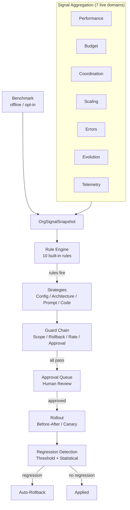

# Self-Improving Company

The self-improvement meta-loop observes company-wide signals from 7 existing subsystems plus the offline golden-company benchmark, and produces deployment and product-level improvement proposals through a rule-first hybrid pipeline with mandatory human approval.

Company autonomy ships at `supervised` so most state-mutating agent actions queue for approval before execution; raise to `semi` or `full` via `company.autonomy_level` (or `config.autonomy.level` in the company YAML) once operators trust the organisation. Rank order: `full` > `semi` > `supervised` > `locked`.

## Architecture Overview

The meta-loop operates at the **company altitude** (distinct from per-agent evolution in #243) and follows the pluggable protocol + strategy + factory + config discriminator pattern used throughout SynthOrg.



## Package Structure

```text
src/synthorg/meta/
  models.py            -- ImprovementProposal, RollbackPlan, CodeChange, etc.
  signal_models.py     -- OrgSignalSnapshot, signal domain summaries
  protocol.py          -- SignalAggregator, ImprovementStrategy, ProposalGuard, CIValidator
  config.py            -- SelfImprovementConfig (frozen, safe defaults)
  service.py           -- SelfImprovementService orchestrator
  factory.py           -- Component construction from config

  rules/               -- Signal pattern detection
    engine.py          -- RuleEngine (evaluates rules, sorts by severity)
    builtin.py         -- 9 built-in signal-detector rules with configurable thresholds
    benchmark_rule.py  -- BenchmarkRegressionRule (golden-benchmark regression, the 10th rule)
    custom.py          -- Declarative custom rules (CustomRuleDefinition, DeclarativeRule, METRIC_REGISTRY, Comparator)
    protocol.py        -- SignalRule protocol
    service.py         -- CustomRuleService (custom signal rule CRUD service layer)

  strategies/          -- Proposal generation
    config_tuning.py   -- Config field changes
    architecture.py    -- Structural changes (roles, workflows)
    prompt_tuning.py   -- Org-wide constitutional principles
    code_modification.py -- Framework code changes (LLM-generated)

  toolsmith/           -- Self-extending toolkit (TOOL_CREATION altitude)
    models.py          -- ToolBlueprint, ToolBlueprintState, CapabilityGap, ToolValidationResult
    config.py          -- ToolsmithConfig (enabled, gap thresholds, allowlists, sandbox, validation)
    protocol.py        -- CapabilityGapSink, CapabilityGapStore, ToolBlueprintGenerator, GoldenScorecardProvider, ToolValidationGate, overflow handler
    gap_store.py       -- RingBufferCapabilityGapStore (recurrence aggregation)
    cycle_scheduler.py -- ToolsmithCycleScheduler (periodic autonomous detection driver)
    strategy.py        -- LLMToolBlueprintGenerator (LLM authors a sandbox tool)
    dynamic_registry.py -- DynamicToolRegistry + LayeredToolRegistry/HandlerMap (runtime registration)
    script_handler.py  -- Per-tool closure handler (runs script_body in the sandbox)
    validation_gate.py -- BenchmarkToolValidationGate (per-tool brief + golden delta)
    golden_scorecard.py -- EvalGoldenScorecardProvider, GoldenScoreRunner (eval-spine adapter for the golden-delta gate)
    applier.py         -- ToolCreationApplier (validate, persist, register, retire)
    service.py         -- ToolsmithService (orchestration + gap sink seam)
    overflow.py        -- CodeModificationOverflowHandler (service-access gap routing)
    factory.py         -- build_toolsmith wiring

  signals/             -- Signal aggregation from existing subsystems
    performance.py     -- PerformanceTracker wrapper
    budget.py          -- Budget analytics wrapper
    coordination.py    -- Coordination metrics wrapper
    scaling.py         -- ScalingService wrapper
    errors.py          -- Classification pipeline wrapper
    evolution.py       -- EvolutionService wrapper
    telemetry.py       -- Telemetry pipeline wrapper
    benchmark.py       -- BenchmarkSignalAggregator (offline golden-benchmark curve)
    snapshot.py        -- Parallel snapshot builder

  guards/              -- Proposal validation chain
    scope_check.py     -- Altitude scope enforcement
    rollback_plan.py   -- Rollback plan validation
    rate_limit.py      -- Submission rate limiting
    approval_gate.py   -- Mandatory human approval routing

  rollout/             -- Staged deployment
    before_after.py    -- Whole-org with Clock-backed observation window
    canary.py          -- Canary subset with Clock-backed observation window
    ab_test.py         -- A/B test group assignment and observation loop
    ab_comparator.py   -- Control vs treatment comparison (Welch-backed)
    ab_models.py       -- GroupAssignment, ABTestVerdict, GroupMetrics (sample-backed)
    roster.py          -- OrgRoster protocol + CallableOrgRoster / NoOpOrgRoster
    group_aggregator.py -- GroupSignalAggregator protocol + TrackerGroupAggregator
    inverse_dispatch.py -- RollbackHandler protocol + 6 mutator protocols + default handlers
    rollback.py        -- RollbackExecutor (dispatches by operation_type)
    mutators/          -- Concrete mutators (config / prompt / architecture / code /
                          principle-removal / branch) + build_architecture_adapters
    regression/        -- Tiered detection
      threshold.py     -- Layer 1: instant circuit-breaker
      statistical.py   -- Layer 2: StatisticalDetector (Welch-backed)
      welch.py         -- Hand-rolled Welch's t-test (no numpy/scipy dep)
      composite.py     -- Combines both layers

  appliers/            -- Change execution
    config_applier.py  -- RootConfig reconstruction
    architecture_applier.py -- Role/workflow creation
    prompt_applier.py  -- Constitutional principle injection
    code_applier.py    -- Local CI + GitHub API push + draft PR
    github_client.py   -- GitHub REST API client (httpx, no git CLI)

  validation/          -- CI and scope validation for code modifications
    scope_validator.py -- Path allowlist/denylist enforcement
    ci_validator.py    -- Local ruff + mypy + pytest runner

  mcp/                 -- Unified MCP API server with capability-based scoping
    server.py          -- Server singleton lifecycle
    tools.py           -- Legacy 9 signal tool definitions
    registry.py        -- MCPToolDef model + DomainToolRegistry
    scoping.py         -- MCPToolScoper (wildcard capability matching)
    invoker.py         -- MCPToolInvoker (handler dispatch + error mapping)
    errors.py          -- ArgumentValidationError + GuardrailViolationError
    tool_builder.py    -- read_tool / write_tool / admin_tool builders
    domains/           -- 22 domain tool definition modules (247 tools)
    handlers/          -- domain handler modules + common envelope helpers
                         (ok / err / not_supported / require_admin_guardrails)

  chief_of_staff/      -- Interactive agent role + advanced capabilities
    role.py            -- CustomRole definition
    prompts.py         -- Analysis + explanation + clarify-propose prompt templates
    config.py          -- ChiefOfStaffConfig (learning, alerts, chat, propose, routing, group chat, invite, direct MCP, narrative)
    enums.py           -- Conversational-interface enums (routing / group-chat / invite)
    models.py          -- ProposalOutcome, OutcomeStats, OrgInflection, Alert,
                          ChatQuery/Response, Conversation, ConversationTurn,
                          ProposedWork, ProposeDecision, PlanDraftSummary,
                          ProposeArgs, ProposeResult
    protocol.py        -- OutcomeStore, ConfidenceAdjuster, OrgInflectionSink, AlertSink
    outcome_store.py   -- MemoryBackendOutcomeStore (episodic memory persistence)
    learning.py        -- EMA + Bayesian confidence adjusters
    inflection.py      -- OrgInflectionDetector (snapshot comparison)
    monitor.py         -- OrgInflectionMonitor (async background loop)
    monitor_builder.py -- build_org_inflection_monitor (ghost-wiring entry for the monitor daemon)
    alerts.py          -- ProactiveAlertService + LoggingAlertSink + PersistentAlertSink
    _capability_gate.py -- resolve_cos_autonomous_cap (persona master + per-capability live gate)
    chat.py            -- ChiefOfStaffChat (LLM-powered explanations)
    org_state.py       -- OrgStateReader + OrgStateSnapshot (real in-flight task / project / approval read model, cited_records)
    _chat_format.py    -- Pure prompt-context formatters (snapshot / org-state / scoped-proposal), extracted from chat.py
    propose.py         -- ChiefOfStaffProposer (clarify, then draft one plan for review)
    _intake_parking.py -- Conversational-intake parking + steering execution helpers
    _propose_act.py    -- ProposeActMixin: park steering (compensatable), then draft the plan
    plan_intake.py     -- ConversationalPlanDispatcher (provision project -> WorkItem(plan_required) -> intake -> background decompose+park)
    refinement.py      -- ChiefOfStaffRefinementRouter (work-item refinement routing)
    resume_service.py  -- ConversationalResumeService (ungated repo facade for approval-resume + history reads)
    routing.py         -- RoleRouter (LLM / keyword concern routing to role agents)
    responder.py       -- Responder selection for the concern-routed clarify-propose loop
    transcript.py      -- Shared conversation-transcript rendering
    conversation_lock.py -- ConversationLockRegistry (per-conversation turn serialisation, self-evicting)
    group_chat.py      -- GroupChatService (round-robin multi-agent group chat)
    _group_budget.py   -- Per-round token budgeting for the multi-agent group chat
    group_models.py    -- Domain + boundary models for the multi-agent group chat
    group_prompt.py    -- Prompt + transcript rendering for the multi-agent group chat
    group_roster.py    -- Roster + transcript helpers for the multi-agent group chat
    group_invite.py    -- GroupInviteCoordinator (agent-initiated invite, human-consented)
    actor.py           -- ConversationalActor (direct MCP acting under trust)
    intent_router.py   -- IntentClassifier + TurnIntent (per-turn capability classification, live confidence floors)
    operator_console.py -- OperatorConsoleService (CONFIGURE turns: configure the control plane as the system console identity)
    console_identity.py -- build_console_identity (shared ELEVATED system console AgentIdentity, fail-closed on unbound model)
    _multi_voice.py    -- Multi-voice chime-in (secondary role agents adding to a routed answer)
    _role_resolution.py -- Shared role -> agent resolution for routing / group chat
    _turn_redaction.py -- Redact-before-persist credential backstop for conversation-turn content
    narrative/         -- Documentary mode (post-run run narrative)
      models.py        -- RunNarrativeInputs, ReducedRun, NarrativeProse, SourceRef
      constants.py     -- Scan / decision / agent / source bounds + section titles
      errors.py        -- NarrativeSourceUnavailableError, NarrativeGenerationError
      reader.py        -- NarrativeReader (flight-recorder + brain + task seams)
      reducer.py       -- reduce_run (deterministic fact rollup)
      assembler.py     -- assemble_blocks (typed DocBlock body, sourced)
      synthesiser.py   -- NarrativeSynthesiser (LLM connective prose only)
      service.py       -- ChiefOfStaffNarrator (orchestrate + persist)
      factory.py       -- build_chief_of_staff_narrator (ghost-wiring entry)

  telemetry/           -- Cross-deployment analytics (opt-in, anonymized)
    config.py          -- CrossDeploymentAnalyticsConfig (disabled by default)
    models.py          -- AnonymizedOutcomeEvent, EventBatch, AggregatedPattern, ThresholdRecommendation
    protocol.py        -- AnalyticsEmitter, AnalyticsCollector, RecommendationProvider
    anonymizer.py      -- Pure anonymization functions (strict allowlist)
    emitter.py         -- HttpAnalyticsEmitter (async httpx, batching, retry)
    collector.py       -- InMemoryAnalyticsCollector (event storage + pattern queries)
    aggregator.py      -- aggregate_patterns() (cross-deployment pattern identification)
    recommender.py     -- DefaultThresholdRecommender (pattern-to-threshold recommendations)
    factory.py         -- Component construction from config
```

## Design Decisions

| Decision | Choice | Rationale |
|----------|--------|-----------|
| Meta-analyst | Interactive Chief of Staff agent | Company metaphor, conversational UX, evolvable via #243 |
| Signal access | MCP tools | First slice of API-as-MCP; agents use native tool interface |
| Proposal generation | Rule-first hybrid | Rules detect (cheap, auditable); LLM synthesises (creative, scoped) |
| Altitudes | Config + Architecture + Prompt + Code + Tool Creation | All pluggable, config enabled by default, others opt-in |
| Scope | Deployment + product level | Code modification altitude for framework improvements |
| Rollout | Before/after default, canary + A/B test opt-in | Per-proposal choice; A/B uses group assignment + statistical comparison |
| Regression | Tiered: threshold + statistical | Layer 1 for catastrophic, Layer 2 for subtle degradation |
| Signals consumed | seven live signal domains + offline benchmark | Performance, budget, coordination, scaling, errors, evolution, telemetry, plus the opt-in golden-benchmark curve |
| Evolution boundary | Org-wide default; override + advisory alternatives | Clear separation from per-agent #243 |
| Safe defaults | Disabled, opt-in, mandatory approval | Never auto-applies without human review |
| Cross-deployment analytics | Dedicated protocol in `meta/telemetry/` | Domain events, not log records; follows meta/ pluggable pattern |
| Analytics anonymisation | Strict allowlist (enums + numerics only) | Maximum privacy; free text dropped, UUIDs hashed, timestamps coarsened |
| Analytics aggregation | In-process API endpoints | Zero extra infra; any deployment can be emitter and/or collector |

### Signals MCP args contract

The nine `synthorg_signals_*` tools follow the shared args conventions:

- Windowed reads (`get_org_snapshot` plus the six per-domain read tools)
  take a `since` / `until` ISO 8601 pair (timezone-aware; an inverted
  window is rejected at the args boundary), not a `window_days` count.
- `synthorg_signals_get_proposals` paginates and filters by an
  `ApprovalStatus` value (proposals live in the shared approval queue,
  so they carry `ApprovalStatus`, not a bespoke proposal status).
- `synthorg_signals_submit_proposal` is an `admin_tool`: it enforces the
  guardrail triple (`confirm` + `reason` + actor) and emits
  `MCP_ADMIN_OP_EXECUTED` once the proposal is accepted.

## Signal Domains

| Domain | Source | Key Metrics |
|--------|--------|-------------|
| Performance | `PerformanceTracker` | Quality, success rate, collaboration, trends (all windows) |
| Budget | Budget pure functions | Spend, category breakdown, orchestration ratio, forecast |
| Coordination | Coordination metrics | 9 composable metrics (Ec, O%, Ae, etc.) |
| Scaling | `ScalingService` | Decision outcomes, success rate, signal patterns |
| Errors | Classification pipeline | Category distribution, severity histogram, trends |
| Evolution | `EvolutionService` | Proposal outcomes, approval rate, axis distribution |
| Telemetry | Telemetry pipeline | Event counts, top event types, error events |
| Benchmark | `ScorecardHistory` (offline, opt-in) | Newest golden-benchmark total, run-over-run delta, regression flag |

## Built-in Rules

| Rule | Severity | Triggers When |
|------|----------|---------------|
| `quality_declining` | WARNING | Org quality below threshold |
| `success_rate_drop` | WARNING | Success rate below threshold |
| `budget_overrun` | CRITICAL | Budget exhaustion imminent |
| `coordination_cost_ratio` | WARNING | Coordination spend too high |
| `coordination_overhead` | WARNING | Coordination overhead % too high |
| `straggler_bottleneck` | INFO | Straggler gap ratio consistently high |
| `redundancy` | INFO | Work redundancy rate too high |
| `scaling_failure` | WARNING | Scaling decisions failing too often |
| `error_spike` | WARNING | Error findings exceed threshold |
| `benchmark_regression` | CRITICAL | Newest golden-benchmark run dropped below its predecessor |

All thresholds are configurable via constructor arguments. `benchmark_regression` is the strongest "something got worse" signal (the golden benchmark is the organisation's ground-truth quality measure), so it fires at CRITICAL and suggests the `PROMPT_TUNING` and `CODE_MODIFICATION` altitudes that can move a benchmark score back up.

## Benchmark-Driven Feedback (Learning Curve)

The golden-company benchmark is the organisation's ground-truth quality measure, and its score across runs is the **learning curve**. Each benchmark run records a per-run scorecard summary into `meta.scorecard_history_dir`; `read_learning_curve` (`synthorg.meta.learning_curve`) assembles the chronological `LearningCurve` with run-over-run deltas and per-run regression flags. `GET /learning/curve` serves it read-only for the dashboard chart; an unset directory yields an empty curve (a legitimate "no benchmark history yet" state, not a failure).

The curve is not just charted; the benchmark quality signal **drives** improvement through three feedback paths, each closing on a tested action rather than a write-only signal:

1. **Evolution**: `BenchmarkSignalAggregator` summarises the curve into `OrgSignalSnapshot.benchmark` (an optional, offline eighth aggregator on `SnapshotBuilder`). The `benchmark_regression` rule then fires CRITICAL on a regression and suggests the `PROMPT_TUNING` and `CODE_MODIFICATION` altitudes.
2. **Scaling / hiring**: `BenchmarkSignalSource` (`hr/scaling/signals/benchmark.py`) emits `benchmark_score_trend` and `benchmark_is_regression` into the `ScalingContext`; `PerformancePruningStrategy` defers pruning while a regression is in progress (`defer_during_benchmark_regression`, default `True`) so the org does not shed capacity while quality is dropping.
3. **Procedural memory and fine-tuning**: successful runs capture reusable lessons and failures capture corrected-failure lessons (see [Memory Learning](memory-learning.md)); the continual-improvement fine-tune harvests those plus accepted deliverables and curates them by the same benchmark score, promoting a new embedder only on a measured benchmark win.

Disabling a learning subsystem measurably flattens the curve; this is validated end to end under the simulation harness (a rising curve with learning enabled, a flat curve with it disabled), since a single release cannot demonstrate the effect on its own.

### Golden-delta gate for authored tools

`BenchmarkToolValidationGate` trusts an authored tool only when its per-tool acceptance brief passes AND the golden-company scorecard does not regress (`candidate_total >= baseline_total + min_score_margin`). The golden stage needs a `GoldenScorecardProvider`, selected by `toolsmith.validation.golden_scorecard_provider`:

- `none` (the default) wires no provider, so a `require_golden_delta` gate **fails closed**: once a candidate's per-tool brief passes and the golden stage is entered, a missing provider raises `ToolValidationConfigError` (rejecting the apply) rather than trusting a tool the gate could not validate. (A tool whose brief fails never reaches the golden stage.)
- `eval` wires `EvalGoldenScorecardProvider`, which adapts the golden-company eval spine into the gate's seam so the no-regression check runs end-to-end (an unknown value fails loudly at wiring; selecting `eval` without the in-repo eval harness on disk fails loudly too).

The provider depends only on an injected scorecard runner, so the framework's production code stays decoupled from the out-of-package eval harness. The default deterministic eval ignores authored tools, so the candidate arm equals the baseline: a no-regression **smoke check** that registers any tool whose presence does not break the golden run. A genuinely-measured delta (a candidate arm scored against a live provider, or a cassette recorded with the candidate tool active) is what makes a regressing tool score below baseline and be rejected.

### Autonomous capability-gap detection

The detection half runs without an operator trigger. Two seams wire at boot (in `api/lifecycle_helpers/toolsmith_wiring.py`, gated on `tool_creation_enabled` plus a provider and connected persistence):

- **Gap feed**: `install_capability_gap_sink(runtime.service)` registers the service as the MCP layer's capability-gap sink. Every `capability_gap` MCP envelope (an agent requesting an unfulfilled capability) then records a `CapabilityGap` into the `RingBufferCapabilityGapStore` for recurrence aggregation. The record is fire-and-forget (the handler does not block the agent's turn on a store write); a write failure is logged via `safe_error_description` without a traceback (SEC-1), never surfaced as an unhandled task-exception traceback.
- **Periodic cycle**: `ToolsmithCycleScheduler` drives `ToolsmithService.run_cycle()` on a fixed cadence (`toolsmith.cycle_interval_seconds`, default one hour, floored at 60s), so a recurring gap is detected and turned into a `TOOL_CREATION` proposal automatically. It extends the shared `AsyncCycleScheduler` base (`core/scheduler.py`), which owns the periodic-lifecycle machinery (deferred loop-bound primitives, lifecycle lock across start/stop, stop-drain hard-deadline marking the scheduler unrestartable). Each tick re-reads the `meta.toolsmith_cycle_paused` kill-switch (fail-safe to enabled) so an operator can halt self-extension at runtime without a restart.

The cycle only ever **proposes**: every authored-tool proposal still flows through the guard chain and human approval below, so autonomous detection never auto-applies a new tool.

## Proposal Lifecycle

1. **Signal collection**: `SnapshotBuilder` runs the 7 core aggregators (plus an opt-in benchmark aggregator) in parallel
2. **Rule evaluation**: `RuleEngine` checks all enabled rules against the snapshot
3. **Strategy dispatch**: Matching strategies generate proposals (rule-first hybrid)
4. **Guard chain**: Sequential evaluation (scope, rollback plan, rate limit, approval gate)
5. **Human approval**: Proposals queue in `ApprovalStore` for mandatory review
6. **Rollout**: Before/after comparison, canary subset, or A/B test (per proposal)
7. **Regression detection**: Tiered (threshold circuit-breaker + statistical significance)
8. **Auto-rollback**: On regression, `RollbackExecutor` dispatches the applier-materialised inverse operations (the concrete `previous_value` / created-id captures the appliers record at apply time, not the proposal's static plan)

## Configuration

### Runtime override setting (`meta.self_improvement`)

`SelfImprovementConfig` ships with safe defaults in code. Operators can override any subset at runtime via the `meta.self_improvement` JSON setting (namespace `META`, advanced level, default `"{}"`).  The loader `load_self_improvement_config(settings_service)`:

- reads the JSON blob,
- performs a shallow merge onto the defaults (unknown keys are dropped, malformed JSON falls back to pure defaults),
- logs `META_SELF_IMPROVEMENT_LOAD_FAILED` at WARNING on every fallback path so operators can audit silent defaults.

Example override (enable the master switch + tighten the cadence):

```json
{"enabled": true, "schedule": {"cycle_interval_hours": 72}}
```

Every meta-loop entry point (`GET /meta/config`, `GET /meta/rules`, `GET /meta/signals`) reads the config via `self_improvement_config_of(app_state)`, which caches the parsed `SelfImprovementConfig` on `MetaStateSlice` so the JSON is parsed once rather than per request. The `MetaSelfImprovementSettingsSubscriber` invalidates that cache (wires the field back to `None`) on an operator edit, so setting changes are still picked up without a server restart.

### Each LLM step names its own connection

The master switch above turns the loop on; it does not decide what any step
dispatches to. Signal analysis reads `self_improvement.analysis_model` and the
code-modification applier reads `self_improvement.code_modification_model`, each
an explicit `(provider, model)` pair with no default, because a provider is a
registered *connection* carrying its own credentials, endpoint, and quota. A step
whose pair is unset is off and says so rather than borrowing one nobody chose for
it, so enabling the loop without choosing them yields a loop that collects
signals and proposes nothing.

### Interactive endpoint: one unified turn

There is **one conversational surface**: the operator types anything and the
organisation detects intent and responds, escalating visibly (answered a
question, drafted a plan, convened a group, needs approval). Intent is the
system's job, not the user's, so there is no mode picker.

- **`POST /meta/chat/turn`** (the unified turn): rate-limited via
  `per_op_rate_limit_from_policy("meta.chat.turn", key="user")` at **5 requests
  per 60 seconds per authenticated user** (429 with `Retry-After` over the
  limit), and idempotent under an optional `Idempotency-Key` header (scope
  `meta.chat.turn`): a replay with the same key and body returns the cached
  response, the same key with a different body is a `409`. An `IntentClassifier`
  (`meta/chief_of_staff/intent_router.py`) first classifies the message to a
  `TurnIntent` (`explain` / `propose` / `act` / `group_convene` / `charter` /
  `configure`), then `dispatch_turn` (`api/controllers/_turn_dispatch.py`)
  routes to the same capability *service* the deleted per-mode endpoints used
  to call directly: `ChiefOfStaffChat.ask`, `ChiefOfStaffProposer.converse`,
  `GroupChatService.converse`, `ConversationalActor.act`, the charter
  interview, or `OperatorConsoleService` (the operator console, below). The
  surface collapses; the downstream state machines do not. The response
  (`TurnResult`) carries the classified `intent`, an `intent_reason` (why it
  landed there or degraded), `intent_confidence`, the `conversation_id`,
  exactly one capability payload matching the intent (`answer` / `propose` /
  `group` / `act` / `charter` / `configure`), and any specialist `chime_ins`
  (multi-voice, below).

- **`POST /meta/chat/turn/stream`** (streamed EXPLAIN): the same classification,
  but an `explain` turn streams token-by-token as SSE `delta` frames, then a
  `complete` frame (the full `TurnResult`), then a `chime` frame per specialist
  as multi-voice resolves. Every *other* intent emits a single `deferred` frame
  and executes nothing: the client re-issues it against the buffered
  `POST /meta/chat/turn` with the classified intent forced, so a side-effecting
  turn (above all `act`) only ever runs on the idempotent buffered path and a
  dropped stream can never re-run its tools.

- **Intent detection is approximate, with a hard safety floor.** Any uncertainty degrades
  toward `explain` (a read), never toward `act` (a write) or `charter` (an
  expensive multi-turn interview): those two carry their own higher confidence
  floors (`act_intent_confidence_floor` 0.85, `charter_intent_confidence_floor`
  0.8), and a malformed/timed-out classification falls back to `explain`.
  `turn_router_enabled` gates the classifier live per request; with no
  classifier wired every turn answers as a plain question. An in-flight `group`
  conversation is never re-classified mid-thread (a fixed-kind short-circuit),
  so a terse follow-up cannot collapse the thread out of the group; a charter
  interview keeps its own substrate (`meta/charter`) and act turns join the
  operator's `direct` conversation, so neither needs a distinct conversation
  kind.

- **Per-capability gates survive the one surface.** Each intent keeps its own
  `chief_of_staff.*_enabled` flag, model setting, and downstream contract,
  re-checked per request via `ensure_feature_enabled` (`api/_feature_gate.py`):
  a closed gate 503s and the router never reinterprets a message to dodge a
  gate. **`act` stays fail-closed** (503 when `direct_mcp_enabled` is off or
  security governance is inactive) **and buffered + idempotent, never
  streamed** (a streamed action that failed mid-run would re-run its tools on
  retry); a classified `act` naming no agent degrades to `explain` rather than
  acting. **`propose`** drafts ONE objective into a durable `Plan` parked for
  holistic review (see [Plan Review: Conversational entry](plan-review.md#conversational-entry));
  nothing executes and no per-item work approvals are parked. **`group_convene`**
  runs the round-robin multi-agent conversation (per-round token budgeting, a
  participant cap, `agent_call_timeout_seconds` per call, `<peer-contribution>`
  untrusted-content fences, human-consented `CONVERSATIONAL_INVITE`).

- **`configure` is the operator console.** A classified `configure` turn routes
  to `OperatorConsoleService` (`meta/chief_of_staff/operator_console.py`), the
  operator's conversational cockpit *over* the control plane (configure
  settings/connections/integrations/catalog/providers, call control-plane
  tools, ask and get options), distinct from the synthetic-org work loop. It is
  a bounded tool-using agent session reusing `AgentEngine.run_chat_action`
  (never a single completion), acting as one shared system **`console`**
  identity at `ToolAccessLevel.ELEVATED`, with the authenticated operator
  recorded in each audit event. Gated live per request by its own default-off
  `chief_of_staff.operator_console_enabled` (fail-closed 503 when off or when
  security governance is inactive); it does **not** require
  `direct_mcp_enabled`. The grant is **broad** (control + read capability tags,
  not a hardcoded allowlist) and every individual tool call is gated
  per-action-in-context by the same SecOps auto-gate the worker uses (a
  deterministic hard-deny floor for `deploy:production` / `db:admin` /
  `org:fire` that survives every autonomy tier, a fast-allow for reads/config,
  and the LLM classifier only for the ambiguous middle), plus the existing
  admin confirm + role + actor-audit guardrails; agent-orchestration internals
  (task/workflow mutations, coordination, self-improvement launchers) stay out
  of the grant, and `memory.*` fine-tune tools sit behind a stricter tier. A
  risky write escalates to the approval inbox and parks/resumes exactly like an
  `act` turn (Flow 1, `PARKED_CONTEXT`). The console ships at the **`semi`**
  autonomy tier by default (reads flow; risky writes escalate). The
  guardrail `reason` is **synthesised** from flow context, so the operator answers
  a structured confirm (tool, risk, target), never a mandatory free-text box.
  Integration setup is the first guided flow. It runs as a **governed agent
  loop** (the console reusing `run_chat_action`), not a separate deterministic
  step controller: the loop reads the backend connection-type metadata registry
  to know which fields a type needs, then drives pick-type -> collect-fields ->
  preview -> confirm -> apply -> health-verify through the ordinary
  `connections.create` / `settings.update` / catalog-install / `check_health`
  MCP tools under the same SecOps gate + approval inbox. When a step needs a
  credential, the console calls `connections.request_secret_capture` to raise an
  in-chat masked field rather than asking for the value in chat; the value is
  captured **out of band** (the dashboard posts it straight to the write-only
  capture endpoint) and only the single-use handle flows back on the next
  `CONFIGURE` turn, which the console passes to `connections.create` (never in
  the transcript or LLM context, see
  [Integrations: conversational setup](integrations.md#conversational-setup));
  the preview reflects the exact resolved `connections.create` arguments so what
  applies is what was reviewed.

- **Two levels of routing.** The intent classifier picks *which capability*;
  the existing concern router (`routing.py`) still picks *who answers* one level
  down, so an `explain`/`propose` turn answers in the closest-fit role agent's
  persona (CFO for budget, CEO for strategy, most senior holder of a tied role),
  falling back to the generic Chief of Staff with a structured `routing_reason`.
  Every `explain` answer is grounded in a per-request **org-state read model**
  (`meta/chief_of_staff/org_state.py`): in-progress/in-review tasks, active
  projects, and pending approvals read from the repositories, with the records
  drawn on cited in `cited_records`; an unavailable read model says so rather
  than asserting idle. Injected history is windowed to
  `conversational_history_token_budget` tokens.

- **Transparent multi-voice (opt-out, default on).** After an `explain` answer,
  0..N specialists above a value floor add a short, attributed chime-in
  (`chime_ins`), rendered as agent bubbles so what answers the operator is the
  *organisation* rather than one synthesised voice. Failure-tolerant: a
  chime-in failure never fails the turn, and every chime is fenced with
  `wrap_untrusted`. Gated live per request via `chief_of_staff.multi_voice_enabled`.

- **`GET /meta/alerts`** (durable org-alert log): cursor-paginated, newest-first,
  with optional `severity`/`alert_type` filters; degrades to an empty page (not
  a 503) when the alert repository is unwired.

- **`GET /meta/chat/conversations`** (owner-scoped conversation list) and
  **`GET /meta/chat/conversations/{id}`** (one conversation's turns):
  cursor-paginated, newest-first, scoped to the caller (`created_by`); a foreign
  or unknown id returns `404`, never `403`. These back resuming any prior
  conversation after a reload: the dashboard fetches the list and hydrates the
  transcript from the turns, staying a pure API consumer.

- **`GET /agents/active`** (active-agent roster): the stable runtime UUIDs,
  names, and roles of the active agents. Backs the group-convene
  participant resolution and multi-voice attribution.

### YAML defaults

```yaml
self_improvement:
  enabled: false                    # Master switch (opt-in)
  chief_of_staff_enabled: false     # Agent persona (opt-in)
  config_tuning_enabled: true       # Config changes (on when enabled)
  architecture_proposals_enabled: false  # Structural changes (opt-in)
  prompt_tuning_enabled: false      # Prompt policies (opt-in)
  code_modification_enabled: false  # Framework code changes (opt-in)
  tool_creation_enabled: false      # Self-extending toolkit (opt-in)
  chief_of_staff:
    # Unified turn (POST /meta/chat/turn): intent classification in front.
    turn_router_enabled: true                # Classify each turn's intent (gated live per request)
    turn_intent_model: example-provider:example-basic-001     # Intent classifier model ref (explicit provider,model)
    act_intent_confidence_floor: 0.85        # Higher floor for act (a write): below it degrades to explain
    charter_intent_confidence_floor: 0.8     # Higher floor for the charter interview
    # Transparent multi-voice: specialists chime in on an answer (opt-out).
    multi_voice_enabled: true                # Let specialists add an attributed chime-in (gated live per request)
    multi_voice_model: example-provider:example-basic-001     # Chime-in model ref (explicit provider,model)
    multi_voice_max_speakers: 2              # Cap on chime-ins per answer
    multi_voice_confidence_floor: 0.7        # Value bar a specialist must clear to chime in
    # Explain turns (the unified turn's read path).
    chat_snapshot_window_days: 7              # Trailing signal window, live-resolved per request
    chat_org_state_max_items_per_section: 10 # Per-section org-state sample cap (tasks/projects/approvals); full counts always reported; live-resolved per request
    # Propose turns (clarify-and-draft-a-plan). All opt-in.
    propose_enabled: false                   # Master switch
    propose_model: example-provider:example-basic-001         # LLM model ref (explicit provider,model)
    propose_temperature: 0.3                 # Lower than chat: structured output
    propose_max_tokens: 2000                 # Per-turn token budget
    conversational_history_token_budget: 4000       # Windowed transcript budget (oldest turns dropped first); also bounds group-convene input
    propose_max_clarification_turns: 5       # Cap before force-closing the conversation
    propose_default_risk_level: medium       # Risk stamp on each parked steering ApprovalItem
    # Concern routing (who answers, within explain/propose). All opt-in.
    routing_enabled: false                   # Master switch
    routing_strategy: llm                    # "llm" (classifier) or "keyword" (static map)
    routing_model: example-provider:example-basic-001         # Classifier model ref (llm strategy; explicit provider,model)
    routing_temperature: 0.0                 # Deterministic classification
    routing_max_tokens: 200                  # Per-classification token budget
    routing_confidence_floor: 0.6            # Below this, fall back to the generic persona
    routing_default_role: CEO                # Role to try when the named role has no active agent
    routing_keyword_rules: []                # Operator override for the keyword map (bespoke roles)
    # Group-convene turns (multi-agent). All opt-in.
    group_chat_enabled: false                # Master switch
    group_chat_max_participants: 5           # Per-conversation participant cap
    group_chat_round_token_budget: 12000     # Total token budget for one round
    group_chat_token_reserve_ratio: 0.2      # Reserve held back so the budget trips early
    group_chat_per_agent_max_tokens: 1500    # Output cap for a single contribution
    group_chat_max_total_turns: 60           # Lifetime turn cap for one conversation
    agent_call_timeout_seconds: 120.0        # Wall-clock cap for one conversational agent call
    # Agent-initiated invite (group chat, gated by human consent). All opt-in.
    invite_enabled: false                    # Master switch (also requires a wired approval store)
    invite_max_per_round: 2                  # Consent-queue storm bound per round
    invite_default_risk_level: medium        # Risk stamp on the consent ApprovalItem
    # Act turns (direct MCP under trust). All opt-in, fail-closed.
    direct_mcp_enabled: false                # Master switch (fail-closed without SecurityConfig)
    direct_mcp_max_turns: 6                  # Hard turn cap for one chat-driven action loop
    # Operator console (configure turns). All opt-in, fail-closed; independent of direct_mcp.
    operator_console_enabled: false          # Master switch (fail-closed without SecurityConfig)
    operator_console_model: example-provider:example-basic-001  # Console model ref (explicit provider,model)
    configure_intent_confidence_floor: 0.85  # Write-capable floor: below it degrades to explain
    operator_console_max_turns: 12           # Hard turn cap for one console action loop
    operator_console_cost_ceiling: 1.0   # Spend ceiling for one console session (budget_checker)
    operator_console_autonomy_level: semi    # Default tier: reads flow, risky writes escalate
    # Documentary mode: post-run run narrative. All opt-in.
    narrative_enabled: false                 # Master switch
    narrative_model: example-provider:example-basic-001       # LLM model ref (connective prose only; explicit provider,model)
    narrative_temperature: 0.4               # Slightly above propose: readable prose
    narrative_max_tokens: 2000               # Per-call token budget
  schedule:
    cycle_interval_hours: 168       # Weekly
    inflection_trigger_enabled: true
  rollout:
    default_strategy: before_after
    observation_window_hours: 48
    regression_check_interval_hours: 4
    ab_test:
      control_fraction: 0.5
      min_agents_per_group: 5
      min_observations_per_group: 10
      improvement_threshold: 0.15
  regression:
    quality_drop_threshold: 0.10
    cost_increase_threshold: 0.20
    error_rate_increase_threshold: 0.15
    success_rate_drop_threshold: 0.10
    statistical_significance_level: 0.05
    min_data_points: 10
  guards:
    proposal_rate_limit: 10
    rate_limit_window_hours: 24
  # Cross-deployment analytics (#1341) -- opt-in, disabled by default.
  cross_deployment_analytics:
    enabled: false                       # Master switch
    collector_url: null                  # HTTPS endpoint for event POST (required when enabled)
    deployment_id_salt: null             # Secret salt for SHA-256 deployment hash (required when enabled)
    collector_enabled: false             # Also act as a collector receiving events
    industry_tag: null                   # Optional industry category (max 100 chars)
    batch_size: 50                       # Max events buffered before flush
    flush_interval_seconds: 30.0         # Periodic flush interval
    http_timeout_seconds: 10.0           # HTTP POST timeout
    min_deployments_for_pattern: 3       # Min unique deployments for pattern reporting
    recommendation_min_observations: 10  # Min events for threshold recommendations
```

## Approval Decision Routing (Flows)

`signal_resume_intent` dispatches every decided approval through a deterministic flow chain keyed off the persisted `ApprovalItem.source` discriminator. The discriminator is fixed at creation so a decided approval routes correctly even if the relevant subsystem is briefly unavailable.

1. **Flow 0** (Conversational steering; `source = CONVERSATIONAL_INTAKE`, `try_conversational_intake_resume`): the only `CONVERSATIONAL_INTAKE` approval the proposer parks is a **steering directive** (a redirect / priority nudge), carried in the approval metadata (`STEERING_INTAKE_*` keys), not a proposal row. On approve it issues the directive to the steering service; on reject it is a no-op. A conversational **work brief** is never parked here: the propose turn drafts it synchronously into a durable `Plan` and parks that for holistic review through Flow 0.7 (`PLAN_REVIEW`) via the `ConversationalPlanDispatcher` (see [Plan Review: Conversational entry](plan-review.md#conversational-entry)). Every other source falls through.
2. **Flow 0.5** (Agent invite; `source = CONVERSATIONAL_INVITE`, `try_conversational_invite_resume`): the dispatcher seats the invited agent into the group conversation on approve (re-checking the participant cap against the live roster) or moves the invite to `DECLINED` on reject. Owned here; every other source falls through.
3. **Flow 0.7** (Plan approval; `source = PLAN_REVIEW`, `try_plan_review_resume`): the plan-review gate persisted a durable `Plan` and parked an approval item referencing its `plan_id`. On approve the durable plan is loaded and rebuilt into a dispatchable subtask tree (so any operator edits made while it was under review are exactly what builds), and the plan's status is synced to `APPROVED`; on reject the parent task is cancelled and the plan is marked `REJECTED`. The decision is reflected onto the plan first, so a dispatch failure marks the parent task `FAILED` while the plan stays `APPROVED`. Owned here; every other source falls through. See [Plan Review](plan-review.md).
4. **Flow 1** (Mid-execution parking; `source = PARKED_CONTEXT`, `try_mid_execution_resume`): the agent that called `request_human_approval` is parked; the decision resumes the parked context. Direct MCP act turns (a `/meta/chat/turn` classified `act`) park here.
5. **Flow 2** (Review gate; `source = REVIEW_GATE`, default): autonomy / hiring / promotion / pruning / scaling / training / signals approvals; the decision drives the task's review transition. For a task-completion review the transition is `IN_REVIEW -> COMPLETED` (approve) or `IN_REVIEW -> IN_PROGRESS` (reject); for a **failed-run** review (`review:task_failed`) approve acknowledges the failure (the task stays `FAILED`) and reject retries (`FAILED -> ASSIGNED`). See [Security: Failed-run review decisions](security.md#failed-run-review-decisions).

Each branch returns `True` once it owns the decision, suppressing fall-through. Source is the routing primary; the legacy parked-context probe is the fallback only when the just-decided approval cannot be re-read.

### Live execution progress

The gap between kicking off work and seeing an outcome used to be a silent
wait. A conversational work brief surfaces its objective task id synchronously
from the propose turn (the `PlanDraftSummary` the `ConversationalPlanDispatcher`
returns after `intake_only`, before any human decision), and an approved run
surfaces its task id at approval time. Either way the caller subscribes to that
task's per-task AG-UI SSE stream (`GET /events/stream?session_id=<task_id>`,
owner/CEO-gated) and watches the run execute: run-started, per-turn tool-call
progress (and per-step progress on the plan/hybrid loops), any approval pause,
and run-finished/failed. The engine
projects these frames failure-tolerantly through the `EventStreamHub`
(`engine/_stream_progress.py`); a failing projection never breaks execution. The
dashboard renders them inline in the chat flows via `useTaskProgress` +
`TaskProgress` (a pure API consumer: the progress is hydrated live from the
replayable stream and discarded on unmount, never persisted client-side).

## Safety Mechanisms

- **Mandatory human approval**: Every proposal goes through `ApprovalStore`. No auto-apply.
- **Guard chain**: 4 sequential guards must all pass before approval routing.
- **Rollback plans**: Every proposal must carry a concrete, validated rollback plan.
- **Tiered regression detection**: Instant circuit-breaker + delayed statistical test.
- **Auto-rollback**: On regression, the executor dispatches the applier-materialised inverse operations automatically (the proposal's static rollback plan remains human-readable intent; the dispatched operations carry the apply-time-captured prior state).
- **Rate limiting**: Configurable proposal submission limits prevent flood.
- **Scope enforcement**: Proposals outside enabled altitudes are rejected.
- **Disabled by default**: The entire system is opt-in.

## MCP Service Facades and Signal Stores

Following META-MCP-2 (#1524), the signal aggregation surface is backed
by three pluggable in-memory stores (each follows the protocol + strategy +
factory pattern; durable backends ship behind the same protocol later):

| Store | Module | Role |
|---|---|---|
| `ErrorTaxonomyStore` | `synthorg.engine.classification.taxonomy_store` | Ring-buffered classification results feeding `ErrorSignalAggregator`; subscribes to the `ClassificationSink` protocol. |
| `EvolutionOutcomeStore` | `synthorg.meta.evolution.outcome_store` | Ring-buffered applied/rolled-back proposal outcomes feeding `EvolutionSignalAggregator`. |
| `TelemetryEventCounter` | `synthorg.telemetry.event_counter` | Rolling event counts by type feeding `TelemetrySignalAggregator`; registered as a `TelemetryCollector.subscribe(...)` consumer. |

The facade layer composes the seven aggregators, `SnapshotBuilder`, and
the proposal approval store into a single `SignalsService` that shims
the `synthorg_signals_*` tools. `AnalyticsService` and `ReportsService`
layer on top: analytics is a stateless view over `SignalsService`
snapshots (single source of truth, no independent cache), and
reports owns async job lifecycle + artifact storage.

The MCP handler surface for the self-improvement loop is described in
[MCP Handler Contract](../reference/mcp-handler-contract.md); coverage across
the CRUD, observability, memory, and coordination domains follows the same
`ToolHandler` + `args_model` pattern as the rest of the MCP tool surface.
