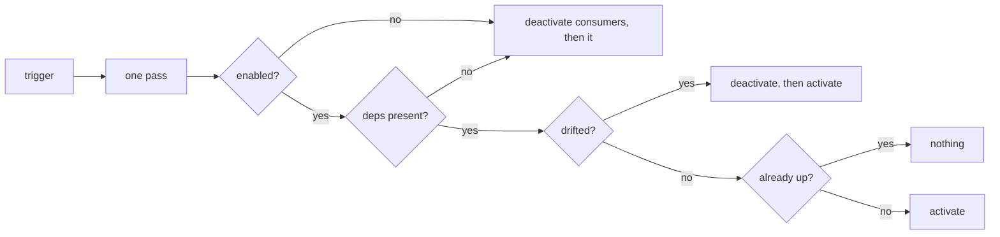

# Subsystem Reconciliation

How the backend decides what is wired, when. Every subsystem declares what it
needs; a level-triggered reconciler compares those declarations against live
state and converges. Boot is the first pass, not a special path.

[API Startup Lifecycle](../reference/api-startup-lifecycle.md) covers the
two-phase boot this sits inside.

## The problem

Wiring used to be decided once, at boot. Every `_wire_*` entry point asked "is
my dependency here?" and froze the answer for the life of the process. A
second, hand-maintained list re-ran fourteen of them after setup; the rest
stayed frozen, and `wire_memory_backend` was missing from that second list
entirely, which is the drift two parallel lists guarantee.

The visible cost: choosing an embedding model after first boot left memory,
living docs, the project brain, the knowledge substrate, the toolsmith and the
retro tail all inert until someone restarted the process. Every one of them had
a dependency that arrived thirty seconds too late.

Boot-time wiring is edge-triggered, and a missed edge in an edge-triggered
system diverges permanently.

## Shape

A subsystem is a declaration, not a call site:

```python
SubsystemSpec(
    name="memory_backend",
    provides=CapabilityId.MEMORY_BACKEND,
    requires=(CapabilityId.PERSISTENCE,),
    activate=_activate_memory_backend,
    deactivate=_deactivate_memory_backend,
    settings=("memory.backend", "memory.embedder_model", ...),
    rebuild_on_change=True,
)
```

`activate` is the existing wiring function, unchanged. What is new is
`requires`: the check that used to sit inside the function body, hoisted where
the reconciler can order by it and report on it.



## Invariants

**Liveness is read from `provides`.** The reconciler asks the capability probe
whether the thing exists, rather than tracking a flag it set itself, so its
idea of "up" cannot drift from what activation installed.

**Activation is idempotent.** The pass runs again on every trigger; a
subsystem already up costs one probe.

**A declined activation costs one probe too.** A subsystem that ran its
activation and installed nothing has no capability to guard on, so without
something else the next trigger re-runs the whole wiring to reach the same
refusal. A snapshot of every requirement and declared setting is taken at the
decline and compared on the next pass: unchanged inputs, no second attempt. An
operator
naming the model a subsystem was waiting for moves the snapshot and is picked up
on that same write. Measured on a wired app, this is the difference between a
pass costing 140 ms and one costing single-digit milliseconds.

**A trigger is a hint, never an instruction.** Boot, a settings write and the
periodic resync all call the same `reconcile()`. A missed trigger costs latency
and never correctness. The one thing the sweep does differently is ask for
`retry_declined=True`: what a snapshot cannot see is the undeclared condition
that made a subsystem `blocked` in the first place, so somebody has to attempt
unconditionally, and the sweep is the caller that knows time has passed. The
periodic sweep is the guarantee; everything else is an optimisation.

**One pass at a time, whichever loop asks.** The reconciler is cached on an
application state that outlives a single event loop, and an `asyncio.Lock`
only serialises callers sharing the loop it bound to, so the claim on a pass
is a plain lock rather than an async one. A caller that finds a pass already
running does not wait on it: it hands its trigger to the pass in flight, which
repeats once it finishes, and gets back the current observation rather than one
it produced. That keeps a second loop from blocking on a lock it cannot await,
and the hand-off is what stops the trigger being dropped instead.

**Order is derived, never written down.** `order_subsystems` topologically
sorts the declarations, rejecting a cycle or two owners of one capability at
construction, so a bad declaration fails the build rather than quietly never
activating.

**A failure is recorded, not fatal.** One subsystem that cannot come up must
not stop the rest; the next pass retries it and `GET /subsystems` names it. The
one caller that cannot live with that is setup completion, which asks a
one-shot question ("is this deployment configured?") and so refuses to persist
`setup_complete=true` over a subsystem that failed on its pass.

**One wiring path per subsystem.** A second caller of a wiring function the
registry activates is a hand-kept list of what someone believed needed
rewiring, and two lists drift: that is precisely how `wire_memory_backend`
came to be absent from the post-setup rewire while thirteen siblings were in
it. Three shapes are all the same defect and all rejected: a post-setup rewire
list, a settings subscriber that re-runs wiring, and a composite wrapper that
runs several registry-owned `wire_*` functions in a fixed order. Enforced by
`scripts/check_subsystems_single_owner.py`; opt out per-line with
`# lint-allow: subsystem-single-owner -- <reason>`.

## Rebuild, and why identity matters

A subsystem that captures a dependency by value at construction (the engine
reads the memory slice once) declares `rebuild_on_change=True`. Two things
count as a change:

- a required capability appeared or vanished, and
- a declared setting the activation baked in has a different value.

Availability alone is not enough. A provider rebuilt inside a single pass reads
present both before and after, while every consumer still holds the instance
being replaced. Each activation therefore bumps a generation counter for the
capability it provides, and a consumer's snapshot records the generation of the
instance it actually captured. Replacing memory replaces what reads through it.

A rebuild is deactivate-then-activate, so `rebuild_on_change=True` requires a
`deactivate`. Without one the subsystem still reads active after the teardown
that did nothing, the pass leaves it alone, and the declaration promises a
replacement that never happens. `order_subsystems` refuses that pairing at
construction rather than letting it fail silently at runtime.

Declaring `settings=` without `rebuild_on_change` is the weaker and commoner
case: it does not replace a running instance, but it does put the key in the
settings subscriber's watched set, so a subsystem waiting on a value (the
Chief-of-Staff features, each blank until an operator names a model) comes up
on the write rather than on the next restart.

A setting the resolver cannot serve is not a change. Its snapshot records "no
reading" rather than a value, and the comparison skips those positions; the
first successful read afterwards becomes the baseline. Without that, one
transient resolver error compares unequal to the successful read it followed
and tears down every `rebuild_on_change` subsystem at once.

## Teardown runs in reverse

Activation order is providers first. Teardown is its mirror: before a
subsystem goes down, everything reading through it goes down first. Taking the
provider first leaves its consumers live over an instance that has gone away,
and a request served in that window reads through a disconnected collaborator
(the knowledge engine answering out of a memory backend that has just been
replaced).

Which consumers follow depends on why the provider is going:

- **Going for good** (switched off, or its own requirement vanished): every
  live consumer follows, transitively. Their requirement is about to be unmet.
- **Coming back on this pass** (a rebuild): only the consumers that captured
  the instance, meaning `rebuild_on_change=True`. One that reads the slice per
  call picks the replacement up on its next read and has nothing to rebuild.

A consumer taken down as part of a rebuild is re-activated later in the same
pass, so `ReconcileReport.deactivated` names only what is still down at the
end: a rebuild reports as `activated`, and reporting it as an outage would
send an operator looking for a subsystem that is up.

## Phases

`GET /subsystems` reports one phase per subsystem, derived from the same
declarations the reconciler uses, so the surface cannot drift from behaviour.

| Phase | Meaning |
| --- | --- |
| `active` | Its capability reads as available. |
| `waiting` | A declared dependency is not here yet; `waiting_on` names every one. |
| `blocked` | Every declared dependency is present, activation ran, and the subsystem declined on a condition the declaration cannot model (memory with no embedding model chosen). It logs the reason. |
| `disabled` | An operator turned it off via `enabled_by`. |
| `failed` | Activation raised; `detail` carries the redacted description. |

`waiting` and `disabled` are resting states, not errors. `blocked` exists
because reporting that case as `waiting` would name no dependency and leave an
operator with nowhere to look. It is also the phase the retry snapshot is for:
a `blocked` subsystem is re-attempted when something it declares moves, and
otherwise on the next sweep.

## Why not the alternatives

**Crash-only.** One way to stop, one way to start, no duplicated paths. It is
the cleanest answer and it is disqualified here by the cold-boot budget: the
backend takes minutes to come back, so "just restart" is an outage.

**A supervision tree with restart strategies.** Solves failure propagation, not
late arrival, which is the actual defect. A dependency that shows up after boot
is not a crash and no restart strategy fires on it.

**An explicit `active` predicate on the spec.** Smaller than making each
subsystem install an observable marker, and it reintroduces exactly the drift
this design removes: two statements of "is it up" that can disagree.

The subsystems that forced the question mutate something in place rather than
publishing a service: four attach a collaborator to the work pipeline, one
attaches a dispatcher to the Chief-of-Staff proposer. Each grew a read-only
counterpart to its `attach_*` seam (`WorkPipeline.attachments`,
`has_plan_dispatcher`) computed from the same field the seam writes, so the
probe cannot claim an attachment that is not there.

## Readiness is not a dependency roll-up

`/readyz` reports whether this process can serve, never whether every optional
collaborator is reachable. Gating readiness on a shared external dependency is
the well-known cascading-failure shape: one unreachable provider takes every
replica out at once. An unreachable LLM provider degrades what agents can do;
it does not stop the API answering. `synthorg start` gates on `/healthz` for
the same reason, and prints the degraded subsystems by name instead.
