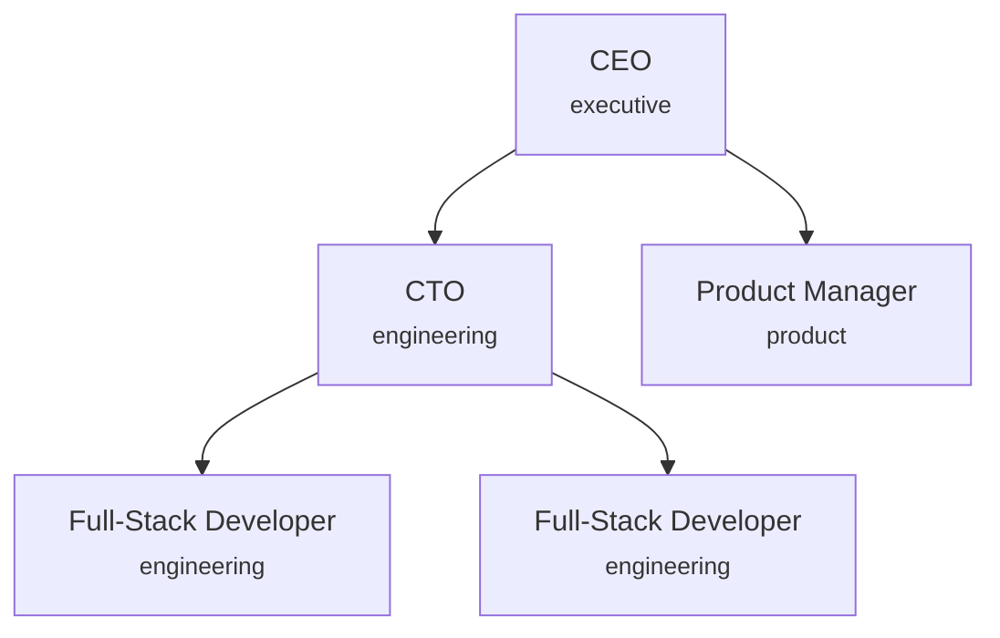

# Agent Roles & Hierarchy

Agents are the core building blocks of a synthetic organisation. Each agent has an identity (role, name), a position in the hierarchy (department, reporting line), and capabilities (model, tools, authority). This guide covers how to configure all of these.

---

## How Agents Work

An agent's configuration is split into two layers:

- **Config layer** (frozen): identity, role, model, department. Set at creation time and never mutated.
- **Runtime state** (mutable-via-copy): execution status, current task, cost spent. Evolves during operation using `model_copy(update=...)`.

This separation means you configure *who an agent is* in YAML, and the engine manages *what the agent is doing* at runtime.

---

## Defining an Agent

Agents are defined in the `agents` list of your company configuration:

```yaml
agents:
  - role: "Full-Stack Developer"
    name: "Alex"
    department: "engineering"
    model:
      priority: "balanced"
      min_context: 50000
    autonomy_level: semi  # override company-wide level
```

### Agent Configuration Fields

| Field | Type | Default | Description |
|-------|------|---------|-------------|
| `name` | string | *(required)* | Display name |
| `role` | string | *(required)* | Role from the built-in catalog or `custom_roles` |
| `department` | string | *(required)* | Department this agent belongs to |
| `model` | dict | `{}` | Model assignment: structured config with priority, min_context |
| `memory` | dict | `{}` | Per-agent memory overrides |
| `tools` | dict | `{}` | Tool access configuration |
| `authority` | dict | `{}` | Delegation and approval authority |
| `autonomy_level` | AutonomyLevel | `null` | Per-agent autonomy override |

!!! tip "Template-only fields"

    When using a **template** (e.g. `company_type: startup`), the template format supports an additional `merge_id` field (disambiguation ID for multiple agents with the same role), resolved by the template engine before constructing the final config. Templates also auto-generate agent names via Faker when `name` is omitted.

!!! note "Unique agent identity"

    Agent names must be unique within the organisation. For template inheritance, agent matching is keyed by `(role, department, merge_id)`. Use `merge_id` to disambiguate multiple agents sharing the same `(role, department)` pair.

---

## Authority & Delegation

Authority is not a per-agent level. It follows from the agent's **role** and where that role sits in the organisation's **reporting graph**. Each role declares an optional `reports_to` (its supervisor's role name); the CEO role is the root (`reports_to` unset).

An agent can delegate work down its reporting chain to roles that (transitively) report to it, and cannot assign work to peers or superiors. The engine resolves "who outranks whom" from reporting depth (see [HR & Agent Lifecycle](../design/hr-lifecycle.md)), not from a seniority attribute. A role's model capability is a separate axis, driven by the work's capability demand rather than org position.

---

## Built-in Roles

SynthOrg ships with 30+ built-in roles organised by department:

| Department | Roles |
|-----------|-------|
| Executive | CEO, CTO, CFO, COO, CPO |
| Product | Product Manager, Technical Writer |
| Design | UX Designer, UI Designer, UX Researcher |
| Engineering | Software Architect, Frontend Developer, Backend Developer, Full-Stack Developer, DevOps/SRE Engineer, Database Engineer, Knowledge Architect |
| Security | Security Engineer, Security Operations |
| Quality Assurance | QA Lead, QA Engineer, Automation Engineer, Performance Engineer, Red Team, Completion Reviewer |
| Data & Analytics | Data Analyst, Data Engineer, ML Engineer |
| Operations | Project Manager, Scrum Master, HR Manager |
| Creative & Marketing | Content Writer, Brand Strategist, Growth Marketer |

**Red Team** and **Completion Reviewer** judge finished work rather than
performing it, so a holder of either reaches every project instead of the one
team it is staffed on, and the matching completion gate selects a holder per
review. They are assigned like any other role through the operator REST path
covered in [Agent Management](agent-management.md); the agent MCP surface
cannot grant or change a gate role, so an agent cannot appoint its own judge.
Staff at least a Completion Reviewer: without one, each finished task parks
awaiting a reviewer instead of being waved through. See
[Built-in Roles](../design/agents.md#built-in-roles).

### Custom Roles

Define custom roles when the built-in catalog does not cover your needs:

```yaml
custom_roles:
  - name: "Compliance Officer"
    department: "operations"
    system_prompt_template: |
      You are a compliance officer responsible for ensuring
      all outputs meet regulatory requirements.
    required_skills:
      - "regulatory_analysis"
      - "policy_review"
    reports_to: "Chief Compliance Officer"
```

---

## Departments & Reporting Lines

Departments group agents and define budget allocation and reporting structure:

```yaml
departments:
  - name: "engineering"
    budget_percent: 60
    head: "CTO"
    reporting_lines:
      - subordinate: "Full-Stack Developer"
        subordinate_id: "fullstack-senior"
        supervisor: "CTO"
      - subordinate: "Full-Stack Developer"
        subordinate_id: "fullstack-mid"
        supervisor: "CTO"
  - name: "product"
    budget_percent: 20
    head: "Product Manager"
  - name: "executive"
    budget_percent: 20
    head: "CEO"
    reporting_lines:
      - subordinate: "CTO"
        supervisor: "CEO"
```

### Hierarchy Diagram

A typical startup hierarchy looks like this:



### Department Fields

| Field | Type | Default | Description |
|-------|------|---------|-------------|
| `name` | string | *(required)* | Unique department name |
| `budget_percent` | int | `0` | Percentage of company budget allocated |
| `head` | string | `null` | Role name (or agent identifier) of the department head. Use the companion `head_id` to disambiguate when several agents share the role |
| `head_id` | string | `null` | Unique identifier for the department head; use when multiple agents share `head` |
| `reporting_lines` | list | `[]` | Subordinate-supervisor pairs |

Use `subordinate_id` in reporting lines when you have multiple agents with the same role (matches the agent's `merge_id` when using templates).

---

## How Agent Output Reads

How an agent writes is not configured per agent. The organisation sets one house
writing style, scoped org-wide with per-role and per-department overrides, and a
deterministic guardrail enforces the hard rules at the boundary where work is kept
or sent. See [Output Style Policy](../design/output-style-policy.md).

---

## Model Assignment

Models can be assigned to agents in two ways:

=== "String Alias"

    Reference a model alias defined in your providers:

    ```yaml
    agents:
      - role: "Full-Stack Developer"
        model: "medium"
    ```

=== "Structured Config"

    Specify priority and constraints; the matcher derives the capability rung
    from real model metadata, so there is no rung to name here:

    ```yaml
    agents:
      - role: "CEO"
        model:
          priority: "quality" # quality, cost, balanced, speed
          min_context: 100000
    ```

When no model is specified, the routing strategy selects one based on the agent's role and the task type.

---

## Templates as Starting Points

Templates pre-populate agents, departments, and workflows. You can customise any aspect after selecting a template:

| Template | Agents | Autonomy | Workflow | Communication |
|----------|--------|----------|----------|---------------|
| `solo_founder` | 3-4 | Full | Kanban | Event-driven |
| `startup` | 4-7 | Semi | Agile Kanban | Hybrid |
| `dev_shop` | 6-10 | Supervised | Agile Kanban | Hybrid |
| `product_team` | 9-14 | Supervised | Agile Kanban | Event-driven |
| `agency` | 10-15 | Supervised | Kanban | Hierarchical |
| `full_company` | 20-50 | Supervised | Agile Kanban | Hierarchical |
| `research_lab` | 5-10 | Full | Kanban | Event-driven |
| `consultancy` | 4-6 | Supervised | Kanban | Hierarchical |
| `data_team` | 5-8 | Full | Kanban | Event-driven |
| `growth_marketing` | 5-8 | Semi | Agile Kanban | Hybrid |
| `support_desk` | 5-7 | Supervised | Kanban | Hierarchical |
| `security_team` | 6-8 | Supervised | Kanban | Hierarchical |

Templates support **inheritance** via the `extends` keyword (deep merge up to 10 levels) and **variables** with Jinja2 placeholders for customisation.

---

## Workflow Handoffs & Escalation

### Handoffs

Define automatic handoffs between departments when specific conditions are met:

```yaml
workflow_handoffs:
  - from_department: "engineering"
    to_department: "product"
    trigger: "Feature implementation completed for product review"
    artifacts:
      - "pull_request"
      - "release_notes"
```

### Escalation Paths

Define escalation routes for blockers or conflicts:

```yaml
escalation_paths:
  - from_department: "engineering"
    to_department: "executive"
    condition: "Technical blocker requiring executive decision"
    priority_boost: 1
  - from_department: "product"
    to_department: "executive"
    condition: "Scope or priority conflict needing CEO resolution"
    priority_boost: 1
```

The `priority_boost` field increases the priority of escalated tasks (0 = no change, 1 = one level up, etc.).

---

## See Also

- [Company Configuration](company-config.md): full configuration reference
- [Budget & Cost Control](budget.md): per-agent budgets and cost tracking
- [Security Policies](security.md): autonomy levels and tool permissions
- [Design: Agents](../design/agents.md): full design specification for agents
- [Design: Organisation](../design/organization.md): template system and hierarchy
