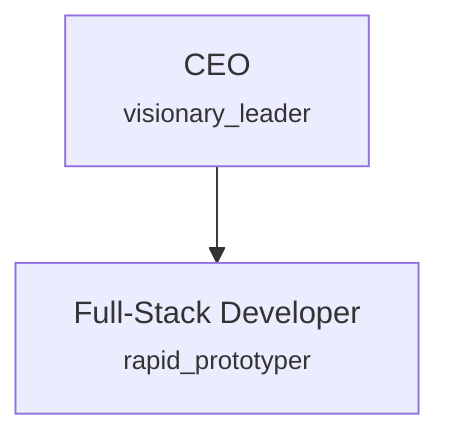
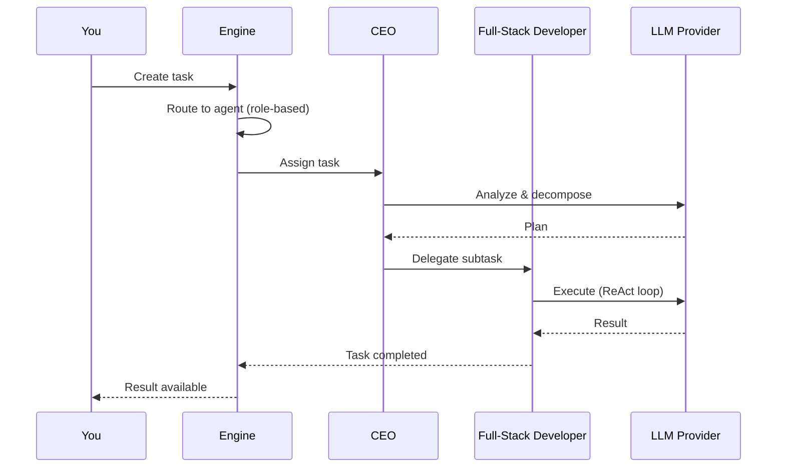

# Quickstart Tutorial

This tutorial walks you through installing SynthOrg, starting the platform,
and configuring your first company, in about 5 minutes.

!!! warning "Honest status"
    The platform, dashboard, CLI, and setup wizard below work today. The
    autonomous agent runtime that executes work is in active development and
    not yet wired: a task you submit advances through its lifecycle states,
    but an agent does not yet execute it. The "designed flow" section makes
    the distinction explicit. See the [Roadmap](../roadmap/index.md).

---

## What You Will Configure

You will configure a **Solo Builder** organisation: a lean two-agent team
designed for rapid prototyping.



By design, the CEO handles strategy and task decomposition while the
Full-Stack Developer writes code and builds features. That execution
behaviour is the runtime work in active development; the steps below set up
the company that will run it.

---

## Prerequisites

- **Docker Desktop** (or Docker Engine + Docker Compose): [install Docker](https://docs.docker.com/get-docker/)
- **An LLM provider API key**: any provider supported by LiteLLM (e.g. a cloud provider or a local instance like Ollama)

---

## Step 1: Install the CLI

=== "Linux / macOS"

    ```bash
    curl -sSfL https://synthorg.io/get/install.sh | bash
    ```

=== "Windows (PowerShell)"

    ```powershell
    irm https://synthorg.io/get/install.ps1 | iex
    ```

Verify the installation:

```bash
synthorg version
```

See the [User Guide](../user_guide.md) for alternative installation methods and CLI commands.

---

## Step 2: Initialise

Run the interactive setup wizard:

```bash
synthorg init
```

The wizard will prompt you to configure infrastructure settings:

1. **Data directory**: where SynthOrg stores its data (default: platform-appropriate path).
2. **Backend API port**: port for the REST/WebSocket API (default: 3001).
3. **Web dashboard port**: port for the web UI (default: 3000).
4. **Enable agent code sandbox**: optionally mount the Docker socket for sandboxed code execution.

`synthorg init` generates the required secrets (`SYNTHORG_JWT_SECRET` and `SYNTHORG_SETTINGS_KEY`) and writes the configuration automatically. Company setup (name, LLM provider, template) happens in the web dashboard after containers start (see [Step 4](#step-4-explore-the-dashboard)).

---

## Step 3: Start

```bash
synthorg start
```

This pulls container images (with automatic [cosign signature verification](deployment.md#image-verification)), starts the backend and web dashboard, and waits for health checks to pass.

Check that everything is running:

```bash
synthorg status
```

You should see both containers (`backend` and `web`) reporting healthy.

---

## Step 4: Explore the Dashboard

Open [http://localhost:3000](http://localhost:3000) in your browser.

On a fresh install, the **setup wizard** appears. Pick **Guided Setup** and step through:

1. **Select a template**: choose **Solo Builder** (the minimal 2-agent template).
2. **Add an LLM provider**: enter your provider's API key. Local providers like Ollama are auto-detected.
3. **Name your company**: pick any name (e.g. "My First Org").
4. **Review agents**: the template populates the roster; tweak personalities and models if you want, or accept defaults.
5. **Pick a theme**: light or dark.

**Quick Setup** is the abbreviated path (provider, company name, done). Use it when you want to land in the dashboard fastest and configure the rest later.

Once the wizard completes, the dashboard loads and you will see:

- **Agents**: the CEO and Full-Stack Developer, each with their personality and model assignment
- **Organisation status**: health indicators for the platform
- **Task board**: empty, ready to accept tasks

---

## Step 5: Submit a Task

=== "Dashboard"

    Use the task board in the dashboard to create a new task. Give it a title and description.

=== "API"

    ```bash
    curl -X POST http://localhost:3001/api/v1/tasks \
      -H "Content-Type: application/json" \
      -H "Authorization: Bearer <your-jwt-token>" \
      -d '{
        "title": "Write a hello world script",
        "description": "Create a simple Python script that prints hello world"
      }'
    ```

    Replace `<your-jwt-token>` with the JWT from your admin session. See the [REST API Reference](../openapi/index.md) for authentication details.

Today the task is created and advances through its lifecycle states. An agent
does not yet pick it up and execute it: that is the agent runtime, which is in
active development. See the [Roadmap](../roadmap/index.md) for current status.

---

## The Designed Flow (in active development)

This is what submitting a task is **designed** to do once the agent runtime
is wired. It is not what happens end to end today.



1. **Task created**: the engine validates the task and queues it. (Works today.)
2. **Task routed**: a routing strategy matches the task to the best-suited agent. (Designed; in active development.)
3. **Agent executes**: the assigned agent uses its configured LLM in a ReAct loop. (Designed; in active development.)
4. **Result returned**: the completed task and its artifacts appear in the dashboard and API. (Designed; in active development.)

---

## Stop

When you are done:

```bash
synthorg stop
```

Your data persists in the `synthorg-data` Docker volume and will be available next time you run `synthorg start`.

---

## Next Steps

- [Company Configuration](company-config.md): customise every aspect of your organisation via YAML
- [Agent Roles & Hierarchy](agents.md): add more agents, define departments, configure personality
- [Budget & Cost Control](budget.md): set spending limits and auto-downgrade policies
- [Deployment (Docker)](deployment.md): production hardening and operations
- [Roadmap](../roadmap/index.md): what is available now versus in active development
