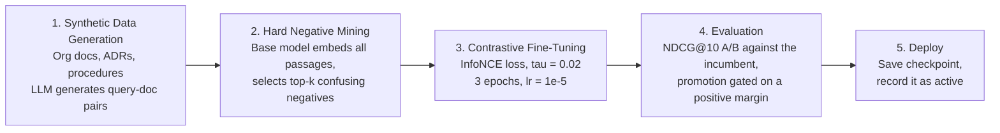

# Embedding Model Evaluation

## Why LMEB, Not MTEB

The standard text embedding benchmark ([MTEB](https://huggingface.co/spaces/mteb/leaderboard))
evaluates traditional passage retrieval. SynthOrg's memory system requires **long-horizon memory
retrieval**: fragmented, context-dependent, and temporally distant information across episodic,
procedural, semantic, and social memory types.

The [LMEB benchmark](https://arxiv.org/abs/2603.12572) (Zhao et al., March 2026) evaluates
exactly this: 22 datasets, 193 zero-shot retrieval tasks across four memory types. Its key finding
is that **MTEB performance does not generalise to memory retrieval**:

| Correlation | Pearson | Spearman |
|-------------|---------|----------|
| Overall LMEB vs MTEB | -0.115 | -0.130 |
| Episodic vs MTEB | -0.271 | -0.150 |
| Dialogue vs MTEB | -0.496 | -0.364 |
| Semantic vs MTEB | 0.103 | 0.061 |
| Procedural vs MTEB | 0.291 | 0.429 |

Negative or near-zero correlations mean a model that tops MTEB may perform poorly on the memory
retrieval tasks SynthOrg relies on. Procedural memory shows the strongest (but still weak) transfer,
while dialogue memory shows **anti-correlation**: dialogue retrieval can rank models differently
from MTEB, so an MTEB position does not predict one here.

---

## SynthOrg Memory Type Mapping

SynthOrg defines five memory categories (`MemoryCategory` enum). LMEB defines four. The mapping
is direct for three types; two SynthOrg types share a single LMEB category.

| SynthOrg Category | LMEB Category | LMEB Task Examples | Evaluation Priority |
|-------------------|---------------|-------------------|---------------------|
| **EPISODIC** | Episodic | EPBench (54 tasks), KnowMeBench (15 tasks): temporal event recall | **High** |
| **PROCEDURAL** | Procedural | Gorilla, ToolBench, ReMe, MemGovern, DeepPlanning (67 tasks): skill/action retrieval | **High** |
| **SEMANTIC** | Semantic | QASPER, NovelQA, PeerQA, SciFact (15 tasks): factual knowledge recall | Medium |
| **SOCIAL** | Dialogue | LoCoMo, LongMemEval, REALTALK, ConvoMem (42 tasks): multi-turn context | Medium |
| **WORKING** | (not applicable) | Working memory is in-context, not stored/retrieved | N/A |

**Priority rationale**: episodic and procedural memory are the primary retrieval-dependent types in
SynthOrg. Social memory maps to dialogue retrieval (the hardest LMEB category). Semantic memory
is important but shows partial overlap with traditional passage retrieval. Working memory is
in-context and does not use the embedding pipeline.

---

## LMEB Leaderboard Analysis

All scores are NDCG@10 (with instruction prompts unless noted). Source: LMEB paper, Table 3.

### Top Models by Memory Type

| Rank | Model | Params | Episodic | Procedural | Dialogue | Semantic | Overall |
|------|-------|--------|----------|------------|----------|----------|---------|
| 1 | bge-multilingual-gemma2 | 9B | 70.88 | 61.40 | **59.60** | 60.41 | **61.41** |
| 2 | KaLM-Embedding-Gemma3 | 12B | **70.89** | **63.43** | 56.59 | 57.53 | 60.10 |
| 3 | NV-Embed-v2 | 7B | 68.45 | 58.77 | 56.42 | **62.18** | 60.25 |
| 4 | e5-mistral-7b-instruct | 7B | 67.43 | 55.41 | 55.03 | 57.63 | 57.08 |
| 5 | multilingual-e5-large-instruct | 560M | 63.60 | 52.22 | 54.62 | 57.18 | 55.33 |

### Small Models (< 1B parameters)

| Model | Params | Episodic | Procedural | Overall | Notes |
|-------|--------|----------|------------|---------|-------|
| EmbeddingGemma-300M | 307M | - | - | 56.03 (w/o inst.) | Outperforms 9B models without instructions |
| Qwen3-Embedding-0.6B | 596M | - | - | ~53 | Competitive small model |
| Qwen3-Embedding-4B | 4B | - | 59.81 | ~58 | Strong procedural performance |

### Key Findings

1. **Larger does not mean better.** EmbeddingGemma-300M (307M params) scores 56.03 without
   instructions, outperforming bge-multilingual-gemma2 (9B) at 45.10 without instructions.
   Architecture and training data matter more than parameter count.

2. **Instruction sensitivity varies wildly.** Some models gain +3-5% with instructions
   (KaLM-Embedding-Gemma3), others are neutral (NV-Embed-v2), and some are harmed by instructions
   (EmbeddingGemma-300M, bge-m3). Instruction tuning must be validated per deployment.

3. **Dialogue memory is the critical gap.** The highest dialogue score is 59.60 (bge-multilingual-gemma2),
   well below episodic (70.89) and semantic (62.18). This affects SynthOrg's SOCIAL memory quality.

4. **No universal embedding model exists.** No single model excels across all memory types.
   Model selection must be optimised for the deployment's primary memory retrieval pattern.

---

## What the results show

The embedding model is the operator's choice. This section reports what the
published evaluations measured, grouped by the resource class a deployment can
afford, so that choice can be an informed one. Nothing here is a default, and
nothing in the codebase reads it.

### Full-resource deployment (GPU server, 7-12B model)

`bge-multilingual-gemma2` (9B) scores highest overall on LMEB (61.41 NDCG@10)
and leads on dialogue and social recall (59.60), the hardest category, alongside
strong episodic (70.88) and procedural (61.40) results and a consistent +1.96
gain from instruction prompts. `NV-Embed-v2` (7B) leads on semantic recall
instead (62.18) and scores consistently regardless of prompt formatting.

### Mid-resource deployment (consumer GPU, 1-4B model)

`Qwen3-Embedding-4B` (4B) scores 59.81 NDCG@10 on procedural recall with a
reasonable balance across the other memory types, and fits in the 16-24 GB of
VRAM a consumer GPU offers for inference.

### CPU-only or embedded deployment (under 1B model)

`EmbeddingGemma-300M` (307M) scores 56.03 without instructions, competitive with
models an order of magnitude larger, and runs on CPU at a latency asynchronous
retrieval tolerates. Its scores fall when given instruction prompts, so the
figure above is measured without them.

### Embedder Configuration

`EmbedderConfig` binds an explicit `(provider, model)` pair plus the vector width.
Boot resolves it through `resolve_embedder_config`, which reads the YAML override
below as the base, then applies the operator's `memory.embedder_model` setting (a
provider-bound `MODEL_REF`) and the optional `memory.embedder_dims` pin over it,
so a setting wins per field. **It selects nothing**: an unresolved binding leaves
memory OFF and logs why, and the built-in embedder is reachable only by naming it
(`builtin` / `hashing`).

The rankings on this page inform that choice; they do not make it. Nothing in the
codebase reads them, and the tiers below are sizing guidance for an operator.

```yaml
memory:
  embedder:
    provider: "example-provider"
    model: "example-embedding-001"
    dims: 2000                 # optional: pin an MRL truncation of the model's width
```

When `dims` is not pinned, the width is **measured** rather than looked up:
`probe_embedder_dims` embeds a short probe string through the chosen pair and
counts components. A shipped table of catalogued widths cannot be the authority
here, because it goes stale, cannot cover a model it has never heard of, and
being wrong by a single component makes every stored vector incomparable. The
probe doubles as proof the binding works: a model that cannot embed fails at
selection rather than at the first memory write.

A `dims` value the model cannot produce is a hard failure rather than a warning:
vectors of the wrong width corrupt recall silently, which is far worse than not
booting. Setting `embedder_dims` *below* the model's output is the one sanctioned
mismatch: an explicitly pinned narrower width truncates each vector to its leading
components and renormalises it, which is how a Matryoshka-trained model is used at
a smaller width. Truncating a model that was not MRL-trained degrades recall, so
this only ever happens on the operator's explicit instruction, never by inference.

### Dense index width ceilings

pgvector indexes at most 2000 dimensions with a full-precision `vector` and 4000
with a half-precision `halfvec`, so the Postgres backend picks the element type
from the configured width: `vector` at or below 2000, `halfvec` up to 4000. Above
4000 no approximate index can be built at all; the dense column is still created
and dense search still runs, as an exact scan over the corpus, reported at ERROR
with `memory.dense_index.unindexable`. Recall stays semantic either way, but a
width above the ceiling reads every row per query: pin `memory.embedder_dims` at
or below 2000 on an MRL-capable model, or choose a narrower embedder.

That state is reported as DEGRADED on the memory health surface and does **not**
fail readiness. It answers every query correctly and differs only in latency, so
gating traffic on it would take a working system offline; it is also terminal,
since no retry can build an index pgvector refuses for that width, so a readiness
probe would wait out its whole budget for a condition known at boot.

Changing the embedding model after deployment invalidates every stored vector, because
embeddings from different models are not comparable. The dense index is therefore keyed
by width: a new width indexes into a fresh table (SQLite) or column (Postgres) rather
than mixing incompatible vectors into the old one. That keeps recall correct, but it
also means the previous vectors go unreachable, so startup scans for indexes left at
other widths and logs `memory.dense_index.width_changed` at ERROR with the orphaned
count. Without that signal an operator would read the resulting empty recall as a bug
in memory rather than as the consequence of the model swap.

Entries themselves survive a width change: rows, tags, and the lexical index are
width-independent, so recall degrades to lexical-only for the older entries rather than
losing them. Re-embedding restores semantic recall. Plan model selection before the
first production deployment regardless.

---

## Domain Fine-Tuning Pipeline

Whichever model an operator picks, domain-specific fine-tuning can improve retrieval
quality by 10-27% ([NVIDIA blog](https://huggingface.co/blog/nvidia/domain-specific-embedding-finetune),
tested on NVDocs and Jira datasets). The pipeline requires no manual annotation and runs on a
single GPU.

### Pipeline Overview



### Stage Details

**Stage 1: Synthetic Data Generation**

- Input: organisation documents (policies, ADRs, procedures, coding standards, meeting notes)
- Process: LLM generates realistic retrieval queries for each document chunk
- Output: `(query, positive_document)` pairs
- No GPU required (API-based LLM calls)

**Stage 2: Hard Negative Mining**

- Input: query-document pairs + base embedding model
- Process: embed all passages, compute query-passage similarity, select top-k highest-scoring
  non-positive passages (with margin filter to avoid false negatives)
- Output: `(query, positive, [hard_negative_1, ..., hard_negative_k])` triples
- GPU required (40 GB VRAM for embedding)
- Encoding constraints: per-call `processing_kwargs={"text": {"max_length": N, "truncation": True}}`
  with `_QUERY_MAX_LENGTH = 128` for queries and `_PASSAGE_MAX_LENGTH = 512` for passages.
  Inputs whose word count likely exceeds the token limit emit a
  `memory.fine_tune.encode_truncation_likely` WARNING log.

**Stage 3: Contrastive Fine-Tuning**

- Input: training triples from Stage 2
- Process: biencoder contrastive training with InfoNCE loss, temperature tau=0.02
- Key hyperparameters: 3 epochs, lr=1e-5, batch size 128, 5 passages per query (1 positive + 4 hard negatives)
- GPU required (80 GB VRAM for training, or reduced batch size on smaller GPUs)
- Duration: 1-2 hours for typical org corpus (~500 documents)

**Stage 4: Evaluation**

- Input: held-out validation pairs + fine-tuned checkpoint and base model
- Process: encode queries and passages with both models and compute NDCG@10 and Recall@10
- Re-applies the same query (128) / passage (512) token caps with truncation enabled, so
  eval embeddings are tokenisation-consistent with mining
- Output: `EvalMetrics` snapshot (per-model NDCG@10 / Recall@10) persisted alongside the checkpoint

**Stage 5: Deploy**

- Save the fine-tuned checkpoint to the run's configured output path
- Promote only on a strictly positive NDCG@10 win over the base, decided by
  `should_promote_checkpoint` (`memory/embedding/promotion.py`); a tie, a
  regression, or a missing measurement records the checkpoint inactive
- Snapshot the embedder settings so a rollback has something to restore

### Integration Design

Fine-tuning is an **offline pipeline**, not a runtime operation. Each run
freezes its own `FineTuneRunConfig` (`memory/embedding/fine_tune_models.py`)
so a resume replays what the run started with.

Promotion records a checkpoint; it does not switch the live embedder.
`deploy_checkpoint` deliberately leaves `memory.embedder_model` alone,
because that setting is a provider-bound model reference and a filesystem
path written into it would reach the boot path as a model name to dispatch
on. Serving a promoted checkpoint means an operator pointing
`memory.embedder_model` at a provider that serves it, which keeps the
choice explicit (see
[Memory Design Spec](../design/memory.md#embedding-model-selection)).

A fine-tuned model whose output width differs from the base model is a width change like
any other, with the same consequence for previously stored vectors.

The pipeline is triggered via `POST /admin/memory/fine-tune`, served by
`MemoryFineTuneController` (`api/controllers/memory/fine_tune.py`).

### Improvement Expectations

Based on the NVIDIA evaluation:

| Dataset | Metric | Base | Fine-Tuned | Improvement |
|---------|--------|------|-----------|-------------|
| NVDocs | NDCG@10 | 0.555 | 0.616 | +10.9% |
| NVDocs | Recall@10 | 0.630 | 0.693 | +10.0% |
| Jira (Atlassian) | Recall@60 | 0.751 | 0.951 | +26.7% |

Domain-specific corpora (like organisational documents) tend to see higher gains because the base
model's generic training does not cover domain-specific terminology and relationships.

### Compilation, and why the image ships no compiler

`torch.compile` applies to a sentence-transformers model from 5.7.0, which
routes `encode()` through `nn.Module.__call__`. Earlier versions called
`forward()` directly, so compilation was a silent no-op for inference. The
mining and evaluation stages are the plausible candidates: they encode a whole
corpus on a GPU, which is the shape compilation rewards.

The numbers below are a floor rather than a forecast. They were measured on
`all-MiniLM-L6-v2`, about 22M parameters at 384 dimensions, at batch size 1.
That model was **fixed in the source rather than selected by an operator**, and
at that size inference is dominated by tokenisation and Python overhead rather
than by compute, so the CPU figure in particular says more about the overhead
floor than about the technique. A pipeline model is larger and batches, so
re-measure against the model actually being trained before drawing a
conclusion from these.

Method: arms are timed in **pairs**. Eager and candidate alternate inside one
loop, so drift in machine load falls on both equally. Running arms one after
another instead scored one arm at 0.96x that a paired run scored at 1.19x,
which inverts the conclusion. Warm-up is reported rather than folded away,
because lazy compilation makes it the other half of the trade. Compiled vectors
are compared against eager, because a speedup that changes the output vector is
not a speedup.

CPU, in a 4-vCPU container with 2 `torch` threads, 140 timed calls per arm.
Warm-up measured 10.8 s for `dynamic=True` and 25.5 s for `dynamic=auto` in a
sequential run of the same arms:

| arm | median ms | p90 ms | speedup |
|---|---|---|---|
| eager | 11.357 | 13.557 | 1.00x |
| default, `dynamic=auto` | 9.382 | 11.714 | 1.21x |
| default, `dynamic=True` | 9.527 | 12.103 | 1.19x |

CUDA, on an RTX 4090, `torch` 2.13.0 and sentence-transformers 5.7.0:

| arm | eager ms | compiled ms | speedup | warm-up s | cosine |
|---|---|---|---|---|---|
| fp32 default, `auto` | 9.984 | 7.477 | 1.34x | 18.5 | 1.000000 |
| fp32 default, `dynamic=True` | 11.142 | 8.291 | 1.34x | 7.5 | 1.000000 |
| fp32 reduce-overhead, `dynamic=True` | 10.756 | 3.637 | 2.96x | 10.6 | 1.000000 |
| bf16 reduce-overhead, `dynamic=True` | 9.510 | 3.872 | 2.46x | 9.6 | 0.999964 |
| bf16 default, `dynamic=True` | 11.359 | 8.220 | 1.38x | 8.8 | 0.999964 |

Four readings:

- `mode="reduce-overhead"` with `dynamic=True` reproduces the roughly 3x that
  upstream reports, and the compiled vectors match eager exactly, so recall is
  unaffected. The mechanism is CUDA graphs, so the gain is a GPU one: CPU
  reaches about 1.2x.
- `dynamic=True` is the correct pairing. CUDA graphs absorb varying lengths by
  recording one graph per distinct size, at some memory cost. `dynamic=False`
  is the configuration to avoid: with varying lengths it compiles again for
  each new shape until it trips the Dynamo recompile limit, then serves eager
  for every further shape while still appearing compiled.
- Half precision is not worth taking. Compiled fp32 (3.637 ms) beats compiled
  bf16 (3.872 ms), and bf16 perturbs the vectors.
- At this model size the whole gain is launch overhead rather than compute.
  Eager CUDA (10.8 ms) is barely faster than eager CPU (11.4 ms).

**The fine-tune image ships no C++ compiler**, so none of this runs inside it
as published. Inductor needs a host compiler, and `docker/fine-tune/apko.yaml`
carries runtime libraries only. That is deliberate: the backend spawns this
image as a one-shot batch container over the Docker API, and a compiler inside
such a container is a post-exploitation aid for a capability the pipeline does
not use. The builder stage carries a compiler, so a variant that genuinely
needs Inductor has somewhere to start from.

---

## References

- Zhao et al., ["LMEB: Long-horizon Memory Embedding Benchmark"](https://arxiv.org/abs/2603.12572) (March 2026)
- NVIDIA, ["Domain-Specific Embedding Fine-Tuning"](https://huggingface.co/blog/nvidia/domain-specific-embedding-finetune) (2026)
- [LMEB GitHub Repository](https://github.com/KaLM-Embedding/LMEB): datasets, evaluation code, leaderboard
- [LMEB HuggingFace Dataset](https://huggingface.co/datasets/KaLM-Embedding/LMEB)
