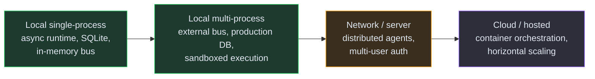

# Future Vision

!!! warning "Everything on this page is intent, not capability"

    Nothing below is built. Each row names a direction the project would like to
    take, either **planned** (scheduled or under active design) or **backlog**
    (a research candidate with no schedule). For what exists in the product,
    read [the roadmap](index.md), which also states plainly that the loop has
    not yet completed a live run.

## Planned

| Feature | Status |
|---------|--------|
| Dynamic company scaling across clusters | Planned |

## Backlog (Research Candidates)

| Feature | Status |
|---------|--------|
| Community template marketplace | Research |
| Inter-org federation as an operator surface. The A2A gateway, the peer registry and the JSON-RPC methods (`skills/query` and `skills/negotiate` among them) are implemented and covered by in-process tests; what has no design and no harness is delegation between two live deployments | Research |
| Inter-company communication beyond A2A | Research |
| Shift system for agents | Research |
| A self-improving company that runs a continuous staged-rollout meta-loop without a human approving each proposal. The shipped meta-loop would keep its mandatory approval gate; this row is the question of whether that gate could ever be narrowed, and twelve live rounds have earned no part of that answer | Research |
| Advanced memory architecture (GraphRAG, RL consolidation) | Research |
| Distributed multi-node organisational memory consistency (Phase 2 compare-and-set on PostgreSQL advisory locks) | Research |
| Kubernetes sandbox backend | Research |
| Training mode (learn from senior agents) | Research |
| Agent-controlled context compaction (agent-guided compaction tool, LLM summarisation, memory offload) | Research |

## Scaling Path

The intended deployment progression, from a local single-process install to a
hosted platform. The first two phases have working code behind them; the last
two are direction only.

No phase carries an agent count, because the project has measured none. What
bounds a deployment is decomposition quality rather than agent supply, and
whether the decomposition ceiling is per level or global is an open measurement.

See the [Distributed Runtime](../design/distributed-runtime.md) page for the NATS JetStream backend and distributed task queue design.

Each phase builds on the previous one. The pluggable protocol interfaces throughout the codebase (persistence, memory, message bus, sandbox) are designed to make these transitions configuration changes rather than rewrites.
